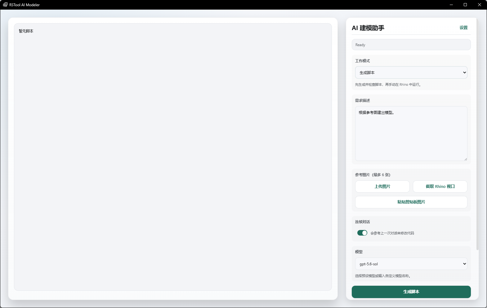
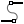
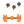
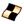

# RsTool 命令完全手册

> 本文档由代码自动生成，覆盖 RsTool 插件全部命令。数据提取自命令源码（C#），与 `RsTool_Command_Reference.html` / `.docx` / `.xlsx` 三版同源。

- 命令总数：**263** 条（262 个唯一命令，其中 `rsMeshRelax` 在「几何-网格」与「物理模拟」两处重复列出）
- 大类：**17** 个
- 每个命令均含功能、调用方式、交互流程、参数表、输出、备注等详解。

---

## AI

> 共 4 个命令 · 子类：渲染与建模 / 视频生成

### rsAiRender · AI 渲染

> 模块：AI / 渲染与建模

**功能**：可以截取 Rhino 当中的模型截图，或者上传特定图片，发送给 Gemini 或 ChatGPT 进行 AI 渲染。渲染完成后可以进行局部重绘或者局部替换。推荐直接截取 Rhino 当中的模型进行 AI 渲染——本命令会自动截取深度图和 AO 图等信息进行补充，确保渲染效果更真实。本命令既可以直接使用个人注册的 API，也可以使用由悠洛仁提供的中转站服务 API。


*图 1：控制面板总览。左侧预览区+历史记录，右侧从上到下依次为比例 1:1/16:9/4:3/3:4/9:16 与「获取高清截图 / 上传图片」按钮、画质 1K/2K/4K、渲染张数、提示词（支持模板库）、模型下拉、提示词模板、参考图上传*


*图 2：参考图渲染案例。上传 Rhino 导出的站点模型截图作为参考图，提示词描述未来主义超高层玻璃幕墙、AI 渲染参数 3:4 比例 + 2K 分辨率 + Nano Banana Pro 模型，AI 在保持建筑体量、轮廓与城市环境氛围的同时，将参考图的形态转译为夜景雨中写实材质，下方历史记录可见 3 张不同结果可逐张对比*


*图 3：案例中的 Rhino 工作区。左侧 Perspective 视口显示两栋曲线造型超高层建筑，右侧 Top 视口是平面定位，背景为 Site model · small.bim；用此视图的「获取高清截图」一键带入 RSTool AI Render 作为参考图（也可在「上传图片」中替换为其他视角/材质）*


*图 4：局部重绘工作台。模式切到「基础渲染/局部重绘」后，预览区顶部出现「隐藏选区」按钮，鼠标可在画面上拖出矩形选区（此处为建筑底部裙房），右侧提示词输入「把画面中央的裙房铺满流光注入屏幕，增添艺术亮光」针对框选范围重绘，模型 Nano Banana Pro、2K、3:4，点击「开始 AI 局部重渲染」即可保留其他区域不动*


*图 5：失败可重试。模型切到 Nano Banana 2 后第一次重绘失败，历史记录第 2 条以红色「An error occurred while executing the...」标注，但第 1 条原图仍可继续作为工作底图——直接调整提示词或换回 Nano Banana Pro 即可重提，不必从头来过*


*图 6：局部重绘成功。状态栏「已完成 · 渲染成功」+ 顶部 渲染成功 提示，历史记录第 3 条以绿色「已完成」徽章显示本次结果（Nano Banana 2），其他区域（天空、塔楼、街道）保持上一版不动，仅框选范围的裙房被重绘——这正是「局部重绘」相对「整图重渲染」的核心优势：迭代只影响你想改的那一块*

**调用**：在 Rhino 命令行输入 `rsAiRender`（打开设置窗口）

**交互流程**：

1. 命令行输入 rsAiRender，打开 AI 渲染窗口（已打开则置前）
2. 在「设置」页选择 API 接入点（悠洛仁 / 官方 / 自定义）并填写 API Key
3. 切换「渲染模式 / 灵感模式」工作区
4. 渲染模式下选 模式（基础渲染/参考图/局部重绘/局部重渲染），按需截取视窗或上传图片作为底图
5. 设置 比例、画质、渲染张数，在「提示词」中描述材质/风格/光线/视角/镜头细节（可点「打开模板库」套用预设）
6. 选择 模型（Nano Banana 2 / Nano Banana Pro / GPT Image 2），点击「AI Render」
7. 结果自动出现在预览区与下方历史记录条，可用「对比原图」「设为底图」「保存图片」
8. 灵感模式支持「想象 / 混图 / 图生提示词」三种工作流，可调用「建筑灵感提示词工具」拼装提示词

**参数**：

| 中文名 | 英文名 | 类型 | 默认值 | 范围 | 说明 |
| --- | --- | --- | --- | --- | --- |
| 工作区 | workspace | chip | render | render / inspiration | 渲染模式 与 灵感模式 之间的切换；前者面向建筑表现出图，后者面向前期意象探索 |
| 模式 | mode | chip | base | base / reference / inpaint / localRerender | 渲染模式下的子模式：基础渲染（纯文生图）、参考图（叠加多张参考）、局部重绘（框选区域 + 批注）、局部重渲染（按当前比例固定矩形重绘） |
| 比例 | aspectRatio | chip | 16:9 | 16:9 / 4:3 / 1:1 / 3:4 / 9:16 | 出图画幅比例；GPT Image 2 模型下切换比例会同步重置画质对应的输出分辨率 |
| 画质 | resolutionIndex | chip | 1 | 1K / 2K / 4K（或模型对应的高/中/低） | 输出分辨率档位；GPT Image 2 按当前比例映射 1280x720 → 3840x2160 三个尺寸，其他模型按高/中/低三档 |
| 渲染张数 | renderCount | number | 1 | 1–20 | 一次提交的并行出图数；超过 20 自动夹到 20；多张结果会在提交时逐张进入历史记录 |
| 提示词 | prompt | textarea | Photorealistic architectural rendering, sunny day, high detail, 8k resolution | 任意文本 | 渲染/局部重绘/局部重渲染的提示词，按模式分别保存（base/reference/inpaint/localRerender 各一份）；可点击「打开模板库」调用预设 |
| 参考图 | referenceImages | file[] | — | image/png, jpeg, webp, bmp，单文件 ≤30MB | 「参考图」与「局部重绘」模式可用，多张同时上传影响生成；灵感模式下也支持「灵感素材图」 |
| 灵感工作流 | inspirationMode | chip | imagine | imagine / blend / describe | 仅灵感工作区可见：想象（纯文字灵感）、混图（结合当前视窗 + 素材图）、图生提示词（将当前视图反推为提示词） |
| 灵感提示词 | inspirationPrompt | textarea | — | 任意文本 | 灵感工作区主输入；可点「提示词工具」调起「建筑灵感提示词工具」按建筑类型/设计风格/体量策略/立面材料/场地/光线/镜头/场景/可持续/出图表达 10 个维度拼装 |
| 模型 | selectedModel | select | gemini-3.1-flash-image-preview | gemini-3.1-flash-image-preview (Nano Banana 2) / gemini-3-pro-image-preview (Nano Banana Pro) / gpt-image-2 | 出图模型；Nano Banana 2 速度快、Nano Banana Pro 质量更佳、GPT Image 2 在分辨率映射上更细 |
| API 接入点 | endpointType | radio | yoro | yoro / official / custom | 在「设置」中切换：悠洛仁 API（推荐）/ 官方 API / 自定义 API；选择 custom 时需填完整端点 URL，并指定协议（auto/gemini/generic） |
| 主题 | theme | radio | System | System / Light / Dark | UI 主题，跟随系统/浅色/深色；切换立即生效 |

**备注**：需要联网；所有参数在窗口内设置并加密保存到本机配置，提示词模板、灵感工具预设、参考图与历史记录均存本机

---

### rsAIModeler · AI 建模

> 模块：AI / 渲染与建模

**功能**：本命令可以调用 AI 大模型快速生成脚本，用来对 Rhino 进行编辑操作；也可以选择 Agent 模式，使用大模型直接修改和编辑 Rhino。生成脚本模式下，AI 输出 Python/RhinoScript 代码，需手动在 Rhino 中执行；Agent 模式下，AI 通过工具调用直接操控 Rhino 几何体（删/替换/布尔等会弹 Approve/Deny 确认）



**调用**：在 Rhino 命令行输入 `rsAIModeler`（打开设置窗口）

**交互流程**：

1. 命令行输入 rsAIModeler，打开 AI 建模窗口
2. 首次使用点「Settings」填写 API Key 并选择 API Endpoint（悠洛仁 / 官方 / 自定义）
3. 选择工作模式：Generate Script（先出可审阅脚本）或 Agent Modeling（自主连续建模）
4. 在提示词框描述需求，可上传 / 截取视窗 / 粘贴参考图
5. Generate Script 模式：点 Generate Script 生成 Python 脚本 → 审阅后点 Run in Rhino 在 Rhino 执行
6. Agent 模式：AI 自主建模，删除对象 / 布尔替换等高风险操作会在弹窗中要求 Approve / Deny 确认
7. 结果进入 Rhino；可用 New Conversation 重开对话，Undo Agent Run 回退上一步

**参数**：

| 中文名 | 英文名 | 类型 | 默认值 | 范围 | 说明 |
| --- | --- | --- | --- | --- | --- |
| 工作模式 | operationMode | select | Generate Script | Generate Script / Agent Modeling | Generate Script 先产出 Python 脚本供审阅再运行；Agent Modeling 让 AI 连续自主建模（受下方权限约束） |
| 提示词 | prompt | textarea | — | 任意文本 | 描述要生成或修改的几何体；可结合参考图 |
| 参考图 | referenceImages | file[] | — | image/* 多张（上传 / 截取视窗 / 粘贴） | 作为建模参考；Agent 模式与脚本模式均可使用 |
| 连续对话 | toggleContinuous | bool | 关 | 开 / 关 | 开启后基于上一次对话继续修改代码，而非从零生成 |
| 视觉校验 | toggleVisualValidation | bool | 关 | 开 / 关 | 建模后自动截取视窗交给 AI 检查一次结果是否符合预期 |
| Agent-允许创建对象 | toggleAgentCreate | bool | 开 | 开 / 关 | 仅 Agent 模式：允许 AI 新建几何体（默认开） |
| Agent-允许修改对象 | toggleAgentModify | bool | 开 | 开 / 关 | 仅 Agent 模式：允许 AI 修改已授权对象（默认开） |
| Agent-允许删除对象 | toggleAgentDelete | bool | 开 | 开 / 关 | 仅 Agent 模式：允许 AI 删除对象（默认开，删除会触发确认弹窗） |
| Agent-确认高风险 | toggleAgentConfirmRisk | bool | 开 | 开 / 关 | 仅 Agent 模式：删除与布尔替换前弹出确认，需手动 Approve（默认开） |
| 模型 | modelSelect | select | Gemini 预设（Nano Banana 2） | 预设模型 / 自定义模型名 | 出图与理解所用的多模态模型；可在下拉选择或输入自定义模型名 |

**备注**：需要联网；所有参数在窗口内设置。Generate Script 模式先出脚本供审阅再运行，相对安全；Agent Modeling 具备创建/修改/删除权限，删除与布尔替换会触发确认弹窗

---

### rsAiRenderOld · 旧版 AI 渲染

> 模块：AI / 渲染与建模

**功能**：旧版：基于视口/参考图生成 AI 渲染图（WinForms 实现），可保存到本地

**调用**：在 Rhino 命令行输入 `rsAiRenderOld`（打开设置窗口）

**交互流程**：

1. 命令行输入 rsAiRenderOld
2. 创建并显示 AiRenderForm (WinForms) 窗口（已打开则置前聚焦）
3. 在「API 设置」中选择接入点（悠洛仁 / 官方）并填入对应 API Key（可选记住配置）
4. 在窗口中点「获取视窗截图」或「上传图片」作为底图，可选「上传参考图」
5. 选择 模型、分辨率/质量、宽高比，在提示词框描述渲染要求
6. 点「开始 AI 渲染」；成功后预览结果，可「对比原图」「设为底图」「保存图片」

**参数**：

| 中文名 | 英文名 | 类型 | 默认值 | 范围 | 说明 |
| --- | --- | --- | --- | --- | --- |
| API 接入点 | EndpointType | radio | 悠洛仁 API (yoro) | 悠洛仁 API / 官方 Google / 官方 OpenAI | 选择 API 提供方；选官方且模型为 GPT Image 2 时自动切到 OpenAI 端点 |
| API Key | ApiKey | password | — | 字符串（按接入点分别保存） | 悠洛仁 / 官方 Key 分别保存；勾选「记住配置」写入 RhinoAiRenderOld_Config.json |
| 模型 | Model | list | Nano Banana Pro | Nano Banana 2 / Nano Banana Pro / GPT Image 2 | AI 图像模型；窗体默认选中 Nano Banana Pro（gemini-3-pro-image-preview） |
| 分辨率/质量 | Resolution | list | 高清 (1920x1080) - 1K | 标准(1280x720)-1K / 高清(1920x1080)-1K / 超清(2560x1440)-2K / 电影级(3840x2160)-4K | 输出分辨率，默认 SelectedIndex=1；传给 API 的 size 映射为 1K/2K/4K |
| 宽高比 | AspectRatio | list | 16:9 | 16:9 / 4:3 / 3:2 / 1:1 / 2:3 / 3:4 / 9:16 | 画面比例，默认 16:9；截图/输出均按此裁剪或校正 |
| 提示词 | Prompt | textarea | Photorealistic architectural rendering, sunny day, high detail, 8k resolution | 任意文本 | 渲染要求；按基础渲染 / 局部重渲染分别记忆 |
| 参考图 | ReferenceImage | file | — | png/jpg/jpeg/bmp/webp | 可选；上传后仅用于整体风格 / 光照 / 材质色调参考，不复制物体或构图 |

**备注**：旧版命令，WinForms 实现，保留用于兼容；需自行配置 API Key。与新版 rsAiRender 相比不区分渲染/灵感工作区，功能较简单

---

### rsAiAnimation · AI 动画

> 模块：AI / 视频生成

**功能**：本命令接入字节跳动（ByteDance）自研的 Seedance / Seedream 大模型，在同一窗口内提供两种生成类型：视频模式基于 Seedance，以参考图（必选）为核心，可叠加参考视频与参考音频做多模态视频生成，或图生视频（首帧/首尾帧）；图片模式基于 Seedream，支持文生图与图生图（以参考图做图生图），一次性生成多张结果。两种模式均支持多任务并发，结果保存到本地并可直接预览


*图 1：AI 动画生成主界面。标题栏右侧「设置」用于切换国内/国际服务区域与配置 API Key；主面板顶部为「生成类型」切换（视频=Seedance / 图片=Seedream，均为字节 ByteDance 自研大模型），下方依次为模型下拉（默认 doubao-seedance-2-5-26028）、参考图片上传（视频必选、可拖拽至少 1 张）、参考视频/参考音频（视频模式可选，做多模态参考或背景音乐）、提示词 textarea，底部为「保存视频 / 保存图片」与状态栏 Ready；左侧大块为结果预览/历史区，任务完成后视频直接播放，图片以缩略图网格展示并可批量保存*

**调用**：在 Rhino 命令行输入 `rsAiAnimation`（打开设置窗口）

**交互流程**：

1. 命令行输入 rsAiAnimation，打开 AI 动画窗口
2. 首次使用点「设置」选择服务区域（国内火山方舟 / 国际 BytePlus）并填写 ARK_API_KEY 保存
3. 在「生成类型」选择 视频 或 图片
4. 视频模式：添加至少 1 张参考图片（可拖拽 / 截取视窗），可选参考视频与音频；图片模式：输入提示词并上传参考图做图生图，或无参考图纯文生图
5. 输入提示词，设置模型、分辨率 / 尺寸、比例、时长（视频）、张数（图片）、随机种子等参数
6. 点「生成」：调用字节 Seedance（视频）/ Seedream（图片）大模型生成，支持一次提交多个任务
7. 等待生成完成后结果自动下载到本地临时目录，可在左侧预览区播放 / 查看，点「保存」导出

**参数**：

| 中文名 | 英文名 | 类型 | 默认值 | 范围 | 说明 |
| --- | --- | --- | --- | --- | --- |
| 生成类型 | genType | radio | 视频 | 视频 / 图片 | 顶部切换：视频=Seedance 视频生成，图片=Seedream 文生图/图生图（均为字节 ByteDance 大模型） |
| 模型 | modelMain | select | Seedance 2.5 | 视频：Seedance 2.5 / 2.0 / 1.5 / 1.0（国内）或 Dreamina-*（国际）/ 自定义；图片：Seedream 系列（按区域切换） | 视频默认 Seedance 2.5（视频参考需 2.0+）；切到图片模式时下拉自动切换为 Seedream 系列（国内 doubao-seedream-* / 国际 seedream-*） |
| 参考图片 | refImages | file[] | — | image/* 多张（视频模式至少 1 张必选；图片模式可选作图生图参考） | 视频模式：有视频走多模态参考，无视频走图生视频（首帧/首尾帧）；图片模式：作为图生图参考驱动生成 |
| 参考视频 | refVideo | file | — | 视频文件（可选） | 多模态视频参考；仅 Seedance 2.0/2.5 支持，1.5/1.0 不支持 |
| 参考音频 | refAudio | file | — | 音频文件（可选，背景音乐） | 可选，作为视频背景音乐参考 |
| 提示词 | prompt | textarea | — | 任意文本 | 视频：描述动画效果（镜头推进、光影变化、建筑摄影风格）；图片：描述画面内容/风格 |
| 分辨率 | resolution | list | 720p | 480p / 720p / 1080p / 4K | 视频模式输出分辨率 |
| 图片尺寸 | imageSize | list | 1K | 1K / 2K / 3K / 4K | 图片模式输出尺寸（Seedream）；视频模式此参数隐藏 |
| 图片张数 | imageCount | number | 4 | 1–10 | 图片模式一次生成的组图张数；Seedream 5.0 pro 不支持组图 |
| 比例 | ratio | list | 16:9 | 16:9 / 4:3 / 1:1 / 3:4 / 9:16 / 21:9 / 自适应 | 画幅比例；自适应随首帧图片尺寸 |
| 时长(秒) | duration | number | 5 | 4–15，步长 1 | 生成视频时长（秒） |
| 随机种子 | seed | number | -1 | 整数（-1 表示随机） | 固定种子可复现结果 |
| 生成音频 | generateAudio | bool | 开 | 开 / 关 | 是否由模型一并生成背景音频 |
| 固定相机 | cameraFixed | bool | 关 | 开 / 关 | 开启后画面不跟随参考视频的相机运动 |
| 添加水印 | watermark | bool | 关 | 开 / 关 | 是否在结果视频上加 AI 生成水印 |
| 服务区域 | region | select | cn（国内火山方舟） | cn 国内 / intl 国际 | 切换区域会同时切换 API 地址与模型列表（视频/图片各自的前缀不同） |
| API Key | apiKey | password | — | ARK_API_KEY | 字节方舟 / BytePlus 的 API Key；加密保存到本机 |
| API 地址 | endpoint | text | https://ark.cn-beijing.volces.com/api/v3 | URL | 随区域自动填充，可改代理地址 |

**备注**：底层调用字节跳动（ByteDance）的 Seedance（视频）/ Seedream（图片）大模型，经火山方舟（国内 ark.cn-beijing.volces.com）或 BytePlus（国际 ark.ap-southeast.bytepluses.com）接口调用，需自备 ARK_API_KEY。视频：有参考视频→多模态参考（仅 2.0/2.5），无视频→图生视频（首帧/首尾帧）；图片：图生图以参考图驱动，也可无参考图文生图。切换国内/国际需同时切接口地址与模型 ID：视频模型国内 doubao-seedance-*、国际 dreamina-seedance-*，图片模型国内 doubao-seedream-*、国际 seedream-*（5.0 pro 不支持组图）。生成通常 1~5 分钟，时长/分辨率越高越久；图片按张计费

---

## 资源库

> 共 4 个命令 · 子类：模型库 / 材质库

### rsModel · 模型库

> 模块：资源库 / 模型库

**功能**：将选中的 .3dm 文件作为块定义导入 Rhino，触发 InsertAsset 命令在视口点击位置放置；或在资源管理器中打开模型所在文件夹


*图 1：模型库主界面。标题栏右侧「刷新 / 选择根目录」为全局操作；左侧栏从上到下依次为：库目录（输入框只读 + 「选择」按钮，配合「上一级 / 返回根目录」快速跳转）、搜索（关键字过滤当前目录下的文件）、主题（跟随系统 / 浅色 / 深色）、收藏的模型（一键只显示已收藏的资产，带数量徽章）、最近使用（chip 形式，最近访问过的根目录可一键切换）、文件夹树（树形展示当前根下的子文件夹，点头切换）；右侧主区显示当前路径下的所有模型，每张缩略图卡含文件名、原始路径、修改时间，并排 3 个圆形动作按钮（收藏模型 / 导入一个 / 导入多个，hover 显示中文 tooltip），右键卡片还能调出右键菜单（Favorite Model / 导入模型 / 打开目录），底部有「加载更多」分页按钮*

**调用**：在 Rhino 命令行输入 `rsModel`（打开设置窗口）

**交互流程**：

1. 命令行输入 rsModel，打开模型库窗口（新版窗口不可用时自动回退到旧版 rsModelOld）
2. 窗口打开后默认加载上次使用的库目录（库目录输入框右侧「选择」按钮可换根）
3. 左侧栏操作：用「搜索」框过滤当前目录下的文件；点「收藏的模型」只显示已收藏项；用「文件夹树」切换子目录；用「上一级 / 返回根目录」快速跳转
4. 主区浏览：卡片缩略图 + 文件名 + 元数据 + 6 个圆形动作按钮；右键/长按弹出右键菜单（Favorite Model / 导入模型 / 打开目录）
5. 点卡片预览按钮（眼睛图标）→ 弹预览大图：右侧有 Favorite Model / 导入一个 / 导入多个 / 打开目录 4 个按钮，可直接收藏或导入到 Rhino
6. 点「导入一个」：模型作为块定义导入 Rhino 并在视口点击位置放置，支持 Angle/Rotate90 命令行选项控制旋转
7. 点「导入多个」：批量导入，提示点选多个位置连续放置
8. 右上角「按名称 / 按时间」切换排序；底部「加载更多」分页读取全部模型

**参数**：

| 中文名 | 英文名 | 类型 | 默认值 | 范围 | 说明 |
| --- | --- | --- | --- | --- | --- |
| 库目录 | rootPath | text | 上次使用值 | 本地路径 | 模型库的根目录路径；点击「选择 / 选择根目录」可换成任意含 .3dm 的文件夹；切换目录后自动重建索引 |
| 搜索 | searchInput | text | 空 | 任意关键字 | 对当前目录下的文件名/标签做即时过滤 |
| 主题 | theme | radio | 跟随系统 | 跟随系统 / 浅色 / 深色 | 切换 UI 主题，配置跟随系统时按 Windows 当前外观切换 |
| 收藏视图 | favoritesView | button | 关闭 | — | 左侧「收藏的模型」按钮：点亮后只显示已收藏的资产；徽章数字表示当前根目录内的收藏数 |
| 最近使用 | recentRoots | chip | — | — | 最近 5 次访问过的根目录，点 chip 快速切换 |
| 文件夹树 | folderTree | tree | — | — | 根目录下子文件夹折叠树，点头切换浏览；点行左侧三角形展开/折叠 |
| 排序 | sort | button | 按时间 | 按名称 / 按时间 | 主区右上角切换，文件卡片排列顺序即时刷新 |
| 刷新 | refresh | button | — | — | 重建索引：扫描当前根目录所有 .3dm/.3dm.gz/.zip，生成缩略图与元数据，状态栏显示进度 |
| 收藏/取消收藏 | favorite | button | — | — | 卡片或预览弹窗内的星标按钮：点亮黄色 = 已收藏；支持右键菜单 Favorite Model |
| 导入一个 | importSingle | button | — | — | 模型作为块定义导入 Rhino 并弹 InsertAsset 命令在视口点击位置放置 |
| 导入多个 | importMultiple | button | — | — | 批量导入，提示点选多个位置连续放置同一块定义 |
| 打开目录 | openFolder | button | — | — | 用 Windows 资源管理器打开模型所在文件夹 |
| 加载更多 | loadMore | button | — | — | 主区底部按钮：分页加载，默认每页 60 张；超过则出现该按钮 |

**备注**：新版窗口不可用时自动回退到 rsModelOld 旧版命令。索引以根目录为粒度，缩略图缓存到 %LOCALAPPDATA%\RSTool\ModelLibrary 缩略图缓存；导入时调用 InsertAsset 走统一放置流程（命令行 Angle/Rotate90 控制旋转）。模型库为本地素材库：内置素材有限，需用户自行整理、补充自己的 .3dm 模型到库目录；也可将 RSTool 相关视频转发到朋友圈后联系客服，领取更多模型素材资源

---

### rsModelOld · 旧版模型库

> 模块：资源库 / 模型库

**功能**：打开旧版模型库窗口，浏览并插入模型/构件

**调用**：在 Rhino 命令行输入 `rsModelOld`（打开设置窗口）

**交互流程**：

1. 命令行输入 rsModelOld
2. 创建并显示 rsModelDialogOld (WinForms) 窗口
3. 在旧版库浏览器中选择模型并插入

**参数**：

> 此命令无命令行数值参数，相关设置在窗口中调整。

**备注**：旧版命令，WinForms 实现；作为 rsModel 的回退

---

### rsMaterial · 材质库

> 模块：资源库 / 材质库

**功能**：把选中的材质按当前贴图轴设置加到 Rhino 材质库，并赋予选中对象/图层，或仅导入材质不赋予；自动贴图轴开启时同步加贴图轴对象


*图 1：材质库主界面。标题栏右上「贴图轴：Box · 5 m」打开自动贴图轴设置（开启后赋予材质时自动按矩形/Box + 尺寸同步加贴图轴），其后是「刷新 / 选择根目录」；左侧栏结构与模型库一致（库目录 / 搜索 / 主题 / 收藏的材质 / 最近使用 / 文件夹树 / 状态栏 + 构建进度）；右侧主区显示当前路径下所有材质，命名空间 chip 区分（默认 MaterialLibrary，截图已切到 Concrete 关注水磨石），每张缩略图卡含文件名、标签、修改时间、并排 3 个圆形动作按钮（收藏材质 / 赋予物体 / 赋予图层），右键卡片可调右键菜单（Favorite Material / 赋予物体 / 赋予图层 / 导入材质 / 打开目录），底部「加载更多」分页全部*

**调用**：在 Rhino 命令行输入 `rsMaterial`（打开设置窗口）

**交互流程**：

1. 命令行输入 rsMaterial，打开材质库窗口（新版不可用时自动回退到旧版 rsMaterialLibraryOld）
2. 窗口打开后默认加载上次使用的库目录（与模型库共用同一套最近使用列表）
3. 标题栏「贴图轴：Box · 5 m」点开可设置：① 是否赋予材质时自动加贴图轴；② 贴图轴类型（矩形平面 / Box）；③ 贴图轴尺寸（统一宽高或长宽高），保存后按钮文案即时刷新显示当前类型+尺寸
4. 左侧栏操作：搜索框按文件名/标签即时过滤；点「收藏的材质」只显示已收藏项；用「最近使用」「文件夹树」快速切换根目录/子目录；状态栏显示索引构建进度
5. 主区浏览：缩略图卡 + 文件名 + 标签（如 terrazzo、BestColor）+ 修改时间 + 3 个圆形动作按钮（收藏/赋予物体/赋予图层），右键调出 5 项右键菜单
6. 点卡片预览按钮（眼睛）→ 弹预览大图：右侧有 4 个动作按钮 收藏材质 / 赋予物体 / 赋予图层 / 导入材质 / 打开目录
7. 点「赋予物体」：先把材质按当前贴图轴设置加到材质库，再选中 Rhino 中一个对象并应用；点「赋予图层」：选中目标图层一次性应用给该图层下所有对象
8. 点「导入材质」：仅导入到 Rhino 材质库（不直接赋予对象）；若开启自动贴图轴则同步加贴图轴
9. 主区右上「按名称 / 按时间」切换排序；底部「加载更多」翻页显示全部材质

**参数**：

| 中文名 | 英文名 | 类型 | 默认值 | 范围 | 说明 |
| --- | --- | --- | --- | --- | --- |
| 库目录 | rootPath | text | 上次使用值 | 本地路径 | 材质库根目录；通过「选择 / 选择根目录」换成任意含材质资产的文件夹；切换后自动重建索引 |
| 搜索 | searchInput | text | 空 | 任意关键字 | 对当前目录下的文件名/标签做即时过滤 |
| 主题 | theme | radio | 跟随系统 | 跟随系统 / 浅色 / 深色 | 切换 UI 主题；与模型库各自独立保存 |
| 贴图轴按钮 | btnMappingSettings | button | — | — | 标题栏「贴图轴：类型 · 尺寸」按钮：点开弹自动贴图轴设置弹层，按钮文案同步显示当前设置 |
| 自动加贴图轴 | autoTextureMappingEnabled | checkbox | 开 | 开 / 关 | 贴图轴弹层开关：开启后赋予材质时同时按当前贴图轴类型+尺寸加贴图轴对象 |
| 贴图轴类型 | autoTextureMappingType | radio | Box | 矩形（平面） / Box | 贴图轴弹层单选：矩形用同一宽高，Box 用同一长宽高；切换后按钮文案即时更新 |
| 贴图轴尺寸 | autoTextureMappingSize | number | 5.0 | > 0（model 单位） | 贴图轴弹层数字输入：矩形用统一宽高、Box 用统一长宽高，步长 0.000001 |
| 收藏视图 | favoritesView | button | 关闭 | — | 左侧「收藏的材质」按钮：点亮后只显示已收藏的资产 |
| 最近使用 | recentRoots | chip | — | — | 最近 5 次访问过的根目录，chip 一键切换 |
| 文件夹树 | folderTree | tree | — | — | 根目录下子文件夹折叠树，点头切换浏览 |
| 排序 | sort | button | 按时间 | 按名称 / 按时间 | 主区右上角切换 |
| 刷新 | refresh | button | — | — | 重建索引：扫描当前根目录所有材质资产，生成缩略图与标签，状态栏显示进度 |
| 收藏/取消收藏 | favorite | button | — | — | 卡片或预览弹窗内的星标按钮：点亮黄色 = 已收藏；支持右键菜单 Favorite Material |
| 赋予物体 | assignObject | button | — | — | 材质按当前贴图轴设置加到材质库，再选中 Rhino 中一个对象并应用；若开启自动贴图轴则同步加贴图轴对象 |
| 赋予图层 | assignLayer | button | — | — | 选中目标图层一次性应用给该图层下所有对象 |
| 导入材质 | importMaterial | button | — | — | 仅导入到 Rhino 材质库（不直接赋予对象）；若开启自动贴图轴则同步加贴图轴 |
| 打开目录 | openFolder | button | — | — | 用 Windows 资源管理器打开材质所在文件夹 |
| 加载更多 | loadMore | button | — | — | 主区底部按钮：分页加载，默认每页 60 张 |

**备注**：新版窗口不可用时自动回退到 rsMaterialLibraryOld 旧版。索引以根目录为粒度，缩略图与贴图缓存到本地；赋予走 Rhino 材质 API，开启自动贴图轴时会按当前类型+尺寸自动加 Surface/BoxMapping。材质库为本地素材库：内置素材有限，需用户自行整理、补充自己的材质资产到库目录；也可将 RSTool 相关视频转发到朋友圈后联系客服，领取更多材质素材资源

---

### rsMaterialLibraryOld · 旧版材质库

> 模块：资源库 / 材质库

**功能**：打开旧版材质库，选择材质后拾取对象或图层进行赋予

**调用**：在 Rhino 命令行输入 `rsMaterialLibraryOld`（命令行交互）

**交互流程**：

1. 命令行输入 rsMaterialLibraryOld
2. 创建并显示 rsMaterialDialogOld (WinForms) 窗口
3. 选择材质后进入拾取循环
4. 点击物体/按选项切换赋予模式（物体/图层）

**参数**：

| 中文名 | 英文名 | 类型 | 默认值 | 范围 | 说明 |
| --- | --- | --- | --- | --- | --- |
| 赋予模式 | Mode | list | 物体(Object) | 物体(Object) / 图层(Layer) | 命令行选项 Mode，默认 物体 (index 0) |

**备注**：旧版命令；赋予材质时使用 GetObject + 选项列表 Mode

---

## 效率工具

> 共 9 个命令 · 子类：生产力 / 屏幕工具 / 浏览器

### rsMindMap · 思维导图

> 模块：效率工具 / 生产力

**功能**：打开思维导图窗口，支持编辑/保存/导出思维导图，文件为 .json（rstool-mindmap v1：title/updatedAt/root 树/view{theme,style,direction,layout}）；PNG/SVG 导出由后端弹保存对话框落盘


**调用**：在 Rhino 命令行输入 `rsMindMap`（打开设置窗口）

**交互流程**：

1. 命令行输入 rsMindMap，打开思维导图窗口
2. 在「中心主题」根节点上双击重命名；选中节点后按 Enter 加同级、Tab 加子节点、F2 重命名、Delete 删除
3. 用顶部工具栏切换结构（思维导图 / 逻辑结构 / 组织结构 / 时间轴 / 鱼骨图等）与配色（清爽蓝 / 深夜蓝等）
4. 用搜索框（Ctrl+F）定位节点；滚轮缩放、点「适应画布」查看全图；可展开 / 折叠分支
5. Ctrl+S 保存、Ctrl+Shift+S 另存为 .json 文件；或点「最近」打开历史文件
6. 点 PNG / SVG 导出当前思维导图
7. 状态栏显示保存状态、文档名与缩放比例；最近 / 结构 / 配色 / 搜索面板按 Esc 或点空白处关闭

**参数**：

> 此命令无命令行数值参数，相关设置在窗口中调整。

**备注**：基于 simple-mind-map 引擎（状态栏右下角显示版本）。

**操作**：左键选节点，右键拖动画布；滚轮反向缩放，范围 20%–400%。

**工具栏**（4 组共 21 个按钮）：

| 分组 | 按钮与快捷键 |
| --- | --- |
| 文件 | 新建 (Ctrl+N) · 打开 (Ctrl+O) · 最近 ▾ · 保存 (Ctrl+S) · 另存为 (Ctrl+Shift+S) |
| 编辑 | 撤销 (↶ Ctrl+Z) · 重做 (↷ Ctrl+Y) · 同级节点 (Enter) · 子节点 (Tab) · 重命名 (F2) · 删除 (Delete) |
| 视图 | 展开 · 折叠 · 缩小 (−) · 放大 (＋) · 适应画布 · 结构 ▾ · 搜索 (Ctrl+F) · 配色 ▾ |
| 导出 | PNG · SVG |

**结构**（共 6 种）：

| 名称 | 走向 / 形态 |
| --- | --- |
| 思维导图 | 双向（默认） |
| 逻辑结构 | 向右 |
| 向左逻辑结构 | 向左 |
| 组织结构 | 树形 |
| 目录结构 | 树形 |
| 时间轴 | 垂直 |
| 鱼骨图 | 横向 |

**配色**（共 6 套）：

| 配色 | 备注 |
| --- | --- |
| 清爽蓝 | 默认 |
| 深夜蓝 | 暗色 |
| 黑底白节点 | 演示用 |
| 暖沙棕 | 暖色调 |
| 森林绿 | 自然系 |
| 紫罗兰 | 紫色系 |

**其他细节**：

- 新增同级默认文本「新主题」，子级「子主题」
- 最近文件最多保留 10 条
- 状态栏 dot 实时提示保存状态
- 异常退出后再次打开会自动恢复未保存的内容

---

### rsVectorStudio · 矢量工作室

> 模块：效率工具 / 生产力

**功能**：打开矢量工作室 (Vector Studio) 窗口，编辑 SVG 矢量图、可与 Rhino 双向同步（曲线 / 贴图 / 视窗截图 / 画板尺寸同步）


**调用**：在 Rhino 命令行输入 `rsVectorStudio`（打开设置窗口）

**交互流程**：

1. 命令行输入 rsVectorStudio，打开矢量工作室窗口
2. 用左侧绘图工具（选择 / 铅笔 / 钢笔 / 矩形 / 圆 / 文本 / 图片等）在画板上绘制
3. 用顶部工具栏做导入 / 导出、布尔运算、路径画笔 / 箭头画笔，以及截取 Rhino 视窗、与 Rhino 双向同步
4. 选中元素后，在右侧属性面板调整填充 / 描边 / 渐变 / 图层
5. Ctrl+S 或关闭窗口前自动写回 Rhino 与本地文件

**参数**：

> 此命令无命令行数值参数，相关设置在窗口中调整。

**备注**：基于 svg-edit 7.4.2 引擎，自定义功能代码在 vector-studio-app.js + vector-studio.css。

**左侧绘图工具**（vendor/Editor.js 自带）：选择 (V) / 铅笔 / 钢笔 / 矩形 / 圆角矩形 / 椭圆 / 多边形 / 直线 / 路径 / 文本 / 图片（点击选择后在画板拖动绘制，多段路径双击或回车闭合）。

**顶部工具栏按钮分组**（buttonLabels 列表）：

| 类别 | 按钮 |
| --- | --- |
| 文件 | 新建 · 打开 · 导入 · 保存 · 另存为 |
| Rhino 双向 | 截取视窗 · 导入视图曲线 · 从 Rhino 导入 · 导入贴图 · 发送到 Rhino · 同步画板到 Rhino |
| 分析图 | 路径画笔（细端宽 · 粗端宽 · 画笔样式：两头细/起点粗/起点细） · 箭头画笔（直线箭头 · 双向 · 曲线 · 箭头样式：三角 · 内凹 · 菱形 · 圆点 · 无 · 箭头大小） |
| 选中转换 | 转箭头 · 转双箭头 · 路径画笔 · 箭头画笔 · 锁定 · 解锁 |
| 几何布尔 | 并集 · 减去顶层 · 交集 · 排除（仅闭合路径/矩形/圆/椭圆/多边形/仅含它们的组） |
| 路径 | 路径圆角（仅由直线段组成的路径；含贝塞尔的路径不修改） |
| 视图操作 | 撤销 · 重做 · 吸附 · 显示网格 · 对齐像素 · 缩放 · 对齐图 · 缩放图 · 图纸尺寸 · 字体 · 导出图像 |
| 导出 | PNG · 原始图像 · DPI 选择 |

**右侧属性面板**：

| 面板 | 字段 |
| --- | --- |
| 填充 | 颜色 · 透明度 · 渐变方向（线性 / 径向） |
| 描边 | 颜色 · 宽度 · 不透明度 · 连接风格 · 虚线线型：实线 / 点 / 虚线 / 点划线（线型 / 相位以「线宽倍数」输入，逗号分隔例如 8,4，存为 `data-rstool-dash-*` 属性以保证 SVG 文件持久化） |
| 渐变 | 线性 · 径向 · 渐变类型 |
| 图片调整 | 亮度 · 对比度 · 饱和度 · 色相 · 灰度 · 去色 · 黑白 · 重置 |
| 图层 | 当前图层增删切换 · 可见 / 锁定 · 锁定后该图层对象不能在画板上点选 |

**与 Rhino 双向**：

- 从 Rhino 导入 — 抓取文档中选中对象的曲线或贴图面到画板
- 发送到 Rhino — 把选中曲线 (polyline/path) 与图片转成 Rhino 对象
- 截取视窗 — 按比例尺截取 Rhino 当前视图，可输入「宽x高」自定义分辨率（1–8192），自动居中并把画板缩放到与截图对齐
- 导入视图曲线 — 按当前视窗反投影曲线；视窗变化会提示「可能无法完全对齐」
- 同步画板到 Rhino — 把画板外框推回 Rhino 同步平面尺寸

**保存与恢复**：

- Ctrl+S 写为 SVG 文本导出到本地（默认 `untitled.svg`，可另存为）
- 未保存时关闭面板会弹确认「放弃修改吗？」
- 异常退出后下次打开弹「检测到上次未保存的矢量文档，是否恢复？」

**教学视频**：

<iframe class="rstool-video" src="https://player.bilibili.com/player.html?isOutside=true&aid=117089180325416&bvid=BV1yhgW6vEkV&cid=40884506417&p=1" scrolling="no" border="0" frameborder="no" framespacing="0" allowfullscreen="true" loading="lazy" title="RsTool · Vector Studio 矢量工作室说明视频（B 站）"></iframe>
*RsTool · Vector Studio 矢量工作室说明视频（B 站）*

---

### rsImageStudio · 图像工作室

> 模块：效率工具 / 生产力

**功能**：打开 RSTool 图像工作室窗口进行位图绘制/标注/导出与保存


*RSTool 图像工作室主界面（顶部工具栏 14 项，左侧绘图工具栏，右侧属性面板含 图层编辑 / 镜像测量 / 椭圆合模式 / 图层管理 / 编辑图层 / 预览 / 颜色 / 信息 8 块，底部含缩放 50% 与画布适配按钮）*

**调用**：在 Rhino 命令行输入 `rsImageStudio`（打开设置窗口）

**交互流程**：

1. 命令行输入 rsImageStudio，打开图像工作室窗口（标题「RSTool 图像工作室」）
2. 在窗口中对位图进行绘制、标注、裁剪与调色，或截图 Rhino 视窗后加标注
3. 处理完成后导出为 PNG / JPEG / WebP，或保存为 .rstool-photo 工程文件

**参数**：

> 此命令无命令行数值参数，相关设置在窗口中调整。

**备注**：基于 miniPaint 引擎，并加了若干自定义 JS 扩展用于画板布局、笔刷、选区、标尺等功能。

**顶部工具栏**（14 项，简化常用 PhotoShop 工作流）：

| 按钮 | 功能 |
| --- | --- |
| 打开图像 | 从本地文件载入位图到画布 |
| 导入图像 | 导入新图层（不替换当前画布）|
| 保存图像 v | 把当前画布导出为带版本号的本地图像 |
| 模板 | 选择内置模板套用画板布局 |
| 截取 Rhino | 抓取 Rhino 视窗截图导入（与 Rhino 双向） |
| 画板尺寸 | 调画板/纸张大小 |
| 打开工程 | 打开 .rstool-photo 工程文件 |
| 保存 / 另存为 | 把当前整套图像工程写入磁盘 |
| PNG / JPEG / WebP | 一键导出当前画布为对应格式 |

**左侧绘图工具栏**：miniPaint 自带的铅笔 / 画笔 / 钢笔 / 形状 / 选取 / 文字 / 图章等工具。

**右侧属性面板**（多块可折叠/独立面板）：

| 面板 | 用途 |
| --- | --- |
| 图层编辑 | 路径 / 填充颜色 / 默认黑色 / 描边 W（容量 32 px）/ 虚线 复选 / 节点 |
| 镜像测量 | 当前锁定的可视化图层（含新建组、不属于组下拉）|
| 椭圆合模式 | 椭圆笔触的合成模式（正常 / 正片叠底 / 滤色 等）|
| 笔不透明度 | 笔触透明度滑杆 |
| 图层管理 | 图层列表 + 添加 按钮 |
| 编辑图层 | 当前选中图层的编辑操作（添加图层、合并、删除等）|
| 预览 | 当前画布小窗缩略图；底部 50% 缩放 + 适应 按钮 |
| 颜色 | 调色板 |
| 信息 | 鼠标坐标 / 选区尺寸等 |

**底部状态栏**：画布距离（例 距离 -4096px / 8192px max）+ 缩放控制 + 适应按钮。

**与 Rhino 双向**：通过「截取 Rhino」一键把 Rhino 视窗截图导入到画布，适合在 AiRender / 渲染后再到 ImageStudio 加标注 / 比例尺 / 文字标注导出。

---

### rsPdfTools · PDF 工具

> 模块：效率工具 / 生产力

**功能**：对 PDF 执行拆分/旋转/压缩/提取/删除/合并/加密/解密/水印等操作并把结果 PDF 落到输出目录


*PDF 工具主界面（合并 Tab 选中；上方 9 个操作 Tab，下方文件列表、当前操作设置面板、输出目录、进度条/开始合并按钮）*

**调用**：在 Rhino 命令行输入 `rsPdfTools`（打开设置窗口）

**交互流程**：

1. 命令行输入 rsPdfTools
2. 创建 PdfToolsDialog (Eto) 窗口；窗口标题「PDF 工具」
3. 顶部 9 个操作 Tab 选择处理方式；中间文件列表拖入或「添加文件」
4. 在「当前操作设置」面板按 Tab 调整参数（拆分模式/旋转角度/水印样式等）
5. 下方输出目录选择或留空走源文件目录
6. 点击「开始 XXX」执行；进度条 + 状态文字实时更新；可点「取消任务」中断
7. 完成后「开始」按钮恢复，「打开输出目录」激活，按钮文案根据当前 Tab 自适应

**参数**：

| 中文名 | 英文名 | 类型 | 默认值 | 范围 | 说明 |
| --- | --- | --- | --- | --- | --- |
| 拆分跨度 | SplitSpan | integer | 5 | 1-9999 | 「每 N 页」拆分模式的页数跨度（NumericStepper） |
| 拆分模式 | SplitMode | list | 逐页拆分 | 逐页拆分 / 每 N 页 / 自定义分组 | 下拉选项，默认 逐页拆分 (index 0)；选「自定义分组」时输入框支持 `1-3;4-6;7,9` 这种分号分隔多段输出 |
| 页面旋转 | PageRotation | list | 90° | 90° / 180° / 270° | 页面旋转角度，默认 90° (index 0) |
| 压缩档位 | Compression | list | 均衡（1600px / 质量 72） | 清晰(2400px/Q85) / 均衡(1600px/Q72) / 极限(1200px/Q55) | 图像压缩档位，默认 均衡 (index 1)；只重编码合格的大图片并保留文字/矢量 |
| 水印透明度 | WatermarkOpacity | integer | 18 | 1-100 | 水印不透明度百分比，默认 18 |
| 水印字体大小 | WatermarkFontSize | integer | 28 | 8-200 | 水印文字字号（pt），默认 28 |
| 水印旋转角度 | WatermarkRotation | integer | -30 | -180~180 | 水印旋转角度（度），默认 -30 |
| 水印水平间距 | WatermarkHorizontalSpacing | integer | 70 | 20-500 | 水印水平重复间距（mm），默认 70 |
| 水印垂直间距 | WatermarkVerticalSpacing | integer | 50 | 20-500 | 水印垂直重复间距（mm），默认 50 |

**备注**：Eto 对话框；PDF 处理在独立后台管线中完成。

**顶部 9 个操作 Tab**（点中即切换设置面板，按钮文案随之改为「开始 合并 / 拆分 / 压缩 / 加密 / 解密 / 提取 / 删除 / 旋转 / 加水印」）：合并（默认）/ 拆分 / 压缩 / 加密 / 解密 / 提取页面 / 删除页面 / 旋转页面 / 加水印。

**文件操作区**（第二行按钮组）：

| 按钮 | 功能 |
| --- | --- |
| 添加文件 | 弹文件选择对话框，多选 |
| 删除选中 | 移除表格中勾选行 |
| 清空列表 | 一键清空 |
| ↑ / ↓ | 仅在「合并」Tab 启用，按列表顺序重排 |
| 设置输入密码 | 给选定文件单独设置打开密码（解密 Tab 使用） |

**文件表**（5 列）：文件名 / 页数 / 大小 / 页面范围（双击直接编辑每行页面范围）/ 状态。也支持把 PDF 文件直接拖入此区域批量添加。

**当前操作设置**（按 Tab 切换的面板）：

| Tab | 设置项 |
| --- | --- |
| 合并 | 输出名称（默认 合并PDF）+ 列表顺序即合并顺序 |
| 拆分 | 拆分模式（逐页/每 N 页/自定义分组）按模式出现「每组页数」「自定义分组」输入框 |
| 压缩 | 压缩档位（清晰/均衡/极限）|
| 加密 | 打开密码 + 确认打开密码 + 所有者密码 + 确认所有者密码 + 4 个权限 CheckBox（允许打印/复制/修改/批注） |
| 解密 | 提示文字（用上方「设置输入密码」为每个文件独立配密码） |
| 提取 / 删除 / 旋转 | 页码输入框 + 页码范围语法（同 Rhino 风格：`1;3;5-7` 或 `1-3;4-6;7,9`） |
| 加水印 | 水印文字 + 应用页码 + 透明度 1–100 + 字号 8–200 pt + 角度 -180~180 + 水平/垂直间距 20–500 mm |

**输出目录行**：输出目录输入框（默认「留空则保存到源文件夹」提示） + 选择目录 + 使用源目录两个按钮。

**底部栏**：状态文字（默认「请添加 PDF 文件。」）/ 进度条 / 三个按钮：开始 XXX（按当前 Tab 动态命名） / 取消任务（执行中才激活） / 打开输出目录（完成后激活）。窗口关闭会自动取消正在运行的任务。窗口最小尺寸 780×520，启动尺寸 920×620。

---

### rsWhiteboard · 白板

> 模块：效率工具 / 生产力

**功能**：打开白板窗口进行绘制、批注、协作与素材管理


*白板主界面：顶部居中 Excalidraw 主工具栏（锁/撤销重做/选择/矩形/椭圆/直线/箭头/自由画/铅笔/文字/图片/橡皮/删除）+ 右侧库按钮；左上 ≡ 汉堡菜单；底部 RSTool 自定义工具栏（截取 Rhino 视图 / 自动对齐:开 / 放置评论 / 本地快照）+ 左侧缩放 50% 控制；画板上排列项目实景与设计图参考，右上角嵌入 B 站视频卡用于设计成果回放*

**调用**：在 Rhino 命令行输入 `rsWhiteboard`（打开设置窗口）

**交互流程**：

1. 命令行输入 rsWhiteboard，打开白板窗口
2. 在白板上自由绘制 / 批注，或使用顶部工具栏的矩形、箭头、文字、图片等工具
3. 开启共享白板可与团队成员实时协作；可截取 Rhino 视窗作为参考图嵌入画板

**参数**：

> 此命令无命令行数值参数，相关设置在窗口中调整。

**备注**：白板是 RSTool 内置的协作绘图工具，基于 Excalidraw + React，与 Rhino 同窗口、可被 Rhino 正常遮挡。窗口标题为「RSTool 白板」，可在标题栏随时改名。文档以 Excalidraw 原生 `.excalidraw` 持久化（结构 `{type:"excalidraw", version, source, elements, appState, files}`）。支持**本地白板**与**公司共享白板（SMB 文件夹）**两种模式，并可保存 / 加载 Excalidraw **素材库** (`*.excalidrawlib`)。

## 主工具栏（顶部居中，从左到右）

主工具栏由 Excalidraw 自带，RSTool 未增减。仅自动对齐、捕获 Rhino、放置评论、共享状态 4 项加在底部。

| 按钮 | 功能 |
| --- | --- |
| 🔒 锁定 | 只读锁定，再点解锁，防止误触修改 |
| ↶ / ↷ | 撤销 / 重做最近编辑 |
| ▶ 选择 | 切换到选择工具，鼠标变箭头，可点击 / 框选元素 |
| ▭ 矩形 | 拖出矩形（按住 Shift 切圆角） |
| ◯ 椭圆 | 拖出椭圆 |
| ➤ 直线 / → 箭头 | 拉一条直线段；箭头模式拖出带箭头的线段 |
| ✏️ 自由画（高亮） | 用画笔按住画连续曲线 |
| ✎ 铅笔 | 比自由画更细腻的笔触 |
| A 文字 | 在画板上点击放置文本框，支持 Markdown |
| 🖼 图片 | 从本地选位图嵌入画板（拖入 / 粘贴亦可） |
| 🩹 橡皮 | 点击或框选删除元素 |
| 🗑 删除 | 移除当前选中元素 |

> 额外：RSTool 在右侧补了一个**库按钮**（book 图标），点击展开 Excalidraw **素材库面板**，列出个人 / 公司库中的可复用组件。

## 顶部汉堡菜单（≡，最左上）

Hamburger 菜单由 RSTool 在 Excalidraw `MainMenu` 中注入，**与协作会话状态联动**：共享开启时「新建 / 打开 / 最近 / 另存为 / 打开共享白板」会被隐藏以防破坏会话一致性（Excalidraw 内置的「加载场景」「保存到当前文件」「导出」按钮也被 RSTool 用 `UIOptions.canvasActions` 隐藏，由 RSTool 自己的菜单接管）。

| 分组 | 菜单项 | 说明 |
| --- | --- | --- |
| 文件 | 新建 | 清空画板（脏时会先弹保存确认） |
| 文件 | 打开… (`Ctrl+O`) | 选本地 `.excalidraw` 或 `.json` 文件 |
| 文件 | 最近 | 子菜单列出 `RecentFiles.json` 中的最近文件（含完整路径） |
| 文件 | 保存 (`Ctrl+S`) | 写当前路径（首次会触发另存为） |
| 文件 | 另存为… | 选新路径存为 `.excalidraw` |
| 共享 | 共享当前白板… | 在 SMB 共享目录首次开启协作（详见下节） |
| 共享 | 打开共享白板… | 选已存在的 `.excalidraw` 加入协作 |
| 共享 | 停止共享编辑 | 退出协作（仅在已加入时显示） |
| 素材库 | 素材库使用说明 | 弹出使用提示卡 |
| 素材库 | 连接公司素材库… | 选一个 `.excalidrawlib` 文件连接为公司库 |
| 素材库 | 刷新公司素材库 | 重新读取公司库（仅在已连接时显示） |
| 素材库 | 断开公司素材库 | 移除公司库连接（仅在已连接时显示） |
| 素材库 | 将个人素材库发布到公司… | 把当前个人库导出为 `.excalidrawlib` |
| 导出 | 导出 PNG | 把当前画板导出为 PNG 位图 |
| 导出 | 导出 SVG | 把当前画板导出为矢量 SVG |
| 默认 | 清空画板 | Excalidraw `DefaultItems.ClearCanvas` |
| 默认 | 切换主题 | Excalidraw `DefaultItems.ToggleTheme` |
| 默认 | 帮助 | Excalidraw `DefaultItems.Help` |

## 底部工具栏（Footer，底部中央）

底部只放 4 个 RSTool 自定义按钮，缩放控件 − / 50% / + 与 ∧ ∨ 的撤销 / 重做 仍是 Excalidraw 自带。

| 按钮 | 行为 |
| --- | --- |
| 📷 截取 Rhino 视图 | 一键把当前 Rhino 视窗截图嵌入到画板中央（按钮带 `loading` 态防止重复点击） |
| 📐 自动对齐：开 / 关 | 拖动元素时吸附附近元素边缘；状态写入 `appState.objectsSnapModeEnabled`，**初次打开默认开** |
| 💬 放置评论 | 仅在共享会话开启时可用：画板切换为「请在白板上点击评论位置」模式 |
| 状态指示器 | 显示「本地白板」/「已同步 · N 人在线」/「正在同步」/「后台保存中」/「共享目录离线，修改将在恢复后同步」 |

## 共享画板的设置（纯 SMB，零服务器）

RSTool 白板的共享**不需要任何专属服务器**，仅靠一个 SMB 共享目录。每个客户端在白板同目录同名 `<name>.rstcollab/` 下分别写文件，靠 `FileSystemWatcher + 400ms 轮询` 拉取其他客户端的增量。

**首位用户开启共享**

1. 打开或新建本地白板 → 顶部 ≡ → 「共享当前白板…」
2. 选择 SMB 网络盘下的某个路径（建议 `\\server\share\...\whiteboard.excalidraw`），系统用 `Path.GetFullPath + DriveInfo.DriveType == Network` 自动识别是否在网络盘；非网络盘时弹确认警告「其他电脑可能无法加入，是否仍要在此位置开启」
3. 系统原子写入 `<name>.excalidraw`（首次保存），并在同目录创建同名 `<name>.rstcollab\` 会话目录，内含：
```
<name>.rstcollab\
session.json          # 版本 / sessionId / 白板文件名 / 创建时间
scenes\<clientId>.json     # 每个客户端的增量场景 (元素 clock / files / appState)
comments\<clientId>.json   # 每个客户端的评论操作流
presence\<clientId>.json   # 客户端在线心跳 (2s 写一次, 7s 超时离线)
clients\<clientId>.json    # 客户端元信息 (userName / machineName / 加入时间)
```
4. 状态指示器从「本地白板」变为「已同步 · 1 人在线」

**其他用户加入**

1. 顶部 ≡ → 「打开共享白板…」→ 选择同一 `.excalidraw` 文件
2. 系统检测到该文件已有 `.rstcollab/session.json`，自动附加到现有会话
3. 加入时若本地有未同步的修改，会弹出「这个白板已经存在共享会话。加入后将载入公司共享目录中的最新版本，当前尚未共享的修改不会覆盖其他人的内容。是否继续？」二次确认
4. 当前在线的所有人会出现在右下角鼠标光标旁的彩色块（颜色由 AuthorId 哈希分到 6 色调色板 `#e0dfff / #d9f4ff / #dcfce7 / #ffedd5 / #ffe4e6 / #f3e8ff`）

**冲突合并**：每个元素都带 `clock` 递增时间戳，增量为 last-writer-wins (`LWW`)。每 30 秒触发一次完整快照写入 `snapshot.json`，通过 `snapshot.lock` 文件 + token 串防并发；锁超过 20 秒视为残留，由下次写入方自动清理。

**评论操作（仅共享时可用）**

- 底部点「放置评论」 → 画板切到「请在白板上点击评论位置」模式
- 点击位置后弹出「新建评论」对话框 → 输入文本 → 发布
- 评论操作类型：`create` / `reply` / `resolve` / `reopen` / `delete`，每条带唯一 `opId` 去重
- 评论位置、文本、作者、解决状态全部走共享目录，团队可见

**共享目录离线时**：状态变为「共享目录离线，修改将在恢复后同步」；本地仍把脏数据写入 `Recovery\` 目录，恢复网络后通过轮询自动补发所有落后增量。

**停止共享**：≡ → 「停止共享编辑」强制写一次完整快照 + 原子保存 `snapshot.json`；若公司共享目录当前离线，会拒绝停止以保护尚未同步的修改。

## 素材库

**添加**：选中任意白板元素 → 右键 → **添加到素材库** → 自动以 `onLibraryChange` 事件触发 500ms 防抖后写入本机库文件。

**个人库**：自动保存到 `%LOCALAPPDATA%\RSTool\Whiteboard\Library\`，每次添加后 500ms 自动写入（关闭窗口时会绕过防抖强制同步一次，避免丢失刚添加的素材）。

**公司库**：支持 `.excalidrawlib` 文件；连接 → 刷新 → 断开 三件套在汉堡菜单中。管理员可「将个人素材库发布到公司…」 → 选目标 `.excalidrawlib` 文件覆盖，其他成员通过「连接公司素材库…」共享同一份。

**容量**：RSTool **不限制**素材库大小，但 > 500KB 时弹性能提示（读写和打开面板可能更慢）。

## 与 Rhino 的双向协作

| 入口 | 行为 |
| --- | --- |
| 截取 Rhino 视图（底部） | 把 Rhino 当前视窗按屏幕分辨率截图嵌入到画板中央 |
| 嵌入 B 站 / 一般网页 | 直接在白板粘贴 `BV/av` 视频地址或外链 URL；为避免 Rhino 卡顿，重型网页默认不加载，用户点击后才加载；**已显式屏蔽 B 站首页与列表页**（过重），仅允许具体视频页 |
| 嵌入对象命名 | 双击嵌入对象的标题可改名为「嵌入的哔哩哔哩视频 / 嵌入的网页」 |
| 滚轮缩放 / 右键平移 | RSTool 加装的额外画板交互（`installWheelZoom` / `installRightButtonPan`） |
| 自定义描边宽度 | 当选中多个元素时，RSTool 在 stroke-width 面板追加「自定义描边宽度」输入；混合选区显示「混合」 |

## 崩溃恢复与离线保护

- 编辑停止 3 秒后自动写入一次恢复快照
- 共享模式下同时保留共享目录的最新快照 + 本机 Recovery 双保险（共享目录离线时仍写到本地，恢复后写回共享）
- 关闭窗口时若仍有未保存改动：非共享模式弹「是否保存」对话框；**共享模式则不会弹**——会强制写完整快照并停止会话（避免阻塞 + 防止丢失）
- 文档体积 > 512KB 时弹 `LargeDocumentPerformanceWarning`（仅首次提醒）
- 关闭后再启动会优先用最近文件恢复空态画板

---

### rsScreenPin · 截图浮窗

> 模块：效率工具 / 屏幕工具

**功能**：截取屏幕并生成可拖动/缩放的置顶悬浮图片

**调用**：在 Rhino 命令行输入 `rsScreenPin`（打开设置窗口）

**交互流程**：

1. 命令行输入 rsScreenPin
2. 显示 ScreenPinControlForm 控制面板
3. 点击“截屏”捕获屏幕区域并置顶悬浮
4. 可滚轮缩放、拖动、右键更多操作；“关闭全部”清除

**参数**：

> 此命令无命令行数值参数，相关设置在窗口中调整。

**备注**：Eto 控制面板 + 屏幕区域选择器；无数值参数（缩放为交互操作）

---

### rsKeyCast · 按键显示

> 模块：效率工具 / 屏幕工具

**功能**：启动或停止屏幕按键显示浮层

**调用**：在 Rhino 命令行输入 `rsKeyCast`（命令行交互）

**交互流程**：

1. 命令行输入 rsKeyCast
2. 若已在运行则停止会话
3. 否则启动 KeyCastSession
4. 显示按键浮层（Ctrl+Alt+P 暂停/恢复）

**参数**：

> 此命令无命令行数值参数，相关设置在窗口中调整。

**备注**：切换式命令：再次运行停止；Ctrl+Alt+P 暂停/恢复；外观由 rsKeyCastSettings 控制

---

### rsKeyCastSettings · 按键显示设置

> 模块：效率工具 / 屏幕工具

**功能**：配置并保存按键显示的外观设置

**调用**：在 Rhino 命令行输入 `rsKeyCastSettings`（打开设置窗口）

**交互流程**：

1. 命令行输入 rsKeyCastSettings
2. 创建并显示 KeyCastSettingsForm (Eto) 窗口
3. 调整颜色/透明度/停留时间/位置
4. 点击 应用/确定 保存到 KeyCastSettingsStore 并生效

**参数**：

| 中文名 | 英文名 | 类型 | 默认值 | 范围 | 说明 |
| --- | --- | --- | --- | --- | --- |
| 背景颜色 | BackgroundColor | color | #1C1C1E |  | 浮层背景色 |
| 文字颜色 | TextColor | color | #FFFFFF |  | 按键文字颜色 |
| 修饰键颜色 | ModifierColor | color | #5DBCFF |  | 修饰键（Ctrl/Shift 等）颜色 |
| 背景透明度 | BackgroundOpacity | integer | 86 | 20-100 | 背景不透明度百分比，默认 86 (0.86) |
| 屏幕停留时间 | DisplayDurationSeconds | integer | 6 | 1-30 | 按键提示停留秒数，默认 6 秒 |
| 屏幕位置 | Position | list | 底部居中(BottomCenter) | 左上 / 顶部居中 / 右上 / 左侧居中 / 屏幕居中 / 右侧居中 / 左下 / 底部居中 / 右下 | 浮层位置，默认 底部居中 (index 7) |

**备注**：Eto 对话框；仅保存外观与停留时间，不记录按键内容

---

### rsBrowser · 摸鱼浏览器

> 模块：效率工具 / 浏览器

**功能**：切换内置浏览器面板（RhinoBrowserPanel）的显示/隐藏

**调用**：在 Rhino 命令行输入 `rsBrowser`（打开设置窗口）

**交互流程**：

1. 命令行输入 rsBrowser，切换内置浏览器面板的显示 / 隐藏
2. 若面板已打开则关闭，否则打开

**参数**：

> 此命令无命令行数值参数，相关设置在窗口中调整。

**备注**：切换式命令：重复运行在显示/隐藏间切换

**教学视频**：

<iframe class="rstool-video" src="https://player.bilibili.com/player.html?isOutside=true&aid=115996429914522&bvid=BV1Dx6hBTEzx&cid=35758997753&p=1" scrolling="no" border="0" frameborder="no" framespacing="0" allowfullscreen="true" loading="lazy" title="RsTool · 摸鱼浏览器（Browser）演示教学（B 站）"></iframe>
*RsTool · 摸鱼浏览器（Browser）演示教学（B 站）*

---

## 建筑

> 共 25 个命令 · 子类：道路 / 楼梯与坡道 / 建筑构件 / 三维墙体

### rsRoadLine · 道路线

> 模块：建筑 / 道路

**功能**：由道路两侧边缘线成对生成道路线、中心花池或自行车道几何

**调用**：在 Rhino 命令行输入 `rsRoadLine`（命令行交互）

**交互流程**：

1. 选择道路两侧边缘线（需成对，至少 2 条；数量为偶数）
2. 设置道路宽度
3. 设置道路中心类型（道路线 / 中心花池 / 中心花池加自行车道）
4. 设置驾驶位置（左舵 / 右舵）
5. 由成对边缘线生成道路线几何

**参数**：

| 中文名 | 英文名 | 类型 | 默认值 | 范围 | 说明 |
| --- | --- | --- | --- | --- | --- |
| 道路宽度 | RoadWidth | double | 3.5 | >0 (min 0.01) | 单位：米 |
| 道路中心类型 | RoadCenterType | list | 0 | 道路线\|道路中心花池\|中心花池和自行车道 | 0=道路线, 1=中心花池, 2=中心花池+自行车道 |
| 驾驶位置 | DriverPosition | bool | false | 右舵\|左舵 | false=右舵(RightHandDrive), true=左舵(LeftHandDrive) |

**备注**：需成对选择边缘线（数量为偶数），否则提示重新选择

---

### rsRoadGenerator · 道路生成

> 模块：建筑 / 道路

**功能**：由各级道路中心线生成多级道路面、岔口面与路段边线

**调用**：在 Rhino 命令行输入 `rsRoadGenerator`（打开设置窗口）

**交互流程**：

1. 打开道路生成对话框
2. 为一级 / 二级 / 三级道路分别拾取中心线
3. 设置各级道路宽度
4. 实时预览并生成道路面、岔口面与边线

**参数**：

| 中文名 | 英文名 | 类型 | 默认值 | 范围 | 说明 |
| --- | --- | --- | --- | --- | --- |
| 一级道路宽度 | FirstLevelWidth | double | 30 | >0 (min max(0.01, tol*4)) | 单位：米，步进 0.5 |
| 二级道路宽度 | SecondLevelWidth | double | 20 | >0 | 单位：米 |
| 三级道路宽度 | ThirdLevelWidth | double | 10 | >0 | 单位：米 |

**备注**：对话框内可分别拾取各等级中心线

---

### rsAutoParking · 自动停车

> 模块：建筑 / 道路

**功能**：由边界曲线与参数生成停车位、车道、绿带及出入口布局

**调用**：在 Rhino 命令行输入 `rsAutoParking`（命令行交互）

**交互流程**：

1. 选择闭合的停车区域边界曲线
2. 设置车位宽度 / 车位长度 / 车道宽度 / 出入口半径 / 绿带宽度
3. （可选）选择内部排除区域（需闭合且位于边界内）
4. 点击出入口位置（可多个）
5. 定义内部排列方向（起点 + 终点）
6. 生成停车位 / 车道 / 绿带 / 出入口布局

**参数**：

| 中文名 | 英文名 | 类型 | 默认值 | 范围 | 说明 |
| --- | --- | --- | --- | --- | --- |
| 车位宽度 | SpotWidth | double | 2.5 | >0 (min 0.01) | 单位：米 |
| 车位长度 | SpotLength | double | 5.0 | >0 (min 0.01) | 单位：米 |
| 车道宽度 | AisleWidth | double | 6.0 | >0 (min 0.01) | 单位：米 |
| 出入口半径 | EntranceRadius | double | 4.0 | >0 (min 0.01) | 单位：米 |
| 绿带宽度 | GreenBeltWidth | double | 1.0 | >=0 | 单位：米 |

---

### rsStairBySteps · 按步数生成楼梯

> 模块：建筑 / 楼梯与坡道

**功能**：沿基础面与踏步线生成参数化楼梯（含扶手）

**调用**：在 Rhino 命令行输入 `rsStairBySteps`（命令行交互）

**交互流程**：

1. 通过表单选择基础面 / 踏步线 / 参考线模式（或直接在场景中选择）
2. 选择基础面
3. 选择踏步线
4. 选择参考（导向）曲线
5. 设置层高 / 扶手高度 / 踏板厚度 / 底部高度 / 翻转
6. 实时预览并生成参数化楼梯（含扶手）

**参数**：

| 中文名 | 英文名 | 类型 | 默认值 | 范围 | 说明 |
| --- | --- | --- | --- | --- | --- |
| 层高 | FloorHeight | double | 4 | 0.001~10000 | 步进 0.1，单位：米 |
| 扶手高度 | HandrailHeight | double | 1.1 | 0.001~10000 | 步进 0.1，单位：米 |
| 踏板厚度 | StepHeight | double | 0.15 | 0.001~10000 | 步进 0.01，单位：米 |
| 底部高度 | BottomHeight | double | 0.4 | 0~10000 | 步进 0.01，单位：米 |
| 翻转参考线 | FlipGuide | bool | false | true\|false | 翻转踏步参考线方向 |

**备注**：表单与命令行选项混合驱动

---

### rsDoubleFlightStairs · 双跑楼梯

> 模块：建筑 / 楼梯与坡道

**功能**：双跑楼梯（含休息平台与扶手）

**调用**：在 Rhino 命令行输入 `rsDoubleFlightStairs`（打开设置窗口）

**交互流程**：

1. 选择楼梯基点
2. 选择方向点
3. 在对话框中设置参数
4. 实时预览并生成双跑楼梯（含休息平台与扶手）

**参数**：

| 中文名 | 英文名 | 类型 | 默认值 | 范围 | 说明 |
| --- | --- | --- | --- | --- | --- |
| 层高 | FloorHeight | double | 3.0 | 0.01~10000 | 步进 0.1，单位：米 |
| 步高 | StepHeight | double | 0.15 | 0.001~1000 | 步进 0.01，单位：米 |
| 步深 | StepDepth | double | 0.28 | 0.001~1000 | 步进 0.01，单位：米 |
| 梯段宽度 | FlightWidth | double | 1.2 | 0.01~10000 | 步进 0.1，单位：米 |
| 休息平台深度 | LandingLength | double | 1.2 | 0.01~10000 | 步进 0.1，单位：米 |
| 梯井宽度 | GapWidth | double | 0.1 | 0~10000 | 步进 0.1，单位：米 |
| 梯板底厚 | BottomHeight | double | 0.2 | 0~10000 | 步进 0.1，单位：米 |
| 扶手高度 | HandrailHeight | double | 0.9 | 0~10000 | 步进 0.1，单位：米 |

**备注**：对话框为非模态，可同时拾取基点与方向点

---

### rsMultiFlightStairs · 多跑楼梯

> 模块：建筑 / 楼梯与坡道

**功能**：沿路径生成多跑楼梯（含休息平台、梯板与扶手，支持翻转）

**调用**：在 Rhino 命令行输入 `rsMultiFlightStairs`（打开设置窗口）

**交互流程**：

1. 拾取路径点（定义多跑楼梯走向）
2. 在对话框中设置层高 / 步高 / 梯段宽度 / 梯板厚度 / 扶手高度 / 翻转
3. 实时预览并生成多跑楼梯（含休息平台与扶手）

**参数**：

| 中文名 | 英文名 | 类型 | 默认值 | 范围 | 说明 |
| --- | --- | --- | --- | --- | --- |
| 层高 | FloorHeight | double | 3.0 | 0.01~10000 | 步进 0.1，单位：米 |
| 步高 | StepHeight | double | 0.15 | 0.01~1000 | 步进 0.01，单位：米 |
| 梯段宽度 | FlightWidth | double | 1.2 | 0.01~10000 | 步进 0.1，单位：米 |
| 梯板厚度 | SlabThickness | double | 0.15 | 0.001~1000 | 步进 0.01，单位：米 |
| 扶手高度 | HandrailHeight | double | 0.9 | 0~1000 | 步进 0.1，单位：米 |
| 翻转 | IsFlip | bool | false | true\|false | 整体翻转 |
| 侧翻转 | IsSideFlip | bool | false | true\|false | 侧向翻转 |

---

### rsSpiralStair · 旋转楼梯

> 模块：建筑 / 楼梯与坡道

**功能**：旋转楼梯（含扶手，标准或镂空踏步）

**调用**：在 Rhino 命令行输入 `rsSpiralStair`（打开设置窗口）

**交互流程**：

1. 选择旋转楼梯基点
2. 在对话框中设置参数
3. 实时预览并生成旋转楼梯（含扶手）

**参数**：

| 中文名 | 英文名 | 类型 | 默认值 | 范围 | 说明 |
| --- | --- | --- | --- | --- | --- |
| 圈数 | TurnCount | double | 1 | 0.01~1000 | 步进 0.01 |
| 层高 | FloorHeight | double | 4 | 0.01~10000 | 步进 0.1，单位：米 |
| 踏板厚度 | StepHeight | double | 0.15 | 0.001~1000 | 步进 0.01，单位：米 |
| 扶手高度 | HandrailHeight | double | 1.1 | 0.01~1000 | 步进 0.1，单位：米 |
| 内圈半径 | InnerRadius | double | 1.5 | 0.01~10000 | 步进 0.1，单位：米 |
| 踏板宽度 | StepWidth | double | 1.5 | 0.01~10000 | 步进 0.1，单位：米 |
| 底部高度 | BottomHeight | double | 0.1 | 0~10000 | 步进 0.1，单位：米 |
| 翻转 | IsFlip | bool | false | true\|false | 翻转楼梯方向 |
| 楼梯类型 | Type | list | 0 | 标准\|空踏板 | 0=标准, 1=镂空踏步 |

---

### rsEscalator · 自动扶梯

> 模块：建筑 / 楼梯与坡道

**功能**：沿基础线生成自动扶梯：以 Brep 列表加入 Rhino 文档，包含踏步（step join）、左右扶手（fillet）、左右手带皮带、以及名为『EscalatorGlass』的玻璃栏板


*rsEscalator 弹出『自动扶梯』Eto 对话框（5 个参数 + 生成/取消两按钮），同时 Rhino 视口已根据基础线（黄色引导线）生成踏步 + 扶手 + 玻璃栏板等构件*

**调用**：在 Rhino 命令行输入 `rsEscalator`（打开设置窗口）

**交互流程**：

1. 命令行输入 rsEscalator，提示选择自动扶梯基础线（必须是 Rhino 直线）
2. 基础线决定扶梯走向与位置；终点侧会抬升至『层高』标高
3. 弹出『自动扶梯』Eto 对话框（标题与字段标签跟随 Rhino 语言设置）
4. 在对话框中调整 5 个参数：扶梯角度 / 层高 / 坑深 / 平台长度 / 扶梯宽度
5. 点击『生成』沿基础线构建扶梯构件（踏步 / 左右扶手 / 玻璃栏板），『取消』放弃

**参数**：

| 中文名 | 英文名 | 类型 | 默认值 | 范围 | 说明 |
| --- | --- | --- | --- | --- | --- |
| 层高 | FloorHeight | double | 4 | 0.1~20000 | 扶梯顶/底两端总高差，决定扶梯顶端所在标高；步进 0.1，3 位小数，单位：米 |
| 坑深 | PitDepth | double | 1.1 | 0.1~10000 | 扶梯底端下凹深度（楼板凹陷形成的空间），决定起始端下嵌位置；步进 0.1，3 位小数，单位：米 |
| 平台长度 | PlatformLength | double | 2 | 0.1~10000 | 扶梯两端水平接入平台长度，决定上下过渡平台大小；步进 0.1，3 位小数，单位：米 |
| 扶梯宽度 | EscalatorWidth | double | 1.2 | 0.5~10000 | 扶梯踏步横向净宽，决定可通行宽度；步进 0.1，3 位小数，单位：米 |
| 扶梯角度 | EscalatorAngle | double | 30.0 | 5~60 | 扶梯倾斜角；步进 1，1 位小数，单位：度。NumericStepper 限定 5~60；IsValid 额外判定 0<角<90 |

**备注**：rsEscalator 是 Eto 表单命令，弹窗内仅 5 个数值参数；本次输入会写入 RsEscalator.EscalatorWidth / EscalatorAngle 静态字段，下次打开自动带入。

对话框标题与字段标签跟随 Rhino 语言设置：中文环境为『自动扶梯 / 层高(m) / 坑深(m) / 平台长度(m) / 扶梯宽度(m) / 扶梯角度(°)』，英文环境为『Escalator / FloorHeight(m) / Depth(m) / PlatformLength(m) / Width(m) / EscalateAngle(°)』。窗口默认定位在屏幕 1/3 处；按钮中英对照『生成 / Generate』与『取消 / Cancel』。

验证逻辑：扶梯角度由 NumericStepper 限定 5~60，IsValid 额外判定 0<角<90；其它四个尺寸要求大于 0。校验失败则不生成。

材质与基础线：渲染材质 EscalatorGlass 不存在时会自动创建基本材质并赋予玻璃栏板；基础线必须为 Rhino 直线（Line），命令行 GetObject 选择后沿该方向构建扶梯。

⚠️ 源码细节：rsEscalatorArgs 字段名为 FloorHeigt（少一个 ‘t’，源码拼写 bug），文档 en 用 FloorHeight 是规范化写法，避免给 GH/外部调用方暴露笔误。

---

### rsZigZagRamp · 折线坡道

> 模块：建筑 / 楼梯与坡道

**功能**：沿多重直线生成折线坡道及栏杆

**调用**：在 Rhino 命令行输入 `rsZigZagRamp`（命令行交互）

**交互流程**：

1. 选择多重直线（折线）作为坡道路径
2. 设置坡道宽度
3. 设置栏杆高度
4. 设置栏杆样式（左 / 右 / 中心）
5. 生成折线坡道及栏杆

**参数**：

| 中文名 | 英文名 | 类型 | 默认值 | 范围 | 说明 |
| --- | --- | --- | --- | --- | --- |
| 坡道宽度 | RampWidth | double | 2 | >0 (min 0.01) | 单位：米 |
| 栏杆高度 | RailingHeight | double | 1.1 | >0 (min 0.01) | 单位：米 |
| 样式 | Style | list | 0 | 左\|右\|中心 | 0=左, 1=右, 2=中心 |

---

### rsFadingStair · 渐变楼梯

> 模块：建筑 / 楼梯与坡道

**功能**：由两条基础曲线渐变生成的渐消楼梯

**调用**：在 Rhino 命令行输入 `rsFadingStair`（命令行交互）

**交互流程**：

1. 选择两条基础曲线（顶 / 底线）
2. 输入踏步数
3. 选择渐变位置（左 / 中 / 右）
4. 生成渐消楼梯

**参数**：

| 中文名 | 英文名 | 类型 | 默认值 | 范围 | 说明 |
| --- | --- | --- | --- | --- | --- |
| 楼梯踏步数 | StepCount | int | 12 | 3~9999 | 默认 12 |
| 渐变位置 | FadePosition | list | 0 | 左\|中\|右 | 0=左, 1=中, 2=右 |

---

### rsFadingStairVertical · 竖向渐变楼梯

> 模块：建筑 / 楼梯与坡道

**功能**：竖向渐消楼梯 Brep

**调用**：在 Rhino 命令行输入 `rsFadingStairVertical`（命令行交互）

**交互流程**：

1. 选择两条基础曲线
2. 输入踏步数
3. 生成竖向渐消楼梯 Brep

**参数**：

| 中文名 | 英文名 | 类型 | 默认值 | 范围 | 说明 |
| --- | --- | --- | --- | --- | --- |
| 楼梯踏步数 | StepCount | int | 12 | 1~999 | 默认 12 |

---

### rsDoor · 门

> 模块：建筑 / 建筑构件

**功能**：在墙上开洞并生成门（门框 / 门扇 / 门把手）

**调用**：在 Rhino 命令行输入 `rsDoor`（打开设置窗口）

**交互流程**：

1. 打开参数化表单
2. 选择门洞基础线（一级 / 二级）与宿主墙体
3. 设置门框宽度与门类型
4. 生成门（开洞 + 门框 + 门扇 + 门把手）

**参数**：

| 中文名 | 英文名 | 类型 | 默认值 | 范围 | 说明 |
| --- | --- | --- | --- | --- | --- |
| 门框宽 | FrameWidth | double | 0.05 | 0.001~10000 | 步进 0.01，单位：米 |
| 门类型 | DoorType | list | 1 | 门洞\|单开\|双开\|子母门 | 0=门洞(Openning), 1=单开(Single), 2=双开(Double), 3=子母门(Auxiliary) |
| 成组 | IsGrouped | bool | false | true\|false | 将生成结果打组 |

---

### rsWindow · 窗

> 模块：建筑 / 建筑构件

**功能**：在墙上开洞并生成窗（窗框 / 玻璃 / 分隔框）

**调用**：在 Rhino 命令行输入 `rsWindow`（打开设置窗口）

**交互流程**：

1. 打开参数化表单
2. 选择窗洞基础线与宿主墙体
3. 设置窗框宽 / 厚、划分数量、窗类型
4. 生成窗（开洞 + 窗框 + 玻璃 + 分隔框）

**参数**：

| 中文名 | 英文名 | 类型 | 默认值 | 范围 | 说明 |
| --- | --- | --- | --- | --- | --- |
| 窗框宽 | FrameWidth | double | 0.05 | 0.001~10000 | 步进 0.01，单位：米 |
| 窗框厚 | FrameThick | double | 0.05 | 0.001~10000 | 步进 0.01，单位：米 |
| 竖向划分 | VerticalDiv | int | 1 | 0~200 | 步进 1 |
| 横向划分 | HorizontalDiv | int | 1 | 0~200 | 步进 1 |
| 窗类型 | WindowType | list | 0 | 均分窗格 | 0=均分窗格(Openning) |
| 成组 | IsGrouped | bool | false | true\|false | 将生成结果打组 |

---

### rsRailing · 栏杆

> 模块：建筑 / 建筑构件

**功能**：沿基础曲线生成玻璃 / 扶手 / 立柱 / 横杆栏杆

**调用**：在 Rhino 命令行输入 `rsRailing`（打开设置窗口）

**交互流程**：

1. 选择基础曲线
2. 在参数化表单中设置栏杆高度 / 间距 / 类型 / 成组
3. 生成栏杆（玻璃 / 扶手 / 立柱 / 横杆）

**参数**：

| 中文名 | 英文名 | 类型 | 默认值 | 范围 | 说明 |
| --- | --- | --- | --- | --- | --- |
| 栏杆高度 | RailingHeight | double | 1.1 | 0.001~10000 | 步进 0.1，单位：米 |
| 栏杆间距 | RailingSpacing | double | 2.5 | 0.001~10000 | 步进 0.1，单位：米 |
| 栏杆类型 | RailingType | list | 0 | 玻璃栏杆1\|栅格栏杆1\|横网栏杆\|玻璃栏杆2\|栅格栏杆2 | 0~4 |
| 是否成组 | IsGrouped | bool | false | true\|false | 将生成结果打组 |

---

### rsSpaceTruss · 双层网架

> 模块：建筑 / 建筑构件

**功能**：基于基础 Mesh 生成单层 / 双层空间网架（杆件与节点）

**调用**：在 Rhino 命令行输入 `rsSpaceTruss`（打开设置窗口）

**交互流程**：

1. 打开参数化网架表单
2. 选择基础 Mesh
3. 设置结构类型 / 模式 / 杆件 / 节点及尺寸
4. 实时预览并生成网架（单层或双层）

**参数**：

| 中文名 | 英文名 | 类型 | 默认值 | 范围 | 说明 |
| --- | --- | --- | --- | --- | --- |
| 结构类型 | StructureType | list | 1 | 单层网架\|双层网架 | 0=单层(Single Layer), 1=双层(Double Layer) |
| 双层模式 | Mode | list | 0 | 对应节点连接\|面斜杆+Dual上弦 | 仅双层时可用；0=Corresponding Nodes, 1=Face Diagonals+Dual Top |
| 单层杆件 | MemberType | list | 0 | 圆管\|方管 | 仅单层时可用；0=Round Pipe, 1=Square Tube |
| 方管节点 | NodeType | list | 0 | 球形节点\|圆柱节点 | 仅单层方管时可用；0=Sphere, 1=Cylinder |
| 间隙距离 | GapDistance | double | 0 | 任意(含负值) | 单位：米 |
| 偏移距离 | OffsetDistance | double | 1.0 | 任意(含负值) | 单位：米 |
| 管半径 | PipeRadius | double | 0.03 | >0 (min 0.001) | 单位：米 |
| 方管宽度 | SquareTubeWidth | double | 0.06 | >0 (min 0.001) | 单位：米 |
| 方管高度 | SquareTubeHeight | double | 0.08 | >0 (min 0.001) | 单位：米 |
| 节点半径 | NodeRadius | double | 0.08 | >0 (min 0.001) | 单位：米 |
| 合并为单个Mesh | JoinResult | bool | false | true\|false | 将结果合并为单一 Mesh |

**备注**：参数可见性随结构类型与杆件类型联动

---

### rsCurtain · 幕墙

> 模块：建筑 / 建筑构件

**功能**：基于基础曲面与竖挺参考线生成幕墙（外框 / 竖挺 / 扣盖）

**调用**：在 Rhino 命令行输入 `rsCurtain`（打开设置窗口）

**交互流程**：

1. 选择基础曲面（Brep）
2. （可选）选择一级 / 二级竖挺参考线
3. 在对话框中设置外框 / 竖挺 / 扣盖尺寸与幕墙模式
4. 生成幕墙

**参数**：

| 中文名 | 英文名 | 类型 | 默认值 | 范围 | 说明 |
| --- | --- | --- | --- | --- | --- |
| 外框宽度 | BoderWidth | double | 0.04 | >0 | 单位：米 |
| 外框厚度 | BoderThick | double | 0.3 | >0 | 单位：米 |
| 扣盖宽度 | CapWidth | double | 0.04 | >0 | 单位：米 |
| 扣盖厚度 | CapThick | double | 0.04 | >0 | 单位：米 |
| 一级竖挺宽度 | FirstMullionWidth | double | 0.04 | >0 | 单位：米 |
| 一级竖挺厚度 | FirstMullionThick | double | 0.3 | >0 | 单位：米 |
| 一级扣盖宽度 | FirstCapWidth | double | 0.04 | >0 | 单位：米 |
| 一级扣盖厚度 | FirstCapThick | double | 0.04 | >0 | 单位：米 |
| 二级竖挺宽度 | SecondMullionWidth | double | 0.04 | >0 | 单位：米 |
| 二级竖挺厚度 | SecondMullionThick | double | 0.3 | >0 | 单位：米 |
| 二级扣盖宽度 | SecondCapWidth | double | 0.04 | >0 | 单位：米 |
| 二级扣盖厚度 | SecondCapThick | double | 0.04 | >0 | 单位：米 |
| 幕墙模式 | CurtainMode | int | 0 | 枚举索引 | 幕墙模式枚举（见源码） |

---

### rsCurtainPlus · 增强版幕墙

> 模块：建筑 / 建筑构件

**功能**：基于基础 Brep 与竖挺线生成幕墙（支持简易 / 精细模式与折角构件）

**调用**：在 Rhino 命令行输入 `rsCurtainPlus`（打开设置窗口）

**交互流程**：

1. 打开幕墙 Plus 对话框
2. 选择基础多重曲面（Brep）
3. （可选）选择一级 / 二级竖挺线
4. 选择模式（简易 / 精细）与是否生成外边框
5. 设置各构件尺寸
6. 生成幕墙（含 G0 折角自动处理）

**参数**：

| 中文名 | 英文名 | 类型 | 默认值 | 范围 | 说明 |
| --- | --- | --- | --- | --- | --- |
| 模式 | Mode | list | 0 | 简易\|精细 | 0=Simple, 1=Detailed |
| 生成外边框 | GenerateBorder | bool | false | true\|false | 精细模式下可用 |
| 宽度 | Width | double | 0.04 | >0 (min max(tol,0.001m)) | 简易/外框/一级/二级共用的宽度默认值，单位：米 |
| 厚度 | Depth | double | 0.3 | >0 (min max(tol,0.001m)) | 单位：米 |
| 扣盖宽 | CapW | double | 0.04 | >0 (min max(tol,0.001m)) | 精细模式外框/一级/二级，单位：米 |
| 扣盖厚 | CapD | double | 0.04 | >0 (min max(tol,0.001m)) | 精细模式外框/一级/二级，单位：米 |

**备注**：G0 折边自动生成折角构件；精细模式下外框/一级/二级各有独立宽、厚、扣盖宽、扣盖厚

---

### rsOldTownRoof · 老镇屋顶

> 模块：建筑 / 建筑构件

**功能**：由闭合平面多段线生成坡屋顶（含封洞处理）

**调用**：在 Rhino 命令行输入 `rsOldTownRoof`（命令行交互）

**交互流程**：

1. 选择闭合平面多段线（可多个）
2. 输入坡度（度数）
3. 生成坡屋顶（自动封洞 / 合并共面）

**参数**：

| 中文名 | 英文名 | 类型 | 默认值 | 范围 | 说明 |
| --- | --- | --- | --- | --- | --- |
| 坡度 | SlopeAngle | double | 30.0 | 0.1~89.0 | 单位：度 |

---

### rsRoofTile · 屋顶瓦生成

> 模块：建筑 / 建筑构件

**功能**：沿基础曲面与路径线阵列生成瓦片（瓦型 / 间距可调）

**调用**：在 Rhino 命令行输入 `rsRoofTile`（命令行交互）

**交互流程**：

1. 选择屋顶曲面
2. 选择参考曲线（瓦片排列路径）
3. 设置瓦型与瓦间距
4. 生成瓦片阵列

**参数**：

| 中文名 | 英文名 | 类型 | 默认值 | 范围 | 说明 |
| --- | --- | --- | --- | --- | --- |
| 瓦型 | TileType | list | 0 | 筒板瓦\|平瓦\|罗马瓦\|鱼鳞瓦 | 0=PanAndCover, 1=Flat, 2=Roman, 3=FishScale |
| 瓦间距 | TileSpacing | double | 0.2 | >0 (min ~0) | 单位：米 |

---

### rsWall · 智能墙体

> 模块：建筑 / 三维墙体

**功能**：由曲线生成直线 / 弧线 / 样条智能墙体（可开洞 / 转曲线）

**调用**：在 Rhino 命令行输入 `rsWall`（命令行交互）

**交互流程**：

1. 选择曲线（一条或多条）
2. 按模式（直线 / 弧线 / 样条）依次拾点绘制墙体
3. 设置墙宽 / 墙高 / 偏移
4. 可转换为曲线或添加开洞
5. 生成智能墙体

**参数**：

| 中文名 | 英文名 | 类型 | 默认值 | 范围 | 说明 |
| --- | --- | --- | --- | --- | --- |
| 墙宽 | Width | double | 0.2 | >0 | 单位：米 |
| 墙高 | Height | double | 3 | >0 | 单位：米 |
| 偏移 | Offset | double | 0.0 | 任意 | 单位：米 |
| 模式 | Mode | list | 0 | 直线\|弧线\|样条 | 0=Line, 1=Arc, 2=Spline |

**备注**：另含“转换为曲线”“添加开洞”命令行选项

**教学视频**：

<iframe class="rstool-video" src="https://player.bilibili.com/player.html?isOutside=true&aid=115871892641774&bvid=BV1nw6QB5EBX&cid=35308962903&p=1" scrolling="no" border="0" frameborder="no" framespacing="0" allowfullscreen="true" loading="lazy" title="RsTool · 智能墙体（Wall）演示教学（B 站）"></iframe>
*RsTool · 智能墙体（Wall）演示教学（B 站）*

---

### rsWallRemoveHole · 墙体去洞

> 模块：建筑 / 三维墙体

**功能**：移除墙体上的洞口切刀

**调用**：在 Rhino 命令行输入 `rsWallRemoveHole`（命令行交互）

**交互流程**：

1. 选择智能墙体
2. 选择要移除的红色切口（洞口）切刀
3. 回车移除全部 / 逐个移除
4. 墙体洞口被移除

**参数**：

> 此命令无命令行数值参数，相关设置在窗口中调整。

**备注**：回车 = 移除全部洞口

---

### rsWallJoin · 墙体连接

> 模块：建筑 / 三维墙体

**功能**：延伸相交两堵智能墙体

**调用**：在 Rhino 命令行输入 `rsWallJoin`（命令行交互）

**交互流程**：

1. 选择第一堵墙（并指定保留侧）
2. 选择第二堵墙
3. 两墙延伸相交并合并

**参数**：

> 此命令无命令行数值参数，相关设置在窗口中调整。

---

### rsFilletWall · 倒墙角

> 模块：建筑 / 三维墙体

**功能**：对两面智能墙体做圆弧倒角

**调用**：在 Rhino 命令行输入 `rsFilletWall`（命令行交互）

**交互流程**：

1. 输入圆角半径
2. 选择第一堵墙
3. 选择第二堵墙
4. 对两面墙做圆弧倒角

**参数**：

| 中文名 | 英文名 | 类型 | 默认值 | 范围 | 说明 |
| --- | --- | --- | --- | --- | --- |
| 圆角半径 | FilletRadius | double | 1000.0 | >0 | 默认值 1.0m（按模型单位）；仅支持相同墙厚 / 墙高 / 直线墙体 |

**备注**：仅支持相同墙厚 / 墙高 / 直线墙体

---

### rsWallExtend · 墙体延伸

> 模块：建筑 / 三维墙体

**功能**：将选定墙体延伸至边界墙体

**调用**：在 Rhino 命令行输入 `rsWallExtend`（命令行交互）

**交互流程**：

1. 选择边界墙体
2. 循环选择要延伸的墙体
3. 选定墙体延伸至边界墙体

**参数**：

> 此命令无命令行数值参数，相关设置在窗口中调整。

---

### rsConvertWallToNormalBrep · 转换墙体为普通Brep

> 模块：建筑 / 三维墙体

**功能**：将智能墙体转换为普通 Brep 并清除智能墙体元数据

**调用**：在 Rhino 命令行输入 `rsConvertWallToNormalBrep`（命令行交互）

**交互流程**：

1. 选择智能墙体 Brep
2. 转换为普通 Brep 并清除智能墙体元数据

**参数**：

> 此命令无命令行数值参数，相关设置在窗口中调整。

---

## 二维建筑

> 共 19 个命令 · 子类：轴网与墙体 / 门窗与电梯 / 其他二维

### rsArchiGrid · 智能轴网

> 模块：二维建筑 / 轴网与墙体

**功能**：建筑轴网（轴网直线、轴号圆与编号文字、分跨及总尺寸标注），归入 rstool/ArchiGrid 图层组

**调用**：在 Rhino 命令行输入 `rsArchiGrid`（命令行交互）

**交互流程**：

1. 命令行输入 rsArchiGrid
2. 弹出“绘制建筑轴网”窗口（非模态）
3. 在四个分页（上开/下开/左进/右进）中逐跨添加轴线间距，可点击常用跨度预设按钮
4. 设置轴号字高、圆直径、手动轴号，勾选是否自动添加分跨与总尺寸标注
5. 点击“生成轴网”后在视口指定轴网基点（或点“手动直线”/“手动圆弧”进入 GetLine/GetArc 交互）
6. 生成正交轴网直线、轴号圆与编号文字及尺寸标注

**参数**：

| 中文名 | 英文名 | 类型 | 默认值 | 范围 | 说明 |
| --- | --- | --- | --- | --- | --- |
| 上开间间距 | UpSpans | text | 6 x3 |  | 文本列表，逗号/分号/空格分隔；支持“数值x数量”重复语法（如 6x3）；默认 6m×3 跨 |
| 下开间间距 | DownSpans | text |  |  | 格式同上，默认空 |
| 左进深间距 | LeftSpans | text | 6 x3 |  | 格式同 UpSpans，默认 6m×3 跨 |
| 右进深间距 | RightSpans | text |  |  | 格式同上，默认空 |
| 轴号字高 | TextHeight | double | 0.6 | >模型公差 | 单位随模型单位，默认 0.6m |
| 轴号圆直径 | BubbleRadius | double | 0.4 | >模型公差 | 窗口内输入为直径，内部存储为半径；默认 0.4m |
| 手动轴号 | ManualAxisLabel | text |  |  | 留空则按 A/B/C… 与 1/2/3… 自动编号 |
| 自动标注尺寸 | AddDimensions | toggle | true |  | 是否在轴网旁生成分跨与总尺寸标注 |

**备注**：非模态窗口，点击生成后仍可在视口指定基点；手动直线/圆弧为交互绘制；累计位置相同的轴线自动合并

---

### rsWall2D · 二维墙体

> 模块：二维建筑 / 轴网与墙体

**功能**：由中心线偏移生成的 2D 墙体（左右边线、中心线、端部封口，可选填充 hatch），归入墙体组

**调用**：在 Rhino 命令行输入 `rsWall2D`（命令行交互）

**交互流程**：

1. 命令行输入 rsWall2D
2. 选择绘制模式：直线/弧线/样条曲线/拾取曲线
3. 设置墙宽、墙体类型（内墙/外墙/幕墙）、是否填充
4. 拾取墙体起点（拾取曲线模式则直接选择曲线转换）
5. 连续拾取下一点生成连续墙体，回车结束

**参数**：

| 中文名 | 英文名 | 类型 | 默认值 | 范围 | 说明 |
| --- | --- | --- | --- | --- | --- |
| 墙宽 | Width | double | 0.2 | >模型公差 | 默认 0.2m |
| 墙体类型 | Style | list | 内墙 | 内墙/外墙/幕墙 |  |
| 绘制模式 | Mode | list | 直线 | 直线/弧线/样条曲线/拾取曲线 | 拾取曲线模式可将已有曲线转为墙 |
| 填充 | Fill | toggle | false |  | 是否生成墙体填充 hatch |

**备注**：拾取曲线模式可选择保留原曲线（KeepSource 选项，仅该模式）；其余模式为交互绘制

---

### rsDeleteWall2D · 删除二维墙体

> 模块：二维建筑 / 轴网与墙体

**功能**：删除所选 2D 墙及其相关门窗符号，并尝试重连相邻墙体

**调用**：在 Rhino 命令行输入 `rsDeleteWall2D`（命令行交互）

**交互流程**：

1. 命令行输入 rsDeleteWall2D
2. 选择要删除的二维墙体（曲线/填充，可框选多选）
3. 自动删除墙及其挂载的门窗，并重建/重连相邻墙段

**参数**：

> 此命令无命令行数值参数，相关设置在窗口中调整。

**备注**：无可调参数，仅做选择；会一并删除宿主墙上的门窗并修复邻接接头

---

### rsWall2DReconnect · 二维墙体重连

> 模块：二维建筑 / 轴网与墙体

**功能**：修复所选二维墙体之间的连接接头

**调用**：在 Rhino 命令行输入 `rsWall2DReconnect`（命令行交互）

**交互流程**：

1. 命令行输入 rsWall2DReconnect
2. 选择需要修复连接的二维墙体（曲线/填充，可框选多选）
3. 自动修复选中墙体的接头

**参数**：

> 此命令无命令行数值参数，相关设置在窗口中调整。

**备注**：无参数，纯选择操作

---

### rsWall2DAutoJoin · 二维墙体自动交接

> 模块：二维建筑 / 轴网与墙体

**功能**：自动在交叉/端点处打断并接合所选 2D 墙体，生成连续墙段（含门窗处智能接合）

**调用**：在 Rhino 命令行输入 `rsWall2DAutoJoin`（命令行交互）

**交互流程**：

1. 命令行输入 rsWall2DAutoJoin
2. 选择至少两面二维墙体（曲线/填充，可框选多选）
3. 自动在交叉点/端点处将墙体打断并重新接合（含门窗感知接合）

**参数**：

> 此命令无命令行数值参数，相关设置在窗口中调整。

**备注**：需至少选择两面墙；无数值参数

---

### rsFilletWall2D · 二维墙体倒角

> 模块：二维建筑 / 轴网与墙体

**功能**：在两面等宽、同类型、同填充设置的 2D 墙体间生成圆角连接墙体

**调用**：在 Rhino 命令行输入 `rsFilletWall2D`（命令行交互）

**交互流程**：

1. 命令行输入 rsFilletWall2D
2. 输入圆角半径
3. 选择第一面墙体并点选保留侧
4. 选择第二面墙体并点选保留侧
5. 生成两面墙之间的圆角连接

**参数**：

| 中文名 | 英文名 | 类型 | 默认值 | 范围 | 说明 |
| --- | --- | --- | --- | --- | --- |
| 圆角半径 | FilletRadius | double | 1.0 | ≥0 | 默认 1.0m；不合理时自动取合理默认值（按墙宽推算） |

**备注**：仅支持相同墙宽、相同类型与填充设置的墙体

---

### rsDoor2D · 二维门

> 模块：二维建筑 / 门窗与电梯

**功能**：在所选 2D 墙体上插入门符号（含门洞与开启弧线），并相应在墙上开洞

**调用**：在 Rhino 命令行输入 `rsDoor2D`（命令行交互）

**交互流程**：

1. 命令行输入 rsDoor2D
2. 选择要插入门的二维墙体（可多选）
3. 设置门宽、类型（单开/双开/门洞）、开启角度、翻转开启方向与铰链
4. 在墙上移动光标指定门的位置，点击插入

**参数**：

| 中文名 | 英文名 | 类型 | 默认值 | 范围 | 说明 |
| --- | --- | --- | --- | --- | --- |
| 门宽 | DoorWidth | double | 0.9 | >模型公差 | 默认 0.9m（按 900mm 适配单位） |
| 门类型 | DoorType | list | 单开 | 单开/双开/门洞 |  |
| 开启角度 | SwingAngle | double | 90 |  | 单位：度，默认 90° |
| 翻转开启方向 | FlipSwing | toggle | false |  |  |
| 翻转铰链 | FlipHinge | toggle | false |  |  |

**备注**：需场景中已有 rsWall2D 墙体；门宽默认值按 900mm 适配模型单位

---

### rsWindow2D · 二维窗

> 模块：二维建筑 / 门窗与电梯

**功能**：在所选 2D 墙体上插入窗符号并开洞

**调用**：在 Rhino 命令行输入 `rsWindow2D`（命令行交互）

**交互流程**：

1. 命令行输入 rsWindow2D
2. 选择要插入窗的二维墙体
3. 设置窗宽、翻转方向
4. 在墙上指定窗的位置点击插入

**参数**：

| 中文名 | 英文名 | 类型 | 默认值 | 范围 | 说明 |
| --- | --- | --- | --- | --- | --- |
| 窗宽 | WindowWidth | double | 1.2 | >模型公差 | 默认 1.2m（按 1200mm 适配单位） |
| 翻转方向 | FlipSide | toggle | false |  | 翻转窗在墙厚方向的位置 |

**备注**：默认窗宽按 1200mm 适配模型单位

---

### rsElevator2D · 二维电梯

> 模块：二维建筑 / 门窗与电梯

**功能**：在所选 2D 墙体上插入电梯符号（轿厢+门）并开洞

**调用**：在 Rhino 命令行输入 `rsElevator2D`（命令行交互）

**交互流程**：

1. 命令行输入 rsElevator2D
2. 选择要插入电梯的二维墙体
3. 设置电梯宽、深、门宽、翻转轿厢方向
4. 在墙上指定电梯位置点击插入

**参数**：

| 中文名 | 英文名 | 类型 | 默认值 | 范围 | 说明 |
| --- | --- | --- | --- | --- | --- |
| 电梯宽 | ElevatorWidth | double | 1.6 | >模型公差 | 默认 1.6m（按 1600mm 适配单位） |
| 电梯深 | ElevatorDepth | double | 1.6 | >模型公差 | 默认 1.6m（按 1600mm 适配单位） |
| 门宽 | DoorWidth | double | 0.9 | ≤电梯宽 | 默认 0.9m，会被钳制不超过电梯宽 |
| 翻转轿厢方向 | FlipSide | toggle | false |  |  |

**备注**：门宽会被钳制不超过电梯宽；默认按 1600/1600/900mm 适配单位

---

### rsMoveOpening2D · 移动二维门窗/电梯

> 模块：二维建筑 / 门窗与电梯

**功能**：将所选门窗/电梯移动到另一位置（保留原参数），并重开墙洞

**调用**：在 Rhino 命令行输入 `rsMoveOpening2D`（命令行交互）

**交互流程**：

1. 命令行输入 rsMoveOpening2D
2. 选择要移动的门/窗/电梯
3. 自动选择候选宿主墙
4. 在目标墙上指定新位置，实时预览

**参数**：

> 此命令无命令行数值参数，相关设置在窗口中调整。

**备注**：无数值参数；位置由 GetPoint 指定，参数沿用原开口

---

### rsCopyOpening2D · 复制二维门窗/电梯

> 模块：二维建筑 / 门窗与电梯

**功能**：将所选门窗/电梯复制到多个目标位置（沿用原参数）

**调用**：在 Rhino 命令行输入 `rsCopyOpening2D`（命令行交互）

**交互流程**：

1. 命令行输入 rsCopyOpening2D
2. 选择要复制的门窗/电梯
3. 自动选择候选宿主墙
4. 在目标位置依次点击复制（回车/Esc 结束）

**参数**：

> 此命令无命令行数值参数，相关设置在窗口中调整。

**备注**：无数值参数；可连续多次复制

---

### rsEditOpening2D · 编辑二维门窗/电梯

> 模块：二维建筑 / 门窗与电梯

**功能**：修改所选门窗/电梯的参数（尺寸、开启方向、电梯尺寸等）并重生成符号与墙洞

**调用**：在 Rhino 命令行输入 `rsEditOpening2D`（命令行交互）

**交互流程**：

1. 命令行输入 rsEditOpening2D
2. 选择要编辑的门窗/电梯
3. 在选项行修改参数（门宽/窗宽/开启角度/翻转方向/电梯宽深等，随类型变化）
4. 回车确认，实时预览更新并重开墙洞

**参数**：

> 此命令无命令行数值参数，相关设置在窗口中调整。

**备注**：参数项随开口类型动态变化，默认值取该开口的现有参数（非固定数值输入）

---

### rsDeleteOpening2D · 删除二维门窗

> 模块：二维建筑 / 门窗与电梯

**功能**：被删除的门窗/电梯图块，以及恢复（填补洞口）后的二维墙体

**调用**：在 Rhino 命令行输入 `rsDeleteOpening2D`（命令行交互）

**交互流程**：

1. 命令行输入 rsDeleteOpening2D
2. 选择要删除的二维门/窗/电梯图块（支持整组选择，GroupSelect）
3. 回车确认
4. 命令自动移除对应洞口图块并恢复（填补）所在二维墙体

**参数**：

> 此命令无命令行数值参数，相关设置在窗口中调整。

**备注**：自动识别门/窗/电梯类型的 A2D 图块（依据 A2DMetadata 的 Kind 标记或 Is*2DSymbol 用户字符串）；按组选择时整组一并删除；若找不到对应墙体洞口则提示失败。依赖二维建筑元数据（A2DMetadata / Wall2DInfo）。

---

### rsStair2D · 二维楼梯

> 模块：二维建筑 / 其他二维

**功能**：双跑楼梯 2D 平面符号（梯段、平台、上下行箭头与踏步线、尺寸标注）

**调用**：在 Rhino 命令行输入 `rsStair2D`（命令行交互）

**交互流程**：

1. 命令行输入 rsStair2D
2. 设置楼层高度、踏步宽/高、梯段宽、梯间宽、平台深、上楼侧
3. 指定梯段起点，移动光标确定走向与长度，点击生成

**参数**：

| 中文名 | 英文名 | 类型 | 默认值 | 范围 | 说明 |
| --- | --- | --- | --- | --- | --- |
| 楼层高度 | FloorHeight | double | 3.0 | >0 | 默认 3.0m（按 3000mm 适配单位） |
| 踏步宽度 | TreadWidth | double | 0.28 | >0 | 默认 0.28m（280mm） |
| 踏步高度 | RiserHeight | double | 0.15 | >0 | 默认 0.15m（150mm） |
| 梯段宽度 | FlightWidth | double | 1.2 | >0 | 默认 1.2m（1200mm） |
| 梯间宽度 | StairwellWidth | double | 2.7 | ≥2×梯段宽 | 默认 2.7m（2700mm），自动不低于 2×FlightWidth |
| 平台深度 | LandingDepth | double | 1.2 | >0 | 默认 1.2m（1200mm） |
| 上楼侧 | UpSide | list | 左 | 左/右 |  |

**备注**：两跑楼梯；梯间宽自动不低于 2×梯段宽

---

### rsPolylineStair2D · 自由二维楼梯

> 模块：二维建筑 / 其他二维

**功能**：沿折线生成的 2D 楼梯平面（含踏步线与上下行标注），按分段类型区分梯段/平台

**调用**：在 Rhino 命令行输入 `rsPolylineStair2D`（命令行交互）

**交互流程**：

1. 命令行输入 rsPolylineStair2D
2. 设置踏步宽度、梯段宽度、下一段类型、上行方向
3. 依次点取折线各顶点（每段实时预览），回车结束生成

**参数**：

| 中文名 | 英文名 | 类型 | 默认值 | 范围 | 说明 |
| --- | --- | --- | --- | --- | --- |
| 踏步宽度 | TreadWidth | double | 0.28 | >0 | 默认 0.28m（280mm） |
| 梯段宽度 | FlightWidth | double | 1.2 | >0 | 默认 1.2m（1200mm） |
| 下一段类型 | SegmentKind | list | 梯段 | 梯段/平台 | 绘制中可逐段切换 |
| 上行方向 | UpDirection | list | 反向 | 沿绘制顺序/反向 | 由 _upFollowsDrawOrder 决定，默认 false→列表第二项“反向” |

**备注**：点取折线顶点逐段生成；每段类型可在绘制中切换

---

### rsCurtainWall2D · 二维幕墙

> 模块：二维建筑 / 其他二维

**功能**：沿中心线生成的 2D 幕墙（竖梃、玻璃夹板曲线），归入幕墙组

**调用**：在 Rhino 命令行输入 `rsCurtainWall2D`（命令行交互）

**交互流程**：

1. 命令行输入 rsCurtainWall2D
2. 设置竖梃间距、竖梃宽/深、玻璃夹板宽、玻璃位置、绘制模式（直线/弧线/样条）
3. 指定起点并连续绘制幕墙中心线，回车结束

**参数**：

| 中文名 | 英文名 | 类型 | 默认值 | 范围 | 说明 |
| --- | --- | --- | --- | --- | --- |
| 竖梃间距 | MullionSpacing | double | 1.2 | >模型公差 | 默认 1.2m（1200mm） |
| 竖梃宽 | MullionWidth | double | 0.04 | >模型公差 | 默认 0.04m（40mm） |
| 竖梃深 | MullionDepth | double | 0.2 | >模型公差 | 默认 0.2m（200mm） |
| 玻璃夹板宽 | GlassClampWidth | double | 0.03 | >模型公差 | 默认 0.03m（30mm） |
| 玻璃位置 | GlassPosition | list | 外侧 | 外侧/中心/内侧 |  |
| 绘制模式 | Mode | list | 直线 | 直线/弧线/样条 |  |

**备注**：默认按 1200/40/200/30mm 适配模型单位

---

### rsElevation2D · 建筑标高

> 模块：二维建筑 / 其他二维

**功能**：建筑立面标高详图（楼层标高线、室外地坪线、标高文字、层高/总高尺寸标注）

**调用**：在 Rhino 命令行输入 `rsElevation2D`（命令行交互）

**交互流程**：

1. 命令行输入 rsElevation2D
2. 弹出建筑立面标高窗口
3. 设置室外地坪标高、楼层分组（各层高度 HeightMeters 与层数 Count，可含地下室分组）
4. 点击生成后在视口指定基点
5. 生成楼层标高线、标高文字与层高/总高标注

**参数**：

| 中文名 | 英文名 | 类型 | 默认值 | 范围 | 说明 |
| --- | --- | --- | --- | --- | --- |
| 室外地坪标高 | OutdoorGroundElevationMeters | double | -0.15 |  | 单位：米，默认 -0.15m |
| 楼层分组（层高） | FloorGroups.HeightMeters | double |  | >0 | 每组楼层高度，默认由默认设置决定（BuildingElevationSettings 默认一组） |
| 楼层分组（层数） | FloorGroups.Count | integer |  | ≥1 | 该组楼层重复层数 |
| 地下室分组（层高） | BasementGroups.HeightMeters | double |  | >0 | 地下室每层高度 |
| 地下室分组（层数） | BasementGroups.Count | integer |  | ≥1 | 地下室层数 |

**备注**：主交互为窗口；生成后需在视口点取基点放置；层级与功能可分组配置

---

### rsBuildingArea2D · 建筑面积

> 模块：二维建筑 / 其他二维

**功能**：计算选定轮廓的建筑面积（全面积/半面积/计容等），输出轮廓线、面积面、标签与 Rhino 面积表

**调用**：在 Rhino 命令行输入 `rsBuildingArea2D`（打开设置窗口）

**交互流程**：

1. 命令行输入 rsBuildingArea2D
2. 弹出建筑体量面积窗口
3. 设置切面上移量、扣洞/修复选项、建筑面积比剖面、各级层高及输出项（轮廓/面积面/标签/表格）
4. 选择/框选参与计算的轮廓（或自动取场景轮廓），点击计算

**参数**：

| 中文名 | 英文名 | 类型 | 默认值 | 范围 | 说明 |
| --- | --- | --- | --- | --- | --- |
| 切面上移 | SliceOffsetMeters | double | 0.010 | 0–10 | 单位：米，默认 0.010m |
| 最大缝隙修复 | MaximumGap | double |  | 0–1000 | 断线修复允许的最大缝隙 |
| 扣除内部洞口 | PreserveHoles | toggle | true |  | 是否扣除内部洞口面积 |
| 失败后尝试断线修复 | RepairGaps | toggle | true |  |  |
| 建筑面积比剖面 | FloorAreaRatioProfile | list |  | 按配置文件/下拉项 | ComboBox，选择计容面积规则剖面 |
| 生成 Rhino 面积表 | AddTable | toggle | true |  | 其余输出项：轮廓/面积面/标签/锁定实体/隐藏实体默认未勾选 |
| 各级层高 | StoreyHeight | list |  | >0 | 按标高分级设置层高（米） |

**备注**：窗口内完成全部配置；需先有闭合轮廓参与计算；窗口还含“生成轮廓/面积面/标签”等开关

---

### rsConvertA2DToNormalCurves · 二维转普通线条

> 模块：二维建筑 / 其他二维

**功能**：将所选 A2D 墙体/门窗对象转为普通 Rhino 曲线（清除 RSTool 元数据，删除墙体 hatch）

**调用**：在 Rhino 命令行输入 `rsConvertA2DToNormalCurves`（命令行交互）

**交互流程**：

1. 命令行输入 rsConvertA2DToNormalCurves
2. 选择要转换的二维墙体/门窗（曲线/填充，可框选多选）
3. 自动将其转为普通 Rhino 曲线并移除 A2D 元数据（删除墙体填充）

**参数**：

> 此命令无命令行数值参数，相关设置在窗口中调整。

**备注**：无参数；转换后失去 A2D 智能关联

---

## 地形

> 共 7 个命令 · 子类：获取与编辑 / 分析与模拟

### rsEarth · 下载地形

> 模块：地形 / 获取与编辑

**功能**：将下载得到的地形网格（含贴图的 Rhino 网格）写入当前文档


**调用**：在 Rhino 命令行输入 `rsEarth`（打开设置窗口）

**交互流程**：

1. 命令行输入 rsEarth，打开地形下载窗口
2. 在窗体中搜索区域、选择地图源并设置下载精度后下载地形
3. 若新版窗口不可用，自动回退到旧版地图窗体 rsEarthOld

**参数**：

> 此命令无命令行数值参数，相关设置在窗口中调整。

**备注**：RSTool Terrain Download 是 Rhino 内的在线地形高程获取工具；启动后打开一个窗口，左侧为 Leaflet 地图，右侧为控制面板，所有交互在网页端完成。

界面分两栏。**左侧为地图预览区**（对应窗体 `#map`），整块是 Leaflet 地图：搜索框（geosearch，支持 Esri + OSM，地址输入即定位）、Zoom 缩放、底图切换按钮；地图四个方向额外放置了 4 颗移动按钮（▲▼◀▶），专门用来在没有滚动条精确定位或鼠标不便时，按「一格 tile」的步进平移当前选中范围。地图上方会显示一个 LOADING 遮罩直到瓦片加载完成。

**右侧控制面板自上而下分区**（按窗体 `#panel-inner` 顺序）：

| 顺序 | 分区 | 控件 | 说明 |
| --- | --- | --- | --- |
| 1 | 标题栏 | `Terrain Download` + `重置` | 标题与一键重置当前范围/参数 |
| 2 | 主题 | radio 三选一 | 跟随系统 / 浅色 / 深色；切换即时生效并写入全局配置 |
| 3 | Mapbox Token | 密码框 + 显示/隐藏 | 用于下载地形与卫星瓦片（pk.xxxxx 开头），本地加密存档 |
| 4 | 代理 (Debug) | 开关 + 地址 + 测试 | 仅 Debug 构建可见；支持 `http://` 或 `socks5://`，可点测试验证连通 |
| 5 | 范围绘制 | 绘制范围按钮 + 方向键 | 在地图上拖矩形选区，4 颗方向键做 tile 粒度的选区平移 |
| 6 | 质量与瓦片 | 精度 select + 瓦片上限 select + 建筑 checkbox | 精度：高/中/低 → 网格采样 step 1/2/4；瓦片上限：20/60/100；建筑：勾选启用 OSM 3D 建筑 |
| 7 | 操作 | 开始生成 + 取消任务 | 主/辅按钮：绿色生成、白底取消 |
| 8 | 状态 | 状态框 + 进度行 | 实时显示当前阶段文本与 `已耗时 Nx` 进度说明 |
| 9 | 任务日志 | 日志列表 + 导出按钮 | 滚动日志区，可导出为 `TerrainLog.txt` |

**操作流程**——打开命令后，先在搜索框定位目的区域，将地图放大到目标地块；在地图上按住鼠标拖出矩形选区，4 颗方向按钮可对选区做 tile 粒度的细微调整；按「开始生成」后流程是：Token 校验 → bounds 校验（南北纬不超过 ±85.05112878、东西经不超过 ±180）→ 计算最优 zoom → 检查瓦片预算 → 下载高程瓦片并拼接为 Rhino 网格 → 若开启 3D 建筑则调用 Overpass 拉取 OSM `building` 关系并拟合高度。

**精度与瓦片上限**决定了网格密度与下载瓦片配额：精度下拉映射 sample step（高=1、中=2、低=4），瓦片上限三档 20/60/100 决定单个任务允许拉取的瓦片数，超过会被服务端丢弃并弹错；调整这两个值会影响最终几何的细节与生成时间。生成 3D 建筑通过 Overpass API 拉取 OSM 内的 `building` 几何，再用高度策略生成 Rhino 网格。

**取消与日志**——生成途中点「取消任务」会立刻停止下载并丢弃已拉取的瓦片；任务日志按行滚动，错误项以红色显示，可一键导出为本地 txt 用于排障。状态区除当前阶段文本外，还会在右下显示阶段耗时汇总（`已耗时 Nx、阶段耗时汇总…`）。

**配置记忆**——Token、主题、最近一次地图位置 (lat/lon/zoom)、精度、瓦片上限、建筑开关、代理地址与开关都会通过 `TerrainDownloadWebForm.Config` 持久化到本地 JSON（Windows `%LocalAppData%` 目录下加密存档），下次打开命令自动恢复。首次打开会尝试从旧版 `rsEarth_Data/token.txt`、`location.txt` 迁移数据。

**网络与性能**——所有下载走自有 `TerrainNetwork` 槽（瓦片 15s 超时 / Overpass 30s 超时 / 地理搜索 15s 超时）；代理若开启则注入相应启动参数。需要联网与 Mapbox 凭据；运行旧版依赖不存在时自动回退 `rsEarthOld` 窗体。

---

### rsEarthOld · 旧版下载地形

> 模块：地形 / 获取与编辑

**功能**：将框选下载得到的地形网格及其贴图写入当前文档

**调用**：在 Rhino 命令行输入 `rsEarthOld`（打开设置窗口）

**交互流程**：

1. 命令启动后弹出旧版地图窗体（MapDialog，WindowsForms，非模态）
2. 在地图窗体中框选区域并确认下载
3. 窗体将地形网格写入当前文档

**参数**：

> 此命令无命令行数值参数，相关设置在窗口中调整。

**备注**：旧版地形下载命令，已被 rsEarth 取代；属于遗留实现。

---

### rsTerrainEdit · 编辑地形

> 模块：地形 / 获取与编辑

**功能**：修改后的地形网格（已挖洞或已挖填整平）

**调用**：在 Rhino 命令行输入 `rsTerrainEdit`（命令行交互）

**交互流程**：

1. 选择要编辑的地形网格（Mesh）
2. 选择一条或多条闭合边界曲线（用于挖洞或挖填）
3. 在命令行选项中切换模式并调整参数，确认后生成新的地形网格

**参数**：

| 中文名 | 英文名 | 类型 | 默认值 | 范围 | 说明 |
| --- | --- | --- | --- | --- | --- |
| 处理方式 | Mode | list | Hole | Hole / CutAndFill | Hole=在地形上挖洞；CutAndFill=按角度挖填（场地平整） |
| 挖洞深度 | HoleDepth | double | 0.0 |  | 仅 Hole 模式有效，洞底相对原始地形的下沉深度 |
| 挖填角度 | CutAndFillAngle | double | 45.0 |  | 仅 CutAndFill 模式有效，边坡角度（度） |

**备注**：边界曲线必须为闭合曲线，否则无法正确计算裁剪区域。

---

### rsTerrain · 地形网格

> 模块：地形 / 分析与模拟

**功能**：由等高线生成的 Delaunay 地形网格

**调用**：在 Rhino 命令行输入 `rsTerrain`（命令行交互）

**交互流程**：

1. 选择一组等高线（曲线/多段线）
2. 输入采样长度（相邻等高线之间生成地形网格的步长）
3. 生成 Delaunay 三角网地形网格

**参数**：

| 中文名 | 英文名 | 类型 | 默认值 | 范围 | 说明 |
| --- | --- | --- | --- | --- | --- |
| 采样长度 | samplingLength | double | 5.0 | 按当前模型单位缩放，>0 | 静态默认值 lastDivLength=5，会按模型单位换算；值越小网格越密 |

**备注**：需要至少 3 个有效顶点/点才能构网；采样长度决定网格密度。

---

### rsTerrainAnalysis · 地形分析

> 模块：地形 / 分析与模拟

**功能**：按所选分析类型着色并附带数值图例的地形网格

**调用**：在 Rhino 命令行输入 `rsTerrainAnalysis`（打开设置窗口）

**交互流程**：

1. 选择要分析的地形对象（网格或曲面 Brep）
2. 若选择的是曲面，输入 Brep 转网格的精度参考值
3. 在 Eto 对话框中选择分析类型、渐变颜色与半球朝向，实时预览
4. 确认后生成着色网格并附带图例

**参数**：

| 中文名 | 英文名 | 类型 | 默认值 | 范围 | 说明 |
| --- | --- | --- | --- | --- | --- |
| 转网格精度 | meshPrecision | double | 1.0 | >0（按模型单位缩放） | 仅当输入为 Brep/曲面时提示输入；静态默认 _lastMeshPrecision=1.0 |
| 分析类型 | AnalysisType | list | Elevation | Elevation / Aspect / Slope / Concavity / Roughness / PondingRisk / Buildability / TerrainCurvature / FlowAccumulation / ErosionRisk / BuildingOrientation | 中文标签：高程/坡向/坡度/凹凸/粗糙度/积水风险/适建性/地形曲率/汇流量/侵蚀风险/建筑朝向适宜性 |
| 渐变颜色 | ColorScheme | list | RedYellowGreen | RedYellowGreen / GreenGradient / OrangeYellowBlue / Grayscale / CustomGradient | 自定义渐变可设置起止颜色 |
| 半球朝向 | Hemisphere | list | 0 | 0 / 1 / 2 | 用于坡向/日照相关分析时指定参考半球（北/南/东等） |

**备注**：分析结果以顶点色形式写入新网格，并自动生成图例。

---

### rsRainFlowSimulation · 雨流分析

> 模块：地形 / 分析与模拟

**功能**：从各起点出发、沿地形最陡坡向累积的雨水流线（曲线）

**调用**：在 Rhino 命令行输入 `rsRainFlowSimulation`（命令行交互）

**交互流程**：

1. 选择地形对象（网格或曲面 Brep）
2. 若为曲面，输入网格化精度
3. 在地形上选择若干起点（点）
4. 输入水流移动距离（步长）
5. 输入移动步数（迭代次数），开始模拟
6. 生成每个起点的雨水流线

**参数**：

| 中文名 | 英文名 | 类型 | 默认值 | 范围 | 说明 |
| --- | --- | --- | --- | --- | --- |
| 转网格精度 | meshPrecision | double | 1.0 | >0 | 仅当输入为 Brep/曲面时提示；静态默认 lastMeshPrecision=1 |
| 移动距离 | moveDis | double | 1.0 | >0 | 每一步水流沿最陡下坡前进的距离；静态默认 lastMoveDis=1 |
| 移动步数 | moveSteps | integer | 50 | ≥1 | 模拟迭代次数；静态默认 50 |

**备注**：模拟步数越大流线越长越精细，但耗时增加。

---

### rsStructuralAnalysis · 结构力学分析

> 模块：地形 / 分析与模拟

**功能**：结构分析结果（变形形状 / 轴力 / 支座反力）网格与曲线，可 Bake 到文档

**调用**：在 Rhino 命令行输入 `rsStructuralAnalysis`（打开设置窗口）

**交互流程**：

1. 弹出结构分析窗体（Eto Forms）
2. 拾取杆件（曲线/直线）
3. 拾取支座（点）
4. 添加荷载（节点力/分布力）
5. 设置材料弹性模量、截面面积与各方向荷载等参数
6. 点击分析，实时显示变形/轴力，最后将结果 Bake 到文档

**参数**：

| 中文名 | 英文名 | 类型 | 默认值 | 范围 | 说明 |
| --- | --- | --- | --- | --- | --- |
| 弹性模量 | ElasticModulus | double | 200 | 1 – 1000 (GPa)，增量 1，1 位小数 | 材料刚度 |
| 截面面积 | Area | double | 1000 | 1 – 1000000 (mm²)，增量 50，0 位小数 | 杆件截面面积 |
| X 方向力 | Fx | double | 0 | -1000000 – 1000000 (kN)，2 位小数 | 节点荷载 X 分量 |
| Y 方向力 | Fy | double | 0 | -1000000 – 1000000 (kN)，2 位小数 | 节点荷载 Y 分量 |
| Z 方向力 | Fz | double | -10 | -1000000 – 1000000 (kN)，2 位小数 | 节点荷载 Z 分量（默认向下 -10） |
| 变形放大系数 | DeformationScale | double | 50 | 1 – 100000，增量 10，0 位小数 | 结果变形显示放大倍数 |
| 结果显示模式 | ResultMode | list | Original | Original / DeformedShape / Deformation+AxialForce / AxialForce / Reaction | 原始形状 / 变形形状 / 变形+轴力 / 仅轴力 / 支座反力 |
| 色带方案 | ColorScheme | list |  | StructuralColorSchemes | 由 StructuralColorSchemes 提供的配色方案列表 |

**备注**：采用线弹性小变形梁模型；结果以放大后的几何与顶点色呈现。

---

## 几何

> 共 44 个命令 · 子类：曲线 / 曲面 / 网格 / 铺装表皮 / 对象变换 / 点

### rsImageToCurve · 图片转曲线

> 模块：几何 / 曲线

**功能**：由位图按所选追踪模式生成的矢量曲线(PolylineCurve)，写入图层 RSTool_ImageToCurve

**调用**：在 Rhino 命令行输入 `rsImageToCurve`（打开设置窗口）

**交互流程**：

1. 命令行输入 rsImageToCurve
2. 点击"选择图片"选择位图(PNG/JPG/JPEG/BMP)
3. 调整追踪模式/阈值/杂点/平滑/优化等参数(视口实时黄色预览)
4. 设置目标宽度与是否包含边缘
5. 点击"生成"并指定左下角插入点(回车使用世界原点)

**参数**：

| 中文名 | 英文名 | 类型 | 默认值 | 范围 | 说明 |
| --- | --- | --- | --- | --- | --- |
| 追踪模式 | TraceMode | list | 阈值掩膜(Threshold mask) | 阈值掩膜/颜色边界/VTracer轮廓 | 0=Threshold mask,1=Color edges,2=VTracer contours |
| 阈值/灵敏度 | Threshold | double | 19 | 0-100 (%) | 灰度/VTracer 模式下的前景灰度阈值；颜色边界模式下的颜色差异灵敏度 |
| 杂点过滤 | Speckles | double | 2 | 0-100 | 过滤小面积噪点(0-100)，数值越大忽略的细碎区域越多 |
| 平滑角点 | SmoothCorners | double | 1.0 | 0.00-1.34 | 角点平滑强度，数值越大转角越圆滑 |
| 优化 | Optimize | double | 0.20 | 0.00-1.00 | 曲线简化程度，数值越大控制点越少 |
| 反色 | Invert | toggle | false |  | 反转前景/背景选择 |
| 包含边缘 | IncludeBorder | toggle | true |  | 是否保留贴着图像边缘的轮廓 |
| 目标宽度 | TargetWidth | double | 100.0 | 0.001-1000000.0 | 生成曲线在 Rhino 中的目标宽度(模型单位) |

**备注**：窗口内"帮助"按钮仅弹出版权说明，无外部帮助 URL；黄色曲线仅为视口预览，点击OK并指定插入点后才写入文档。

---

### rsFilletNonPlanar · 非共面倒角

> 模块：几何 / 曲线

**功能**：替换原曲线为末端截断段，并在两曲线末端间生成 G1 连续的非共面圆角曲线(NurbsCurve)，并自动选中

**调用**：在 Rhino 命令行输入 `rsFilletNonPlanar`（命令行交互）

**交互流程**：

1. 命令行输入 rsFilletNonPlanar
2. 输入圆角半径
3. 选择第一条曲线靠近末端的位置
4. 选择第二条曲线靠近末端的位置
5. 自动拟合投影平面并生成非共面 G1 圆角

**参数**：

| 中文名 | 英文名 | 类型 | 默认值 | 范围 | 说明 |
| --- | --- | --- | --- | --- | --- |
| 圆角半径 | radius (m_radius) | double | 1.0 | ≥ 模型绝对公差, 最大 double.MaxValue | 静态变量记忆上一次值；GetNumber 下限为 doc.ModelAbsoluteTolerance |

**备注**：自动按拾取点靠近起点/终点翻转曲线；在拟合平面(向该平面做 PlanarProjection)上做圆角后再拉回三维空间并保持 G1 连续。

---

### rsFitArcChain · 相切圆弧拟合

> 模块：几何 / 曲线

**功能**：用相切(同向 G1 连续)圆弧/直线链拟合出的曲线，原曲线保留，新增拟合曲线

**调用**：在 Rhino 命令行输入 `rsFitArcChain`（打开设置窗口）

**交互流程**：

1. 命令行输入 rsFitArcChain
2. 选择要拟合的曲线(可多选)
3. 在 Eto 窗口选择拟合模式
4. 设置段数 / 段长范围 / 最大偏差参数
5. 点击"更新预览"查看实时预览(误差绿-黄-红着色)
6. 点击"生成"写出相切圆弧链

**参数**：

| 中文名 | 英文名 | 类型 | 默认值 | 范围 | 说明 |
| --- | --- | --- | --- | --- | --- |
| 拟合模式 | Mode | list | 指定段数(By segment count) | 指定段数/指定段长范围/指定最大偏差 | 0=BySegmentCount,1=ByLengthRange,2=ByMaximumDeviation |
| 每条曲线段数 | SegmentCount | integer | 6 | 2-64 (闭合曲线下界为 3) | 仅"指定段数"模式生效；常量 DefaultSegmentCount=6 |
| 最短段长 | MinimumSegmentLength | double | max(模型绝对公差*10, 平均长度/20) | 0.000001-1000000000.0 | 仅"指定段长范围"模式生效；默认由所选曲线平均长度估算 |
| 最长段长 | MaximumSegmentLength | double | max(最短段长, 平均长度/6) | 0.000001-1000000000.0 | 仅"指定段长范围"模式生效；默认由平均长度估算 |
| 目标最大偏差 | TargetMaximumDeviation | double | max(模型绝对公差*5, 平均长度/100) | 0.000001-1000000000.0 | 仅"指定最大偏差"模式生效；默认由平均长度估算 |

**备注**：段长相关默认值随所选曲线平均长度动态计算并受文档绝对公差约束；长度相关 NumericStepper 精度 4 位小数。

---

### rsExtractIsoCrvByNum · 按数量提取等参线

> 模块：几何 / 曲线

**功能**：从所选曲面按数量(等分数或等距)抽离的等参曲线(ISO curves)，按来源对象+方向分组

**调用**：在 Rhino 命令行输入 `rsExtractIsoCrvByNum`（打开设置窗口）

**交互流程**：

1. 命令行输入 rsExtractIsoCrvByNum
2. 点击"选择曲面"拾取曲面/Brep/挤出(可多选，可子物体)
3. 选择模式(按等分数 / 按指定距离)
4. 设置 U/V 等分数或 U/V 距离
5. 实时黄色预览抽离的等参线
6. 点击 OK 写入等参线(按来源自动分组)

**参数**：

| 中文名 | 英文名 | 类型 | 默认值 | 范围 | 说明 |
| --- | --- | --- | --- | --- | --- |
| 模式 | Mode | list | 按等分数(By divisions) | 按等分数/按指定距离 | 0=ByDivisions,1=ByDistance；按距离模式禁用等分数、启用距离 |
| U 等分数 | UDivisions | integer | 3 | 0-1000 | U 方向等分数(静态 lastUCount) |
| V 等分数 | VDivisions | integer | 3 | 0-1000 | V 方向等分数(静态 lastVCount) |
| U 指定距离 | UDistance | double | 1.0 | 0-1000000.0 | U 方向按等距抽离(模型单位)；为 0 则该方向不抽离(静态 lastUDistance) |
| V 指定距离 | VDistance | double | 1.0 | 0-1000000.0 | V 方向按等距抽离；为 0 则该方向不抽离(静态 lastVDistance) |
| 交换 U/V | SwapUv | toggle | false |  | 交换 U/V 方向(静态 lastSwapUv) |

**备注**：无可调单位限制；距离模式最大分段上限 1000。

---

### rsRandomTrimCurve · 按随机参数对曲线进行修剪，生成不规则片段。

> 模块：几何 / 曲线

**功能**：用随机长度裁剪后(起点和/或终点)的曲线，替换原曲线并保留图层/颜色

**调用**：在 Rhino 命令行输入 `rsRandomTrimCurve`（命令行交互）

**交互流程**：

1. 命令行输入 rsRandomTrimCurve
2. 选择要随机裁剪的曲线(可多选)
3. 在循环选项中设置最小/最大裁剪长度与裁剪模式
4. 按回车确认执行
5. 对每条曲线随机裁剪起点/终点

**参数**：

| 中文名 | 英文名 | 类型 | 默认值 | 范围 | 说明 |
| --- | --- | --- | --- | --- | --- |
| 最小裁剪长度 | MinLength (lastMinLen) | double | 1.0 | 模型单位 | 随机裁剪长度下限 |
| 最大裁剪长度 | MaxLength (lastMaxLen) | double | 2.0 | 模型单位 | 随机裁剪长度上限；若小于 Min 自动交换 |
| 裁剪模式 | Mode (lastModeIndex) | list | 两端(Both) | 起点/终点/两端 | 0=Start,1=End,2=Both；默认 Both |

**备注**：Min>Max 时自动交换；总长度不足以裁剪的曲线被跳过。

---

### rsSplitCrvAtIntersection · 交点处分割曲线

> 模块：几何 / 曲线

**功能**：在所选曲线两两交点(及重叠端点)处切分后的多段曲线，替换原曲线；极短段被过滤

**调用**：在 Rhino 命令行输入 `rsSplitCrvAtIntersection`（命令行交互）

**交互流程**：

1. 命令行输入 rsSplitCrvAtIntersection
2. 选择要分割的曲线(可多选)
3. 自动在曲线两两交点处切分并替换原曲线

**参数**：

> 此命令无命令行数值参数，相关设置在窗口中调整。

**备注**：无可调参数；使用 CurveCurve 求交，重叠段以端点作为切点；成功后才删除原曲线。

---

### rsRepairOpenCurves · 修复开放曲线

> 模块：几何 / 曲线

**功能**：修复(闭合或连接)后的曲线，保留首个所选对象的图层与颜色；统计选中/生成/闭合数量

**调用**：在 Rhino 命令行输入 `rsRepairOpenCurves`（命令行交互）

**交互流程**：

1. 命令行输入 rsRepairOpenCurves
2. 选择需要修复/闭合的开放曲线
3. 设置修复阈值(或回车使用默认)
4. 生成修复/闭合后的曲线并删除原曲线

**参数**：

| 中文名 | 英文名 | 类型 | 默认值 | 范围 | 说明 |
| --- | --- | --- | --- | --- | --- |
| 修复阈值 | Threshold | double | 模型绝对公差(>=ZeroTolerance) | >0 (下限 ZeroTolerance, 上限 double.MaxValue) | 连接/闭合开放曲线的距离容差；默认 max(ModelAbsoluteTolerance, ZeroTolerance) |

**备注**：先删除原曲线再写入修复结果；闭合曲线计为 closed。

---

### rsFindCurveGaps · 查找线头

> 模块：几何 / 曲线

**功能**：在容差内修复的曲线(延长/修剪/连接线头)，可删除短曲线；支持 UndoLast 撤销单笔修复

**调用**：在 Rhino 命令行输入 `rsFindCurveGaps`（命令行交互）

**交互流程**：

1. 命令行输入 rsFindCurveGaps
2. 命令自动分析预选或全部可编辑曲线
3. 悬停线头查看修复方案(NextSolution 切换方案)
4. 单击线头执行修复
5. 用 Tolerance / DeleteShortCurves 选项调整，回车完成或 Esc 退出

**参数**：

| 中文名 | 英文名 | 类型 | 默认值 | 范围 | 说明 |
| --- | --- | --- | --- | --- | --- |
| 容差 | Tolerance | double | 10.0 (毫米，按模型单位换算；无单位时为 10.0) | 下限 max(模型绝对公差, ZeroTolerance), 上限 double.MaxValue | 线头间距容差，设置键为 FindCurveGaps.Tolerance* 持久化 |
| 删除短线 | DeleteShortCurves | toggle | false |  | 开启后单击长度小于容差的短曲线将其删除(设置键 FindCurveGaps.DeleteShortCurves) |

**备注**：非平面曲线仅标记不自动修复；通过 GetPoint 悬停/点击交互，并带有 AddOptionDouble/AddOptionToggle 命令行选项。

---

### rsCleanUpOverlappingCurves · 清理重叠曲线

> 模块：几何 / 曲线

**功能**：删除重复/重叠曲线并生成的合并曲线(统计删除/生成/跳过组数)

**调用**：在 Rhino 命令行输入 `rsCleanUpOverlappingCurves`（命令行交互）

**交互流程**：

1. 命令行输入 rsCleanUpOverlappingCurves
2. 自动分析文档中所有可编辑曲线
3. 按 Esc 可取消
4. 自动删除重复/重叠曲线并合并，输出结果

**参数**：

> 此命令无命令行数值参数，相关设置在窗口中调整。

**备注**：无交互参数，处理全部曲线；分析阶段支持 Esc 取消，取消时文档不发生更改。

---

### rsUnrollCrv · 曲线展直

> 模块：几何 / 曲线

**功能**：从曲线起点沿 +X 轴正向、长度等于曲线长度的直线(Line)

**调用**：在 Rhino 命令行输入 `rsUnrollCrv`（命令行交互）

**交互流程**：

1. 命令行输入 rsUnrollCrv
2. 选择一条曲线
3. 自动沿 +X 方向以其起点为起点创建等长直线

**参数**：

> 此命令无命令行数值参数，相关设置在窗口中调整。

**备注**：仅选一条曲线(GetMultiple(1,1))；无任何可调参数。

---

### rsLoftCurvesPairs · 成对放样

> 模块：几何 / 曲面

**功能**：相邻曲线两两放样生成的曲面(Brep)，每条相邻曲线对生成一个放样

**调用**：在 Rhino 命令行输入 `rsLoftCurvesPairs`（命令行交互）

**交互流程**：

1. 命令行输入 rsLoftCurvesPairs
2. 选择至少两条曲线(按选择顺序)
3. 自动对相邻曲线两两 Loft 放样
4. 生成放样曲面

**参数**：

> 此命令无命令行数值参数，相关设置在窗口中调整。

**备注**：按选择顺序两两 Loft(LoftType.Normal, closed=false)；最少需 2 条曲线；无可调参数。

---

### rsSectionSweep · 剖面扫掠

> 模块：几何 / 曲面

**功能**：沿轨迹对断面扫掠生成的曲面(Brep)，带实时橙色线框预览

**调用**：在 Rhino 命令行输入 `rsSectionSweep`（命令行交互）

**交互流程**：

1. 命令行输入 rsSectionSweep
2. 选择轨迹线(可多选)
3. 选择断面线(可多选)
4. 选择断面线参考点
5. 选择扫掠类型(自由扭转 / Top走向 / 对齐曲面)
6. 若对齐曲面则额外选择参考 Brep
7. 在预览中切换镜像 / 旋转90度选项
8. 回车生成曲面

**参数**：

| 中文名 | 英文名 | 类型 | 默认值 | 范围 | 说明 |
| --- | --- | --- | --- | --- | --- |
| 扫掠类型 | SweepType | list |  | 0=自由扭转(FreeForm)/1=Top走向(RoadLike)/2=对齐曲面(AlignToBrep) | 由 GetString 选项选择，必须选择其一；类型为 AlignToBrep 时需再选参考 Brep |
| 镜像 | Mirror | toggle | false |  | 镜像断面(确认阶段的 OptionToggle) |
| 旋转90度 | Rotate90 | toggle | false |  | 确认阶段点击选项，每次 +90° 循环(0/90/180/270)，通过 RotationCount 控制 |

**备注**：扫掠类型必须选择；旋转为每次点击累加 90° 的循环选项；对齐曲面模式需要额外选择参考 Brep。

---

### rsMeshWindow · 网格工具

> 模块：几何 / 网格

**功能**：在原网格每个面内生成缩小/内缩的“窗玻璃”拓扑网格，并隐藏原网格

**调用**：在 Rhino 命令行输入 `rsMeshWindow`（命令行交互）

**交互流程**：

1. 选择要生成窗玻璃(Window)的网格
2. 选择生成方式：Scale(按比例缩放) 或 Distance(按距离内缩)
3. 输入参数（缩放比例 或 向内收缩距离）
4. 生成 Window 拓扑网格并隐藏原网格

**参数**：

| 中文名 | 英文名 | 类型 | 默认值 | 范围 | 说明 |
| --- | --- | --- | --- | --- | --- |
| 生成方式 | Mode | list | Scale | Scale / Distance | GetOption 选项；Scale=边长按比例缩放，Distance=按绝对距离内缩 |
| 缩放比例 | Scale ratio | double | 0.8 | 0.01–1.0 | 仅 Scale 模式；默认 0.8 表示边长缩为原来的 80% |
| 向内距离 | Inward distance | double | 1 | >=0.001 | 仅 Distance 模式；默认 1.0（模型单位） |

---

### rsTriRemesh · 三角重构

> 模块：几何 / 网格

**功能**：均匀三角网格（各向同性重拓扑）

**调用**：在 Rhino 命令行输入 `rsTriRemesh`（命令行交互）

**交互流程**：

1. 选择网格
2. 输入目标边长（默认按包围盒对角线/20 自动估算）
3. 输入迭代次数
4. 执行各向同性三角重构

**参数**：

| 中文名 | 英文名 | 类型 | 默认值 | 范围 | 说明 |
| --- | --- | --- | --- | --- | --- |
| 目标边长 | Target edge length | double | auto = bbox.Diagonal/20 | >=0.0001 | 各向同性重网格目标边长；自动默认值 = 包围盒对角线长度的 1/20 |
| 迭代次数 | Iterations | integer | 5 | 1–20 |  |

**备注**：基于 Botsch & Kobbelt 各向同性重网格算法

---

### rsQuadRemesh · 四边重构

> 模块：几何 / 网格

**功能**：对网格进行四边面重新划分，生成均匀的四边网格。

**调用**：在 Rhino 命令行输入 `rsQuadRemesh`（命令行交互）

**参数**：

> 此命令无命令行数值参数，相关设置在窗口中调整。

**备注**：源码中未找到 rsQuadRemesh 命令类：仅在 docs/RsTool_Command_Reference.html 文档中以“四边重构”描述，未在 MeshAndTileCommandModule 中注册，也没有对应的 .cs 源文件。无法从真实源码提取任何字段（license/help/style/flow/params/output 均未知）。

---

### rsDualMesh · 对偶网格

> 模块：几何 / 网格

**功能**：将网格每个面转化为一个顶点的对偶网格

**调用**：在 Rhino 命令行输入 `rsDualMesh`（命令行交互）

**交互流程**：

1. 选择网格
2. 生成对偶网格（面中心 → 顶点）

**参数**：

> 此命令无命令行数值参数，相关设置在窗口中调整。

**备注**：无可调参数

**教学视频**：

<iframe class="rstool-video" src="https://player.bilibili.com/player.html?isOutside=true&aid=116403864606637&bvid=BV1DrQ3ByEQz&cid=37507697272&p=1" scrolling="no" border="0" frameborder="no" framespacing="0" allowfullscreen="true" loading="lazy" title="RsTool · 对偶网格（Dual Mesh）演示教学（B 站）"></iframe>
*RsTool · 对偶网格（Dual Mesh）演示教学（B 站）*

---

### rsDiamondMesh · 菱形网格

> 模块：几何 / 网格

**功能**：Diamond / Ambo 算子生成的双色(菱形)拓扑网格

**调用**：在 Rhino 命令行输入 `rsDiamondMesh`（命令行交互）

**交互流程**：

1. 选择网格
2. 生成 Diamond（Ambo）对偶网格

**参数**：

> 此命令无命令行数值参数，相关设置在窗口中调整。

**备注**：无可调参数

---

### rsSubdivideMesh · 细分网格

> 模块：几何 / 网格

**功能**：Catmull-Clark 细分后的网格

**调用**：在 Rhino 命令行输入 `rsSubdivideMesh`（命令行交互）

**交互流程**：

1. 选择网格
2. 循环：附加 Boundary 选项并输入细分次数（可重复切换边界模式）
3. 执行 Catmull-Clark 细分

**参数**：

| 中文名 | 英文名 | 类型 | 默认值 | 范围 | 说明 |
| --- | --- | --- | --- | --- | --- |
| 细分次数 | Iterations | integer | 1 | 1–6 |  |
| 边界处理 | Boundary | list | 固定角点 (FixCorners) | 自由(Free) / 固定角点(FixCorners) / 固定边缘(FixEdges) | AddOptionList；默认索引 1(FixCorners)，记忆上次选择 _lastModeIndex |

**备注**：通过 SubD 细分实现

---

### rsUnifyQuadMesh · 统一四边面网格

> 模块：几何 / 网格

**功能**：统一了顶点排列方向（行/列）的四边网格

**调用**：在 Rhino 命令行输入 `rsUnifyQuadMesh`（命令行交互）

**交互流程**：

1. 选择四边网格
2. 按 BFS 行列统一 UV / 顶点方向

**参数**：

> 此命令无命令行数值参数，相关设置在窗口中调整。

**备注**：无可调参数

---

### rsFlipClosedMeshOutward · 闭合网格外翻

> 模块：几何 / 网格

**功能**：法线朝外的封闭网格（原地修改）

**调用**：在 Rhino 命令行输入 `rsFlipClosedMeshOutward`（命令行交互）

**交互流程**：

1. 选择一个或多个封闭网格
2. 翻转使其法线朝外

**参数**：

> 此命令无命令行数值参数，相关设置在窗口中调整。

**备注**：仅对封闭网格生效

---

### rsJoinMeshesByMaterials · 按材质合并网格

> 模块：几何 / 网格

**功能**：按材质合并后的网格组

**调用**：在 Rhino 命令行输入 `rsJoinMeshesByMaterials`（命令行交互）

**交互流程**：

1. 自动枚举文档中所有网格（ObjectEnumeratorSettings）
2. 按材质哈希分组
3. 每组合并为一个网格

**参数**：

> 此命令无命令行数值参数，相关设置在窗口中调整。

**备注**：无需手动选择，自动处理文档内全部网格

---

### rsReduceMeshByCurvature · 按曲率减网格面

> 模块：几何 / 网格

**功能**：按曲率保留特征、减少面数的三角网格（并传递顶点色）

**调用**：在 Rhino 命令行输入 `rsReduceMeshByCurvature`（打开设置窗口）

**交互流程**：

1. 选择要按曲率减面的网格
2. 弹出“按曲率减面”对话框
3. 选择预设或手动调整参数，实时预览（橙色）
4. 点击“确认生成”写入结果 / “取消”

**参数**：

| 中文名 | 英文名 | 类型 | 默认值 | 范围 | 说明 |
| --- | --- | --- | --- | --- | --- |
| 预设 | Preset | list | 均衡 (Balanced) | 保守减面 / 均衡 / 强力减面 / 自定义 | 默认索引 1；切换预设自动设置边长因子/曲率角/偏置/迭代 |
| 最小边长 | Minimum edge | double | avgEdge*0.65 | >= 模型容差，<= lengthUpperLimit | 初始为平均边长*0.65；上限 = max(包围盒对角线*2, 最大边长*100) |
| 最大边长 | Maximum edge | double | avgEdge*2.5 | >= 模型容差 | 初始为平均边长*2.5 |
| 曲率角(度) | Curvature angle | double | 25 | 1.0–180.0 |  |
| 曲率偏置 | Curvature bias | double | 1.25 | 0.2–5.0 |  |
| 迭代次数 | Iterations | integer | 8 | 1–30 |  |
| 保护裸边 | Preserve boundaries | toggle | true |  |  |
| 保护硬折边 | Preserve sharp edges | toggle | true |  |  |
| 隐藏原始网格 | Hide original mesh | toggle | true |  |  |

**备注**：采用边折叠(edge collapse)+曲率权重算法；自定义预设的边长因子：保守(0.55,1.6,18,1.5,6)、均衡(0.65,2.5,25,1.25,8)、强力(0.85,4.0,35,1.0,12)（分别为 min因子,max因子,曲率角,偏置,迭代）

---

### rsMeshFrame · 网格框架

> 模块：几何 / 网格

**功能**：在原网格面内生成的图片边框(Picture Frame)拓扑

**调用**：在 Rhino 命令行输入 `rsMeshFrame`（命令行交互）

**交互流程**：

1. 选择网格
2. 选择生成方式：Scale / Distance
3. 输入参数
4. 生成 Picture Frame 边框网格

**参数**：

| 中文名 | 英文名 | 类型 | 默认值 | 范围 | 说明 |
| --- | --- | --- | --- | --- | --- |
| 生成方式 | Mode | list | Scale | Scale / Distance |  |
| 缩放比例 | Scale ratio | double | 0.8 | 0.01–0.99 | 仅 Scale 模式 |
| 向内距离 | Inward distance | double | 1 | >=0.001 | 仅 Distance 模式 |

**备注**：与 rsMeshWindow 类似但生成边框而非窗玻璃

---

### rsHairSystem · 毛发系统

> 模块：几何 / 网格

**功能**：沿表面生成的毛发系统（可渲染网格 或 中心曲线）

**调用**：在 Rhino 命令行输入 `rsHairSystem`（打开设置窗口）

**交互流程**：

1. 选择曲面 / 裁剪面 / 网格 / SubD 作为载体
2. 弹出毛发系统对话框
3. 调整参数并实时预览
4. 点击“生成”写入 / “取消”

**参数**：

| 中文名 | 英文名 | 类型 | 默认值 | 范围 | 说明 |
| --- | --- | --- | --- | --- | --- |
| 预设 | Preset | list | 自定义 | 自定义 / 地毯短绒 / 物体短毛 / 柔软长毛 |  |
| 毛发长度 | Length | double | 0.025 | min≈0.001 (模型单位), max 极大 | 默认按米换算为模型单位 0.025 |
| 毛根间距/密度 | Root spacing | double | 0.008 | min≈0.001 (模型单位) | 默认按米换算 0.008 |
| 根部直径 | Root diameter | double | 0.0008 | min≈0.0001 (模型单位) | 默认按米换算 0.0008 |
| 尖端粗细 | Tip scale | double | 12 | 1–100 | 界面显示值 = 内部值×100；内部默认 0.12 |
| 长度随机 | Length variation | double | 15 | 0–95 | 界面显示值 = 内部值×100；内部默认 0.15 |
| 最大倾斜角度 | Lean angle | double | 12 | 0–89 | 单位：度 |
| 重力效果 | Gravity | double | 25 | 0–300 | 界面显示值 = 内部值×100；内部默认 0.25 |
| 自然弯曲/扰动 | Bend | double | 12 | 0–200 | 界面显示值 = 内部值×100；内部默认 0.12 |
| 长度分段 | Length segments | integer | 4 | 1–24 | 弯曲精度 |
| 截面边数 | Section sides | integer | 4 | 3–12 | 网格精度 |
| 毛发数量上限 | Max hair count | integer | 50000 | 1–200000 |  |
| 预览比例 | Preview percentage | integer | 10 | 1–100 | 单位：% |
| 随机种子 | Random seed | integer | 2026 | 0 – int.MaxValue |  |
| 输出类型 | Output type | list | 可渲染毛发网格 | 可渲染毛发网格 / 毛发中心曲线（轻量） |  |

**备注**：界面中 TipScale/LengthVariation/Gravity/Bend 显示为百分比（内部值除以 100）

---

### rsConvertToMeshPanel · Nurbs单元转Mesh单元

> 模块：几何 / 网格

**功能**：由曲面面转换而来的网格嵌板

**调用**：在 Rhino 命令行输入 `rsConvertToMeshPanel`（命令行交互）

**交互流程**：

1. 选择一个或多个曲面 / Brep
2. 将每个 Brep 面转为三角/四边/多边形网格嵌板

**参数**：

> 此命令无命令行数值参数，相关设置在窗口中调整。

**备注**：过滤器为 Surface\|Brep；无参数

---

### rsSimpleSculptor · 快速雕刻工具

> 模块：几何 / 网格

**功能**：原地雕刻后的网格（顶点位移）；取消则恢复原网格

**调用**：在 Rhino 命令行输入 `rsSimpleSculptor`（命令行交互）

**交互流程**：

1. 选择要雕刻的网格
2. 打开雕刻面板并激活 GetPoint
3. 按住左键在网格上拖动雕刻（隆起/下降/整平）
4. 在面板调整笔刷半径/强度/硬度/曲线/镜像等
5. 回车或“完成”结束写入，或“取消”恢复原网格

**参数**：

| 中文名 | 英文名 | 类型 | 默认值 | 范围 | 说明 |
| --- | --- | --- | --- | --- | --- |
| 笔刷模式 | Mode | list | 隆起 (Raise) | 隆起(Raise) / 下降(Lower) / 整平(Flatten) | 面板按钮切换 |
| 笔刷半径 | Brush radius | double | 1 | 0.001–100000.0 | 实际值按米→模型单位缩放 (_lastBrushRadius*unitScale) |
| 位移量 | Amount | double | 0.1 | 0.0–100000.0 | 整平(Flatten)模式下禁用；按单位缩放 |
| 强度 | Strength | double | 0.55 | 0.0–1.0 |  |
| 硬度 | Hardness | double | 0.35 | 0.0–1.0 |  |
| 曲线形式 | Profile | list | 圆润 (Smooth) | 圆润(Smooth) / 线性(Linear) / 尖峰(Sharp) / 宽缓(Broad) / 拱形(Dome) / 阶梯(Terrace) | 枚举值 1–6 |
| 固定边界 | Preserve boundary | toggle | true |  |  |
| 镜像笔刷 | Mirror brush | toggle | false |  |  |
| 镜像轴 | Mirror axis | list | X | X / Y / Z | 面板按钮切换 |
| 镜像平面位置 | Mirror plane offset | double | 0 | -100000.0–100000.0 | 按单位缩放 |
| 黑白贴图 | Alpha map | text |  | png/jpg/jpeg/bmp/tif/tiff | 可选载入黑白笔刷贴图 |

**备注**：Ctrl+Z 撤销上一笔；支持镜像对称雕刻；整平模式移除曲率不漂移顶点

---

### rsMeshRelax · 网格均匀松弛

> 模块：几何 / 网格

**功能**：松弛后的网格（弹簧/平滑粒子求解，Bake 写入文档）

**调用**：在 Rhino 命令行输入 `rsMeshRelax`（打开设置窗口）

**交互流程**：

1. 选择网格
2. 打开松弛面板，实时预览
3. 点击“启动预览”开始弹簧求解模拟
4. 可“重置”/“确认生成(Bake)”/“关闭”

**参数**：

| 中文名 | 英文名 | 类型 | 默认值 | 范围 | 说明 |
| --- | --- | --- | --- | --- | --- |
| 目标边长比例 | Length scale | double | 0.75 | 0.1–5.0 | 目标边长相对当前网格边长中位数的比例 |
| 弹力强度 | Elasticity | double | 0.1 | 0.0–2.0 | 边弹簧强度，越大越快拉向统一边长 |
| 平滑权重 | Smoothing | double | 0.05 | 0.0–2.0 | 邻域平滑强度，越大越趋向邻点质心 |
| 阻尼 | Damping | double | 0.85 | 0.0–0.99 | 速度阻尼，越大保留越多惯性 |
| 每帧步数 | Steps per frame | integer | 3 | 1–30 | 每次界面刷新推进的求解步数 |

**备注**：使用 DisplayConduit 实时预览；记忆上次设置。注意：help 仅指向网站根域名，非 detail/NNN 详情页

---

### rsTileMeshBlend · 网格铺装混接

> 模块：几何 / 铺装表皮

**功能**：按 PolyPrism 空间变形将单元网格铺设到目标面（每面一个），可合并为单一网格

**调用**：在 Rhino 命令行输入 `rsTileMeshBlend`（打开设置窗口）

**交互流程**：

1. 打开“网格单元混合”窗口
2. 选取目标网格（可多个）
3. 选取参照多边形（polyline）
4. 选取单元A
5. 选取单元B（可与A相同）
6. 若 A≠B：选取干扰曲线 + 映射曲线
7. 实时橙色预览
8. 应用 / 取消

**参数**：

| 中文名 | 英文名 | 类型 | 默认值 | 范围 | 说明 |
| --- | --- | --- | --- | --- | --- |
| 隐藏目标网格 | Hide target mesh | toggle | false |  |  |
| 旋转参照多边形90° | Rotate ref polyline 90° | toggle | false |  |  |
| 采样方式 | Sample mode | list | 流动后UnitA顶点 | 流动后UnitA顶点 / 目标网格面中心 |  |
| 组合结果网格 | Join result meshes | toggle | false |  |  |
| 统一网格UV方向 | Unify mesh UV direction | toggle | false |  |  |

**备注**：无数值步进器；A=B 时为单一单元流动，A≠B 时按曲线映射混合

---

### rsTileMeshBlendByColor · 按颜色生成渐变表皮

> 模块：几何 / 铺装表皮

**功能**：按顶点颜色权重在单元A/B之间混合铺设的网格

**调用**：在 Rhino 命令行输入 `rsTileMeshBlendByColor`（打开设置窗口）

**交互流程**：

1. 打开“网格单元混合(按颜色)”窗口
2. 选取目标网格、参照多边形、单元A、单元B
3. 点击“启动网格颜色绘制”后在目标网格上按颜色绘制混合权重
4. 应用 / 取消

**参数**：

| 中文名 | 英文名 | 类型 | 默认值 | 范围 | 说明 |
| --- | --- | --- | --- | --- | --- |
| 隐藏目标网格 | Hide target mesh | toggle | false |  |  |
| 旋转参照多边形90° | Rotate ref polyline 90° | toggle | false |  |  |
| 采样方式 | Sample mode | list | 流动后UnitA顶点 | 流动后UnitA顶点 / 目标网格面中心 |  |
| 反转颜色映射 | Invert color mapping | toggle | false |  |  |
| 组合结果网格 | Join result meshes | toggle | false |  |  |
| 统一网格UV方向 | Unify mesh UV direction | toggle | false |  |  |

**备注**：默认白色接近 TypeA、黑色接近 TypeB；未绘制默认为白色。基于顶点色作为混合权重

**教学视频**：

<iframe class="rstool-video" src="https://player.bilibili.com/player.html?isOutside=true&aid=116675823277532&bvid=BV1gTVf6SEWx&cid=38781780987&p=1" scrolling="no" border="0" frameborder="no" framespacing="0" allowfullscreen="true" loading="lazy" title="RsTool · 按颜色生成渐变表皮（Tile Mesh Blend By Color）演示教学（B 站）"></iframe>
*RsTool · 按颜色生成渐变表皮（Tile Mesh Blend By Color）演示教学（B 站）*

---

### rsTileMeshBlendByBitmap · 按贴图生成渐变表皮

> 模块：几何 / 铺装表皮

**功能**：按参考物体灰度在单元A/B之间混合铺设的网格

**调用**：在 Rhino 命令行输入 `rsTileMeshBlendByBitmap`（打开设置窗口）

**交互流程**：

1. 打开“网格单元混合(按贴图)”窗口
2. 选取目标网格、参照多边形、单元A、单元B
3. 选取参考物体（带颜色贴图的 Mesh 或 Brep）
4. 按参考物体灰度混合
5. 应用 / 取消

**参数**：

| 中文名 | 英文名 | 类型 | 默认值 | 范围 | 说明 |
| --- | --- | --- | --- | --- | --- |
| 隐藏目标网格 | Hide target mesh | toggle | false |  |  |
| 旋转参照多边形90° | Rotate ref polyline 90° | toggle | false |  |  |
| 采样方式 | Sample mode | list | 流动后UnitA顶点 | 流动后UnitA顶点 / 目标网格面中心 |  |
| 反转灰度映射 | Invert grayscale mapping | toggle | false |  |  |
| 组合结果网格 | Join result meshes | toggle | false |  |  |
| 统一网格UV方向 | Unify mesh UV direction | toggle | false |  |  |

**备注**：默认白色接近 TypeA、黑色接近 TypeB；参考物体需为带颜色贴图的 Mesh 或 Brep

---

### rsMeshColorPaint · 网格笔刷

> 模块：几何 / 铺装表皮

**功能**：带有顶点颜色的网格（供按颜色混合等命令复用）

**调用**：在 Rhino 命令行输入 `rsMeshColorPaint`（命令行交互）

**交互流程**：

1. 选择要绘制的网格
2. 打开“网格颜色绘制”面板
3. 在网格上拖动绘制顶点色（Ctrl 切换黑/白笔刷）
4. 点击“完成”/“取消”

**参数**：

| 中文名 | 英文名 | 类型 | 默认值 | 范围 | 说明 |
| --- | --- | --- | --- | --- | --- |
| 笔刷半径 | Radius | double | 2 | 0.001–100000 |  |
| 硬度 | Hardness | double | 0.5 | 0.0–1.0 |  |
| 强度 | Strength | double | 0.5 | 0.0–1.0 |  |
| 使用后平滑 | Use post smooth | toggle | true |  |  |
| 平滑次数 | Smooth passes | integer | 3 | 1–100 |  |
| 平滑强度 | Smooth strength | double | 0.65 | 0.0–1.0 |  |

**备注**：采用 GetPoint 实时绘制；Ctrl 键切换黑/白笔刷

---

### rsTileQuadNurbsBlend · NURBS渐变表皮生成

> 模块：几何 / 铺装表皮

**功能**：通过 Sporph 空间变形把单元物件流动/混合到每个嵌板曲面的 Brep/Surface（应用后成组）

**调用**：在 Rhino 命令行输入 `rsTileQuadNurbsBlend`（打开设置窗口）

**交互流程**：

1. 打开“曲面单元混合”窗口
2. 选取嵌板曲面（Brep，单面）
3. 选取流动基面（Origin）
4. 选取单元A
5. 选取单元B（可与A相同）
6. 若 A≠B：选取干扰曲线 + 映射曲线
7. 实时橙色预览
8. 应用（分组）/ 取消

**参数**：

| 中文名 | 英文名 | 类型 | 默认值 | 范围 | 说明 |
| --- | --- | --- | --- | --- | --- |
| 是否旋转90° | Rotate 90° | toggle | false |  | 旋转基面 UV |
| 是否反转Z轴 | Reverse Z axis | toggle | false |  |  |
| 是否隐藏嵌板曲面 | Hide panels | toggle | false |  |  |

**备注**：UnitA 与 UnitB 必须同为 Brep、Mesh 或 SubD；无数值步进器

**教学视频**：

<iframe class="rstool-video" src="https://player.bilibili.com/player.html?isOutside=true&aid=116084611026973&bvid=BV16aZCBYETP&cid=36119186485&p=1" scrolling="no" border="0" frameborder="no" framespacing="0" allowfullscreen="true" loading="lazy" title="RsTool · NURBS 渐变表皮生成（Tile Quad Nurbs Blend）演示教学（B 站）"></iframe>
*RsTool · NURBS 渐变表皮生成（Tile Quad Nurbs Blend）演示教学（B 站）*

---

### rsTesselateNurbs · NURBS表皮细分

> 模块：几何 / 铺装表皮

**功能**：划分生成的嵌板 Brep 集合（按输出组分组写入文档），支持单面与多重曲面连续划分

**调用**：在 Rhino 命令行输入 `rsTesselateNurbs`（打开设置窗口）

**交互流程**：

1. 打开“Nurbs曲面划分”窗口
2. 选取基础面（Brep/Extrusion）
3. 选择划分方式（Pattern）
4. 设置 U / V 方向等分数，可选交换 UV
5. 实时橙色预览
6. 应用（按组写入）/ 取消

**参数**：

| 中文名 | 英文名 | 类型 | 默认值 | 范围 | 说明 |
| --- | --- | --- | --- | --- | --- |
| 划分方式 | Pattern | list | 矩形 (QuadPanels) | 矩形 / 菱形 / 三角形 / 随机矩形 / 随机四边面板 / 斜矩形 / 六边形 / 错缝砖 / 人字纹 / 八边形方格 / 三角六边形 / Cairo五边形 | 12 种图案；默认索引 0 (QuadPanels) |
| U方向等分数 | UDivideNum | integer | 10 | 1–999 | 记忆上次值 lastUDivNum |
| V方向等分数 | VDivideNum | integer | 10 | 1–999 | 记忆上次值 lastVDivNum |
| 交换UV | Swap U/V | toggle | false |  | 记忆上次值 lastSwapUV |
| 隐藏基础面 | Hide base surface | toggle | false |  |  |

**备注**：多重曲面连续划分支持全部 12 种图案

---

### rsArrayBetween · 两对象间阵列

> 模块：几何 / 对象变换

**功能**：沿起止两参考点连线方向，均匀复制并生成指定份数的物体阵列

**调用**：在 Rhino 命令行输入 `rsArrayBetween`（命令行交互）

**交互流程**：

1. 命令行输入 rsArrayBetween
2. 框选/逐个选择待阵列物体（GetMultiple）
3. 指定起始参考点（GetPoint）
4. 指定结束参考点，过程中可用选项调整数量（AddOptionInteger）
5. 回车确认，实时预览后生成两参考点之间的均匀阵列

**参数**：

| 中文名 | 英文名 | 类型 | 默认值 | 范围 | 说明 |
| --- | --- | --- | --- | --- | --- |
| 数量 | Count | integer | 10 | >=1 | 两参考点之间的等分阵列份数（lastArrayNum 记忆上次值，默认10），不含原物体位置，从 i=1 开始复制 |

**备注**：起点终点距离过近（< ZeroTolerance）会失败；命令行中可选数量并实时预览（ArrayPreviewConduit）。

---

### rsSprinkerOne · 单点散布

> 模块：几何 / 对象变换

**功能**：将所选单个物体按随机点、随机旋转与随机缩放散布到目标面/网格上

**调用**：在 Rhino 命令行输入 `rsSprinkerOne`（命令行交互）

**交互流程**：

1. 命令行输入 rsSprinkerOne
2. 选择一个待散布物体（GetMultiple 1,1）
3. 指定一个参考点（GetPoint）
4. 选择目标面/网格（Brep/Mesh/SubD，GetObject）
5. 在选取目标时使用选项设置角度范围、数量、最小/最大缩放
6. 回车生成随机散布物体

**参数**：

| 中文名 | 英文名 | 类型 | 默认值 | 范围 | 说明 |
| --- | --- | --- | --- | --- | --- |
| 角度范围 | AngleRange | double | 180 | >=0 | 随机旋转角度上限（度）：实际旋转 = PI*(angle/180)*rand |
| 散布数量 | Count | integer | 20 | >=1 | 在目标面上生成的随机点数量 |
| 最小缩放值 | MinimumScale | double | 0.8 | >=0.01 | 随机缩放比例下限 |
| 最大缩放值 | MaximumScale | double | 1.2 | >=0.01 | 随机缩放比例上限 |

**备注**：目标面会被转为网格后在其上取点；每次复制位于不同随机位置。

---

### rsSprinkerMutiple · 多点散布

> 模块：几何 / 对象变换

**功能**：按对话框参数将多个源物体随机散布到目标面上，并保留历史记录便于编辑

**调用**：在 Rhino 命令行输入 `rsSprinkerMutiple`（打开设置窗口）

**交互流程**：

1. 命令行输入 rsSprinkerMutiple
2. 弹出 Eto 对话框（SprinkerMultipleDialog，半模态）
3. 在对话框中选择源物体、目标面，并设置各项参数（数量/角度/缩放/间距/噪波/分布等）
4. 实时预览（SprinkerPreviewConduit）
5. 点击确定后按 TransformWithHistory 批量生成散布物体

**参数**：

| 中文名 | 英文名 | 类型 | 默认值 | 范围 | 说明 |
| --- | --- | --- | --- | --- | --- |
| 数量 | Count | integer | 100 | 1 ~ 2147483647 | 散布物体总份数 |
| 角度范围 | AngleRangeDegrees | double | 180 | 0 ~ 360 | 随机旋转角度上限（度） |
| 最小缩放 | MinimumScale | double | 0.8 | 0.01 ~ 1000000 | 随机缩放比例下限 |
| 最大缩放 | MaximumScale | double | 1.2 | 0.01 ~ 1000000 | 随机缩放比例上限 |
| 最小间距 | MinimumDistance | double | 0.5 | 0 ~ 极大值 | 散布点之间最小间距，避免物体重叠 |
| 对齐到表面 | AlignToSurface | toggle | false |  | 是否使物体法线对齐目标表面 |
| 随机种子 | RandomSeed | integer | 12345 | -2147483648 ~ 2147483647 | 随机种子，相同种子结果可复现 |
| 噪波缩放 | NoiseScale | double | 0.25 | 0.001 ~ 1000 | 噪波分布频率，仅噪波聚集/留白模式生效 |
| 噪波强度 | NoiseStrength | double | 0.85 | 0 ~ 1 | 噪波聚集/留白强度 |
| 噪波层数 | NoiseOctaves | integer | 4 | 1 ~ 8 | 噪波叠加分形层数 |
| 预览模式 | PreviewMode | list | BoxWire(包围盒线框) | 包围盒线框 / 物体线框 / 着色面预览 | 预览显示方式（SprinkerPreviewMode 枚举） |
| 分布模式 | DistributionMode | list | Random(面积随机) | 面积随机 / 均匀间距 / 噪波聚集 / 噪波留白 | 散布分布算法（SprinkerDistributionMode 枚举） |

**备注**：纯表单交互（Eto 对话框），无命令行数值参数；所有默认值由 last* 静态字段记忆。

---

### rsPlaceObjsOnCrv · 沿曲线摆放对象

> 模块：几何 / 对象变换

**功能**：将所选物体依据参照点与目标曲线（及可选参照面）的几何关系，放置/对齐到曲线上

**调用**：在 Rhino 命令行输入 `rsPlaceObjsOnCrv`（命令行交互）

**交互流程**：

1. 命令行输入 rsPlaceObjsOnCrv
2. 选择待放置物体（GetMultiple，自动取 boundingbox 下部中心为定位点）
3. 选择目标曲线（Curve，可多选）
4. 选择参照点（Point，可多选）
5. 选择参照面（Brep，可跳过 AcceptNothing）
6. 系统将临近曲线与点的物体按曲线切线平面放置

**参数**：

> 此命令无命令行数值参数，相关设置在窗口中调整。

**备注**：无数值参数，全部为对象选择交互；未选参照面时按曲线切线在 XY 平面投影构造工作平面，选了参照面则用法线与切线叉乘构造平面。

---

### rsGradientChangeByCrv · 沿曲线渐变变换

> 模块：几何 / 对象变换

**功能**：以物体包围盒中心到干扰曲线的最近距离为梯度，对物体做由近到远的渐变缩放

**调用**：在 Rhino 命令行输入 `rsGradientChangeByCrv`（命令行交互）

**交互流程**：

1. 命令行输入 rsGradientChangeByCrv
2. 选择待干扰（变动）的物体（GetMultiple）
3. 选择干扰用曲线（Curve，GetObject，可多选）
4. 选取期间用选项设置最小缩放/最大缩放
5. 回车后按物体到曲线的最近距离做线性重映射缩放

**参数**：

| 中文名 | 英文名 | 类型 | 默认值 | 范围 | 说明 |
| --- | --- | --- | --- | --- | --- |
| 最小缩放值 | MinimumScale | double | 0.8 | >= 文档绝对公差 | 最近物体对应的缩放比例（lastMinScaleNum 记忆，默认0.8） |
| 最大缩放值 | MaximumScale | double | 1.2 | >= 文档绝对公差 | 最远物体对应的缩放比例（lastMaxScaleNum 记忆，默认1.2） |

**备注**：缩放值通过 Remap(距离, 最小距离, 最大距离, minScale, maxScale) 计算，并按各自包围盒中心缩放。

---

### rsRandomChange · 随机变换

> 模块：几何 / 对象变换

**功能**：对所选每个物体施加随机旋转角度与随机缩放比例（就地修改，保留历史）

**调用**：在 Rhino 命令行输入 `rsRandomChange`（命令行交互）

**交互流程**：

1. 命令行输入 rsRandomChange
2. 选择待随机修改的物体（GetMultiple，可多选）
3. 选取期间用选项设置角度范围、最小缩放、最大缩放
4. 回车后对每个物体施加随机旋转与随机缩放

**参数**：

| 中文名 | 英文名 | 类型 | 默认值 | 范围 | 说明 |
| --- | --- | --- | --- | --- | --- |
| 角度范围 | AngleRange | double | 180 | >=0 | 随机旋转角度上限（度），实际旋转 = PI*(angle/180)*rand（lastAngleRangeNum 记忆，默认180） |
| 最小缩放值 | MinimumScale | double | 0.8 | >=0.01 | 随机缩放比例下限（lastMinScaleNum 记忆） |
| 最大缩放值 | MaximumScale | double | 1.2 | >=0.01 | 随机缩放比例上限（lastMaxScaleNum 记忆） |

**备注**：随机旋转基于各物体包围盒下部中心；缩放保留两位小数。

---

### rsMoveToOrigin · 移动到原点

> 模块：几何 / 对象变换

**功能**：把用户指定的参考点平移到世界原点，从而整体移动文档中所有物体

**调用**：在 Rhino 命令行输入 `rsMoveToOrigin`（命令行交互）

**交互流程**：

1. 命令行输入 rsMoveToOrigin
2. 用 GetPoint 指定一个参考点
3. 系统将整个文档（含隐藏/锁定物体与图层）平移，使该参考点对齐世界原点(0,0,0)
4. 完成后恢复物体与图层原状态并 ZoomExtents 全屏显示

**参数**：

> 此命令无命令行数值参数，相关设置在窗口中调整。

**备注**：无数值参数，仅拾取一个参考点；会临时解锁/显示所有图层与物体，结束后恢复原可见性与锁定状态。命令类名为 rsMoveToOriginCommand，英文命令名 rsMoveToOrigin。

---

### rsMoveProject · 工程移动

> 模块：几何 / 对象变换

**功能**：将所选物体沿竖向（Z轴）投影移动到目标面/网格表面

**调用**：在 Rhino 命令行输入 `rsMoveProject`（命令行交互）

**交互流程**：

1. 命令行输入 rsMoveProject
2. 选择待投影移动的物体（GetMultiple）
3. 选择目标面/网格（Brep/Mesh/SubD，可多选，内部转网格）
4. 系统沿 ±Z 轴射线求交，将物体包围盒下部中心点投影到目标面上

**参数**：

> 此命令无命令行数值参数，相关设置在窗口中调整。

**备注**：无数值参数；利用 MeshRay 向上(+Z)与向下(-Z)求交，命中第一个交点即移动；SubD 先转 Brep 再转网格。

---

### rsRandomPtsOnCrv · 曲线上随机点

> 模块：几何 / 点

**功能**：在所选曲线上生成指定数量、按指定分布模式的随机点（去除过近点）

**调用**：在 Rhino 命令行输入 `rsRandomPtsOnCrv`（命令行交互）

**交互流程**：

1. 命令行输入 rsRandomPtsOnCrv
2. 选择目标曲线（Curve，GetObject，可多选）
3. 选取期间用选项切换分布模式（完全随机 / 尽量均匀）
4. 输入随机点数量（GetInteger，默认100）
5. 设置删除接近点的公差（GetNumber，默认0.5）
6. 在曲线上生成随机点并去除过近点后写入文档

**参数**：

| 中文名 | 英文名 | 类型 | 默认值 | 范围 | 说明 |
| --- | --- | --- | --- | --- | --- |
| 分布模式 | DistributionMode | toggle | 尽量均匀(EvenRandom) | 完全随机(TrueRandom) / 尽量均匀(EvenRandom) | 切换随机采样策略；尽量均匀采用候选点法（Poisson 式）拉开间距 |
| 随机点数量 | Count | integer | 100 | >=1 | 生成随机点数量（lastRandomPtNum 记忆，默认100） |
| 接近点公差 | RemoveTolerance | double | 0.5 |  | 去除距离小于该值重复点的公差（lastDelTolNum 记忆，默认0.5） |

**备注**：无显式下限约束；多曲线按长度加权分配采样。

---

### rsRandomPtsOnObj · 物体上随机生成点

> 模块：几何 / 点

**功能**：在所选物体（曲线按长度、面/网格按面积加权）上生成指定数量的随机点

**调用**：在 Rhino 命令行输入 `rsRandomPtsOnObj`（命令行交互）

**交互流程**：

1. 命令行输入 rsRandomPtsOnObj
2. 选择目标物体（Curve/Surface/Brep/Mesh/SubD，可多选）
3. 选取期间用选项切换分布模式（完全随机 / 尽量均匀）
4. 输入随机点数量（GetInteger，下限1，默认100）
5. 按曲线长度/网格面积加权在物体表面生成随机点并写入文档

**参数**：

| 中文名 | 英文名 | 类型 | 默认值 | 范围 | 说明 |
| --- | --- | --- | --- | --- | --- |
| 分布模式 | DistributionMode | toggle | 尽量均匀(EvenRandom) | 完全随机(TrueRandom) / 尽量均匀(EvenRandom) | 切换随机采样策略；尽量均匀采用候选点法拉开间距 |
| 随机点数量 | Count | integer | 100 | >=1 | 生成随机点数量（lastRandomPtNum 记忆，默认100，SetLowerLimit(1)） |

**备注**：该命令未重写 OnHelp，无帮助文档链接；曲线与网格混合时按长度/面积比例分配点数。

---

### rsDivideCrvByRoundedCount · 按圆整数量分割曲线

> 模块：几何 / 点

**功能**：按“曲线长度÷参考间距”取整后的份数对曲线做近似等分，并生成点（可选群组）

**调用**：在 Rhino 命令行输入 `rsDivideCrvByRoundedCount`（命令行交互）

**交互流程**：

1. 命令行输入 rsDivideCrvByRoundedCount
2. 选择目标曲线（Curve，GetObject，可多选/可预选）
3. 选取期间用选项设置参考间距与是否群组
4. 系统将曲线长度除以参考间距后四舍五入得到份数，按份数等分并生成点（可成组）

**参数**：

| 中文名 | 英文名 | 类型 | 默认值 | 范围 | 说明 |
| --- | --- | --- | --- | --- | --- |
| 参考间距 | RefDistance | double | 1.5 | >=0.01 | 参考段长（米）；实际默认值按文档单位换算为 1.5*unitValue，内部按曲线长度/间距四舍五入取整得到等分份数（lastDivLength 记忆，默认1.5） |
| 群组 | Group | toggle | 是(true) | 是 / 否 | 生成的点是否加入群组 |

**备注**：采用四舍五入近似等分而非严格等距；默认间距以米为单位并按文档单位系统换算。

---

## 组织与选择

> 共 19 个命令 · 子类：选择 / 图层 / 材质辅助

### rsSelectSimilar · 相似对象选择

> 模块：组织与选择 / 选择

**功能**：选中与参考对象满足所勾选规则的所有对象（按「匹配范围」遍历，根据各规则 + 允许差异计算）


*相似对象选择对话框：样本对象、匹配范围、动态规则组与数值容差*

**调用**：在 Rhino 命令行输入 `rsSelectSimilar`（打开设置窗口）

**交互流程**：

1. 命令行输入 rsSelectSimilar
2. 选择一个参考对象（曲线 / 曲面 / 网格 / 块 / 文字 / 填充 等任意 RhinoObject）
3. 选择匹配范围：整个文档 或 框选候选范围（点 “框选候选对象…” 进入 Rhino 原生窗口选择，左→右 窗选、右→左 交叉选）
4. 对话框实时显示当前满足勾选规则的候选数；可点 “推荐规则 / 全部勾选 / 全部清除” 快速调整勾选
5. 为数值类规则设置「允许差异」（线宽/长度/面积/体积/包围盒/方向角/整数计数各自的容差）
6. 勾选 “保留并添加到当前选择” 可与已有选区合并；否则替换当前选择
7. 点 “选择匹配对象” 执行选择（点 “取消” 不做选择）

**参数**：

| 中文名 | 英文名 | 类型 | 默认值 | 范围 | 说明 |
| --- | --- | --- | --- | --- | --- |
| 匹配范围 | candidateScope | enum | 整个文档 | 整个文档 / 框选候选范围 | Dropdown 控制候选对象池：整个文档=遍历 doc.Objects 全部对象；框选候选范围=先用 Rhino 原生窗口选择得到候选 id 集合（点 “框选候选对象…” 触发；状态栏提示 “尚未框选”/“已选 N 个”） |
| 筛选规则（勾选） | criteria | toggle | 按样本类型默认勾选对象类型 / 几何子类型 / 所在图层 / 面积 / 体积 / 闭合 / 封闭实体 / 点数量 / 块定义 / 填充图案等 |  | 动态生成：根据参考对象类型显示不同规则组（通用属性 / 几何度量 / 拓扑与形态 / 包围盒与位置 / 内容与定义），每条规则一个复选框；勾选即作为过滤条件 |
| 允许差异 | difference | double | 线宽 0.001mm、方向 1.0°、点/曲线起点终点 = 模型容差、长度/面积/体积/包围盒尺寸 = max(模型容差, 样本值×1%)、整数计数 0 | 0 ~ 1e18 | 仅数值规则可设；NumericStepper MinValue=0 MaxValue=1e18，Increment/DecimalPlaces 随规则变化（线宽 Increment=0.01 / 方向 Increment=0.5 / 整数 Increment=1 / 其他 Increment=max(模型容差,0.001)） |
| 保留并添加到当前选择 | AddToSelection | toggle | false |  | 勾选后保留原有选择并追加匹配对象（Rhino SelectObjects with enable=true + previousSelected=true 行为）；不勾选则替换当前选择 |

**备注**：**规则分组（按 `SimilarSelectionRuleFactory.Create` 动态生成）**：

- **通用属性（10 条，Common）**：对象类型 ObjectType、几何子类型 GeometrySubtype（如 Line / Polyline / Arc / Circle / NURBS curve / Single-face Brep / Multi-face Brep / Mesh / Point / Point cloud / Block instance / Hatch / Text 等）、所在图层 Layer（FullPath 路径）、对象名称 Name、显示颜色 DisplayColor（DrawColor，*含随图层*）、打印颜色 PlotColor、有效线型 Effective Linetype、有效材质 Effective Material、有效打印线宽 Effective PlotWeight（数值，默认 0.001mm 容差 / Increment=0.01 / 小数 3 位）、所属组数量 GroupCount（整数）。前 3 条默认勾选，其余按需勾选。

- **几何度量（Geometry，按几何类型动态出现）**：曲线长度 CurveLength（数值，默认容差 = max(模型容差, 样本值×1%)，单位=模型长度单位）、曲线起点 CurveStart（点，容差=模型容差）、曲线终点 CurveEnd（点）、首尾方向 CurveDirection（向量，仅在样本非空时出现；用 `VectorAngle` 计算夹角与 180-夹角取较小值，容差=角度°，默认 1°、Increment=0.5、小数 2 位，**忽略反向**）、面积 Area（数值，单位=长度单位²）、体积 Volume（数值，仅实体可用，单位=长度单位³）。曲线长度 / 面积 / 体积 / 起点 / 终点 / 方向 默认勾选。

- **拓扑与形态（Topology，按几何类型动态出现）**：闭合 Closed（布尔）、平面曲线 Planar（仅曲线）、封闭实体 Solid（仅 Brep / Mesh）、曲线阶数 Degree / 曲线跨度数 SpanCount / 控制点数 ControlPointCount（按需出现，整数容差=0 Increment=1）、曲面 U/V 阶数 Surface U/V Degree、U/V 跨度数 Surface U/V SpanCount（仅 Brep.Faces.Count==1 时出现）、曲面数量 FaceCount / 边数量 EdgeCount / 顶点数量 VertexCount / 裸边环数 NakedEdgeCount（Brep 按 `Edge.Valence==Naked` 计数，Mesh 按 `GetNakedEdges().Length`）、网格面数量 MeshFaceCount / N-gon 数量 MeshNgonCount（仅 Mesh）、点数量 PointCount（仅点云，整数容差=0）。闭合 / 封闭实体 / 点数量 默认勾选。

- **包围盒与位置（Bounds & Position，3-4 条）**：世界 X / Y / Z 尺寸 BoundingBox X / Y / Z（数值，按几何包围盒三轴长，单位=长度单位）；点坐标 PointPosition（仅 Point 几何）。包围盒数值容差= max(模型容差, 样本值×1%)。

- **内容与定义（Content & Definition，仅特定类型）**：块定义 InstanceDefinition（仅 InstanceObject，含 Block instance 几何，默认勾选）、文字内容 TextContent（仅 Annotation/TextEntity）、填充图案 HatchPattern（仅 Hatch，默认勾选）。

**匹配语义**：候选对象与样本逐条比较。文本类（名称 / 颜色 / 图层 / 块定义 / 填充 / 文字）严格相等；数值类 `Math.Abs(差) ≤ max(0, 容差)`；点类 `DistanceTo ≤ max(0, 容差)`；方向类夹角取 `min(α, \|180-α\|)` 后 ≤ 容差；布尔 / 整数类 `Math.Abs(差) ≤ 容差`（整数容差=0 即精确相等）。**匹配计数实时刷新**：修改任一勾选或容差后会触发 `RefreshMatchCount()` 重算并在对话框底部 “X / Y 个匹配” 显示（X=当前匹配数，Y=候选总数）。

**快捷按钮**："推荐规则" = 按 `SelectedByDefault` 复位（不同对象类型有不同推荐勾选）；"全部勾选" / "全部清除" 全量切换。**底部按钮**：「选择匹配对象」执行；「取消」放弃选择；右侧实时提示 `请先框选候选对象`（未选候选时禁用匹配）。

**设置持久化**：勾选状态 / 容差 / AddToSelection / 候选范围模式 由 `SimilarSelectionSettingsStore` 写入磁盘，下次打开自动带入；可在 `SimilarSelectionSettings.cs` 查看所有字段。

---

### rsGradientSelcectByCrv · 按曲线渐变选择

> 模块：组织与选择 / 选择

**功能**：根据候选物体到干扰曲线的距离渐变随机生成所选对象集合（带实时预览）

**调用**：在 Rhino 命令行输入 `rsGradientSelcectByCrv`（打开设置窗口）

**交互流程**：

1. 命令行输入 rsGradientSelcectByCrv
2. 在弹窗点击“选择候选物体”拾取对象
3. 点击“选择干扰曲线”拾取曲线
4. 调整选择偏移/随机种子/靠近曲线优先参数并实时预览
5. 点击“确认选择”完成

**参数**：

| 中文名 | 英文名 | 类型 | 默认值 | 范围 | 说明 |
| --- | --- | --- | --- | --- | --- |
| 选择偏移 | SelectionBias | integer | 0 | -50 ~ 50 | 负值增加选择数量，正值减少；默认优先远离曲线的物体 |
| 随机种子 | RandomSeed | integer | 1 | 1 ~ 999999 | 稳定随机，可用“重新随机”按钮自增 |
| 靠近曲线的物体优先 | PreferNearCurve | toggle | false |  | 勾选后优先选择靠近曲线的物体 |

**备注**：需同时选择候选物体和干扰曲线方可确认；使用 Eto 对话框 GradientSelectionDialog

---

### rsSelectByPrintWidth · 按打印宽度选择

> 模块：组织与选择 / 选择

**功能**：选中具有指定有效打印线宽（含 ByLayer 解析）的所有对象

**调用**：在 Rhino 命令行输入 `rsSelectByPrintWidth`（打开设置窗口）

**交互流程**：

1. 命令行输入 rsSelectByPrintWidth
2. 程序按有效线宽（含随图层）分组
3. 在弹出的列表框中选择一个线宽
4. 确认后选中该线宽的所有对象

**参数**：

> 此命令无命令行数值参数，相关设置在窗口中调整。

**备注**：使用 Rhino 原生 Dialogs.ShowListBox；线宽分组由场景中实际存在的线宽决定，无数值参数

---

### rsSelectBySrfEdgeCount · 按曲面边数选择

> 模块：组织与选择 / 选择

**功能**：选中边界曲线段数等于指定值的曲面/多重曲面

**调用**：在 Rhino 命令行输入 `rsSelectBySrfEdgeCount`（命令行交互）

**交互流程**：

1. 命令行输入 rsSelectBySrfEdgeCount
2. 输入要筛选的边数
3. 框选/选择要筛选的面
4. 自动选中边界段数等于该值的曲面

**参数**：

| 中文名 | 英文名 | 类型 | 默认值 | 范围 | 说明 |
| --- | --- | --- | --- | --- | --- |
| 面边数 | edgeCount | integer | 3 | >=1 | RhinoGet.GetInteger 输入；少于 1 会提示但仍继续 |

---

### rsSelectHathByName · 按名称选择填充

> 模块：组织与选择 / 选择

**功能**：选中使用指定填充图案（Hatch Pattern）的所有填充对象

**调用**：在 Rhino 命令行输入 `rsSelectHathByName`（打开设置窗口）

**交互流程**：

1. 命令行输入 rsSelectHathByName
2. 程序收集文档中现有填充图案名
3. 在列表框中选择一个图案
4. 确认后选中该图案的所有填充对象

**参数**：

> 此命令无命令行数值参数，相关设置在窗口中调整。

**备注**：使用 Dialogs.ShowListBox；仅含文档中实际存在的图案，无数值参数

---

### rsRandomSelection · 随机选择

> 模块：组织与选择 / 选择

**功能**：按给定百分比随机选中所选对象中的一部分

**调用**：在 Rhino 命令行输入 `rsRandomSelection`（命令行交互）

**交互流程**：

1. 命令行输入 rsRandomSelection
2. 选择要进行随机选择的物体
3. 输入随机选择百分比
4. 回车后按百分比随机选中物体

**参数**：

| 中文名 | 英文名 | 类型 | 默认值 | 范围 | 说明 |
| --- | --- | --- | --- | --- | --- |
| 随机选择百分比 | per | double | 50 | 0 ~ 100 | GetNumber 输入，SetLowerLimit(0) SetUpperLimit(100)；记忆上次值 lastPerNum |

---

### rsNewLayer · 新建图层

> 模块：组织与选择 / 图层

**功能**：创建（或在已存在时复用）新图层并设为当前图层

**调用**：在 Rhino 命令行输入 `rsNewLayer`（命令行交互）

**交互流程**：

1. 命令行输入 rsNewLayer
2. 输入新图层名称
3. 在当前图层下创建子图层（或同级）并设为当前图层

**参数**：

| 中文名 | 英文名 | 类型 | 默认值 | 范围 | 说明 |
| --- | --- | --- | --- | --- | --- |
| 新图层名称 | layerName | text |  |  | RhinoGet.GetString；若同名图层已存在则直接设为当前图层 |

**备注**：若当前图层为子图层，则在该父图层下创建嵌套子图层

---

### rsCloseObjLayer · 关闭对象所在图层

> 模块：组织与选择 / 图层

**功能**：隐藏（关闭）所选对象所在的所有图层

**调用**：在 Rhino 命令行输入 `rsCloseObjLayer`（命令行交互）

**交互流程**：

1. 命令行输入 rsCloseObjLayer
2. 选择要关闭图层的物体
3. 程序关闭这些物体所在图层（跳过锁定图层）

**参数**：

> 此命令无命令行数值参数，相关设置在窗口中调整。

**备注**：跳过已锁定图层；被锁定的图层不会被处理

---

### rsMoveLayerObjs · 移动图层对象

> 模块：组织与选择 / 图层

**功能**：将所选对象及其图块涉及的所有源图层中的物体移动到目标图层，并把随层材质固化到物体

**调用**：在 Rhino 命令行输入 `rsMoveLayerObjs`（命令行交互）

**交互流程**：

1. 命令行输入 rsMoveLayerObjs
2. 选择参考物体（自动识别其及内部图块涉及的源图层）
3. 在弹出的图层选择对话框中选择目标图层
4. 程序将涉及图层内模型空间与图块定义中的物体移入目标图层（固化随层材质）

**参数**：

> 此命令无命令行数值参数，相关设置在窗口中调整。

**备注**：递归处理嵌套图块；勾选随层材质的物体会被转为随物体材质再移动；目标图层用 ShowSelectLayerDialog 选择

---

### rsMergeLayers · 合并图层

> 模块：组织与选择 / 图层

**功能**：将所选多个源图层合并到目标图层，并删除源图层（含图块内部对象）

**调用**：在 Rhino 命令行输入 `rsMergeLayers`（打开设置窗口）

**交互流程**：

1. 命令行输入 rsMergeLayers
2. 在弹出的多图层选择对话框中选择要合并的源图层
3. 选择目标图层
4. 程序将源图层物体移入目标图层并删除源图层

**参数**：

> 此命令无命令行数值参数，相关设置在窗口中调整。

**备注**：若源图层集合包含目标图层，则先从源列表移除目标图层

---

### rsAssignLayerMaterialToObj · 图层材质赋给对象

> 模块：组织与选择 / 图层

**功能**：把目标图层（含图块内部）中材质来源为“随层”的对象改为使用图层材质（随物体）

**调用**：在 Rhino 命令行输入 `rsAssignLayerMaterialToObj`（命令行交互）

**交互流程**：

1. 命令行输入 rsAssignLayerMaterialToObj
2. 选择物体以指定要更新的图层（支持图块）
3. 程序将所选及图块内部图层中“随层”材质的对象改为“随物体”并赋该图层材质

**参数**：

> 此命令无命令行数值参数，相关设置在窗口中调整。

**备注**：支持递归处理图块定义内对象

---

### rsAssignRandomMaterialToLayers · 按图层随机赋材质

> 模块：组织与选择 / 图层

**功能**：为所有尚未分配渲染材质的图层随机创建并指派一个材质（名称 RM-<图层路径>）

**调用**：在 Rhino 命令行输入 `rsAssignRandomMaterialToLayers`（命令行交互）

**交互流程**：

1. 命令行输入 rsAssignRandomMaterialToLayers
2. 程序遍历所有未设置材质的图层并随机分配一种材质

**参数**：

> 此命令无命令行数值参数，相关设置在窗口中调整。

**备注**：仅处理 RenderMaterialIndex == -1 的图层；无交互参数，为批量命令

---

### rsAssignRandomColorToLayer · 图层随机着色

> 模块：组织与选择 / 图层

**功能**：为所有仍为默认黑色(0,0,0)的图层随机分配颜色，保留已设颜色的图层

**调用**：在 Rhino 命令行输入 `rsAssignRandomColorToLayer`（命令行交互）

**交互流程**：

1. 命令行输入 rsAssignRandomColorToLayer
2. 程序遍历默认黑色(0,0,0)图层并随机赋色

**参数**：

> 此命令无命令行数值参数，相关设置在窗口中调整。

**备注**：仅修改 R=G=B=0 的图层颜色；无交互参数，为批量命令

---

### rsAutoSegColorToLayer · 自动分段着色到图层

> 模块：组织与选择 / 图层

**功能**：根据内置 150 条语义分割关键词→颜色映射表，自动为匹配图层名（含中英文关键词）的图层设置对应显示颜色

**调用**：在 Rhino 命令行输入 `rsAutoSegColorToLayer`（命令行交互）

**交互流程**：

1. 命令行输入 rsAutoSegColorToLayer
2. 程序根据内置语义分割关键词规则匹配图层名并赋色

**参数**：

> 此命令无命令行数值参数，相关设置在窗口中调整。

**备注**：颜色表内置于 SegRulesParser（150 条规则，关键词含中英文）；不带任何交互，直接批量处理；图层名包含关键词即匹配（按规则顺序优先级）

---

### rsBlockObjectsToLayer · 块对象归层

> 模块：组织与选择 / 图层

**功能**：将指定范围的图块实例（含图块定义内部及嵌套子块）移动到目标图层，并把随层材质固化到物体

**调用**：在 Rhino 命令行输入 `rsBlockObjectsToLayer`（命令行交互）

**交互流程**：

1. 命令行输入 rsBlockObjectsToLayer
2. 在命令行选择处理范围（全部图块/仅选中实例/同定义全部实例/所选图层全部图块）
3. 按需选择图块实例
4. 在弹出的图层选择对话框中选择目标图层
5. 程序将匹配图块（含嵌套）移入目标图层并固化材质

**参数**：

| 中文名 | 英文名 | 类型 | 默认值 | 范围 | 说明 |
| --- | --- | --- | --- | --- | --- |
| 处理范围 | ProcessingScope | list | AllBlocks | AllBlocks / SelectedInstances / SameDefinition / SameLayer | 命令行 GetOption 选项；非 AllBlocks 时需后续选择图块实例 |

**备注**：目标图层选择使用 ShowSelectLayerDialog；固化材质逻辑同 rsMoveLayerObjs

---

### rsPickMaterial · 拾取材质

> 模块：组织与选择 / 材质辅助

**功能**：拾取点击位置（含图块内部）的真实材质并在材质面板中打开/选中它

**调用**：在 Rhino 命令行输入 `rsPickMaterial`（命令行交互）

**交互流程**：

1. 命令行输入 rsPickMaterial
2. 用鼠标左键直接点击模型（自动穿透图块）吸取材质
3. 程序打开材质面板并定位到该材质

**参数**：

> 此命令无命令行数值参数，相关设置在窗口中调整。

**备注**：提示用左键点击而非框选；若使用默认材质或无材质则给出提示

---

### rsQuickColor · 快速着色

> 模块：组织与选择 / 材质辅助

**功能**：把所选颜色（含透明度）应用到选中对象的物体颜色/材质或所在图层的颜色/材质

**调用**：在 Rhino 命令行输入 `rsQuickColor`（打开设置窗口）

**交互流程**：

1. 命令行输入 rsQuickColor
2. 在快速着色窗口选择颜色（调色板/配色模板）
3. 勾选应用目标（物体颜色/物体材质/图层颜色/图层材质）
4. 调整透明度后点击颜色即可应用到已选/待选对象

**参数**：

| 中文名 | 英文名 | 类型 | 默认值 | 范围 | 说明 |
| --- | --- | --- | --- | --- | --- |
| 应用到物体颜色 | ApplyObjectColor | toggle | true |  | 默认勾选 |
| 应用到物体材质 | ApplyObjectMaterial | toggle | false |  |  |
| 应用到图层颜色 | ApplyLayerColor | toggle | false |  |  |
| 应用到图层材质 | ApplyLayerMaterial | toggle | false |  |  |
| 透明度 | Transparency | integer | 0 | 0 ~ 100 | TrackBar/NumericUpDown，0=不透明，100=全透明；内部存储为 0.0~1.0 |
| 配色模板 | ColorTemplate | list | architectural-neutral | 20 个内置模板 | 下拉选择调色板模板 |

**备注**：WinForms 窗口；若未预选对象会提示选择；设置持久化到 RSTool_QuickColor.json

**教学视频**：

<iframe class="rstool-video" src="https://player.bilibili.com/player.html?isOutside=true&aid=116754642639698&bvid=BV1U6jN6MELo&cid=39143082515&p=1" scrolling="no" border="0" frameborder="no" framespacing="0" allowfullscreen="true" loading="lazy" title="RsTool · 快速着色（Quick Color）演示教学（B 站）"></iframe>
*RsTool · 快速着色（Quick Color）演示教学（B 站）*

---

### rsAutoBoxMapping · 自动盒映射

> 模块：组织与选择 / 材质辅助

**功能**：为所选物体（曲面/多重曲面/挤出体/网格）生成并应用 Box 贴图映射（含本地 XYZ 预览轴）

**调用**：在 Rhino 命令行输入 `rsAutoBoxMapping`（命令行交互）

**交互流程**：

1. 命令行输入 rsAutoBoxMapping
2. 选择要赋予 Box 贴图轴的物体
3. 在命令行设置尺寸/旋转X,Y,Z/随机位移（带实时预览）
4. 回车确认应用 Box 贴图

**参数**：

| 中文名 | 英文名 | 类型 | 默认值 | 范围 | 说明 |
| --- | --- | --- | --- | --- | --- |
| 尺寸 | Size | double | 1.0×单位换算(米) 或上次值 | >0（实际取 \|size\|，最小约 0.001） | OptionDouble；AcceptNumber 可直接输入；记忆 _lastInputSize |
| 旋转X | RotateX | double | 0 | 角度（度） |  |
| 旋转Y | RotateY | double | 0 | 角度（度） |  |
| 旋转Z | RotateZ | double | 0 | 角度（度） |  |
| 随机位移 | RandomOffset | double | 0 | >=0 | 每个轴按 0~1 随机系数×该范围偏移贴图原点 |

**备注**：贴图平面由几何智能对齐；参数带实时预览；取消时还原初始贴图

---

### rsPBRToCustomMaterial · PBR转自定义材质

> 模块：组织与选择 / 材质辅助

**功能**：把所选对象使用的 PBR 材质转换为 Rhino 自定义（旧式）材质，保留基础色、基础贴图与透明度，反射设为 0

**调用**：在 Rhino 命令行输入 `rsPBRToCustomMaterial`（命令行交互）

**交互流程**：

1. 命令行输入 rsPBRToCustomMaterial
2. 选择要将 PBR 材质转为自定义材质的物体
3. 程序把其 PBR 材质转换为 Rhino 自定义材质（反射清零、保留基色/基色贴图/透明度）

**参数**：

> 此命令无命令行数值参数，相关设置在窗口中调整。

**备注**：仅处理 IsPhysicallyBased 的材质；非 PBR 物体被跳过

---

## 视图出图

> 共 14 个命令 · 子类：标注出图 / 视图相机

### rsHatchPlanarSurfaces · 平面填充

> 模块：视图出图 / 标注出图

**功能**：由平面边界曲线生成的填充 (Hatch) 对象

**调用**：在 Rhino 命令行输入 `rsHatchPlanarSurfaces`（命令行交互）

**交互流程**：

1. 命令行运行 rsHatchPlanarSurfaces
2. 选择要转换成填充的平面 (Brep)
3. 切换“删除原始面”开关 (是/否)
4. 确认后由平面边界曲线生成填充 (Hatch)

**参数**：

| 中文名 | 英文名 | 类型 | 默认值 | 范围 | 说明 |
| --- | --- | --- | --- | --- | --- |
| 删除原始面 | DeleteInputSrf (ifDelSrf) | toggle | true |  | 记忆上次选择 (lastIfDelSrf)；选项标签中文 是/否，英文 Yes/No |

**备注**：仅处理平面 Brep 的 Faces[0]；开启则删除原始面；填充创建于当前图层

---

### rsSectionBox · 剖切框

> 模块：视图出图 / 标注出图

**功能**：三维剖切框 (6 个隐藏剪切平面 + 橙色线框，成组于 rsSectionBox 图层)

**调用**：在 Rhino 命令行输入 `rsSectionBox`（命令行交互）

**交互流程**：

1. 命令行运行 rsSectionBox
2. 通过 RhinoGet.GetBox 指定剖切长方体 (可点选或拖动)
3. 自动生成 6 个隐藏剪切平面与线框并成组

**参数**：

> 此命令无命令行数值参数，相关设置在窗口中调整。

**备注**：Z 方向厚度为 0 时自动沿 Z 膨胀 1.0；删除线框时自动清理关联剪切平面；支持缩放/移动/旋转

---

### rsDiagramArrow · 示意箭头

> 模块：视图出图 / 标注出图

**功能**：箭头实体几何 (杆体扫掠 + 箭头头部 Brep)，成组


*绘制窗口（Eto 非模态 Form）参数面板 + Rhino 视图中实时预览的开放 V 型平滑路径箭头（终点位置 / 宽度 1.000 / 箭头大小 3.00 / 锥状化 ✓）*

**调用**：在 Rhino 命令行输入 `rsDiagramArrow`（命令行交互）

**交互流程**：

1. 命令行运行 rsDiagramArrow
2. 弹出箭头设置窗口 (Eto 非模态 Form)
3. 在视图中拾取路径起点
4. 继续拾取后续点 (回车/右键结束，或在窗口点确认)
5. 实时预览并生成箭头几何

**参数**：

| 中文名 | 英文名 | 类型 | 默认值 | 范围 | 说明 |
| --- | --- | --- | --- | --- | --- |
| 宽度 | Width | double | 1.0 (按文档单位米换算) | 0.001 – 100000 | 窗口 NumericStepper 增量 0.1；默认按模型单位米换算 (unitValue)，记忆上次值 |
| 箭头大小乘数 | ArrowScale | double | 3.0 | 0.01 – 100.0 | 窗口 NumericStepper 增量 0.5 |
| 线型比例 | LineScale | double | 1.0 | 0.01 – 100.0 | 窗口 NumericStepper 增量 0.1；按模型单位缩放 |
| 箭头位置 | Location | list | End (终点) | None/Start/End/Both (无/起点/终点/两端) |  |
| 路径类型 | CurveType | list | Polyline (折线) | Polyline/Smooth (折线/平滑) |  |
| 箭头样式 | ArrowheadStyle | list | Triangle (三角形) | Triangle/OpenV (三角形/开放V型) |  |
| 线型 | LineStyle | list | Continue (实线) | Continue/Dash/DashDot/Center (实线/虚线/点划线/中心线) |  |
| 锥状化 | Taper | toggle | false |  | 仅对平滑路径 (Smooth) 生效 |

**备注**：参数通过 UserString 写入对象，可被 rsDiagramArrowEdit 读取编辑；单位随文档单位自适应

---

### rsDiagramArrowEdit · 编辑示意箭头

> 模块：视图出图 / 标注出图

**功能**：更新后的箭头几何 (重新生成 Brep)，成组

**调用**：在 Rhino 命令行输入 `rsDiagramArrowEdit`（命令行交互）

**交互流程**：

1. 命令行运行 rsDiagramArrowEdit
2. 选择要编辑的箭头对象 (整组)
3. 弹出编辑窗口 (Eto Dialog)
4. 调整参数并点击应用
5. 删除旧对象并按新参数生成箭头

**参数**：

| 中文名 | 英文名 | 类型 | 默认值 | 范围 | 说明 |
| --- | --- | --- | --- | --- | --- |
| 宽度 | Width | double | 取自所选对象 UserString (默认 1.0) | 0.001 – 100000 | 窗口 NumericStepper 增量 0.1 |
| 箭头大小乘数 | ArrowScale | double | 取自所选对象 UserString (默认 3.0) | 0.01 – 100.0 | 窗口 NumericStepper 增量 0.5 |
| 线型比例 | LineScale | double | 取自所选对象 UserString (默认 1.0) | 0.01 – 100.0 | 窗口 NumericStepper 增量 0.1 |
| 箭头位置 | Location | list | 取自所选对象 UserString (默认 End) | None/Start/End/Both (无/起点/终点/两端) |  |
| 路径类型 | CurveType | list | 取自所选对象 UserString (默认 Polyline) | Polyline/Smooth (折线/平滑) |  |
| 箭头样式 | ArrowheadStyle | list | 取自所选对象 UserString (默认 Triangle) | Triangle/OpenV (三角形/开放V型) |  |
| 线型 | LineStyle | list | 取自所选对象 UserString (默认 Continue) | Continue/Dash/DashDot/Center (实线/虚线/点划线/中心线) |  |
| 锥状化 | Taper | toggle | 取自所选对象 UserString (默认 false) |  | 仅对平滑路径 (Smooth) 生效 |

**备注**：从所选对象 UserString 读取参数；自动同步移动/缩放变换；应用后替换原对象并保留图层/颜色

---

### rsHeightDot · 高程点

> 模块：视图出图 / 标注出图

**功能**：标注文本点 (TextDot)：高度值或 XYZ 坐标


**调用**：在 Rhino 命令行输入 `rsHeightDot`（命令行交互）

**交互流程**：

1. 命令行运行 rsHeightDot
2. 弹出高度标注设置窗口 (Eto Form)
3. 设置标注模式/单位/小数位
4. 在视图中拾取点生成注解（可直接标注高度或 XYZ 坐标）
5. 可点击“设置工作平面”，通过三点绘制矩形的方式放置工作平面，之后的高度/XYZ 标注都会参考该工作平面计算对应数值
6. 随时可关闭（右键/空格/回车或关闭窗口结束）

**参数**：

| 中文名 | 英文名 | 类型 | 默认值 | 范围 | 说明 |
| --- | --- | --- | --- | --- | --- |
| 标注模式 | Mode | list | Height (标注高度) | Height/Coordinates (标注高度/标注XYZ坐标) | HeightDotMode 枚举 |
| 单位 | Unit | list | 文档模型单位 | Millimeters/Centimeters/Meters/Feet/Inches | 默认取 doc.ModelUnitSystem 归一化；可选 mm/cm/m/ft/in |
| 小数位数 | Digits | integer | 3 | 0 – 8 | NumericStepper 整数，增量 1 |
| 使用工作平面 | UseReferencePlane | toggle | false |  | 通过“设置工作平面”按钮用 3 点矩形定义；决定坐标/高度基于世界坐标或工作平面 |

**备注**：支持中英文；工作平面下标注局部坐标/有符号高度；参数记忆上次设置；标注过程随时可关闭

---

### rsQuickNest · 快速排料

> 模块：视图出图 / 标注出图

**功能**：排料结果：零件 Brep/曲线置于板材、板材边框曲线、编号标签曲线 (图层 rsQuickNest_Sheets / rsQuickNest_Labels)

**调用**：在 Rhino 命令行输入 `rsQuickNest`（命令行交互）

**交互流程**：

1. 命令行运行 rsQuickNest
2. 弹窗后点击“选择物体”拾取平面对象/群组
3. 设置板材尺寸/间距/排序等参数
4. 点击“计算/更新预览”
5. 点击“确认生成”烘焙排料结果

**参数**：

| 中文名 | 英文名 | 类型 | 默认值 | 范围 | 说明 |
| --- | --- | --- | --- | --- | --- |
| 板材宽度 | Width | double | 2440 (毫米换算到模型单位) | min=单位换算值, max=100000 | 默认 2440mm；按文档单位缩放 |
| 板材高度 | Height | double | 1220 (毫米换算到模型单位) | min=单位换算值, max=100000 | 默认 1220mm；按文档单位缩放 |
| 零件间距 | Gap | double | 10 (毫米换算到模型单位) | 0 – 100000 | 默认 10mm |
| 板材间距 | SheetGap | double | 100 (毫米换算到模型单位) | 0 – 100000 | 默认 100mm |
| 编号最大高度 | LabelHeight | double | 50 (毫米换算到模型单位) | min=单位换算值, max=100000 | 默认 50mm |
| 排序依据 | SortMode | list | Area (面积) | Area/X/Y/Z/PickOrder (面积/X/Y/Z/选择顺序) |  |
| 降序排序 | SortDescending | toggle | true |  |  |
| 允许旋转 | AllowRotate | toggle | true |  |  |
| 旋转角度步长 | RotationStepDegrees | double | 15.0 | 1.0 – 90.0 | NumericStepper 整数增量 1 |
| 绘制板材边框 | DrawSheet | toggle | true |  |  |

**备注**：基于 OpenNest (Clipper2)；输入需为闭合平面曲线/平面 Brep/Surface/平面 Mesh 或共面群组；输出估算利用率

---

### rsShadowRender · 建筑渲染窗口

> 模块：视图出图 / 标注出图

**功能**：建筑阴影/白模渲染结果 (在 ArchiRenderWindow 中渲染当前视口场景)

**调用**：在 Rhino 命令行输入 `rsShadowRender`（打开设置窗口）

**交互流程**：

1. 命令行运行 rsShadowRender
2. 打开建筑渲染窗口 (捕获当前视口)
3. 自动开启文档太阳
4. 在窗口设置质量/输出/白模/阴影等
5. 点击“渲染”开始

**参数**：

| 中文名 | 英文名 | 类型 | 默认值 | 范围 | 说明 |
| --- | --- | --- | --- | --- | --- |
| 渲染质量 | QualityPreset | list | High | Preview/Medium/High/Ultra | 影响内部分辨率倍率与抗锯齿 (Preview0.5/Medium1/High2/Ultra3) |
| 输出尺寸 | OutputPreset | list | Output2K (2560px) | 1K(1920)/2K(2560)/4K(3840)/6K(6144) | 长边像素 |
| 宽高比 | AspectRatioPreset | list | MatchViewport (跟随视口) | MatchViewport/Square1x1/4x3/16x9/9x16 |  |
| 继承Rhino材质颜色 | InheritRhinoMaterialColor | toggle | true |  | 代码中固定为 true |
| 边线模式 | EdgeRenderMode | list | ViewportOverlay | Off/ViewportOverlay/NativeFramebuffer |  |
| 物体边线宽度 | ObjectEdgeLineWidth | integer | 1 | 1 – 16 | ClampObjectEdgeLineWidth 限制 |
| 使用高级Rhino材质 | UseAdvancedRhinoMaterial | toggle | true |  | 代码中固定为 true |
| 白模模式 | UseWhiteModel | toggle | false |  |  |
| 阴影强度 | ShadowIntensity | double | 1.0 | 0.0 – 1.0 | ClampShadowIntensity 限制 |
| 主轮廓线宽比 | PrimaryOutlineWidthRatio | double | 1.5 | 0.0 – 2.0 | ClampPrimaryOutlineWidthRatio 限制 |

**备注**：自动开启文档太阳 (渲染→太阳面板可调)；设置持久化到命令 PersistentSettings；同一文档复用窗口实例

**教学视频**：

<iframe class="rstool-video" src="https://player.bilibili.com/player.html?isOutside=true&aid=116754558752387&bvid=BV1ymjN6YE9P&cid=39142556947&p=1" scrolling="no" border="0" frameborder="no" framespacing="0" allowfullscreen="true" loading="lazy" title="RsTool · 建筑渲染窗口（Shadow Render）演示教学（B 站）"></iframe>
*RsTool · 建筑渲染窗口（Shadow Render）演示教学（B 站）*

<iframe class="rstool-video" src="https://player.bilibili.com/player.html?isOutside=true&aid=116607640670567&bvid=BV1jjLS6zENC&cid=38483397032&p=1" scrolling="no" border="0" frameborder="no" framespacing="0" allowfullscreen="true" loading="lazy" title="RsTool · 建筑渲染窗口（Shadow Render）补充演示（B 站）"></iframe>
*RsTool · 建筑渲染窗口（Shadow Render）补充演示（B 站）*

---

### rsSetCamera · 设置相机

> 模块：视图出图 / 视图相机

**功能**：设置当前视图的摄像机 (透视或两点透视投影)

**调用**：在 Rhino 命令行输入 `rsSetCamera`（命令行交互）

**交互流程**：

1. 命令行运行 rsSetCamera
2. 选择投影类型 (Perspective / TwoPointPerspective)
3. 选取相机位置所在曲面/Brep/网格/SubD
4. 在其上拾取相机位置点
5. 拾取目标点并生成摄像机视图

**参数**：

| 中文名 | 英文名 | 类型 | 默认值 | 范围 | 说明 |
| --- | --- | --- | --- | --- | --- |
| 投影类型 | ProjectionMode | list | Perspective (透视) | Perspective/TwoPointPerspective (透视/两点透视) | 通过 AddOption 切换；记忆上次 (_lastProjectionMode) |

**备注**：相机位置点沿法线自动抬高 1.7 米(模型单位)；镜头焦距固定 30mm；两点透视要求相机与目标在水平面上有距离

---

### rsFaceCamera · 面向相机

> 模块：视图出图 / 视图相机

**功能**：将所选对象旋转为面向当前视图摄像机 (仅水平平面内对齐)

**调用**：在 Rhino 命令行输入 `rsFaceCamera`（命令行交互）

**交互流程**：

1. 命令行运行 rsFaceCamera
2. 选择需要面向摄像机的曲面/网格/图块
3. 绕世界 Z 轴旋转使其法线朝向当前摄像机

**参数**：

> 此命令无命令行数值参数，相关设置在窗口中调整。

**备注**：仅绕世界 Z 轴在平面内旋转；基于包围盒底部中心点与法线方向；适用于 Brep/Mesh/图块(InstanceReference)

---

### rsBatchSnapshotCapture · 批量截图

> 模块：视图出图 / 视图相机

**功能**：批量导出所有快照为 PNG 图片到指定文件夹

**调用**：在 Rhino 命令行输入 `rsBatchSnapshotCapture`（打开设置窗口）

**交互流程**：

1. 命令行运行 rsBatchSnapshotCapture
2. 选择导出文件夹 (WinForms 文件夹对话框)
3. 遍历文档所有 Snapshots
4. 逐个恢复快照并截图保存为 PNG

**参数**：

> 此命令无命令行数值参数，相关设置在窗口中调整。

**备注**：使用 ScriptRunner 同步恢复快照；每帧等待 500ms 缓冲；文件名取快照名(非法字符替换为下划线)；无快照时提示返回。窗口仅为文件夹选择器，无可调数值参数

---

### rsBatchViewCapture · 批量视图捕捉

> 模块：视图出图 / 视图相机

**功能**：批量导出所有命名视图为 PNG 图片到指定文件夹

**调用**：在 Rhino 命令行输入 `rsBatchViewCapture`（打开设置窗口）

**交互流程**：

1. 命令行运行 rsBatchViewCapture
2. 选择导出文件夹 (WinForms 文件夹对话框)
3. 遍历所有已命名视图 (Named Views)
4. 逐个恢复视图并截图保存为 PNG

**参数**：

> 此命令无命令行数值参数，相关设置在窗口中调整。

**备注**：无命名视图时提示并返回；文件名取视图名(非法字符替换为下划线)。窗口仅为文件夹选择器，无可调数值参数

---

### rsImportCamFromSU · 从SketchUp导入相机

> 模块：视图出图 / 视图相机

**功能**：设置当前视图相机 (同步 SketchUp 相机参数)

**调用**：在 Rhino 命令行输入 `rsImportCamFromSU`（命令行交互）

**交互流程**：

1. 命令行运行 rsImportCamFromSU
2. 从剪贴板读取 SketchUp 相机 JSON
3. 解析 eye/target/up/fov/viewHeight 并设置当前视图

**参数**：

> 此命令无命令行数值参数，相关设置在窗口中调整。

**备注**：从剪贴板读取 JSON；支持 Perspective/Parallel/TwoPoint；坐标按 毫米→文档单位 缩放；视图高度同步缩放

---

### rsExportCamToSU · 导出相机到SketchUp

> 模块：视图出图 / 视图相机

**功能**：复制当前相机参数 JSON 到剪贴板 (mode/eye/target/up/fov/viewHeight)

**调用**：在 Rhino 命令行输入 `rsExportCamToSU`（命令行交互）

**交互流程**：

1. 命令行运行 rsExportCamToSU
2. 读取当前视图相机参数
3. 将 JSON 复制到剪贴板 (供 SketchUp 粘贴)

**参数**：

> 此命令无命令行数值参数，相关设置在窗口中调整。

**备注**：单位转为毫米；两点透视计算视中心偏移；普通透视用 35mm 镜头算 FOV 最准

---

### rsCameraPath · 相机路径

> 模块：视图出图 / 视图相机

**功能**：相机路径曲线与目标路径曲线、关键帧点；或导出动画帧 PNG 序列

**调用**：在 Rhino 命令行输入 `rsCameraPath`（打开设置窗口）

**交互流程**：

1. 命令行运行 rsCameraPath
2. 打开摄像机路径动画记录器窗口 (Eto 非模态 Form)
3. 调整视角后点击“记录当前视角”
4. 管理关键帧/片段，设置时长/循环/帧率
5. 播放预览，或生成路径曲线/关键帧点，或导出动画帧

**参数**：

| 中文名 | 英文名 | 类型 | 默认值 | 范围 | 说明 |
| --- | --- | --- | --- | --- | --- |
| 时长(秒) | Duration | double | 5.0 | 0.5 – 600 | NumericStepper 增量 0.5；CameraClip.Duration 默认 5.0 |
| 循环 | Loop | toggle | false |  |  |
| 导出帧率 | ExportFps | integer | 30 | 1 – 120 | NumericStepper 整数，增量 1 |

**备注**：片段与关键帧随 .3dm UserString 持久化；窗口非模态且置顶；导出帧使用 EaseInOut 缓动；至少 2 个关键帧才能播放/生成路径

---

## 分析

> 共 7 个命令 · 子类：建筑物理分析

### rsShadow · 阴影分析

> 模块：分析 / 建筑物理分析

**功能**：各时刻的阴影投影曲线，以及半透明阴影填充面

**调用**：在 Rhino 命令行输入 `rsShadow`（命令行交互）

**交互流程**：

1. 确保文档太阳（Sun）已启用
2. 选择要投影阴影的物体（Brep / Mesh / SubD）
3. 输入起始小时（0–23）
4. 输入结束小时（≥起始，0–23）
5. 以固定 10 分钟间隔逐时刻计算阴影

**参数**：

| 中文名 | 英文名 | 类型 | 默认值 | 范围 | 说明 |
| --- | --- | --- | --- | --- | --- |
| 起始小时 | startHour | integer | 8 | 0 – 23 | 阴影分析开始时刻（本地时间） |
| 结束小时 | endHour | integer | 17 | 0 – 23，且 ≥ 起始小时 | 阴影分析结束时刻 |

**备注**：必须启用 Sun；采样间隔固定为 10 分钟，不在命令行参数中暴露。

---

### rsSunlightAnalysisByGrid · 日照平面分析

> 模块：分析 / 建筑物理分析

**功能**：各网格点的日照时数（文字标注或顶点着色网格 + 图例）

**调用**：在 Rhino 命令行输入 `rsSunlightAnalysisByGrid`（打开设置窗口）

**交互流程**：

1. 确保文档 Sun 已启用（未启用则自动启用）
2. 选择遮挡物/建筑（Brep / Mesh，可多选）
3. 选择分析范围（一条闭合矩形曲线/多段线）
4. 在 Eto 对话框中设置网格尺寸、起止小时、步长、输出方式与配色
5. 确认后按网格逐点计算日照时数，输出文字标注或着色网格

**参数**：

| 中文名 | 英文名 | 类型 | 默认值 | 范围 | 说明 |
| --- | --- | --- | --- | --- | --- |
| 网格尺寸 | gridSize | double | min(范围宽,范围高)/20 | >0（按模型单位） | 分析网格单元边长；首次默认取范围短边的 1/20，之后沿用上次值 _lastGridSize |
| 起始小时 | startHour | integer | 8 | 0 – 23 | 日照分析开始时刻 |
| 结束小时 | endHour | integer | 16 | 0 – 23，且 ≥ 起始小时 | 日照分析结束时刻 |
| 时间步长 | stepMinutes | integer | 30 | 1 – 120 | 采样间隔（分钟）；静态默认 _lastStepMinutes=30 |
| 输出方式 | output | list | Text | Text / Mesh | Text=在各网格点输出日照时数文字标注；Mesh=输出着色网格 |
| 结果平滑 | smoothingIterations | list | Light | NoSmooth=0 / Light=1 / Medium=3 | 仅 Mesh 输出时生效 |
| 渐变颜色 | colorScheme | list | 0 | SunlightColorSchemes 方案列表 | 共享日照配色方案，默认取索引 0 |

**备注**：依赖文档 Sun 的纬度/经度/日期；分析范围必须是闭合矩形曲线。

---

### rsSunlightAnalysisByMesh · 三维网格日照分析

> 模块：分析 / 建筑物理分析

**功能**：带有日照时数顶点色与分析网格 + 图例

**调用**：在 Rhino 命令行输入 `rsSunlightAnalysisByMesh`（命令行交互）

**交互流程**：

1. 确保文档 Sun 已启用
2. 选择分析网格（Mesh，命令行拾取）
3. 选择遮挡物（可选，Mesh / Brep，命令行拾取）
4. 弹出 Eto 对话框设置起止小时、步长、平滑与配色
5. 确认后逐面/逐顶点计算日照时数并写入顶点色，附图例

**参数**：

| 中文名 | 英文名 | 类型 | 默认值 | 范围 | 说明 |
| --- | --- | --- | --- | --- | --- |
| 起始小时 | StartHour | integer | 8 | 0 – 23 | 日照分析开始时刻 |
| 结束小时 | EndHour | integer | 16 | 0 – 23，且 ≥ 起始小时 | 日照分析结束时刻 |
| 时间步长 | StepMinutes | integer | 30 | 1 – 120 | 采样间隔（分钟）；静态默认 _lastStepMinutes=30 |
| 结果平滑 | SmoothingIterations | list | Light | NoSmooth=0 / Light=1 / Medium=3 | 网格顶点色平滑强度 |
| 渐变颜色 | ColorSchemeIndex | list | 0 | SunlightColorSchemes 方案列表 | 共享日照配色方案，默认取索引 0 |

**备注**：依赖文档 Sun 的日期与经纬度；遮挡物可选。

---

### rsSolarFocusRiskSimulation · 泛光聚光分析

> 模块：分析 / 建筑物理分析

**功能**：反映聚光热风险或炫光时间的顶点着色网格 + 图例

**调用**：在 Rhino 命令行输入 `rsSolarFocusRiskSimulation`（打开设置窗口）

**交互流程**：

1. 选择分析对象（建筑/曲面 Mesh 或 Brep）
2. 在 Eto 对话框中设置输出类型、步长、站点海拔、大气清晰度与平滑
3. 确认后按一天内太阳轨迹逐时刻追踪反射，累积热量密度或炫光时间
4. 生成着色网格与图例

**参数**：

| 中文名 | 英文名 | 类型 | 默认值 | 范围 | 说明 |
| --- | --- | --- | --- | --- | --- |
| 输出类型 | OutputMode | list | HeatDensity | HeatDensity / ReflectionTime | 累计热量密度 / 炫光（反射）时间 |
| 时间步长 | StepMinutes | integer | 10 | 1 – 120 | 太阳轨迹采样间隔（分钟）；静态默认 _lastStepMinutes=10 |
| 站点海拔 | SiteAltitudeMeters | double | 0 | -500 – 9000 (米)，增量 10 | 用于大气衰减计算 |
| 大气清晰度 | AtmosphericClearness | double | 1.0 | 0.5 – 1.5，增量 0.05 | 预设：普通城市 0.90 / 晴朗郊野 1.05 / 高原晴空 1.20；可自定义 |
| 结果平滑 | SmoothingIterations | list | Light | NoSmooth=0 / Light=1 / Medium=3 | 网格结果平滑强度 |
| 渐变颜色 | ColorSchemeIndex | list | 5 | SunlightColorSchemes 方案列表 | 共享日照配色方案，默认取索引 5 |

**备注**：依赖文档 Sun 与日期；逐时刻追踪镜面反射累积结果。

**教学视频**：

<iframe class="rstool-video" src="https://player.bilibili.com/player.html?isOutside=true&aid=116673625529139&bvid=BV1FwVd64Err&cid=38766511757&p=1" scrolling="no" border="0" frameborder="no" framespacing="0" allowfullscreen="true" loading="lazy" title="RsTool · 泛光聚光分析（Solar Focus Risk Simulation）演示教学（B 站）"></iframe>
*RsTool · 泛光聚光分析（Solar Focus Risk Simulation）演示教学（B 站）*

---

### rsVisibilityAnalysis · 可见性分析

> 模块：分析 / 建筑物理分析

**功能**：可见性百分比顶点着色网格 + 图例

**调用**：在 Rhino 命令行输入 `rsVisibilityAnalysis`（打开设置窗口）

**交互流程**：

1. 弹出 Eto 对话框（VisibilityAnalysisSettingsDialog）
2. 选择分析模式（观察面 / 被观察建筑）
3. 根据模式分别拾取观察面网格与被观察目标网格
4. 设置最大距离、平滑、配色与背向过滤选项
5. 确认后计算可见性百分比并写入顶点色，附图例

**参数**：

| 中文名 | 英文名 | 类型 | 默认值 | 范围 | 说明 |
| --- | --- | --- | --- | --- | --- |
| 分析模式 | Mode | list | ObserverSurface | ObserverSurface / TargetBuilding | 观察面模式=分析哪些观察点能看到目标；被观察建筑模式=分析建筑哪些点被看到 |
| 最大距离 | MaxDistance | double | 0 | 0 – 100000000（模型单位），0 表示不限 | 超过该距离的视线被忽略；0=无限制 |
| 结果平滑 | SmoothingIterations | list | Light | NoSmooth=0 / Light=1 / Medium=3 | 可见性结果平滑强度；默认 1 |
| 结果色带 | ColorSchemeIndex | list | 5 | SunlightColorSchemes 方案列表 | 默认取索引 5 |
| 忽略观察面背向点 | FilterObserverBackfaces | toggle | true |  | 观察面模式下是否跳过背向点 |
| 只统计朝向观察面的目标点 | FilterTargetBackfaces | toggle | true |  | 被观察建筑模式下是否仅统计法线朝向观察者的点 |

**备注**：通过射线-网格遮挡判定可见性；最大距离 0 表示不限制。

---

### rsViewshedAnalysis · 视野分析

> 模块：分析 / 建筑物理分析

**功能**：在分析网格顶点色上写入目标可见率（0~1）着色结果，并生成颜色图例（含平均可见率与最佳可见率文本）

**调用**：在 Rhino 命令行输入 `rsViewshedAnalysis`（打开设置窗口）

**交互流程**：

1. 命令行输入 rsViewshedAnalysis
2. 在弹出的“建筑窗口视野分析”对话框中点击“选择分析网格”，拾取一个网格作为分析对象
3. 点击“选择遮挡网格”（可选），拾取遮挡物网格；点击“选择目标网格”，拾取一个或多个目标网格
4. 设置 结果平滑 / 结果色带 / 最大距离 / 观察方向 等参数
5. 点击“开始分析”，等待射线并行计算完成
6. 结果按目标网格可见率写入分析网格顶点色，并自动生成颜色图例（含平均/最佳可见率）

**参数**：

| 中文名 | 英文名 | 类型 | 默认值 | 范围 | 说明 |
| --- | --- | --- | --- | --- | --- |
| 结果平滑 | SmoothingIterations | list | 轻度（1） | 不平滑(0) / 轻度(1) / 中度(3) | 对顶点色结果做邻域平滑的迭代档位 |
| 结果色带 | ColorSchemeIndex | list | 5 | 随系统色带列表（SunlightColorSchemes） | 用于映射可见率到颜色的渐变方案索引 |
| 最大距离 | MaxDistance | double | 0（不限制） | 0 ~ 100000000 | 射线最大距离；0 表示不限距离 |
| 观察方向 | FrontDirectionOnly | toggle | true | 开 / 关 | 仅统计顶点法线朝向一侧的目标（剔除背面） |

**备注**：分析网格自身也参与遮挡计算；目标可见率 = 可见目标面积 / 目标总面积；基于 MeshRay 射线求交并行计算。最大距离为 0 表示不限制。

---

### rsWindAnalysis · 风环境分析

> 模块：分析 / 建筑物理分析

**功能**：风速大小顶点着色网格 + 图例（概念二维）；或后台 CFD 计算结果（工程模式）

**调用**：在 Rhino 命令行输入 `rsWindAnalysis`（命令行交互）

**交互流程**：

1. 选择模拟模式（概念二维 / 工程 CFD）
2. 概念二维：选择障碍网格 → 输入风向（度） → 输入入口风速(m/s) → 选择矩形边界（闭合曲线） → 输入分析网格尺寸 → 选择平滑 → 选择尾流响应 → 运行 LBM（固定 600 步）
3. 工程 CFD：选择障碍网格 → 选择 CFD 边界 → 设置风向/参考风速/地表粗糙度/质量/网格尺寸/体素尺寸/迭代次数 → 后台计算
4. 生成风速着色网格与图例（或后台 CFD 任务结果）

**参数**：

| 中文名 | 英文名 | 类型 | 默认值 | 范围 | 说明 |
| --- | --- | --- | --- | --- | --- |
| 模拟模式 | simulationMode | list | Concept2D | Concept2D / EngineeringCFD | 概念二维为快速 LBM 近似；工程 CFD 为后台高质量求解 |
| 风向角度 | windDirectionDegrees | double | _lastWindDirectionDegrees | 角度（度） | 来流方向，沿用上次值 |
| 入口风速 | inletWindSpeed | double | _lastWindSpeedMetersPerSecond | >0 (m/s) | 概念二维入口风速 |
| 分析网格尺寸 | targetGridSize | double | min(边界宽,边界高)/50 | >0（模型单位） | 概念二维网格单元尺寸 |
| 结果平滑 | smoothingIterations | list | Light | NoSmooth=0 / Light=1 / Medium=3 | 风速场平滑强度 |
| 尾流响应 | wakeResponseMode | list | Balanced | Stable / Balanced / TurbulentVisual | 尾流可视化风格 |
| 参考风速 | referenceSpeed | double |  | >0 (m/s) | 工程 CFD 模式使用的参考风速 |
| 地表粗糙度 | roughnessPreset | list |  | Open / Suburban / Urban / DenseUrban | 工程 CFD 地表粗糙度预设 |
| 质量模式 | qualityMode | list |  | Preview / Balanced / Fine | 工程 CFD 网格质量，决定默认网格尺寸与迭代次数 |
| CFD 网格尺寸 | analysisGridSize | double | 按质量模式默认 | >0 | 工程 CFD 平面网格尺寸 |
| 体素尺寸 | targetVoxelSize | double |  | >0 | 工程 CFD 体素（三维）尺寸 |
| 迭代次数 | iterations | integer | 按质量模式默认 | ≥1 | 工程 CFD 求解迭代步数 |

**备注**：概念二维模式 LBM 固定迭代 600 步；工程 CFD 在后台运行。

**教学视频**：

<iframe class="rstool-video" src="https://player.bilibili.com/player.html?isOutside=true&aid=115973713567504&bvid=BV1mHzXBxEE6&cid=35672950510&p=1" scrolling="no" border="0" frameborder="no" framespacing="0" allowfullscreen="true" loading="lazy" title="RsTool · 风环境分析（Wind Analysis）演示教学（B 站）"></iframe>
*RsTool · 风环境分析（Wind Analysis）演示教学（B 站）*

---

## 物理模拟

> 共 7 个命令 · 子类：找形与松弛 / 动力学

### rsBubble · 起泡泡

> 模块：物理模拟 / 找形与松弛

**功能**：以边界为锚点、向上鼓起的找形网格（原地替换所选对象）

**调用**：在 Rhino 命令行输入 `rsBubble`（命令行交互）

**交互流程**：

1. 选择起泡泡的基础面/网格（Mesh 或 Brep）
2. 若选择 Brep，输入转网格精度
3. 输入目标泡泡高度（当前模型单位）
4. 输入弹力大小（0–10000）
5. 运行弹簧-质点找形求解（固定 1000 步），生成鼓起网格

**参数**：

| 中文名 | 英文名 | 类型 | 默认值 | 范围 | 说明 |
| --- | --- | --- | --- | --- | --- |
| 转网格精度 | meshPrecision | double | 1.0 | >0 | 仅当输入为 Brep 时提示；静态默认 lastMeshPrecision |
| 目标高度 | bubbleHeight | double | 1.0 | ≥0（按模型单位缩放） | 泡泡最高点相对原始网格的高度；静态默认 lastBubbleHeight=1 |
| 弹力 | stiffness | double | 50 | 0 – 10000 | 弹簧边约束强度；静态默认 lastStiffness=50 |

**备注**：求解固定迭代 1000 步，其中前 50 步为高度缩放预热；需要至少一个裸露边界点作为锚点。

---

### rsMembrane · 膜结构找形

> 模块：物理模拟 / 找形与松弛

**功能**：膜结构找形结果网格（顶点受锚点约束、按弹力与重力下垂/收缩）

**调用**：在 Rhino 命令行输入 `rsMembrane`（打开设置窗口）

**交互流程**：

1. 弹出膜结构找形窗体（Eto Forms）
2. 拾取基础网格（Mesh）
3. 拾取至少两个锚固点（Point 对象）
4. 调整弹力与重力参数，实时预览
5. 点击生成，将当前预览作为新网格写入文档

**参数**：

| 中文名 | 英文名 | 类型 | 默认值 | 范围 | 说明 |
| --- | --- | --- | --- | --- | --- |
| 弹力 | Elasticity | double | 50.0 | 0 – 1000，增量 5，1 位小数 | 抗收缩能力；越大越接近原始边长、收缩越弱 |
| 重力 | Gravity | double | 0.0 | 0 – 1000 (m/s²)，增量 0.5，2 位小数 | 沿世界 -Z 的重力加速度，允许为 0 |

**备注**：窗体运行期间隐藏原始网格；生成后原始网格显示状态可被保持。

---

### rsMeshRelax · 网格均匀松弛

> 模块：物理模拟 / 找形与松弛

**功能**：松弛后的网格（弹簧/平滑粒子求解，Bake 写入文档）

**调用**：在 Rhino 命令行输入 `rsMeshRelax`（打开设置窗口）

**交互流程**：

1. 选择网格
2. 打开松弛面板，实时预览
3. 点击“启动预览”开始弹簧求解模拟
4. 可“重置”/“确认生成(Bake)”/“关闭”

**参数**：

| 中文名 | 英文名 | 类型 | 默认值 | 范围 | 说明 |
| --- | --- | --- | --- | --- | --- |
| 目标边长比例 | Length scale | double | 0.75 | 0.1–5.0 | 目标边长相对当前网格边长中位数的比例 |
| 弹力强度 | Elasticity | double | 0.1 | 0.0–2.0 | 边弹簧强度，越大越快拉向统一边长 |
| 平滑权重 | Smoothing | double | 0.05 | 0.0–2.0 | 邻域平滑强度，越大越趋向邻点质心 |
| 阻尼 | Damping | double | 0.85 | 0.0–0.99 | 速度阻尼，越大保留越多惯性 |
| 每帧步数 | Steps per frame | integer | 3 | 1–30 | 每次界面刷新推进的求解步数 |

**备注**：使用 DisplayConduit 实时预览；记忆上次设置。注意：help 仅指向网站根域名，非 detail/NNN 详情页

---

### rsCirclePacking · 圆形填充

> 模块：物理模拟 / 找形与松弛

**功能**：贴合网格表面、互不重叠的圆曲线集合

**调用**：在 Rhino 命令行输入 `rsCirclePacking`（命令行交互）

**交互流程**：

1. 选择目标网格（Mesh）
2. 框选若干点（≥2）作为圆打包起点
3. 输入最小半径
4. 输入最大半径
5. 运行排斥-投影求解（固定 1500 步），将圆曲线 Bake 到文档

**参数**：

| 中文名 | 英文名 | 类型 | 默认值 | 范围 | 说明 |
| --- | --- | --- | --- | --- | --- |
| 最小半径 | minRadius | double | 1.0 | >0（按模型单位缩放） | 每个圆随机半径下限；静态默认 lastMinR=1 |
| 最大半径 | maxRadius | double | 3.0 | >0（按模型单位缩放） | 每个圆随机半径上限；静态默认 lastMaxR=3 |

**备注**：圆自动投影并贴合网格法线；固定迭代 1500 步。

---

### rsClothFluttering · 布料风动分析

> 模块：物理模拟 / 动力学

**功能**：受风与重力作用飘动的布料网格（橙色透明预览，可 Bake）

**调用**：在 Rhino 命令行输入 `rsClothFluttering`（打开设置窗口）

**交互流程**：

1. 弹出布料风动模拟窗体（Eto Forms）
2. 拾取一块或多块布料网格（Mesh）
3. 拾取锚固点（Point 对象）锁定顶点
4. 设置风向/风力、重力、弹力、阻尼与碰撞参数
5. 启动模拟实时预览，最后 Bake 为网格

**参数**：

| 中文名 | 英文名 | 类型 | 默认值 | 范围 | 说明 |
| --- | --- | --- | --- | --- | --- |
| 风向 X | windX | double | 1 | -1 – 1（自动归一化） | 风向向量分量 |
| 风向 Y | windY | double | 0 | -1 – 1（自动归一化） | 风向向量分量 |
| 风向 Z | windZ | double | 0.2 | -1 – 1（自动归一化） | 风向向量分量 |
| 风力 | windStrength | double | 4.0 | 0 – 10000，增量 0.5，2 位小数 | 风压与飘动扰动强度 |
| 重力方向 X | gravityX | double | 0 | -1 – 1（自动归一化） | 重力方向向量分量 |
| 重力方向 Y | gravityY | double | 0 | -1 – 1（自动归一化） | 重力方向向量分量 |
| 重力方向 Z | gravityZ | double | -1 | -1 – 1（自动归一化） | 默认 -1 表示向世界 Z 负方向下落 |
| 重力大小 | gravityStrength | double | 9.8 | 0 – 10000，增量 0.5，2 位小数 | 重力加速度大小 |
| 弹力 | stiffness | double | 180.0 | 1 – 5000，增量 10，1 位小数 | 边弹簧约束强度 |
| 阻尼 | damping | double | 0.985 | 0.80 – 0.999，增量 0.005，3 位小数 | 速度阻尼，越接近 1 惯性越强 |
| 碰撞厚度 | collisionThickness | double | 0.03 | 0 – 100000（按模型单位） | 多块布料间最小分离距离 |
| 避让距离 | collisionAvoidance | double | 0.09 | 0 – 100000（按模型单位） | 进入该范围提前柔和推开 |
| 碰撞力度 | collisionStrength | double | 0.45 | 0 – 1，增量 0.05，2 位小数 | 碰撞/避让推开力度 |
| 碰撞范围 | collisionSpan | integer | 1 | 0 – 50 | 按拾取顺序限制碰撞检测范围；0=所有布料互检，1=相邻一片 |
| 每帧步数 | stepsPerFrame | integer | 3 | 1 – 30 | 每次界面刷新推进的物理步数 |

**备注**：支持多块布料相互碰撞；启动模拟后自动隐藏原始网格。

**教学视频**：

<iframe class="rstool-video" src="https://player.bilibili.com/player.html?isOutside=true&aid=116749827577150&bvid=BV16HJN6wEJt&cid=39121259158&p=1" scrolling="no" border="0" frameborder="no" framespacing="0" allowfullscreen="true" loading="lazy" title="RsTool · 布料风动分析（Cloth Fluttering）演示教学（B 站）"></iframe>
*RsTool · 布料风动分析（Cloth Fluttering）演示教学（B 站）*

---

### rsBoids · 类群体运动分析

> 模块：物理模拟 / 动力学

**功能**：群体运动粒子（轨迹曲线，可 Bake 为 NURBS 曲线；或按位置批量放置实例对象）

**调用**：在 Rhino 命令行输入 `rsBoids`（打开设置窗口）

**交互流程**：

1. 弹出群体运动模拟窗体（Eto Forms）
2. 绘制模拟边界 Box
3. （可选）从面/网格发射粒子、拾取避障物体、吸引源与实例对象
4. 设置分离/对齐/聚集等群体参数与预设
5. 启动模拟实时预览，可 Bake 轨迹曲线或按粒子位置批量放置实例

**参数**：

| 中文名 | 英文名 | 类型 | 默认值 | 范围 | 说明 |
| --- | --- | --- | --- | --- | --- |
| 粒子数量 | boidCount | integer | 50 | 1 – 10000 | 模拟中的 boid 数量 |
| 分离权重 | separationWeight | double | 1.5 | 0 – 10，增量 0.1，2 位小数 | 避免彼此靠太近的强度 |
| 对齐权重 | alignmentWeight | double | 1.0 | 0 – 10，增量 0.1，2 位小数 | 跟随邻居方向的强度 |
| 聚集权重 | cohesionWeight | double | 1.0 | 0 – 10，增量 0.1，2 位小数 | 向群体中心聚拢的强度 |
| 感知半径 | perceptionRadius | double | 50.0 | 0.1 – 10000（按模型单位） | 感知邻居的距离范围 |
| 最大速度 | maxSpeed | double | 10.0 | 0.1 – 1000（按模型单位） | 每个粒子最大移动速度 |
| 最大力 | maxForce | double | 0.3 | 0.01 – 10，增量 0.05，2 位小数 | 最大转向力度 |
| 避障权重 | avoidanceWeight | double | 2.0 | 0 – 10，增量 0.1，2 位小数 | 避开障碍物的力度 |
| 吸引力 | attractionWeight | double | 0.0 | 0 – 10，增量 0.1，2 位小数 | 围绕吸引源（点/线）飞行的强度 |
| 每帧步数 | stepsPerFrame | integer | 1 | 1 – 10 | 每次界面刷新推进的模拟步数 |
| 轨迹长度 | trailLength | integer | 500 | 2 – 5000 | 每个粒子保留的轨迹点数量 |
| 参数预设 | preset | list | Balanced | Balanced / TightFlock / LooseWander / FastSchool | 一键套用一组群体运动参数 |

**备注**：边界 Box 为必选项；支持从曲面发射、避障、吸引源与图块/SubD 实例。

**教学视频**：

<iframe class="rstool-video" src="https://player.bilibili.com/player.html?isOutside=true&aid=116749424924802&bvid=BV1gpJK6nEg2&cid=39120932166&p=1" scrolling="no" border="0" frameborder="no" framespacing="0" allowfullscreen="true" loading="lazy" title="RsTool · 类群体运动分析（Boids）演示教学（B 站）"></iframe>
*RsTool · 类群体运动分析（Boids）演示教学（B 站）*

---

### rsPhysarum · 黏菌模拟

> 模块：物理模拟 / 动力学

**功能**：黏菌网络：二维为点云+等值线，三维为点云+等值面网格

**调用**：在 Rhino 命令行输入 `rsPhysarum`（打开设置窗口）

**交互流程**：

1. 弹出黏菌算法模拟窗体（Eto Forms）
2. 选择模式（二维矩形 / 三维盒），自动生成默认范围
3. （可选）拾取范围、吸引点（食物源）与发射源
4. 设置粒子数、传感器、沉积/衰减、网格分辨率等参数或套用预设
5. 启动模拟实时预览，确认生成点云+等值线（2D）或点云+等值面（3D）

**参数**：

| 中文名 | 英文名 | 类型 | 默认值 | 范围 | 说明 |
| --- | --- | --- | --- | --- | --- |
| 模拟模式 | Mode | list | TwoD | TwoD / ThreeD | 二维在矩形平面运行，三维在盒体体积内运行 |
| 粒子数量 | particleCount | integer | 40000 | 1000 – 100000，增量 1000 | 代理粒子数量；静态默认 LastParticleCount=40000 |
| 传感器角度 | sensorAngle | double | 30.0 | 0 – 180 (度)，增量 1，1 位小数 | 传感器相对朝向的夹角 |
| 传感器距离 | sensorDistance | double | 15.0 | 1.0 – 50.0，增量 1，1 位小数 | 传感器到粒子的距离（网格单位） |
| 旋转角度 | rotationAngle | double | 25.0 | 0 – 180 (度)，增量 1，1 位小数 | 每步朝向调整角度 |
| 移动距离 | moveDistance | double | 1.0 | 0.1 – 5.0，增量 0.1，2 位小数 | 每步前进距离（网格单位） |
| 沉积量 | depositAmount | double | 5.0 | 0.1 – 20.0，增量 0.5，2 位小数 | 每步在当前位置沉积的轨迹值 |
| 衰减系数 | decay | double | 0.94 | 0.5 – 0.99，增量 0.01，3 位小数 | 轨迹场每步衰减（1=不衰减） |
| 网格分辨率 | gridResolution | integer | 200 | 64 – 400，增量 16 | 2D 平面边 / 3D X/Y 边单元数 |
| Z 分辨率 | zResolution | integer | 48 | 16 – 96，增量 8 | 仅 3D 模式的 Z 方向分辨率（体积 O(res³)） |
| 等值阈值 | contourLevel | double | 0.35 | 0.0 – 1.0，增量 0.05，2 位小数 | 等值线/等值面提取的归一化阈值 |
| 每帧步数 | stepsPerFrame | integer | 2 | 1 – 20 | 每次界面刷新推进的求解步数 |
| 吸引半径 | attractorRadius | double | 8.0 | 0.0 – 50.0，增量 1，1 位小数 | 吸引点注入轨迹的网格半径 |
| 吸引强度 | attractorStrength | double | 4.0 | 0.5 – 10.0，增量 0.5，2 位小数 | 相对背景轨迹峰值的倍率（>1 吸引粒子聚集） |
| 穿梭系数 | teleportFactor | double | 0.2 | 0.0 – 1.0，增量 0.05，2 位小数 | 到达吸引点后传送到其它吸引点的触发半径比例；0=不穿梭 |
| 轨迹历史点 | pathHistoryPoints | integer | 1200 | 50 – 10000，增量 100 | 每个代表粒子保留的最近轨迹点数 |
| 探索步数 | explorationSteps | integer | 300 | 0 – 2000，增量 50 | 发射源模式起始全向自由扩散步数，之后启用吸引与竞争 |

**备注**：提供多组预设一键配置；3D 模式体积计算开销随 Z 分辨率立方增长。

---

## SubD辅助

> 共 2 个命令 · 子类：编辑工具

### rsMoveAlongNormal · SubD沿法线移动

> 模块：SubD辅助 / 编辑工具

**功能**：沿各自法线方向移动指定距离后的 SubD / Mesh 控制点(原地 GripUpdate 更新)

**调用**：在 Rhino 命令行输入 `rsMoveAlongNormal`（命令行交互）

**交互流程**：

1. 命令行输入 rsMoveAlongNormal
2. 选取 SubD 或 Mesh 的控制点(Grips)
3. 自动计算各控制点法线方向
4. 拖动鼠标或输入数值设置沿法线移动距离
5. 提交更新控制点

**参数**：

| 中文名 | 英文名 | 类型 | 默认值 | 范围 | 说明 |
| --- | --- | --- | --- | --- | --- |
| 移动距离 | Distance (finalDist) | double | 0.0 (交互输入) | 模型单位(可拖动或输入数值) | 沿各自控制点法线方向移动的距离；GetPoint 约束在法线直线上并 AcceptNumber |

**备注**：法线由控制网网格计算；SubD 通过控制网等价 Mesh 求最接近顶点法线(容差 0.01 匹配)，兼容角点与硬边 Crease。

---

### rsCopyMayaToRhino · Maya文件复制到Rhino

> 模块：SubD辅助 / 编辑工具

**功能**：从 Maya 剪贴板导入的 SubD 或 Mesh 对象(SoftCrease=SmoothX 时为软折边生成权重百分比 TextDots 标注)，整体编组

**调用**：在 Rhino 命令行输入 `rsCopyMayaToRhino`（命令行交互）

**交互流程**：

1. 命令行输入 rsCopyMayaToRhino
2. 从剪贴板读取 Maya ASCII 或自定义 JSON 数据
3. 在选项中设置导入参数(Y轴转Z轴/优先SubD/使用源单位/硬折边阈值/SoftCrease模式)
4. 回车执行导入
5. 生成 SubD 或 Mesh(带软折边 TextDots 标注)

**参数**：

| 中文名 | 英文名 | 类型 | 默认值 | 范围 | 说明 |
| --- | --- | --- | --- | --- | --- |
| Y轴转Z轴 | YUpToZUp | toggle | true |  | 将 Maya Y-up 坐标转换为 Rhino Z-up(静态 _lastConvertYUpToZUp) |
| 优先 SubD | PreferSubD | toggle | true |  | 优先生成为 SubD，否则 Mesh(静态 _lastPreferSubD) |
| 使用源单位 | UseSourceUnits | toggle | true |  | 按源单位换算到当前文档单位(静态 _lastUseSourceUnits) |
| 硬折边阈值 | HardCreaseThreshold | double | 9.5 | 0.01-100.0 | sharpness≥此值视为硬折边(Crease)，否则按 SoftCrease 模式处理 |
| 软折边模式 | SoftCrease | list | 柔和(SmoothX) | 忽略/柔和/锐边 | 0=Ignore,1=SmoothX,2=Crease；默认 SmoothX(静态 _lastSoftCreaseModeIndex=1) |

**备注**：数据来源为系统剪贴板(Maya ASCII 文本片段或 RSTool.MayaClipboard.v1 JSON)；无外部帮助 URL。

---

## 截面管理

> 共 2 个命令 · 子类：Profile Director

### rsProfileDirector · Profile Director

> 模块：截面管理 / Profile Director

**功能**：沿路径阵列生成的截面扫掠体与组件/跨件实例（可烘焙为块或独立几何体）


*Profile Director 主界面（沿曲线路径阵列栏杆截面与竖向组件）*

**调用**：在 Rhino 命令行输入 `rsProfileDirector`（打开设置窗口）

**交互流程**：

1. 命令行输入 rsProfileDirector
2. 弹出截面路径生成器窗口（ProfileDirectorSession/Dialog）
3. 选择/绘制路径曲线，拾取或定义截面（含参考点），添加组件与跨件（设置尺寸、间距、旋转等）
4. 点击预览/生成，沿路径阵列并烘焙截面与组件

**参数**：

| 中文名 | 英文名 | 类型 | 默认值 | 范围 | 说明 |
| --- | --- | --- | --- | --- | --- |
| 截面缩放 | Profile.Scale | double | 1.0 |  | 截面整体缩放 |
| 截面旋转 | Profile.RotationDegrees | double | 0 |  | 单位：度 |
| 截面 Z 偏移（高度） | Profile.ProfileHeight | double | 0 |  | 默认 0 |
| 截面宽度 | Profile.ProfileWidth | double |  |  | 留空则按原截面 |
| 截面深度(高度) | Profile.ProfileDepth | double |  |  | 留空则按原截面 |
| 起点延伸 | Profile.StartExtension | double | 0 |  |  |
| 终点延伸 | Profile.EndExtension | double | 0 |  |  |
| 组件间距 | Component.Spacing | double |  |  | 留空则改用数量；优先使用间距 |
| 组件数量 | Component.Count | integer | 5 | ≥0 |  |
| 组件物体宽 | Component.ObjectWidth | double |  |  |  |
| 组件物体长 | Component.ObjectDepth | double |  |  |  |
| 组件物体高 | Component.ObjectHeight | double |  |  |  |
| 组件 Z 偏移 | Component.PlaneOffset | double | 0 |  |  |
| 组件 XY 旋转 | Component.RotationDegrees | double | 0 |  | 单位：度 |
| 跨件间距 | Span.Spacing | double |  |  | 留空则按数量 |
| 跨件数量 | Span.Count | integer | 1 | ≥1 |  |
| 跨件端部裁切 | Span.EndTrim | double | 0 |  |  |
| 跨件高度 | Span.Height | double |  |  |  |
| 跨件物体宽 | Span.ObjectWidth | double |  |  |  |
| 跨件物体长 | Span.ObjectDepth | double |  |  |  |
| 跨件平面偏移 | Span.PlaneOffset | double | 0 |  |  |
| 跨件旋转值 | Span.RotationValue | double | 0 |  |  |
| 跨件随机偏移 | Span.RandomPlaneOffset | double | 0 |  |  |

**备注**：窗口含路径拾取/绘制、截面库/组件库浏览、参考点拾取等交互；数值均以文本框输入，默认值多为 0 或空；分布模式可按间距或数量

**教学视频**：

<iframe class="rstool-video" src="https://player.bilibili.com/player.html?isOutside=true&aid=116918556236559&bvid=BV1HWNt6FEH5&cid=39940849872&p=1" scrolling="no" border="0" frameborder="no" framespacing="0" allowfullscreen="true" loading="lazy" title="RsTool · Profile Director 截面路径阵列操作演示（B 站）"></iframe>
*RsTool · Profile Director 截面路径阵列操作演示（B 站）*

---

### rsProfileDirectorAddProfile · 添加截面

> 模块：截面管理 / Profile Director

**功能**：将所选封闭平面曲线作为截面保存到 ProfileDirector 用户截面库

**调用**：在 Rhino 命令行输入 `rsProfileDirectorAddProfile`（命令行交互）

**交互流程**：

1. 命令行输入 rsProfileDirectorAddProfile
2. 选择一条封闭平面轮廓曲线
3. 指定截面参考点
4. 输入截面名称
5. 保存到 ProfileDirector 截面库

**参数**：

> 此命令无命令行数值参数，相关设置在窗口中调整。

**备注**：无数值参数；仅接受封闭且平面的曲线；参考点用于定位

---

## 辅助工具

> 共 18 个命令 · 子类：剪贴板 / 块操作 / 系统工具 / 导入导出

### rsCopy · 带原点Copy

> 模块：辅助工具 / 剪贴板

**功能**：将选中的物体（含图层、材质、嵌套块定义）与参考点写入 RSTool 本地临时剪贴板，供 rsPaste 使用

**调用**：在 Rhino 命令行输入 `rsCopy`（命令行交互）

**交互流程**：

1. 命令行输入 rsCopy
2. 选择要复制的物体（支持预选与组选）
3. 指定复制参考点
4. 物体与参考点写入 RSTool 临时剪贴板（.3dm 文件）

**参数**：

> 此命令无命令行数值参数，相关设置在窗口中调整。

---

### rsPaste · 带原点Paste

> 模块：辅助工具 / 剪贴板

**功能**：根据参考点将剪贴板中的物体粘贴到文档，自动重建块定义、图层与材质

**调用**：在 Rhino 命令行输入 `rsPaste`（命令行交互）

**交互流程**：

1. 命令行输入 rsPaste
2. 读取 rsCopy 剪贴板数据
3. 指定粘贴放置点（动态预览）
4. 按参考点偏移放置物体（自动处理单位、块、图层）

**参数**：

> 此命令无命令行数值参数，相关设置在窗口中调整。

---

### rsPasteExcel · 粘贴Excel到Rhino

> 模块：辅助工具 / 剪贴板

**功能**：从剪贴板的 Excel HTML 表格生成由矩形边框曲线与文字组成的 Rhino 表格（自动处理合并单元格）

**调用**：在 Rhino 命令行输入 `rsPasteExcel`（命令行交互）

**交互流程**：

1. 命令行输入 rsPasteExcel
2. 检查剪贴板中是否有从 Excel 复制的表格数据
3. 指定表格插入点
4. 通过命令行选项调整行高 / 列宽 / 字高
5. 生成曲线边框与文字并打组

**参数**：

| 中文名 | 英文名 | 类型 | 默认值 | 范围 | 说明 |
| --- | --- | --- | --- | --- | --- |
| 行高 | RowHeight | double | 5.0 | 0.1~1000 | 表格行高度 |
| 列宽 | ColumnWidth | double | 20.0 | 0.1~1000 | 表格列宽度 |
| 文字高度 | TextHeight | double | 2.5 | 0.1~500 | 单元格文字高度 |

---

### rsGroupToBlock · 组转块

> 模块：辅助工具 / 块操作

**功能**：将文档中所有组由内而外递归转换为嵌套块定义（与 SketchUp 组件兼容）

**调用**：在 Rhino 命令行输入 `rsGroupToBlock`（命令行交互）

**交互流程**：

1. 命令行输入 rsGroupToBlock
2. 将组内裸物体逐一转为独立块（原子化）
3. 递归把组容器化为嵌套大块（由内而外）
4. 继承父组关系并删除原物体/空组

**参数**：

> 此命令无命令行数值参数，相关设置在窗口中调整。

---

### rsExplodeNestedBlocks · 炸开嵌套块

> 模块：辅助工具 / 块操作

**功能**：递归炸开所有嵌套图块引例，使其还原为最底层的几何/非嵌套引用

**调用**：在 Rhino 命令行输入 `rsExplodeNestedBlocks`（命令行交互）

**交互流程**：

1. 命令行输入 rsExplodeNestedBlocks
2. 查找文档中所有图块引例
3. 逐层递归炸开嵌套图块
4. 重绘视图

**参数**：

> 此命令无命令行数值参数，相关设置在窗口中调整。

---

### rsMenu · RSTool菜单

> 模块：辅助工具 / 系统工具

**功能**：开启/关闭 RSTool 覆盖式悬浮菜单（点击菜单项或搜索执行命令）


*浅色主题：右上角 DARK 按钮，点击切到深色*


*深色主题：右上角 LIGHT 按钮，点击切回浅色*

**调用**：在 Rhino 命令行输入 `rsMenu`（打开设置窗口）

**交互流程**：

1. 命令行输入 rsMenu
2. 切换 RSTool 悬浮菜单显示
3. 再次运行可关闭

**参数**：

> 此命令无命令行数值参数，相关设置在窗口中调整。

**备注**：悬浮式覆盖菜单：在 Rhino 当前视图上叠加一个浮动面板，按分类浏览 RSTool 命令。再次运行 rsMenu 即可关闭；切换视图、切换活动文档时面板也会自动收起。

菜单布局：

| 区域 | 内容 |
| --- | --- |
| 左栏（分类） | 建筑 / 二维建筑 / 楼梯 / 场地 / 地形 / 曲线 / 曲面 / 网格 / 选择 / 图层 / 表皮；选中分类高亮 |
| 顶栏 | 当前分类标题 + 搜索框 + 主题切换按钮 |
| 主区（命令列表） | 当前分类下的命令项，每条显示中文名 + 英文名（rsXxx）；点击后关闭面板并执行对应命令 |
| 底部状态栏 | ACTIVE MODULE: 当前分类 // 该分类命令数 // READY |

核心交互：

- 搜索：搜索框 placeholder「搜索命令 / Search commands (Ctrl+F)」；按中文名称或英文命令名匹配（tooltip 提示）；输入后顶部标题切换为「搜索 // SEARCH RESULTS」，主区列出匹配项。
- 切换界面（主题）：右上角按钮文字显示的是**目标主题**——浅色模式下显示 DARK，点击切到深色；深色模式下显示 LIGHT，点击切回浅色。主题切换即时重绘整个面板（背景、文字、选中态、卡片、轨道等 9 套配色）。
- 执行：菜单项点击后先关闭面板（CloseAnimated），再通过 RhinoApp.Idle 异步执行 RunScript 脚本（前缀 !_ 加英文命令名），避免命令在面板关闭前就开始运行。

---

### rsHotbox · 热盒

> 模块：辅助工具 / 系统工具

**功能**：在活动视口内呼出/关闭径向命令菜单

**调用**：在 Rhino 命令行输入 `rsHotbox`（命令行交互）

**交互流程**：

1. 默认轻点 Ctrl 呼出热盒（可在设置中改为其他触发方式）
2. 热盒围绕鼠标位置显示 8 个方向槽位，悬停子环槽位自动展开子命令
3. 点击命令槽执行命令；点击中心切换方案，深层子环时点击中心返回上一层
4. 打开热盒后可按数字键 1-8 快速选择命令，回车执行，Esc 关闭
5. 再次运行 rsHotbox 或按 Esc / 鼠标右键关闭热盒

**参数**：

> 此命令无命令行数值参数，相关设置在窗口中调整。

**备注**：切换式命令：再次运行关闭；支持多方案（Profile）与命令/宏/子环三种动作，子环最多嵌套两层；热盒仅在 Rhino 活动视口拥有焦点时响应，命令行、其他窗口和外部软件不会误触发；外观可跟随 Rhino 深浅色主题；滚动鼠标滚轮可快速切换方案

---

### rsHotboxSettings · 热盒设置

> 模块：辅助工具 / 系统工具

**功能**：打开热盒设置窗口

**调用**：在 Rhino 命令行输入 `rsHotboxSettings`（打开设置窗口）

**交互流程**：

1. 命令行输入 rsHotboxSettings 打开设置窗口
2. 在「通用」页选择触发方式（轻点修饰键 / 短按长按 / 组合键 / 立即呼出），点击「录入按键」按下目标键或组合键
3. 调整长按阈值与轻点上限，选择外观主题
4. 在「布局与命令」页新增、复制、重命名或删除方案
5. 选择方向与层级编辑槽位，类型可选命令、宏或子环
6. 在命令库中按名称搜索、按分类筛选或按最近使用排序，双击命令分配到当前槽位
7. 点击「应用」保存并实时生效

**参数**：

| 中文名 | 英文名 | 类型 | 默认值 | 范围 | 说明 |
| --- | --- | --- | --- | --- | --- |
| 触发方式 | ActivationMode | list | 轻点修饰键 | 轻点修饰键 / 短按原功能长按呼出 / 组合键按住呼出 / 按键立即呼出并覆盖 | 热盒的呼出方式 |
| 长按阈值 | HoldMilliseconds | integer | 180 | 120-600 | 短按/长按模式判定为长按的毫秒数 |
| 轻点上限 | TapMilliseconds | integer | 250 | 120-500 | 轻点修饰键模式判定为轻点的毫秒数 |
| 外观主题 | ThemeMode | list | 跟随 Rhino 主题 | 跟随 Rhino 主题 / 始终深色 / 始终浅色 | 热盒面板配色 |

**备注**：支持导入/导出配置与恢复默认；命令库会记录最近使用，可按最近使用或使用次数排序；方案切换与槽位修改点击「应用」后立即生效

---

### RsAutoEnglish · 自动英文命令

> 模块：辅助工具 / 系统工具

**功能**：后台接管系统输入法：启用后命令行保持英文，文本输入框聚焦时恢复中文（或其他原输入法）；不生成几何

**调用**：在 Rhino 命令行输入 `RsAutoEnglish`（命令行交互）

**交互流程**：

1. 命令行输入 RsAutoEnglish
2. 显示当前状态与二级选项菜单
3. 选择 启用/切出恢复/输入框切换/退出
4. 子菜单中 开/关/切换 设置
5. 退出后后台接管输入法

**参数**：

| 中文名 | 英文名 | 类型 | 默认值 | 范围 | 说明 |
| --- | --- | --- | --- | --- | --- |
| 智能英文锁定（启用） | Enable | toggle | false | 开/关 | 总开关：命令行保持英文输入 |
| 切出恢复 | RestoreOnDeactivate | toggle | true | 开/关 | 切出 Rhino 时恢复原输入法 |
| 输入框切换 | TextInputFocus | toggle | true | 开/关 | 文本输入框聚焦时恢复原输入法 |

**教学视频**：

<iframe class="rstool-video" src="https://player.bilibili.com/player.html?isOutside=true&aid=116018777167422&bvid=BV1epFezvE4V&cid=35845966752&p=1" scrolling="no" border="0" frameborder="no" framespacing="0" allowfullscreen="true" loading="lazy" title="RsTool · 自动英文命令（Auto English）演示教学（B 站）"></iframe>
*RsTool · 自动英文命令（Auto English）演示教学（B 站）*

---

### rsEngCommandSearch · 英文命令搜索

> 模块：辅助工具 / 系统工具

**功能**：按中文关键词检索插件 RUI 宏并执行所选命令

**调用**：在 Rhino 命令行输入 `rsEngCommandSearch`（命令行交互）

**交互流程**：

1. 命令行输入 rsEngCommandSearch
2. 输入中文命令关键词
3. 在插件 .rui 宏中搜索匹配项并列出
4. 输入要执行的序号
5. 运行对应 Rhino 命令脚本

**参数**：

> 此命令无命令行数值参数，相关设置在窗口中调整。

---

### rsToolStart · 工具启动

> 模块：辅助工具 / 系统工具

**功能**：重新加载 RSTool 工具栏并弹出对应语言面板

**调用**：在 Rhino 命令行输入 `rsToolStart`（命令行交互）

**交互流程**：

1. 命令行输入 rsToolStart，自动加载并弹出 RSTool 工具栏（依界面语言匹配中文 / 英文配置）

**参数**：

> 此命令无命令行数值参数，相关设置在窗口中调整。

**备注**：依赖 Package 目录 %APPDATA%\McNeel\Rhinoceros\packages\8.0\RSTool 下的版本文件夹与 RSTool_CN/EN.rui；需要 Rhino 8

执行 rsToolStart 后，RSTool 会自动弹出工具列（工具面板），无需在 Rhino 中手动调出；若工具栏此前被关闭、隐藏或版本更新后未加载，重新运行该命令即可恢复显示。

---

### rsToolLocation · 打开插件目录

> 模块：辅助工具 / 系统工具

**功能**：在系统文件管理器中打开 RSTool 插件安装目录

**调用**：在 Rhino 命令行输入 `rsToolLocation`（命令行交互）

**交互流程**：

1. 命令行输入 rsToolLocation
2. 获取插件安装目录路径
3. 在资源管理器中打开该目录

**参数**：

> 此命令无命令行数值参数，相关设置在窗口中调整。

---

### rsClean · 深度清理

> 模块：辅助工具 / 系统工具

**功能**：清理/合并文档中的未使用材质、空图层、未使用块定义以及同名重复项

**调用**：在 Rhino 命令行输入 `rsClean`（打开设置窗口）

**交互流程**：

1. 命令行输入 rsClean
2. 打开 rsClean 对话框
3. 勾选要执行的清理/合并项
4. （可选）点击 分析 查看统计摘要
5. 点击 执行清理

**参数**：

| 中文名 | 英文名 | 类型 | 默认值 | 范围 | 说明 |
| --- | --- | --- | --- | --- | --- |
| 清理未使用材质 | RemoveUnusedMaterials | toggle | true | 开/关 | 删除文档中未被引用的材质 |
| 清理空图层 | RemoveEmptyLayers | toggle | true | 开/关 | 删除空图层 |
| 清理未使用块定义 | RemoveUnusedBlockDefinitions | toggle | true | 开/关 | 删除未被引用的块定义 |
| 合并同名材质 | MergeDuplicateMaterials | toggle | true | 开/关 | 按名称合并重复材质 |
| 合并同名图层 | MergeDuplicateLayers | toggle | true | 开/关 | 按名称合并重复图层 |
| 合并同名块定义 | MergeDuplicateBlockDefinitions | toggle | true | 开/关 | 按名称合并重复块定义 |

---

### rsFilterHeavyObjects · 筛选重量级对象

> 模块：辅助工具 / 系统工具

**功能**：按几何复杂度权重排序，仅保留最重的 N 个物体/图块（及其图层），隐藏其余物体

**调用**：在 Rhino 命令行输入 `rsFilterHeavyObjects`（命令行交互）

**交互流程**：

1. 命令行输入 rsFilterHeavyObjects
2. 遍历所有物体并估算复杂度权重
3. 列出前 20 个最重物体/图块
4. 输入保留前 N 个条目
5. 隐藏其余物体（保留图层/解除锁定）

**参数**：

| 中文名 | 英文名 | 类型 | 默认值 | 范围 | 说明 |
| --- | --- | --- | --- | --- | --- |
| 保留条目数 | keepCount | integer | （用户输入） | 1~条目总数 | 只保留权重排名前 N 的条目，其余隐藏 |

**备注**：权重按网格顶点/面、Brep 面/边/顶点、曲线控制点等估算；图块按定义递归累加

---

### rsWeChatSend · 自动发送微信消息

> 模块：辅助工具 / 系统工具

**功能**：在设定时间打开并激活微信（Weixin），向前台窗口发送回车键

**调用**：在 Rhino 命令行输入 `rsWeChatSend`（打开设置窗口）

**交互流程**：

1. 命令行输入 rsWeChatSend
2. 弹出定时发送对话框
3. 选择日期与 时/分/秒
4. 确定后后台定时唤醒系统
5. 到时打开并激活微信、发送回车键

**参数**：

| 中文名 | 英文名 | 类型 | 默认值 | 范围 | 说明 |
| --- | --- | --- | --- | --- | --- |
| 日期 | Date | text |  |  | 计划发送的日期（Eto DateTimePicker） |
| 小时 | Hour | integer |  | 0~23 | 计划小时（步进 1） |
| 分钟 | Minute | integer |  | 0~59 | 计划分钟（步进 1） |
| 秒 | Second | integer |  | 0~59 | 计划秒（步进 1） |

**备注**：需系统已安装并登录微信（Weixin.exe）；依赖 Windows API 前台窗口激活与模拟按键；运行期间会阻止系统休眠/熄屏直到发送完成

---

### RSToolActivateLicense · 激活许可证

> 模块：辅助工具 / 系统工具

**功能**：打开 RSTool 许可证激活对话框（输入激活码完成激活）

**调用**：在 Rhino 命令行输入 `RSToolActivateLicense`（命令行交互）

**交互流程**：

1. 命令行输入 RSToolActivateLicense
2. 检查是否已激活/正在验证
3. 未激活时打开许可证激活窗口（输入激活码）

**参数**：

> 此命令无命令行数值参数，相关设置在窗口中调整。

---

### rsSuExport · 导出SketchUp

> 模块：辅助工具 / 导入导出

**功能**：将所选物体按图层打包为临时图块并导出为 SketchUp (.skp) 文件（保留块组件结构）

**调用**：在 Rhino 命令行输入 `rsSuExport`（命令行交互）

**交互流程**：

1. 命令行输入 rsSuExport
2. 选择要导出的物体
3. 内部按图层打包为临时块（保留块实例）
4. 弹出保存对话框选择 .skp 路径
5. 导出为 SketchUp 文件并清理临时块

**参数**：

> 此命令无命令行数值参数，相关设置在窗口中调整。

**备注**：导出质量由 Rhino 当前网格参数决定；过短曲线会被过滤；无用户可调数值参数

---

### rsSendToSU · 发送模型到SketchUp

> 模块：辅助工具 / 导入导出

**功能**：将所选对象导出并推送到 SketchUp：在线时即时定向发送，离线时写入传输槽排队等待接收；命令行回显发送对象数与路由消息。

**调用**：在 Rhino 命令行输入 `rsSendToSU`（命令行交互）

**交互流程**：

1. 命令行输入 rsSendToSU
2. 若已有预选对象则直接使用，否则按命令行提示选择要发送的对象
3. 命令将选中对象整理为 SketchUp 兼容数据并发送
4. 若检测到正在运行的 SketchUp 则即时推送；否则排队等待 SketchUp 接收
5. 命令行回显发送的对象数量与状态

**参数**：

> 此命令无命令行数值参数，相关设置在窗口中调整。

**备注**：rsSendToSU 与 rsSuExport 的区别：前者是一键将模型推送到正在运行的 SketchUp（实时联动，无需落地文件），后者是把模型导出为 .skp 文件。

选择行为：执行前若已在 Rhino 中预选对象则直接发送这些对象；若没有任何预选，命令行会提示你选择要发送的对象。

接收端：需要 SketchUp 一侧的 RSTool 处于可接收状态。检测到在线的 SketchUp 时会即时定向推送；若 SketchUp 未在线，则写入传输槽排队，待 SketchUp 下次打开时自动接收。

传输机制：基于中转清单（manifest）与推送请求；若导出或推送失败，命令行会回显失败原因，便于排查。

**教学视频**：

<iframe class="rstool-video" src="https://player.bilibili.com/player.html?isOutside=true&aid=117049552608868&bvid=BV1EMuH6SEdt&cid=40663515751&p=1" scrolling="no" border="0" frameborder="no" framespacing="0" allowfullscreen="true" loading="lazy" title="RsTool · 发送模型到SketchUp（Send to SketchUp）演示教学（B 站）"></iframe>
*RsTool · 发送模型到SketchUp（Send to SketchUp）演示教学（B 站）*

---

## 趣味

> 共 3 个命令 · 子类：互动娱乐

### rsThreeBody · 三体运动模拟

> 模块：趣味 / 互动娱乐

**功能**：实时预览三体引力运动（球体+轨迹+速度向量），可 Bake 轨迹为 NURBS 曲线

**调用**：在 Rhino 命令行输入 `rsThreeBody`（打开设置窗口）

**交互流程**：

1. 命令行输入 rsThreeBody
2. 打开三体模拟 Eto 窗口
3. 选择初始预设（8字形/等边三角形/随机）
4. 调整物理与显示参数
5. 点击 启动/暂停 实时预览
6. （可选）点击 Bake 轨迹 生成为 NURBS 曲线

**参数**：

| 中文名 | 英文名 | 类型 | 默认值 | 范围 | 说明 |
| --- | --- | --- | --- | --- | --- |
| 质量 m1 | Mass1 | double | 1.0 | 0.01~10000 | 体1质量 |
| 质量 m2 | Mass2 | double | 1.0 | 0.01~10000 | 体2质量 |
| 质量 m3 | Mass3 | double | 1.0 | 0.01~10000 | 体3质量 |
| 引力常数 G | Gravity | double | 1.0 | 0.0~1000 | 引力常数 |
| 时间步 dt | TimeStep | double | 0.005 | 0.0001~0.5 | 积分步长，越小越稳定 |
| 初速度倍率 | VelocityScale | double | 1.0 | 0.0~5.0 | 初速度缩放，1.0=经典解 |
| Z 轴扰动 | ZPerturbation | double | 0.0 | 0.0~2.0 | >0 进入三维混沌 |
| 显示缩放 | DisplayScale | double | 30.0 | 0.1~10000 | 纯显示倍率，不影响物理 |
| 球体半径 | BodyRadius | double | 1.0（按模型单位缩放） | 0.01~1000 | 预览球体显示半径 |
| 每帧步数 | StepsPerFrame | integer | 4 | 1~50 | 每帧推进的物理步数 |
| 轨迹长度 | TrailLength | integer | 2000 | 10~50000 | 每体保留轨迹点数 |
| 记录轨迹 | RecordTrails | toggle | true | 开/关 | 是否记录并可 Bake 轨迹 |
| 显示速度向量 | ShowVelocity | toggle | true | 开/关 | 是否绘制速度方向箭头 |
| 初始预设 | Preset | list | Figure8 | Figure8/Lagrange/Random | 初始条件预设 |

**备注**：采用 RK4 积分；经典预设（8字形/等边三角形）为稳定解

---

### rsWalker · 漫游模式

> 模块：趣味 / 互动娱乐

**功能**：进入 FPS 式漫游模式，在视口中用 WASD/QE 移动相机（不修改几何）

**调用**：在 Rhino 命令行输入 `rsWalker`（命令行交互）

**交互流程**：

1. 命令行输入 rsWalker
2. 首次：设置速度/帧率/移动触发/输入锁定并启动
3. 之后：可停止/调参/查看状态
4. 在视口中按住触发键 + WASD/QE 漫游移动相机

**参数**：

| 中文名 | 英文名 | 类型 | 默认值 | 范围 | 说明 |
| --- | --- | --- | --- | --- | --- |
| 速度 | Speed | double | 3.0 | 0.1~1000 | 移动速度 m/s |
| 帧率 | FPS | integer | 120 | 15~240 | 目标刷新帧率 |
| 移动触发 | MoveTrigger | toggle | Shift | Shift/RightMouse | 按住此键配合 WASD/QE 移动 |
| 输入锁定 | InputLock | toggle | false | 关闭/开启 | 锁定输入以捕获命令相关按键 |

---

### rsFpsGame · FPS反应测试

> 模块：趣味 / 互动娱乐

**功能**：进入 FPS 反应速度测试模式（在视口中点击出现的目标）

**调用**：在 Rhino 命令行输入 `rsFpsGame`（打开设置窗口）

**交互流程**：

1. 命令行输入 rsFpsGame
2. 打开 FPS 游戏设置窗口
3. 设置游戏时长与鼠标灵敏度
4. 点击 开始游戏 进入测试

**参数**：

| 中文名 | 英文名 | 类型 | 默认值 | 范围 | 说明 |
| --- | --- | --- | --- | --- | --- |
| 游戏时长 | Duration | integer | 30 | 10~120（步进 5） | 游戏持续秒数，<5 时回退为 30 |
| 鼠标灵敏度 | MouseSensitivity | double | 0.5 | 0.1~3.0 | 鼠标灵敏度，过低（<0.05）回退为 0.5 |

**备注**：游戏运行中再次运行 rsFpsGame 会被拒绝，需先退出当前游戏

---

## 动态组件

> 共 7 个命令 · 子类：创建 / 面板 / 入门 / 交互 / 维护 / 装配

### rsCreateDynamicComponent · 创建动态组件

> 模块：动态组件 / 创建

**功能**：在模型中生成动态组件实例（块参照），并自动打开“动态组件”面板，可在节点树中编辑参数、绑定和位置关系。

**调用**：在 Rhino 命令行输入 `rsCreateDynamicComponent`（命令行交互）

**交互流程**：

1. 若当前没有选中对象，命令行提示选择要创建为动态组件的对象（支持 Rhino 组整体作为一个节点，原有块实例按整体保留）。
2. 命令行提示指定动态组件原点，可用鼠标拾取，或按 Enter 采用默认原点（选中对象包围盒最小角）。
3. 确认后生成动态组件（可通过 Rhino 撤销 Ctrl+Z 回退）。
4. 自动打开「动态组件」面板，在节点树中编辑参数、绑定与位置关系。

**参数**：

> 此命令无命令行数值参数，相关设置在窗口中调整。

**备注**：入门要点（详见 rsDynamicComponentGuide 入门指南）：①两种创建方式——普通几何一体化（一扇门、柜体等不单独复用的零件）与动态组件装配（门框/门扇/五金等需独立复用构件，先分别做成动态组件再一起创建外层装配体）；②五步完成：命名摆位→选中运行命令→选 CPlane 方向并指定原点→在节点树确认蓝框与“组件身份”后设参数/绑定→预览无误后“保存模板”；③$参数名 表示参数，Parent 为父节点、Root 为根节点，先定驱动者再让其他节点单向跟随，避免互相引用；④单独选中组件后用 Rhino Scale/Gumball 缩放，可自动写回尺寸参数（模板默认值不变），镜像/剪切/零比例/缩放复制不写回；⑤公式可直接用 20mm/5cm/1.2m，角度默认用度；⑥保存模板形成一条 Rhino 撤销记录，撤销会同步恢复模板与所有实例。

---

### rsDynamicComponent · 动态组件面板

> 模块：动态组件 / 面板

**功能**：打开“动态组件”面板：显示当前选中实例的组件选项，或在编辑器模式下显示模板的组件编辑器。

**调用**：在 Rhino 命令行输入 `rsDynamicComponent`（命令行交互）

**交互流程**：

1. 命令行输入 rsDynamicComponent，打开“动态组件”面板（停靠于 Rhino 侧边）。

**参数**：

> 此命令无命令行数值参数，相关设置在窗口中调整。

**备注**：面板两部分——“组件选项”改当前实例公开参数（可多选批量、可恢复模板值）；“组件编辑器”改模板结构/默认值/节点公式/子组件绑定/动作，必须点击“保存模板”才全局生效（保存前可看预览与错误列表）。编辑器改动只是草稿，未保存不影响实例。

---

### rsDynamicComponentGuide · 动态组件入门指南

> 模块：动态组件 / 入门

**功能**：弹出入门指南窗口，按标签页浏览创建与编辑要点；点击“关闭”退出。

**调用**：在 Rhino 命令行输入 `rsDynamicComponentGuide`（命令行交互）

**交互流程**：

1. 运行 rsDynamicComponentGuide，弹出“动态组件入门指南”窗口（置顶、可缩放、居中于 Rhino 屏幕）。

**参数**：

> 此命令无命令行数值参数，相关设置在窗口中调整。

**备注**：首次使用动态组件必看。快速入门页给出“普通几何一体化 vs 动态组件装配”的选择建议与五步创建流程；公式基础页列出 $参数名 / 节点名.Size.X / IF / CLAMP / MAX 等可用函数，并标明首版不支持 RAND、ANIMATE、LAT/LNG 等 SU 函数；门案例页给出门框+门扇的完整公式示例。

---

### rsDynamicComponentInteract · 动态组件交互

> 模块：动态组件 / 交互

**功能**：按动作修改组件参数并重建实例（一次执行只形成一条 Rhino 撤销记录）；命令行报告执行实例数。

**调用**：在 Rhino 命令行输入 `rsDynamicComponentInteract`（命令行交互）

**交互流程**：

1. 取当前选中的动态组件实例；若无选中则提示选择要执行交互动作的实例。
2. 若一次选中多个且模板不一致，提示只能处理同一模板的实例并中止。
3. 若模板未定义任何动作，提示在“组件编辑器→交互动作”新增并保存，并自动打开面板。
4. 动作多于一个时，命令行列出可用动作供选择（单个动作直接执行）。
5. 执行所选动作，回显“已对 N 个动态组件实例执行‘动作名’”。

**参数**：

> 此命令无命令行数值参数，相关设置在窗口中调整。

**备注**：五种安全动作：切换布尔参数、设置参数值、循环选项、循环参数值、显示提示消息。动作只改参数，不执行 C#/脚本、不访问文件或网络；启用平滑过渡动画时逐帧重建。详见 rsDynamicComponentGuide 的“交互动作”页。

---

### rsDynamicComponentSelfTest · 动态组件自检

> 模块：动态组件 / 维护

**功能**：命令行逐条输出自检结果，并给出“动态组件 Rhino 自检：N/M passed”；全通过返回 Success，否则 Failure。

**调用**：在 Rhino 命令行输入 `rsDynamicComponentSelfTest`（命令行交互）

**交互流程**：

1. 命令行输入 rsDynamicComponentSelfTest，运行动态组件运行时自检（只读，不修改任何对象）。
2. 逐行输出自检项，最后汇总 PASS 数量（如 12/12 passed）。

**参数**：

> 此命令无命令行数值参数，相关设置在窗口中调整。

**备注**：只读、不改文档。若某一项失败，输出会指出具体检查项，便于定位动态组件运行时问题。自动 Headless 测试环境本身不支持 Redo，发布前仍需在 Rhino 桌面执行一次 Undo/Redo 手工验收。

---

### rsDetachDynamicComponent · 分离动态组件

> 模块：动态组件 / 装配

**功能**：选中的动态组件实例变为普通几何，命令行报告分离数量；无实例可分离时返回 Failure。

**调用**：在 Rhino 命令行输入 `rsDetachDynamicComponent`（命令行交互）

**交互流程**：

1. 取当前选中的动态组件实例；若无选中则提示选择要分离的实例。
2. 确认后将实例还原为可独立编辑的普通几何（可通过 Rhino 撤销回退）。
3. 重绘视图并回显“已分离 N 个动态组件实例”。

**参数**：

> 此命令无命令行数值参数，相关设置在窗口中调整。

**备注**：分离是不可逆的结构解除（仍可用 Rhino Undo 撤销）。若只需改尺寸/参数，优先用“组件选项”而非分离。

---

### rsPurgeDynamicComponentCache · 清理组件缓存

> 模块：动态组件 / 维护

**功能**：命令行报告清理的派生块数量。

**调用**：在 Rhino 命令行输入 `rsPurgeDynamicComponentCache`（命令行交互）

**交互流程**：

1. 命令行输入 rsPurgeDynamicComponentCache，清理动态组件中未被引用的派生块。
2. 回显“已清理 N 个无引用动态组件派生块”。

**参数**：

> 此命令无命令行数值参数，相关设置在窗口中调整。

**备注**：仅删除无引用派生块，不影响仍在使用中的组件实例。适合在大量增删组件尺寸/变体后瘦身文档。

---

## GH组件

> 共 72 个命令 · 子类：Animation / Architecture / Color / Curve / Developer / Display / Light / Math / Mesh / Points / SubD / Surface / Text / TextureMapping / Util

### Counter

> 模块：GH组件 / Animation


**功能**：在 Grasshopper 求解或动画过程中生成计数值。

**使用步骤**：

1. 在 Grasshopper 画布中，从 RSTool 标签的「Animation」分组下找到该组件并拖入
2. 按参数表连接各输入端口（标注「可选」的为可空端口）
3. 每次画布求解时执行一次，从输出端口读取结果

**参数**：

| 中文名 | 英文名 | 类型 | 默认值 | 范围 | 说明 |
| --- | --- | --- | --- | --- | --- |
| 启动计数器 | On | 布尔 | 否 | 单值 |  |

**备注**：该运算器在 Grasshopper 画布中运行，输入与输出通过组件端口连接；每次画布求解时执行一次。

输出参数：
| 名称 | 类型 | 说明 |
| --- | --- | --- |
| Num | 整数 | 计数器数字 |

所属 GH 分组：RSTool / Animation

---

### EventOperation

> 模块：GH组件 / Animation


**功能**：处理 Grasshopper 时间轴中的事件与时间区间。

**使用步骤**：

1. 在 Grasshopper 画布中，从 RSTool 标签的「Animation」分组下找到该组件并拖入
2. 按参数表连接各输入端口（标注「可选」的为可空端口）
3. 每次画布求解时执行一次，从输出端口读取结果

**参数**：

| 中文名 | 英文名 | 类型 | 默认值 | 范围 | 说明 |
| --- | --- | --- | --- | --- | --- |
| 事件 | events | 数值 |  | 列表 |  |
| 时间 | time | 数值 |  | 单值 |  |

**备注**：该运算器在 Grasshopper 画布中运行，输入与输出通过组件端口连接；每次画布求解时执行一次。

输出参数：
| 名称 | 类型 | 说明 |
| --- | --- | --- |
| OutValue | 数值 | 输出值 |

所属 GH 分组：RSTool / Animation

---

### GetCamera

> 模块：GH组件 / Animation


**功能**：读取当前 Rhino 视口的摄像机信息。

**使用步骤**：

1. 在 Grasshopper 画布中，从 RSTool 标签的「Animation」分组下找到该组件并拖入
2. 按参数表连接各输入端口（标注「可选」的为可空端口）
3. 每次画布求解时执行一次，从输出端口读取结果

**参数**：

| 中文名 | 英文名 | 类型 | 默认值 | 范围 | 说明 |
| --- | --- | --- | --- | --- | --- |
| 是否获取当前摄像机信息 | Active | 布尔 | 否 | 单值 |  |

**备注**：该运算器在 Grasshopper 画布中运行，输入与输出通过组件端口连接；每次画布求解时执行一次。

输出参数：
| 名称 | 类型 | 说明 |
| --- | --- | --- |
| CameraLocation | 点 | 摄像机位置点 |
| CameraTarget | 点 | 摄像机目标点 |
| CameraPlane | 平面 | 摄像机平面 |

所属 GH 分组：RSTool / Animation

---

### GetGraphMapperDomain

> 模块：GH组件 / Animation


**功能**：读取 Graph Mapper 组件的定义域。

**使用步骤**：

1. 在 Grasshopper 画布中，从 RSTool 标签的「Animation」分组下找到该组件并拖入
2. 按参数表连接各输入端口（标注「可选」的为可空端口）
3. 每次画布求解时执行一次，从输出端口读取结果

**参数**：

| 中文名 | 英文名 | 类型 | 默认值 | 范围 | 说明 |
| --- | --- | --- | --- | --- | --- |
| Graph Mapper的输出端数据 | GraphMapperOutput | 数值 |  | 单值 |  |

**备注**：该运算器在 Grasshopper 画布中运行，输入与输出通过组件端口连接；每次画布求解时执行一次。

输出参数：
| 名称 | 类型 | 说明 |
| --- | --- | --- |
| X0 | 数值 | Graph Mapper定义域起始值 |
| X1 | 数值 | Graph Mapper定义域结尾值 |

所属 GH 分组：RSTool / Animation

---

### LockGroupByName

> 模块：GH组件 / Animation


**功能**：根据名称锁定或解锁 Grasshopper 分组中的对象。

**使用步骤**：

1. 在 Grasshopper 画布中，从 RSTool 标签的「Animation」分组下找到该组件并拖入
2. 按参数表连接各输入端口（标注「可选」的为可空端口）
3. 每次画布求解时执行一次，从输出端口读取结果

**参数**：

| 中文名 | 英文名 | 类型 | 默认值 | 范围 | 说明 |
| --- | --- | --- | --- | --- | --- |
| 是否锁定gh中指定名称的Group | Active | 布尔 |  | 单值 |  |
| GHGroup名称 | GroupName | 文字 |  | 单值 |  |
| 为 true 时解锁组内对象，为 false 时锁定 | Unlock | 布尔 |  | 单值 |  |

**备注**：该运算器在 Grasshopper 画布中运行，输入与输出通过组件端口连接；每次画布求解时执行一次。

所属 GH 分组：RSTool / Animation

---

### RandomFlash

> 模块：GH组件 / Animation


**功能**：为对象生成随机闪现动画效果。

**使用步骤**：

1. 在 Grasshopper 画布中，从 RSTool 标签的「Animation」分组下找到该组件并拖入
2. 按参数表连接各输入端口（标注「可选」的为可空端口）
3. 每次画布求解时执行一次，从输出端口读取结果

**参数**：

| 中文名 | 英文名 | 类型 | 默认值 | 范围 | 说明 |
| --- | --- | --- | --- | --- | --- |
| 闪现动画物体 | Geometry | 几何 |  | 列表 |  |
| 动画时间线，0-1 | timeline | 数值 | 0 | 单值 |  |
| 随机种子 | seed | 整数 | 1 | 单值 |  |

**备注**：该运算器在 Grasshopper 画布中运行，输入与输出通过组件端口连接；每次画布求解时执行一次。

输出参数：
| 名称 | 类型 | 说明 |
| --- | --- | --- |
| GeometryOut | 几何 | 动画后物件 |

所属 GH 分组：RSTool / Animation

---

### SetCamera

> 模块：GH组件 / Animation


**功能**：设置当前 Rhino 视口的摄像机位置与方向。

**使用步骤**：

1. 在 Grasshopper 画布中，从 RSTool 标签的「Animation」分组下找到该组件并拖入
2. 按参数表连接各输入端口（标注「可选」的为可空端口）
3. 每次画布求解时执行一次，从输出端口读取结果

**参数**：

| 中文名 | 英文名 | 类型 | 默认值 | 范围 | 说明 |
| --- | --- | --- | --- | --- | --- |
| 是否控制摄像机 | On | 布尔 | 否 | 单值 |  |
| 摄像机位置 | Location | 点 |  | 单值 |  |
| 摄像机目标点 | Target | 点 |  | 单值 |  |
| 镜头焦距 | Len | 数值 | 30 | 单值 |  |
| 摄像机旋转角度 | Bias | 数值 | 0 | 单值 |  |
| Up | Up | 向量 | Vector3d.ZAxis | 单值 |  |
| 用于求网格轮廓线的网格物体 | Mesh | 网格 |  | 列表（可选） |  |
| IsParallel | IsParallel | 布尔 | 否 | 单值 |  |

**备注**：该运算器在 Grasshopper 画布中运行，输入与输出通过组件端口连接；每次画布求解时执行一次。

输出参数：
| 名称 | 类型 | 说明 |
| --- | --- | --- |
| cameraPlane | 平面 | cameraPlane |
| meshOutLines | 曲线 | 网格轮廓线 |

所属 GH 分组：RSTool / Animation

---

### ZigzagRamp

> 模块：GH组件 / Architecture


**功能**：根据多重直线或折线路径创建折返坡道。

**使用步骤**：

1. 在 Grasshopper 画布中，从 RSTool 标签的「Architecture」分组下找到该组件并拖入
2. 按参数表连接各输入端口（标注「可选」的为可空端口）
3. 每次画布求解时执行一次，从输出端口读取结果

**参数**：

| 中文名 | 英文名 | 类型 | 默认值 | 范围 | 说明 |
| --- | --- | --- | --- | --- | --- |
| Polyline | Polyline | 曲线 |  | 单值 |  |
| RampWidth | RampWidth | 数值 | 2.0 | 单值 |  |
| RailHeight | RailHeight | 数值 | 1.1 | 单值 |  |

**备注**：该运算器在 Grasshopper 画布中运行，输入与输出通过组件端口连接；每次画布求解时执行一次。

输出参数：
| 名称 | 类型 | 说明 |
| --- | --- | --- |
| Ramp | 多重曲面 | Ramp |
| Rail | 多重曲面 | Rail |

所属 GH 分组：RSTool / Architecture

---

### TweenColor

> 模块：GH组件 / Color


**功能**：在两种颜色之间进行线性插值。

**使用步骤**：

1. 在 Grasshopper 画布中，从 RSTool 标签的「Color」分组下找到该组件并拖入
2. 按参数表连接各输入端口（标注「可选」的为可空端口）
3. 每次画布求解时执行一次，从输出端口读取结果

**参数**：

> 该运算器无参数输入；每次画布求解时自动执行。

**备注**：该运算器在 Grasshopper 画布中运行，输入与输出通过组件端口连接；每次画布求解时执行一次。

所属 GH 分组：RSTool / Color

---

### ArcBlend

> 模块：GH组件 / Curve



**功能**：使用圆弧在曲线之间创建过渡连接。

**使用步骤**：

1. 在 Grasshopper 画布中，从 RSTool 标签的「Curve」分组下找到该组件并拖入
2. 按参数表连接各输入端口（标注「可选」的为可空端口）
3. 每次画布求解时执行一次，从输出端口读取结果

**参数**：

> 该运算器无参数输入；每次画布求解时自动执行。

**备注**：该运算器在 Grasshopper 画布中运行，输入与输出通过组件端口连接；每次画布求解时执行一次。

所属 GH 分组：RSTool / Curve

---

### BrepSmoothEdge

> 模块：GH组件 / Curve


**功能**：筛选 Brep 中平滑连接的边。

**使用步骤**：

1. 在 Grasshopper 画布中，从 RSTool 标签的「Curve」分组下找到该组件并拖入
2. 按参数表连接各输入端口（标注「可选」的为可空端口）
3. 每次画布求解时执行一次，从输出端口读取结果

**参数**：

> 该运算器无参数输入；每次画布求解时自动执行。

**备注**：该运算器在 Grasshopper 画布中运行，输入与输出通过组件端口连接；每次画布求解时执行一次。

所属 GH 分组：RSTool / Curve

---

### CurveBooleanRegions

> 模块：GH组件 / Curve


**功能**：根据闭合平面曲线创建布尔区域。

**使用步骤**：

1. 在 Grasshopper 画布中，从 RSTool 标签的「Curve」分组下找到该组件并拖入
2. 按参数表连接各输入端口（标注「可选」的为可空端口）
3. 每次画布求解时执行一次，从输出端口读取结果

**参数**：

| 中文名 | 英文名 | 类型 | 默认值 | 范围 | 说明 |
| --- | --- | --- | --- | --- | --- |
| Closed planar curves to compute regions from | Curves | 曲线 |  | 列表 |  |
| Origin of the projection plane | Reference Point | 点 |  | 单值 |  |
| Combine overlapping regions if true | Combine | 布尔 |  | 单值 |  |
| Tolerance for region calculation | Tolerance | 数值 | 0.001 | 单值 |  |

**备注**：该运算器在 Grasshopper 画布中运行，输入与输出通过组件端口连接；每次画布求解时执行一次。

所属 GH 分组：RSTool / Curve

---

### CurveRegion

> 模块：GH组件 / Curve


**功能**：分析平面曲线并生成封闭区域。

**使用步骤**：

1. 在 Grasshopper 画布中，从 RSTool 标签的「Curve」分组下找到该组件并拖入
2. 按参数表连接各输入端口（标注「可选」的为可空端口）
3. 每次画布求解时执行一次，从输出端口读取结果

**参数**：

| 中文名 | 英文名 | 类型 | 默认值 | 范围 | 说明 |
| --- | --- | --- | --- | --- | --- |
| Curves used to create regions | Curves | 曲线 |  | 列表 |  |

**备注**：该运算器在 Grasshopper 画布中运行，输入与输出通过组件端口连接；每次画布求解时执行一次。

所属 GH 分组：RSTool / Curve

---

### CurvesSplitAtIntersections

> 模块：GH组件 / Curve


**功能**：在曲线相交位置拆分多条曲线。

**使用步骤**：

1. 在 Grasshopper 画布中，从 RSTool 标签的「Curve」分组下找到该组件并拖入
2. 按参数表连接各输入端口（标注「可选」的为可空端口）
3. 每次画布求解时执行一次，从输出端口读取结果

**参数**：

| 中文名 | 英文名 | 类型 | 默认值 | 范围 | 说明 |
| --- | --- | --- | --- | --- | --- |
| Curves to split at their intersections | Curves | 曲线 |  | 列表 |  |

**备注**：该运算器在 Grasshopper 画布中运行，输入与输出通过组件端口连接；每次画布求解时执行一次。

所属 GH 分组：RSTool / Curve

---

### DivideCrvByDistanceList

> 模块：GH组件 / Curve


**功能**：按照给定的距离列表依次获取曲线上的分点。

**使用步骤**：

1. 在 Grasshopper 画布中，从 RSTool 标签的「Curve」分组下找到该组件并拖入
2. 按参数表连接各输入端口（标注「可选」的为可空端口）
3. 每次画布求解时执行一次，从输出端口读取结果

**参数**：

| 中文名 | 英文名 | 类型 | 默认值 | 范围 | 说明 |
| --- | --- | --- | --- | --- | --- |
| Curve | Curve | 曲线 |  | 单值 |  |
| DistanceList | DistanceList | 数值 |  | 列表 |  |

**备注**：该运算器在 Grasshopper 画布中运行，输入与输出通过组件端口连接；每次画布求解时执行一次。

输出参数：
| 名称 | 类型 | 说明 |
| --- | --- | --- |
| Points | 点 | Points |

所属 GH 分组：RSTool / Curve

---

### ExtendCrvOnSrf

> 模块：GH组件 / Curve


**功能**：沿曲面将曲线端部延伸至曲面边界。

**使用步骤**：

1. 在 Grasshopper 画布中，从 RSTool 标签的「Curve」分组下找到该组件并拖入
2. 按参数表连接各输入端口（标注「可选」的为可空端口）
3. 每次画布求解时执行一次，从输出端口读取结果

**参数**：

| 中文名 | 英文名 | 类型 | 默认值 | 范围 | 说明 |
| --- | --- | --- | --- | --- | --- |
| 待延伸曲线 | Crv | 曲线 |  | 单值 |  |
| 参考曲面 | Srf | 曲面 |  | 单值 |  |
| 延伸侧 | Side | 整数 | 2 | 单值 |  |

**备注**：该运算器在 Grasshopper 画布中运行，输入与输出通过组件端口连接；每次画布求解时执行一次。

输出参数：
| 名称 | 类型 | 说明 |
| --- | --- | --- |
| ExtendedCrv | 曲线 | 延伸后曲线 |

所属 GH 分组：RSTool / Curve

---

### FilletMultipleRadii

> 模块：GH组件 / Curve


**功能**：使用多个半径依次对曲线转角进行圆角处理。

**使用步骤**：

1. 在 Grasshopper 画布中，从 RSTool 标签的「Curve」分组下找到该组件并拖入
2. 按参数表连接各输入端口（标注「可选」的为可空端口）
3. 每次画布求解时执行一次，从输出端口读取结果

**参数**：

| 中文名 | 英文名 | 类型 | 默认值 | 范围 | 说明 |
| --- | --- | --- | --- | --- | --- |
| Curve to fillet | Curve | 曲线 |  | 单值 |  |
| Fillet radius list | RadiusList | 数值 |  | 列表 |  |

**备注**：该运算器在 Grasshopper 画布中运行，输入与输出通过组件端口连接；每次画布求解时执行一次。

输出参数：
| 名称 | 类型 | 说明 |
| --- | --- | --- |
| FilletCrv | 曲线 | Filleted curve |

所属 GH 分组：RSTool / Curve

---

### FitPolyline

> 模块：GH组件 / Curve


**功能**：将多段线中近似平滑的部分拟合为曲线。

**使用步骤**：

1. 在 Grasshopper 画布中，从 RSTool 标签的「Curve」分组下找到该组件并拖入
2. 按参数表连接各输入端口（标注「可选」的为可空端口）
3. 每次画布求解时执行一次，从输出端口读取结果

**参数**：

| 中文名 | 英文名 | 类型 | 默认值 | 范围 | 说明 |
| --- | --- | --- | --- | --- | --- |
| 多重直线 | polyline | 曲线 |  | 单值 |  |
| 角度限定值 | anglelimit | 数值 |  | 单值 |  |

**备注**：该运算器在 Grasshopper 画布中运行，输入与输出通过组件端口连接；每次画布求解时执行一次。

输出参数：
| 名称 | 类型 | 说明 |
| --- | --- | --- |
| Curve | 曲线 | 多重曲线 |

所属 GH 分组：RSTool / Curve

---

### Helix

> 模块：GH组件 / Curve


**功能**：创建螺旋线或弹簧状曲线。

**使用步骤**：

1. 在 Grasshopper 画布中，从 RSTool 标签的「Curve」分组下找到该组件并拖入
2. 按参数表连接各输入端口（标注「可选」的为可空端口）
3. 每次画布求解时执行一次，从输出端口读取结果

**参数**：

| 中文名 | 英文名 | 类型 | 默认值 | 范围 | 说明 |
| --- | --- | --- | --- | --- | --- |
| 绘制平面 | plane | 平面 |  | 单值 |  |
| 螺距 | pitch | 数值 |  | 单值 |  |
| 圈数 | turnCount | 数值 |  | 单值 |  |
| 起始半径 | radiusStart | 数值 |  | 单值 |  |
| 结尾半径 | radiusEnd | 数值 |  | 单值 |  |

**备注**：该运算器在 Grasshopper 画布中运行，输入与输出通过组件端口连接；每次画布求解时执行一次。

输出参数：
| 名称 | 类型 | 说明 |
| --- | --- | --- |
| HelixCrv | 曲线 | 螺旋线 |

所属 GH 分组：RSTool / Curve

---

### Loop Offset Curve On Surface

> 模块：GH组件 / Curve


**功能**：在曲面上连续偏移曲线，每次拟合并延伸至边界后继续下一轮偏移。

**使用步骤**：

1. 在 Grasshopper 画布中，从 RSTool 标签的「Curve」分组下找到该组件并拖入
2. 按参数表连接各输入端口（标注「可选」的为可空端口）
3. 每次画布求解时执行一次，从输出端口读取结果

**参数**：

> 该运算器无参数输入；每次画布求解时自动执行。

**备注**：该运算器在 Grasshopper 画布中运行，输入与输出通过组件端口连接；每次画布求解时执行一次。

所属 GH 分组：RSTool / Curve

---

### MinBoundingRec

> 模块：GH组件 / Curve


**功能**：计算几何对象的最小包围矩形。

**使用步骤**：

1. 在 Grasshopper 画布中，从 RSTool 标签的「Curve」分组下找到该组件并拖入
2. 按参数表连接各输入端口（标注「可选」的为可空端口）
3. 每次画布求解时执行一次，从输出端口读取结果

**参数**：

| 中文名 | 英文名 | 类型 | 默认值 | 范围 | 说明 |
| --- | --- | --- | --- | --- | --- |
| 待求最小包裹矩形的曲线 | crv | 曲线 |  | 单值 |  |

**备注**：该运算器在 Grasshopper 画布中运行，输入与输出通过组件端口连接；每次画布求解时执行一次。

输出参数：
| 名称 | 类型 | 说明 |
| --- | --- | --- |
| minRec | 曲线 | 最小包裹矩形 |

所属 GH 分组：RSTool / Curve

---

### OffsetCrv

> 模块：GH组件 / Curve


**功能**：在指定平面上偏移曲线。

**使用步骤**：

1. 在 Grasshopper 画布中，从 RSTool 标签的「Curve」分组下找到该组件并拖入
2. 按参数表连接各输入端口（标注「可选」的为可空端口）
3. 每次画布求解时执行一次，从输出端口读取结果

**参数**：

| 中文名 | 英文名 | 类型 | 默认值 | 范围 | 说明 |
| --- | --- | --- | --- | --- | --- |
| 待偏移曲线 | crvs | 曲线 |  | 单值 |  |
| 偏移平面 | plane | 平面 | 平面 XY | 单值 |  |
| 偏移距离 | distance | 数值 | 1 | 单值 |  |
| 两侧偏移 | bothside | 布尔 | 否 | 单值 |  |
| 加盖类型 0 = None 1 = Linear 2 = Tangency | cap | 整数 | 0 | 单值 |  |

**备注**：该运算器在 Grasshopper 画布中运行，输入与输出通过组件端口连接；每次画布求解时执行一次。

输出参数：
| 名称 | 类型 | 说明 |
| --- | --- | --- |
| offsetcrvs | 曲线 | 偏移后曲线 |

所属 GH 分组：RSTool / Curve

---

### OffsetCrvOnSrfThroughPt

> 模块：GH组件 / Curve


**功能**：在曲面上偏移曲线，并使结果经过指定点。

**使用步骤**：

1. 在 Grasshopper 画布中，从 RSTool 标签的「Curve」分组下找到该组件并拖入
2. 按参数表连接各输入端口（标注「可选」的为可空端口）
3. 每次画布求解时执行一次，从输出端口读取结果

**参数**：

| 中文名 | 英文名 | 类型 | 默认值 | 范围 | 说明 |
| --- | --- | --- | --- | --- | --- |
| 待偏移的曲线 | Crv | 曲线 |  | 单值 |  |
| 偏移曲线需经过的点 | Pt | 点 |  | 单值 |  |
| 参考曲面 | Srf | 曲面 |  | 单值 |  |

**备注**：该运算器在 Grasshopper 画布中运行，输入与输出通过组件端口连接；每次画布求解时执行一次。

输出参数：
| 名称 | 类型 | 说明 |
| --- | --- | --- |
| OffsetCrv | 曲线 | 偏移后曲线 |

所属 GH 分组：RSTool / Curve

---

### PolyCrv to Arc

> 模块：GH组件 / Curve


**功能**：将多重曲线转换为圆弧或直线段。

**使用步骤**：

1. 在 Grasshopper 画布中，从 RSTool 标签的「Curve」分组下找到该组件并拖入
2. 按参数表连接各输入端口（标注「可选」的为可空端口）
3. 每次画布求解时执行一次，从输出端口读取结果

**参数**：

| 中文名 | 英文名 | 类型 | 默认值 | 范围 | 说明 |
| --- | --- | --- | --- | --- | --- |
| 多重曲线 | PolyCrv | 曲线 |  | 单值 |  |
| 公差 | Tolerance | 数值 |  | 单值 |  |
| 角度公差 | AngleTolerance | 数值 | 1 | 单值 |  |
| 最小长度 | MinimumLength | 数值 | 0 | 单值 |  |
| 最大长度 | MaximumLength | 数值 | 0 | 单值 |  |

**备注**：该运算器在 Grasshopper 画布中运行，输入与输出通过组件端口连接；每次画布求解时执行一次。

输出参数：
| 名称 | 类型 | 说明 |
| --- | --- | --- |
| PolyCrv | 曲线 | 圆弧拟合后曲线 |

所属 GH 分组：RSTool / Curve

---

### PolylineMaxDistance

> 模块：GH组件 / Curve


**功能**：查找多段线中距离最远的两个顶点并创建连线。

**使用步骤**：

1. 在 Grasshopper 画布中，从 RSTool 标签的「Curve」分组下找到该组件并拖入
2. 按参数表连接各输入端口（标注「可选」的为可空端口）
3. 每次画布求解时执行一次，从输出端口读取结果

**参数**：

| 中文名 | 英文名 | 类型 | 默认值 | 范围 | 说明 |
| --- | --- | --- | --- | --- | --- |
| 绘制多边形中距离最远两点所成直线 | Polyline | 曲线 |  | 单值 |  |

**备注**：该运算器在 Grasshopper 画布中运行，输入与输出通过组件端口连接；每次画布求解时执行一次。

输出参数：
| 名称 | 类型 | 说明 |
| --- | --- | --- |
| Line | 曲线 | 最远直线 |

所属 GH 分组：RSTool / Curve

---

### Text curve

> 模块：GH组件 / Curve


**功能**：根据文字内容与字体创建文字轮廓曲线。

**使用步骤**：

1. 在 Grasshopper 画布中，从 RSTool 标签的「Curve」分组下找到该组件并拖入
2. 按参数表连接各输入端口（标注「可选」的为可空端口）
3. 每次画布求解时执行一次，从输出端口读取结果

**参数**：

| 中文名 | 英文名 | 类型 | 默认值 | 范围 | 说明 |
| --- | --- | --- | --- | --- | --- |
| 文字平面 | Plane | 平面 | 平面 XY | 单值 |  |
| 待创建文字 RhinoStudio.cn | Text | 文字 | "RhinoStudio.cn" | 单值 |  |
| 字体 黑体 | Font | 文字 | "黑体" | 单值 |  |
| 文字大小 | Size | 数值 | 1.0 | 单值 |  |
| 是否添加外框矩形 | CrvOn | 布尔 | 否 | 单值 |  |
| 外框偏移距离 | OffDistance | 数值 | 0.1 | 单值 |  |

**备注**：该运算器在 Grasshopper 画布中运行，输入与输出通过组件端口连接；每次画布求解时执行一次。

输出参数：
| 名称 | 类型 | 说明 |
| --- | --- | --- |
| TextCurve | 曲线 | 文字曲线 |

所属 GH 分组：RSTool / Curve

---

### Linked C#

> 模块：GH组件 / Developer


**功能**：运行可信的本地 C# 源码，并在文件保存后同步 Grasshopper 输入与输出端。

**使用步骤**：

1. 在 Grasshopper 画布中，从 RSTool 标签的「Developer」分组下找到该组件并拖入
2. 按参数表连接各输入端口（标注「可选」的为可空端口）
3. 每次画布求解时执行一次，从输出端口读取结果

**参数**：

> 该运算器无参数输入；每次画布求解时自动执行。

**备注**：该运算器在 Grasshopper 画布中运行，输入与输出通过组件端口连接；每次画布求解时执行一次。

所属 GH 分组：RSTool / Developer

---

### 2dTextToScreen

> 模块：GH组件 / Display


**功能**：在 Rhino 视口的屏幕坐标中显示二维文字，适合辅助标注与预览。

**使用步骤**：

1. 在 Grasshopper 画布中，从 RSTool 标签的「Display」分组下找到该组件并拖入
2. 按参数表连接各输入端口（标注「可选」的为可空端口）
3. 每次画布求解时执行一次，从输出端口读取结果

**参数**：

| 中文名 | 英文名 | 类型 | 默认值 | 范围 | 说明 |
| --- | --- | --- | --- | --- | --- |
| 视窗显示文字 | Text | 文字 |  | 单值 |  |
| 文字坐标，注意是像素坐标 | Location | 点 |  | 单值 |  |
| 字体高度 | Size | 数值 | 12.0 | 单值 |  |
| 字体颜色 | Color | 颜色 | Color.Black | 单值 |  |
| 字体 | Font | 文字 |  | 单值（可选） |  |

**备注**：该运算器在 Grasshopper 画布中运行，输入与输出通过组件端口连接；每次画布求解时执行一次。

所属 GH 分组：RSTool / Display

---

### MaterialPlus

> 模块：GH组件 / Display


**功能**：创建包含基础颜色与贴图设置的 Rhino 材质。

**使用步骤**：

1. 在 Grasshopper 画布中，从 RSTool 标签的「Display」分组下找到该组件并拖入
2. 按参数表连接各输入端口（标注「可选」的为可空端口）
3. 每次画布求解时执行一次，从输出端口读取结果

**参数**：

| 中文名 | 英文名 | 类型 | 默认值 | 范围 | 说明 |
| --- | --- | --- | --- | --- | --- |
| 漫反射颜色 | DiffuseColour | 颜色 | Color.White | 单值 |  |
| 漫反射贴图 | DiffuseTex | 文字 |  | 单值（可选） |  |
| AmbientColour | AmbientColour | 颜色 | Color.Black | 单值（可选） |  |
| 发光颜色 | EmissionColour | 颜色 | Color.Black | 单值（可选） |  |
| 反射度 | Reflection | 数值 | 0 | 单值 |  |
| 光滑度 | Smoothness | 数值 | 0 | 单值 |  |
| 透明度 | Transparency | 数值 | 0.0 | 单值 |  |
| 透明通道贴图 | TransparencyTex | 文字 |  | 单值（可选） |  |
| 凹凸贴图，请确保显示模式中开启了使用高级GPU照明选项 | BumpTex | 文字 |  | 单值（可选） |  |
| 菲涅尔反射是否开启 | FresnelReflections | 布尔 | 否 | 单值 |  |

**备注**：该运算器在 Grasshopper 画布中运行，输入与输出通过组件端口连接；每次画布求解时执行一次。

输出参数：
| 名称 | 类型 | 说明 |
| --- | --- | --- |
| Material | 通用 | 材质 |

所属 GH 分组：RSTool / Display

---

### Preview Materials

> 模块：GH组件 / Display


**功能**：在 Grasshopper 预览中显示输入材质。

**使用步骤**：

1. 在 Grasshopper 画布中，从 RSTool 标签的「Display」分组下找到该组件并拖入
2. 按参数表连接各输入端口（标注「可选」的为可空端口）
3. 每次画布求解时执行一次，从输出端口读取结果

**参数**：

| 中文名 | 英文名 | 类型 | 默认值 | 范围 | 说明 |
| --- | --- | --- | --- | --- | --- |
| 待显示材质用的Mesh物件 | Mesh | 网格 |  | 列表 |  |
| 默认颜色 | Color | 颜色 |  | 列表（可选） |  |
| 透明度 0-1 | Transparency | 数值 |  | 列表 |  |
| 漫反射贴图文件 | Diffuse | 文字 |  | 列表（可选） |  |
| 透明通道贴图文件 | Transparency Map | 文字 |  | 列表（可选） |  |
| HDR 贴图文件 | HDR Map | 文字 |  | 列表（可选） |  |
| 凹凸贴图文件 | Bump Map | 文字 |  | 列表（可选） |  |
| 高光强度 0-1 | Shininess | 数值 |  | 列表（可选） |  |

**备注**：该运算器在 Grasshopper 画布中运行，输入与输出通过组件端口连接；每次画布求解时执行一次。

所属 GH 分组：RSTool / Display

---

### TextDisplay

> 模块：GH组件 / Display


**功能**：在 Rhino 视口中显示文字标注。

**使用步骤**：

1. 在 Grasshopper 画布中，从 RSTool 标签的「Display」分组下找到该组件并拖入
2. 按参数表连接各输入端口（标注「可选」的为可空端口）
3. 每次画布求解时执行一次，从输出端口读取结果

**参数**：

| 中文名 | 英文名 | 类型 | 默认值 | 范围 | 说明 |
| --- | --- | --- | --- | --- | --- |
| 文字平面 | Plane | 平面 |  | 列表 |  |
| 待创建文字 | Text | 文字 |  | 列表 |  |
| 文字大小 | Size | 数值 |  | 列表 |  |
| 默认颜色 | Color | 颜色 |  | 列表 |  |
| 字体 | Font | 文字 |  | 列表 |  |
| Text justification | Justification | 整数 | 7 | 单值 |  |

**备注**：该运算器在 Grasshopper 画布中运行，输入与输出通过组件端口连接；每次画布求解时执行一次。

所属 GH 分组：RSTool / Display

---

### AddPointLights

> 模块：GH组件 / Light


**功能**：根据输入点批量向 Rhino 文档添加点光源。

**使用步骤**：

1. 在 Grasshopper 画布中，从 RSTool 标签的「Light」分组下找到该组件并拖入
2. 按参数表连接各输入端口（标注「可选」的为可空端口）
3. 每次画布求解时执行一次，从输出端口读取结果

**参数**：

| 中文名 | 英文名 | 类型 | 默认值 | 范围 | 说明 |
| --- | --- | --- | --- | --- | --- |
| 是否生成点光源 | Run | 布尔 |  | 单值 |  |
| 点光源位置点 | LocationPt | 点 |  | 列表 |  |

**备注**：该运算器在 Grasshopper 画布中运行，输入与输出通过组件端口连接；每次画布求解时执行一次。

所属 GH 分组：RSTool / Light

---

### AddRectangularLights

> 模块：GH组件 / Light


**功能**：根据输入几何批量向 Rhino 文档添加矩形灯光。

**使用步骤**：

1. 在 Grasshopper 画布中，从 RSTool 标签的「Light」分组下找到该组件并拖入
2. 按参数表连接各输入端口（标注「可选」的为可空端口）
3. 每次画布求解时执行一次，从输出端口读取结果

**参数**：

| 中文名 | 英文名 | 类型 | 默认值 | 范围 | 说明 |
| --- | --- | --- | --- | --- | --- |
| 是否生成矩形灯光 | Run | 布尔 |  | 单值 |  |
| 灯光矩形 | Rectangle | 矩形 |  | 列表 |  |

**备注**：该运算器在 Grasshopper 画布中运行，输入与输出通过组件端口连接；每次画布求解时执行一次。

所属 GH 分组：RSTool / Light

---

### AddSpotLight

> 模块：GH组件 / Light


**功能**：根据输入位置与方向批量向 Rhino 文档添加聚光灯。

**使用步骤**：

1. 在 Grasshopper 画布中，从 RSTool 标签的「Light」分组下找到该组件并拖入
2. 按参数表连接各输入端口（标注「可选」的为可空端口）
3. 每次画布求解时执行一次，从输出端口读取结果

**参数**：

| 中文名 | 英文名 | 类型 | 默认值 | 范围 | 说明 |
| --- | --- | --- | --- | --- | --- |
| 是否生成聚光灯 | Run | 布尔 |  | 单值 |  |
| 聚光灯位置点 | LocationPt | 点 |  | 列表 |  |
| 聚光灯目标点 | TargetPt | 点 |  | 列表 |  |
| 聚光灯半径 | LightRadius | 数值 |  | 列表 |  |

**备注**：该运算器在 Grasshopper 画布中运行，输入与输出通过组件端口连接；每次画布求解时执行一次。

所属 GH 分组：RSTool / Light

---

### ClosestOddEvenNumber

> 模块：GH组件 / Math


**功能**：查找最接近目标数值的奇数与偶数。

**使用步骤**：

1. 在 Grasshopper 画布中，从 RSTool 标签的「Math」分组下找到该组件并拖入
2. 按参数表连接各输入端口（标注「可选」的为可空端口）
3. 每次画布求解时执行一次，从输出端口读取结果

**参数**：

| 中文名 | 英文名 | 类型 | 默认值 | 范围 | 说明 |
| --- | --- | --- | --- | --- | --- |
| Input value | x | 数值 |  | 单值 |  |

**备注**：该运算器在 Grasshopper 画布中运行，输入与输出通过组件端口连接；每次画布求解时执行一次。

输出参数：
| 名称 | 类型 | 说明 |
| --- | --- | --- |
| Even | 整数 | Even |
| Odd | 整数 | Odd |

所属 GH 分组：RSTool / Math

---

### Value Quantization

> 模块：GH组件 / Math



**功能**：将指定区间内的数值替换为自定义目标列表中的最近值，区间外保持不变。

**使用步骤**：

1. 在 Grasshopper 画布中，从 RSTool 标签的「Math」分组下找到该组件并拖入
2. 按参数表连接各输入端口（标注「可选」的为可空端口）
3. 每次画布求解时执行一次，从输出端口读取结果

**参数**：

> 该运算器无参数输入；每次画布求解时自动执行。

**备注**：该运算器在 Grasshopper 画布中运行，输入与输出通过组件端口连接；每次画布求解时执行一次。

所属 GH 分组：RSTool / Math

---

### CurveProjectToMesh

> 模块：GH组件 / Mesh


**功能**：沿指定方向将曲线投影到网格。

**使用步骤**：

1. 在 Grasshopper 画布中，从 RSTool 标签的「Mesh」分组下找到该组件并拖入
2. 按参数表连接各输入端口（标注「可选」的为可空端口）
3. 每次画布求解时执行一次，从输出端口读取结果

**参数**：

| 中文名 | 英文名 | 类型 | 默认值 | 范围 | 说明 |
| --- | --- | --- | --- | --- | --- |
| 待投影网格 | mesh | 网格 |  | 单值 |  |
| 投影曲线 | Curve | 曲线 |  | 列表 |  |
| 曲线投影方向 | Vector | 向量 |  | 单值 |  |

**备注**：该运算器在 Grasshopper 画布中运行，输入与输出通过组件端口连接；每次画布求解时执行一次。

输出参数：
| 名称 | 类型 | 说明 |
| --- | --- | --- |
| ProjectedCrvs | 曲线 | 投影后曲线 |

所属 GH 分组：RSTool / Mesh

---

### MeshEdgeSelect

> 模块：GH组件 / Mesh


**功能**：根据相邻网格面的夹角筛选网格边。

**使用步骤**：

1. 在 Grasshopper 画布中，从 RSTool 标签的「Mesh」分组下找到该组件并拖入
2. 按参数表连接各输入端口（标注「可选」的为可空端口）
3. 每次画布求解时执行一次，从输出端口读取结果

**参数**：

| 中文名 | 英文名 | 类型 | 默认值 | 范围 | 说明 |
| --- | --- | --- | --- | --- | --- |
| Mesh whose edges will be selected | Mesh | 网格 |  | 单值 |  |
| Maximum edge angle in degrees | AngleLimit | 数值 | 15 | 单值 |  |

**备注**：该运算器在 Grasshopper 画布中运行，输入与输出通过组件端口连接；每次画布求解时执行一次。

输出参数：
| 名称 | 类型 | 说明 |
| --- | --- | --- |
| outLine | 直线 | 网格边缘线 |

所属 GH 分组：RSTool / Mesh

---

### MeshExplode

> 模块：GH组件 / Mesh


**功能**：根据角度公差将网格拆分成独立部分。

**使用步骤**：

1. 在 Grasshopper 画布中，从 RSTool 标签的「Mesh」分组下找到该组件并拖入
2. 按参数表连接各输入端口（标注「可选」的为可空端口）
3. 每次画布求解时执行一次，从输出端口读取结果

**参数**：

| 中文名 | 英文名 | 类型 | 默认值 | 范围 | 说明 |
| --- | --- | --- | --- | --- | --- |
| 待炸开网格 | mesh | 网格 |  | 单值 |  |
| 角度公差（弧度） | AngleTolerance | 数值 |  | 单值 |  |

**备注**：该运算器在 Grasshopper 画布中运行，输入与输出通过组件端口连接；每次画布求解时执行一次。

输出参数：
| 名称 | 类型 | 说明 |
| --- | --- | --- |
| exploded | 网格 | 炸开后网格 |

所属 GH 分组：RSTool / Mesh

---

### MeshLoft

> 模块：GH组件 / Mesh


**功能**：通过一组多段线放样生成网格。

**使用步骤**：

1. 在 Grasshopper 画布中，从 RSTool 标签的「Mesh」分组下找到该组件并拖入
2. 按参数表连接各输入端口（标注「可选」的为可空端口）
3. 每次画布求解时执行一次，从输出端口读取结果

**参数**：

| 中文名 | 英文名 | 类型 | 默认值 | 范围 | 说明 |
| --- | --- | --- | --- | --- | --- |
| Polyline sections to loft | Polylines | 曲线 |  | 列表 |  |
| Connect the last section back to the first | Close | 布尔 | 否 | 单值 |  |

**备注**：该运算器在 Grasshopper 画布中运行，输入与输出通过组件端口连接；每次画布求解时执行一次。

输出参数：
| 名称 | 类型 | 说明 |
| --- | --- | --- |
| Mesh | 网格 | Lofted mesh |

所属 GH 分组：RSTool / Mesh

---

### MeshPipe

> 模块：GH组件 / Mesh


**功能**：沿曲线生成网格圆管。

**使用步骤**：

1. 在 Grasshopper 画布中，从 RSTool 标签的「Mesh」分组下找到该组件并拖入
2. 按参数表连接各输入端口（标注「可选」的为可空端口）
3. 每次画布求解时执行一次，从输出端口读取结果

**参数**：

| 中文名 | 英文名 | 类型 | 默认值 | 范围 | 说明 |
| --- | --- | --- | --- | --- | --- |
| 生成网格圆管曲线 | Curve | 曲线 |  | 单值 |  |
| 角度公差 | angleTol | 数值 | 0.25 | 单值 |  |
| 圆管半径 | radius | 数值 | 1.0 | 单值 |  |
| 网格段数 | segments | 整数 | 8 | 单值 |  |
| 圆管旋转角度 | rotation | 数值 | 0 | 单值 |  |
| 加盖类型 0 = 不加盖 1 = 平头 2 = 圆头 | cap | 整数 | 1 | 单值 |  |

**备注**：该运算器在 Grasshopper 画布中运行，输入与输出通过组件端口连接；每次画布求解时执行一次。

输出参数：
| 名称 | 类型 | 说明 |
| --- | --- | --- |
| meshPipe | 网格 | meshPipe |

所属 GH 分组：RSTool / Mesh

---

### OffsetMesh

> 模块：GH组件 / Mesh


**功能**：沿顶点法线方向偏移网格。

**使用步骤**：

1. 在 Grasshopper 画布中，从 RSTool 标签的「Mesh」分组下找到该组件并拖入
2. 按参数表连接各输入端口（标注「可选」的为可空端口）
3. 每次画布求解时执行一次，从输出端口读取结果

**参数**：

| 中文名 | 英文名 | 类型 | 默认值 | 范围 | 说明 |
| --- | --- | --- | --- | --- | --- |
| 待偏移网格 | Mesh | 网格 |  | 单值 |  |
| 偏移距离 | OffDis | 数值 | 1.0 | 单值 |  |
| 两侧偏移 | BothSide | 布尔 | 否 | 单值 |  |
| 创建实体 | Solid | 布尔 | 否 | 单值 |  |

**备注**：该运算器在 Grasshopper 画布中运行，输入与输出通过组件端口连接；每次画布求解时执行一次。

输出参数：
| 名称 | 类型 | 说明 |
| --- | --- | --- |
| offMesh | 网格 | 偏移后网格 |

所属 GH 分组：RSTool / Mesh

---

### SplitMeshWithProjectedPolylines

> 模块：GH组件 / Mesh


**功能**：使用投影到网格上的多段线拆分网格。

**使用步骤**：

1. 在 Grasshopper 画布中，从 RSTool 标签的「Mesh」分组下找到该组件并拖入
2. 按参数表连接各输入端口（标注「可选」的为可空端口）
3. 每次画布求解时执行一次，从输出端口读取结果

**参数**：

| 中文名 | 英文名 | 类型 | 默认值 | 范围 | 说明 |
| --- | --- | --- | --- | --- | --- |
| 待分割网格 | mesh | 网格 |  | 单值 |  |
| 分割用多重直线 | Polylines | 曲线 |  | 列表 |  |

**备注**：该运算器在 Grasshopper 画布中运行，输入与输出通过组件端口连接；每次画布求解时执行一次。

输出参数：
| 名称 | 类型 | 说明 |
| --- | --- | --- |
| SplitMesh | 网格 | 分割后的网格 |

所属 GH 分组：RSTool / Mesh

---

### Tween Mesh

> 模块：GH组件 / Mesh


**功能**：在拓扑兼容的两张网格之间插值对应顶点，生成过渡网格。

**使用步骤**：

1. 在 Grasshopper 画布中，从 RSTool 标签的「Mesh」分组下找到该组件并拖入
2. 按参数表连接各输入端口（标注「可选」的为可空端口）
3. 每次画布求解时执行一次，从输出端口读取结果

**参数**：

> 该运算器无参数输入；每次画布求解时自动执行。

**备注**：该运算器在 Grasshopper 画布中运行，输入与输出通过组件端口连接；每次画布求解时执行一次。

所属 GH 分组：RSTool / Mesh

---

### PointGroup

> 模块：GH组件 / Points


**功能**：根据点之间的距离将点划分为多个组。

**使用步骤**：

1. 在 Grasshopper 画布中，从 RSTool 标签的「Points」分组下找到该组件并拖入
2. 按参数表连接各输入端口（标注「可选」的为可空端口）
3. 每次画布求解时执行一次，从输出端口读取结果

**参数**：

| 中文名 | 英文名 | 类型 | 默认值 | 范围 | 说明 |
| --- | --- | --- | --- | --- | --- |
| 点集 | point | 点 |  | 列表 |  |
| 范围距离 | distance | 数值 | 10.0 | 单值 |  |

**备注**：该运算器在 Grasshopper 画布中运行，输入与输出通过组件端口连接；每次画布求解时执行一次。

输出参数：
| 名称 | 类型 | 说明 |
| --- | --- | --- |
| point | 点 | 分组点集 |
| index | 整数 | 原始编号 |

所属 GH 分组：RSTool / Points

---

### Sequential Closest Projection

> 模块：GH组件 / Points


**功能**：将起始点依次投影到曲线列表的最近点，并可按固定间隔沿当前曲线切向移动后继续投影。

**使用步骤**：

1. 在 Grasshopper 画布中，从 RSTool 标签的「Points」分组下找到该组件并拖入
2. 按参数表连接各输入端口（标注「可选」的为可空端口）
3. 每次画布求解时执行一次，从输出端口读取结果

**参数**：

> 该运算器无参数输入；每次画布求解时自动执行。

**备注**：该运算器在 Grasshopper 画布中运行，输入与输出通过组件端口连接；每次画布求解时执行一次。

所属 GH 分组：RSTool / Points

---

### CreaseVertex

> 模块：GH组件 / SubD


**功能**：将指定的 SubD 顶点设置为锐角顶点。

**使用步骤**：

1. 在 Grasshopper 画布中，从 RSTool 标签的「SubD」分组下找到该组件并拖入
2. 按参数表连接各输入端口（标注「可选」的为可空端口）
3. 每次画布求解时执行一次，从输出端口读取结果

**参数**：

| 中文名 | 英文名 | 类型 | 默认值 | 范围 | 说明 |
| --- | --- | --- | --- | --- | --- |
| 待修改SubD物件 | SubD | SubD |  | 单值 |  |
| 需指定为锐边的点 | CreasePt | 点 |  | 列表 |  |

**备注**：该运算器在 Grasshopper 画布中运行，输入与输出通过组件端口连接；每次画布求解时执行一次。

输出参数：
| 名称 | 类型 | 说明 |
| --- | --- | --- |
| SubD | SubD | 修改完毕的SubD |

所属 GH 分组：RSTool / SubD

---

### SubDToBrep

> 模块：GH组件 / SubD


**功能**：将 SubD 对象转换为 NURBS Brep。

**使用步骤**：

1. 在 Grasshopper 画布中，从 RSTool 标签的「SubD」分组下找到该组件并拖入
2. 按参数表连接各输入端口（标注「可选」的为可空端口）
3. 每次画布求解时执行一次，从输出端口读取结果

**参数**：

| 中文名 | 英文名 | 类型 | 默认值 | 范围 | 说明 |
| --- | --- | --- | --- | --- | --- |
| SubD | SubD | SubD |  | 单值 |  |

**备注**：该运算器在 Grasshopper 画布中运行，输入与输出通过组件端口连接；每次画布求解时执行一次。

输出参数：
| 名称 | 类型 | 说明 |
| --- | --- | --- |
| Brep | 多重曲面 | Brep |

所属 GH 分组：RSTool / SubD

---

### ExtendSrf

> 模块：GH组件 / Surface


**功能**：沿指定方向延伸曲面。

**使用步骤**：

1. 在 Grasshopper 画布中，从 RSTool 标签的「Surface」分组下找到该组件并拖入
2. 按参数表连接各输入端口（标注「可选」的为可空端口）
3. 每次画布求解时执行一次，从输出端口读取结果

**参数**：

| 中文名 | 英文名 | 类型 | 默认值 | 范围 | 说明 |
| --- | --- | --- | --- | --- | --- |
| 待延伸曲面 | Srf | 曲面 |  | 单值 |  |
| 曲面延伸方向 0 = U方向 1 = V方向 | ExtendDirection | 整数 | 0 | 单值 |  |
| 起始位置延伸长度 | Start | 数值 | 0 | 单值 |  |
| 终点位置延伸长度 | End | 数值 | 0 | 单值 |  |

**备注**：该运算器在 Grasshopper 画布中运行，输入与输出通过组件端口连接；每次画布求解时执行一次。

输出参数：
| 名称 | 类型 | 说明 |
| --- | --- | --- |
| ExtendedSrf | 曲面 | 延伸后曲面 |

所属 GH 分组：RSTool / Surface

---

### OffsetBrep

> 模块：GH组件 / Surface


**功能**：偏移 Brep 或多重曲面并生成实体结果。

**使用步骤**：

1. 在 Grasshopper 画布中，从 RSTool 标签的「Surface」分组下找到该组件并拖入
2. 按参数表连接各输入端口（标注「可选」的为可空端口）
3. 每次画布求解时执行一次，从输出端口读取结果

**参数**：

| 中文名 | 英文名 | 类型 | 默认值 | 范围 | 说明 |
| --- | --- | --- | --- | --- | --- |
| 多重曲面 | brep | 多重曲面 |  | 单值 |  |
| 偏移距离 | distance | 数值 | 1.0 | 单值 |  |
| 是否实体 | solid | 布尔 | 是 | 单值 |  |
| 是否延伸 | extend | 布尔 | 是 | 单值 |  |
| 两侧偏移 | bothside | 布尔 | 否 | 单值 |  |

**备注**：该运算器在 Grasshopper 画布中运行，输入与输出通过组件端口连接；每次画布求解时执行一次。

输出参数：
| 名称 | 类型 | 说明 |
| --- | --- | --- |
| OffsetBrep | 多重曲面 | 偏移后多重曲面 |

所属 GH 分组：RSTool / Surface

---

### ShrinkTrimmedSrf

> 模块：GH组件 / Surface


**功能**：将修剪曲面的底层曲面收缩到修剪边界。

**使用步骤**：

1. 在 Grasshopper 画布中，从 RSTool 标签的「Surface」分组下找到该组件并拖入
2. 按参数表连接各输入端口（标注「可选」的为可空端口）
3. 每次画布求解时执行一次，从输出端口读取结果

**参数**：

| 中文名 | 英文名 | 类型 | 默认值 | 范围 | 说明 |
| --- | --- | --- | --- | --- | --- |
| 修剪曲面 | brep | 多重曲面 |  | 列表 |  |

**备注**：该运算器在 Grasshopper 画布中运行，输入与输出通过组件端口连接；每次画布求解时执行一次。

输出参数：
| 名称 | 类型 | 说明 |
| --- | --- | --- |
| Shrunk | 多重曲面 | 已缩回曲面 |

所属 GH 分组：RSTool / Surface

---

### SplitBrepByCrvs

> 模块：GH组件 / Surface


**功能**：使用位于表面上的曲线拆分 Brep。

**使用步骤**：

1. 在 Grasshopper 画布中，从 RSTool 标签的「Surface」分组下找到该组件并拖入
2. 按参数表连接各输入端口（标注「可选」的为可空端口）
3. 每次画布求解时执行一次，从输出端口读取结果

**参数**：

| 中文名 | 英文名 | 类型 | 默认值 | 范围 | 说明 |
| --- | --- | --- | --- | --- | --- |
| Brep to split | Brep | 多重曲面 |  | 单值 |  |
| Splitting curves | SplitCrvs | 曲线 |  | 列表 |  |

**备注**：该运算器在 Grasshopper 画布中运行，输入与输出通过组件端口连接；每次画布求解时执行一次。

输出参数：
| 名称 | 类型 | 说明 |
| --- | --- | --- |
| SplitBreps | 多重曲面 | Split Breps |

所属 GH 分组：RSTool / Surface

---

### Tessellate NURBS

> 模块：GH组件 / Surface


**功能**：在 NURBS 单曲面或多重曲面上生成参数化铺装面板。

**使用步骤**：

1. 在 Grasshopper 画布中，从 RSTool 标签的「Surface」分组下找到该组件并拖入
2. 按参数表连接各输入端口（标注「可选」的为可空端口）
3. 每次画布求解时执行一次，从输出端口读取结果

**参数**：

> 该运算器无参数输入；每次画布求解时自动执行。

**备注**：该运算器在 Grasshopper 画布中运行，输入与输出通过组件端口连接；每次画布求解时执行一次。

所属 GH 分组：RSTool / Surface

---

### Tween Surface

> 模块：GH组件 / Surface


**功能**：通过对应采样点插值，在两张曲面之间重建 NURBS 过渡曲面。

**使用步骤**：

1. 在 Grasshopper 画布中，从 RSTool 标签的「Surface」分组下找到该组件并拖入
2. 按参数表连接各输入端口（标注「可选」的为可空端口）
3. 每次画布求解时执行一次，从输出端口读取结果

**参数**：

> 该运算器无参数输入；每次画布求解时自动执行。

**备注**：该运算器在 Grasshopper 画布中运行，输入与输出通过组件端口连接；每次画布求解时执行一次。

所属 GH 分组：RSTool / Surface

---

### Unroller

> 模块：GH组件 / Surface


**功能**：展开单曲面或多重曲面，并输出对应的展开几何。

**使用步骤**：

1. 在 Grasshopper 画布中，从 RSTool 标签的「Surface」分组下找到该组件并拖入
2. 按参数表连接各输入端口（标注「可选」的为可空端口）
3. 每次画布求解时执行一次，从输出端口读取结果

**参数**：

| 中文名 | 英文名 | 类型 | 默认值 | 范围 | 说明 |
| --- | --- | --- | --- | --- | --- |
| 待展开曲面或多重曲面 | brep | 多重曲面 |  | 单值 |  |
| 随同展开的曲线 | crv | 曲线 |  | 单值（可选） |  |
| 展开时是否炸开 | explode | 布尔 | 是 | 单值 |  |
| 炸开间距 | ExplodeSpacing | 数值 | 1.0 | 单值 |  |

**备注**：该运算器在 Grasshopper 画布中运行，输入与输出通过组件端口连接；每次画布求解时执行一次。

输出参数：
| 名称 | 类型 | 说明 |
| --- | --- | --- |
| UnrolledBrep | 多重曲面 | 展开后曲面 |
| UnrolledCrv | 曲线 | 展开后曲线 |

所属 GH 分组：RSTool / Surface

---

### FilterTextAndNumbers

> 模块：GH组件 / Text


**功能**：筛选并分离文字内容与数字内容。

**使用步骤**：

1. 在 Grasshopper 画布中，从 RSTool 标签的「Text」分组下找到该组件并拖入
2. 按参数表连接各输入端口（标注「可选」的为可空端口）
3. 每次画布求解时执行一次，从输出端口读取结果

**参数**：

| 中文名 | 英文名 | 类型 | 默认值 | 范围 | 说明 |
| --- | --- | --- | --- | --- | --- |
| 待筛选的文字 | Text | 文字 |  | 单值 |  |

**备注**：该运算器在 Grasshopper 画布中运行，输入与输出通过组件端口连接；每次画布求解时执行一次。

输出参数：
| 名称 | 类型 | 说明 |
| --- | --- | --- |
| Text | 文字 | 文字 |
| Number | 文字 | 数字 |

所属 GH 分组：RSTool / Text

---

### FontTable

> 模块：GH组件 / Text


**功能**：读取可用字体列表并区分中文与西文字体。

**使用步骤**：

1. 在 Grasshopper 画布中，从 RSTool 标签的「Text」分组下找到该组件并拖入
2. 按参数表连接各输入端口（标注「可选」的为可空端口）
3. 每次画布求解时执行一次，从输出端口读取结果

**参数**：

| 中文名 | 英文名 | 类型 | 默认值 | 范围 | 说明 |
| --- | --- | --- | --- | --- | --- |
| 是否获取所有字体 | Active | 布尔 | 是 | 单值 |  |

**备注**：该运算器在 Grasshopper 画布中运行，输入与输出通过组件端口连接；每次画布求解时执行一次。

输出参数：
| 名称 | 类型 | 说明 |
| --- | --- | --- |
| ChineseFont | 文字 | 中文字体 |
| EnglishFont | 文字 | 英文字体 |

所属 GH 分组：RSTool / Text

---

### ApplyBoxMapping

> 模块：GH组件 / TextureMapping


**功能**：为对象应用盒式纹理映射。

**使用步骤**：

1. 在 Grasshopper 画布中，从 RSTool 标签的「TextureMapping」分组下找到该组件并拖入
2. 按参数表连接各输入端口（标注「可选」的为可空端口）
3. 每次画布求解时执行一次，从输出端口读取结果

**参数**：

| 中文名 | 英文名 | 类型 | 默认值 | 范围 | 说明 |
| --- | --- | --- | --- | --- | --- |
| 待赋予贴图的Mesh物件 | Mesh | 网格 |  | 单值 |  |
| 贴图轴用Box | Box | 盒子 |  | 单值 |  |

**备注**：该运算器在 Grasshopper 画布中运行，输入与输出通过组件端口连接；每次画布求解时执行一次。

输出参数：
| 名称 | 类型 | 说明 |
| --- | --- | --- |
| MappedMesh | 网格 | 赋予box贴图轴后的mesh |

所属 GH 分组：RSTool / TextureMapping

---

### ApplyPlanarMapping

> 模块：GH组件 / TextureMapping


**功能**：为对象应用平面纹理映射。

**使用步骤**：

1. 在 Grasshopper 画布中，从 RSTool 标签的「TextureMapping」分组下找到该组件并拖入
2. 按参数表连接各输入端口（标注「可选」的为可空端口）
3. 每次画布求解时执行一次，从输出端口读取结果

**参数**：

| 中文名 | 英文名 | 类型 | 默认值 | 范围 | 说明 |
| --- | --- | --- | --- | --- | --- |
| 待赋予贴图的Mesh物件 | Mesh | 网格 |  | 单值 |  |
| 贴图用平面矩形 | Rec | 矩形 |  | 单值 |  |

**备注**：该运算器在 Grasshopper 画布中运行，输入与输出通过组件端口连接；每次画布求解时执行一次。

输出参数：
| 名称 | 类型 | 说明 |
| --- | --- | --- |
| MappedMesh | 网格 | 赋予平面贴图轴后的mesh |

所属 GH 分组：RSTool / TextureMapping

---

### SurfaceMapping

> 模块：GH组件 / TextureMapping



**功能**：为对象应用曲面纹理映射。

**使用步骤**：

1. 在 Grasshopper 画布中，从 RSTool 标签的「TextureMapping」分组下找到该组件并拖入
2. 按参数表连接各输入端口（标注「可选」的为可空端口）
3. 每次画布求解时执行一次，从输出端口读取结果

**参数**：

| 中文名 | 英文名 | 类型 | 默认值 | 范围 | 说明 |
| --- | --- | --- | --- | --- | --- |
| 待赋予贴图的Mesh物件 | Mesh | 网格 |  | 单值 |  |
| 贴图轴用曲面 | Surface | 曲面 |  | 单值 |  |
| U 方向缩放倍数 | U Scale | 数值 | 1.0 | 单值 |  |
| V 方向缩放倍数 | V Scale | 数值 | 1.0 | 单值 |  |

**备注**：该运算器在 Grasshopper 画布中运行，输入与输出通过组件端口连接；每次画布求解时执行一次。

输出参数：
| 名称 | 类型 | 说明 |
| --- | --- | --- |
| MappedMesh | 网格 | 赋予曲面贴图轴后的mesh |

所属 GH 分组：RSTool / TextureMapping

---

### CanvasTransparent

> 模块：GH组件 / Util


**功能**：调整 Grasshopper 画布背景的透明显示效果。

**使用步骤**：

1. 在 Grasshopper 画布中，从 RSTool 标签的「Util」分组下找到该组件并拖入
2. 按参数表连接各输入端口（标注「可选」的为可空端口）
3. 每次画布求解时执行一次，从输出端口读取结果

**参数**：

| 中文名 | 英文名 | 类型 | 默认值 | 范围 | 说明 |
| --- | --- | --- | --- | --- | --- |
| 是否激活背景透明显示 | Active | 布尔 | 否 | 单值 |  |
| 透明区域宽度百分比 | Width | 数值 | 0.4 | 单值 |  |

**备注**：该运算器在 Grasshopper 画布中运行，输入与输出通过组件端口连接；每次画布求解时执行一次。

所属 GH 分组：RSTool / Util

---

### ChangeGui

> 模块：GH组件 / Util


**功能**：修改 Grasshopper 界面的显示设置。

**使用步骤**：

1. 在 Grasshopper 画布中，从 RSTool 标签的「Util」分组下找到该组件并拖入
2. 按参数表连接各输入端口（标注「可选」的为可空端口）
3. 每次画布求解时执行一次，从输出端口读取结果

**参数**：

| 中文名 | 英文名 | 类型 | 默认值 | 范围 | 说明 |
| --- | --- | --- | --- | --- | --- |
| 是否切换显示 | switcher | 布尔 |  | 单值 |  |
| 背景颜色 | canvas_back | 颜色 |  | 单值 |  |
| 格线颜色 | canvas_grid | 颜色 |  | 单值 |  |
| 连线颜色 | canvas_wire | 颜色 |  | 单值 |  |
| 连线阴影颜色 | canvas_shadow | 颜色 |  | 单值 |  |

**备注**：该运算器在 Grasshopper 画布中运行，输入与输出通过组件端口连接；每次画布求解时执行一次。

所属 GH 分组：RSTool / Util

---

### CloseAllGHDocuments

> 模块：GH组件 / Util


**功能**：关闭当前 Grasshopper 会话中打开的全部文档。

**使用步骤**：

1. 在 Grasshopper 画布中，从 RSTool 标签的「Util」分组下找到该组件并拖入
2. 按参数表连接各输入端口（标注「可选」的为可空端口）
3. 每次画布求解时执行一次，从输出端口读取结果

**参数**：

| 中文名 | 英文名 | 类型 | 默认值 | 范围 | 说明 |
| --- | --- | --- | --- | --- | --- |
| 是否关闭所有 Grasshopper 文档 | CloseAllGHDocuments | 布尔 | 否 | 单值 |  |

**备注**：该运算器在 Grasshopper 画布中运行，输入与输出通过组件端口连接；每次画布求解时执行一次。

所属 GH 分组：RSTool / Util

---

### CloseGH

> 模块：GH组件 / Util


**功能**：关闭 Grasshopper 窗口。

**使用步骤**：

1. 在 Grasshopper 画布中，从 RSTool 标签的「Util」分组下找到该组件并拖入
2. 按参数表连接各输入端口（标注「可选」的为可空端口）
3. 每次画布求解时执行一次，从输出端口读取结果

**参数**：

> 该运算器无参数输入；每次画布求解时自动执行。

**备注**：该运算器在 Grasshopper 画布中运行，输入与输出通过组件端口连接；每次画布求解时执行一次。

所属 GH 分组：RSTool / Util

---

### Component Labels

> 模块：GH组件 / Util


**功能**：在 Grasshopper 组件旁显示浮动名称标签，并支持例外配置。

**使用步骤**：

1. 在 Grasshopper 画布中，从 RSTool 标签的「Util」分组下找到该组件并拖入
2. 按参数表连接各输入端口（标注「可选」的为可空端口）
3. 每次画布求解时执行一次，从输出端口读取结果

**参数**：

| 中文名 | 英文名 | 类型 | 默认值 | 范围 | 说明 |
| --- | --- | --- | --- | --- | --- |
| List of component names to exclude | Exceptions | 文字 |  | 列表（可选） |  |

**备注**：该运算器在 Grasshopper 画布中运行，输入与输出通过组件端口连接；每次画布求解时执行一次。

所属 GH 分组：RSTool / Util

---

### DeletePlaceholder

> 模块：GH组件 / Util


**功能**：删除 Grasshopper 文档中的占位组件。

**使用步骤**：

1. 在 Grasshopper 画布中，从 RSTool 标签的「Util」分组下找到该组件并拖入
2. 按参数表连接各输入端口（标注「可选」的为可空端口）
3. 每次画布求解时执行一次，从输出端口读取结果

**参数**：

| 中文名 | 英文名 | 类型 | 默认值 | 范围 | 说明 |
| --- | --- | --- | --- | --- | --- |
| 是否删除占位符运算器 | Delete | 布尔 | 是 | 单值 |  |

**备注**：该运算器在 Grasshopper 画布中运行，输入与输出通过组件端口连接；每次画布求解时执行一次。

所属 GH 分组：RSTool / Util

---

### NamedView

> 模块：GH组件 / Util


**功能**：读取当前 Rhino 文档中的已命名视图。

**使用步骤**：

1. 在 Grasshopper 画布中，从 RSTool 标签的「Util」分组下找到该组件并拖入
2. 按参数表连接各输入端口（标注「可选」的为可空端口）
3. 每次画布求解时执行一次，从输出端口读取结果

**参数**：

| 中文名 | 英文名 | 类型 | 默认值 | 范围 | 说明 |
| --- | --- | --- | --- | --- | --- |
| 是否获取已命名视图列表 | Update | 布尔 |  | 单值 |  |

**备注**：该运算器在 Grasshopper 画布中运行，输入与输出通过组件端口连接；每次画布求解时执行一次。

输出参数：
| 名称 | 类型 | 说明 |
| --- | --- | --- |
| NamedViewList | 文字 | 已命名视图列表 |

所属 GH 分组：RSTool / Util

---

### ObjectsExport

> 模块：GH组件 / Util


**功能**：将指定对象导出为选定的文件格式。

**使用步骤**：

1. 在 Grasshopper 画布中，从 RSTool 标签的「Util」分组下找到该组件并拖入
2. 按参数表连接各输入端口（标注「可选」的为可空端口）
3. 每次画布求解时执行一次，从输出端口读取结果

**参数**：

| 中文名 | 英文名 | 类型 | 默认值 | 范围 | 说明 |
| --- | --- | --- | --- | --- | --- |
| 是否导出 | On | 布尔 | 否 | 单值 |  |
| 待导出物体 | Objects | 几何 |  | 列表 |  |
| 文件路径 | FilePath | 文字 |  | 单值 |  |

**备注**：该运算器在 Grasshopper 画布中运行，输入与输出通过组件端口连接；每次画布求解时执行一次。

所属 GH 分组：RSTool / Util

---

### RhinoRandomSelect

> 模块：GH组件 / Util


**功能**：按指定比例随机选择 Rhino 文档对象。

**使用步骤**：

1. 在 Grasshopper 画布中，从 RSTool 标签的「Util」分组下找到该组件并拖入
2. 按参数表连接各输入端口（标注「可选」的为可空端口）
3. 每次画布求解时执行一次，从输出端口读取结果

**参数**：

| 中文名 | 英文名 | 类型 | 默认值 | 范围 | 说明 |
| --- | --- | --- | --- | --- | --- |
| 是否开启 | On | 布尔 | 否 | 单值 |  |
| 取消选择物件的百分比 | Percent | 数值 | 50 | 单值 |  |

**备注**：该运算器在 Grasshopper 画布中运行，输入与输出通过组件端口连接；每次画布求解时执行一次。

所属 GH 分组：RSTool / Util

---

### RhinoViewCaptureToFile

> 模块：GH组件 / Util


**功能**：批量捕捉 Rhino 已命名视图并保存到文件。

**使用步骤**：

1. 在 Grasshopper 画布中，从 RSTool 标签的「Util」分组下找到该组件并拖入
2. 按参数表连接各输入端口（标注「可选」的为可空端口）
3. 每次画布求解时执行一次，从输出端口读取结果

**参数**：

| 中文名 | 英文名 | 类型 | 默认值 | 范围 | 说明 |
| --- | --- | --- | --- | --- | --- |
| 是否截图 | Activate | 布尔 | 否 | 单值 |  |
| 已命名视图名称 | NamedViewName | 文字 |  | 单值 |  |
| 输出文件路径 | FilePath | 文字 |  | 单值 |  |

**备注**：该运算器在 Grasshopper 画布中运行，输入与输出通过组件端口连接；每次画布求解时执行一次。

所属 GH 分组：RSTool / Util

---

### Rich Graph Mapper

> 模块：GH组件 / Util


**功能**：提供可编辑的增强型数值映射曲线。

**使用步骤**：

1. 在 Grasshopper 画布中，从 RSTool 标签的「Util」分组下找到该组件并拖入
2. 按参数表连接各输入端口（标注「可选」的为可空端口）
3. 每次画布求解时执行一次，从输出端口读取结果

**参数**：

| 中文名 | 英文名 | 类型 | 默认值 | 范围 | 说明 |
| --- | --- | --- | --- | --- | --- |
| Input values | Values | 数值 |  | 列表 |  |
| Source domain | Source | 区间 |  | 单值 |  |
| Target domain | Target | 区间 |  | 单值 |  |

**备注**：该运算器在 Grasshopper 画布中运行，输入与输出通过组件端口连接；每次画布求解时执行一次。

输出参数：
| 名称 | 类型 | 说明 |
| --- | --- | --- |
| Values | 数值 | Output values |

所属 GH 分组：RSTool / Util

---

### ViewCaptureToFile

> 模块：GH组件 / Util


**功能**：从 Grasshopper 捕捉当前 Rhino 视口并保存到指定路径。

**使用步骤**：

1. 在 Grasshopper 画布中，从 RSTool 标签的「Util」分组下找到该组件并拖入
2. 按参数表连接各输入端口（标注「可选」的为可空端口）
3. 每次画布求解时执行一次，从输出端口读取结果

**参数**：

| 中文名 | 英文名 | 类型 | 默认值 | 范围 | 说明 |
| --- | --- | --- | --- | --- | --- |
| 是否截图 | On | 布尔 | 否 | 单值 |  |
| 截图路径 请将显示面板中的背景改为使用程序设置 | FilePath | 文字 |  | 单值 |  |
| Rhino 视窗背景颜色 | ViewportBackgroundColor | 颜色 |  | 单值 |  |
| 文件格式 0 = jpg 1 = png | ImageFormat | 整数 | 0 | 单值 |  |
| 宽度分辨率 | width | 整数 | 1920 | 单值 |  |
| 高度分辨率 | height | 整数 | 1080 | 单值 |  |
| png格式透明背景 | PngTrans | 布尔 | 否 | 单值 |  |

**备注**：该运算器在 Grasshopper 画布中运行，输入与输出通过组件端口连接；每次画布求解时执行一次。

所属 GH 分组：RSTool / Util

---

## 附录：生成说明

- 本手册由 `docs/RsTool_Command_Reference.html` 内嵌的 `data`（命令清单）与 `details`（命令详情）自动渲染。
- 当插件命令源码更新后，重新生成 HTML 参考，再运行 `node docs/generate_commands_md.js` 即可同步。
- 生成时间：2026-08-19
