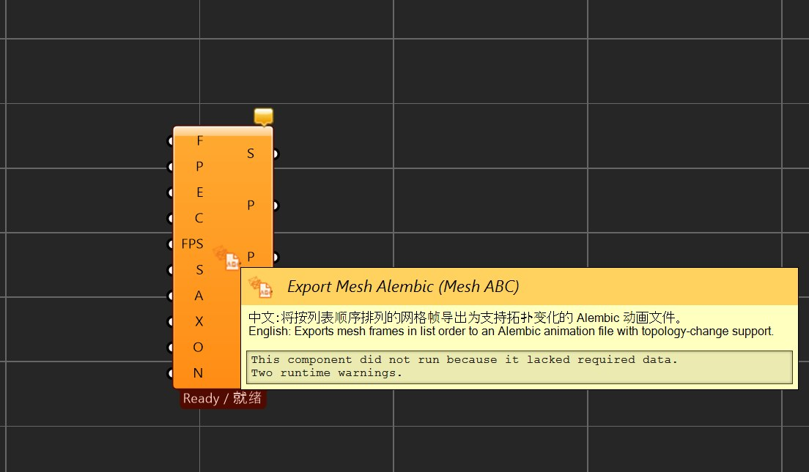

# Export Mesh Alembic

> 模块：GH组件 / Animation

[← 返回命令目录](/commands/)

**功能**：Success（最近一次是否成功）/ File Path（实际绝对路径）/ Progress（0~1，Path 与 Progress 复用 P 名）/ Frames Written（已写入帧数）/ Message（中英双语状态、警告或错误信息）

*图 1：Export Mesh Alembic（Mesh ABC）运算器在 Grasshopper 画布上的状态。组件位于 RSTool / Animation 分组下，浅橘色图标，左侧输入端口依次为：F（Frames 网格帧列表）、P（File Path 目标 .abc 路径）、E（Export 触发，False→True 上升沿）、C（Cancel 取消，True 上升沿）、FPS（帧率，默认 30）、S（Start Frame 起始帧）、A（Up Axis 0=Z-Up/1=Y-Up）、X（Scale 缩放）、O（Overwrite 覆盖）、N（Object Name 内部名）；右侧输出端口为：S（Success）、P（Path/Progress 复用 P 名）、F（Frames Written）、M（Message）。悬停 tooltip（中英双语）：将按列表顺序排列的网格帧导出为支持拓扑变化的 Alembic 动画文件。本图组件正处于 Ready / 就绪 状态但显示 This component did not run because it lacked required data.Two runtime warnings.——说明输入尚未完整连接；一旦 Frames 与 File Path 接入并 Export 触发一次上升沿，后台 MeshRay 导出即开始。*

**使用步骤**：

1. 在 Grasshopper 画布中，从 RSTool 标签的「Animation」分组下找到 Export Mesh Alembic 组件并拖入
2. 按参数表连接各输入端口：Frames 网格帧列表、File Path 目标 .abc 路径、Export 触发、Cancel 取消、FPS 帧率、Start Frame 起始帧、Up Axis 坐标轴、Scale 缩放、Overwrite 覆盖、Object Name 内部名称
3. Export 仅在 False→True 上升沿时启动一次后台导出；Cancel 在 True 上升沿时取消正在执行的导出并清理临时 .abc.tmp 文件
4. 导出采用临时文件 + 原子替换：先写 `.rstool.<guid>.tmp` 再原子替换到目标路径，避免半成品污染
5. 每次画布求解时刷新输出端口 Success / File Path / Progress / Frames Written / Message（其中 Path 与 Progress 复用 P 名）

**参数**：

| 中文名 | 英文名 | 类型 | 默认值 | 范围 | 说明 |
| --- | --- | --- | --- | --- | --- |
| 网格帧列表 | Frames | Mesh | 空 | Mesh 列表 | 按列表顺序排列的网格帧，每个网格对应 Alembic 一帧；拓扑可变 |
| 输出路径 | File Path | Text |  | .abc 绝对路径或相对 GH 文件目录的相对路径 | 扩展名必须为 .abc；空扩展名自动补 .abc；GH 文件未保存时相对路径不可用，须使用绝对路径 |
| 导出触发 | Export | Bool | false | True / False | 仅在 False→True 上升沿启动一次；已有任务运行则本次触发被忽略并提示 warning |
| 取消导出 | Cancel | Bool | false | True / False | True 上升沿取消正在执行的导出并清理临时 `.rstool.<guid>.tmp` 文件 |
| 帧率 | FPS | Number | 30 | 有限正数 | 动画帧率；必须是有限正数，非法值直接报错 |
| 起始帧 | Start Frame | Integer | 0 | 整数 | Alembic 首个样本对应的起始帧号 |
| 向上轴 | Up Axis | Integer | 0 | 0 = Z-Up（Rhino 默认）/ 1 = Y-Up（绕 X 轴旋转） | 控制导出坐标系方向；常见用法是把 Rhino 模型导出到 Maya/Houdini 时取 1 |
| 缩放 | Scale | Number | 1.0 | 有限正数 | 坐标缩放系数；法线不缩放 |
| 允许覆盖 | Overwrite | Bool | false | True / False | 目标 .abc 已存在时；true = 原子替换，false = 拒绝并报错 |
| 对象名 | Object Name | Text | MeshAnimation | 任意文本 | Alembic 内部网格名称；非法字符自动替换为下划线 |

**备注**：通过 MeshRay 并行计算导出；采用临时文件 + 原子替换避免半成品；Export / Cancel 均为上升沿触发，互不冲突；网格拓扑可变化（topology-change support）。

所属 GH 分组：RSTool / Animation
