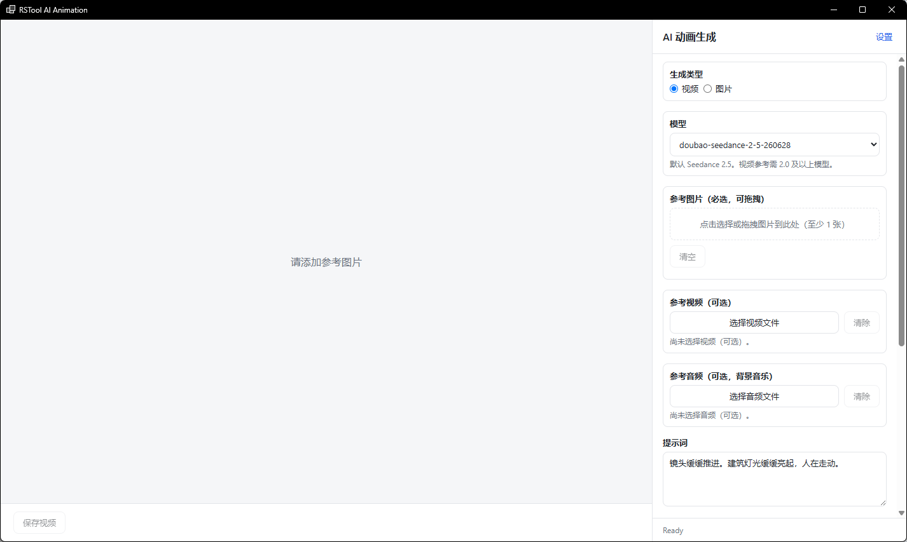

# rsAiAnimation · AI 动画

> 模块：AI / 视频生成

[← 返回命令完全手册](/RsTool命令手册)

**功能**：本命令接入字节跳动（ByteDance）自研的 Seedance / Seedream 大模型，在同一窗口内提供两种生成类型：视频模式基于 Seedance，以参考图（必选）为核心，可叠加参考视频与参考音频做多模态视频生成，或图生视频（首帧/首尾帧）；图片模式基于 Seedream，支持文生图与图生图（以参考图做图生图），一次性生成多张结果。两种模式均支持多任务并发，结果保存到本地并可直接预览

*图 1：AI 动画生成主界面。标题栏右侧「设置」用于切换国内/国际服务区域与配置 API Key；主面板顶部为「生成类型」切换（视频=Seedance / 图片=Seedream，均为字节 ByteDance 自研大模型），下方依次为模型下拉（默认 doubao-seedance-2-5-26028）、参考图片上传（视频必选、可拖拽至少 1 张）、参考视频/参考音频（视频模式可选，做多模态参考或背景音乐）、提示词 textarea，底部为「保存视频 / 保存图片」与状态栏 Ready；左侧大块为结果预览/历史区，任务完成后视频直接播放，图片以缩略图网格展示并可批量保存*

**调用**：在 Rhino 命令行输入 `rsAiAnimation`（打开设置窗口）

**交互流程**：

1. 命令行输入 rsAiAnimation，打开 AI 动画窗口
2. 首次使用点「设置」选择服务区域（国内火山方舟 / 国际 BytePlus）并填写 ARK_API_KEY 保存
3. 在「生成类型」选择 视频 或 图片
4. 视频模式：添加至少 1 张参考图片（可拖拽 / 截取视窗），可选参考视频与音频；图片模式：输入提示词并上传参考图做图生图，或无参考图纯文生图
5. 输入提示词，设置模型、分辨率 / 尺寸、比例、时长（视频）、张数（图片）、随机种子等参数
6. 点「生成」：调用字节 Seedance（视频）/ Seedream（图片）大模型生成，支持一次提交多个任务
7. 等待生成完成后结果自动下载到本地临时目录，可在左侧预览区播放 / 查看，点「保存」导出

**参数**：

| 中文名 | 英文名 | 类型 | 默认值 | 范围 | 说明 |
| --- | --- | --- | --- | --- | --- |
| 生成类型 | genType | radio | 视频 | 视频 / 图片 | 顶部切换：视频=Seedance 视频生成，图片=Seedream 文生图/图生图（均为字节 ByteDance 大模型） |
| 模型 | modelMain | select | Seedance 2.5 | 视频：Seedance 2.5 / 2.0 / 1.5 / 1.0（国内）或 Dreamina-*（国际）/ 自定义；图片：Seedream 系列（按区域切换） | 视频默认 Seedance 2.5（视频参考需 2.0+）；切到图片模式时下拉自动切换为 Seedream 系列（国内 doubao-seedream-* / 国际 seedream-*） |
| 参考图片 | refImages | file[] | — | image/* 多张（视频模式至少 1 张必选；图片模式可选作图生图参考） | 视频模式：有视频走多模态参考，无视频走图生视频（首帧/首尾帧）；图片模式：作为图生图参考驱动生成 |
| 参考视频 | refVideo | file | — | 视频文件（可选） | 多模态视频参考；仅 Seedance 2.0/2.5 支持，1.5/1.0 不支持 |
| 参考音频 | refAudio | file | — | 音频文件（可选，背景音乐） | 可选，作为视频背景音乐参考 |
| 提示词 | prompt | textarea | — | 任意文本 | 视频：描述动画效果（镜头推进、光影变化、建筑摄影风格）；图片：描述画面内容/风格 |
| 分辨率 | resolution | list | 720p | 480p / 720p / 1080p / 4K | 视频模式输出分辨率 |
| 图片尺寸 | imageSize | list | 1K | 1K / 2K / 3K / 4K | 图片模式输出尺寸（Seedream）；视频模式此参数隐藏 |
| 图片张数 | imageCount | number | 4 | 1–10 | 图片模式一次生成的组图张数；Seedream 5.0 pro 不支持组图 |
| 比例 | ratio | list | 16:9 | 16:9 / 4:3 / 1:1 / 3:4 / 9:16 / 21:9 / 自适应 | 画幅比例；自适应随首帧图片尺寸 |
| 时长(秒) | duration | number | 5 | 4–15，步长 1 | 生成视频时长（秒） |
| 随机种子 | seed | number | -1 | 整数（-1 表示随机） | 固定种子可复现结果 |
| 生成音频 | generateAudio | bool | 开 | 开 / 关 | 是否由模型一并生成背景音频 |
| 固定相机 | cameraFixed | bool | 关 | 开 / 关 | 开启后画面不跟随参考视频的相机运动 |
| 添加水印 | watermark | bool | 关 | 开 / 关 | 是否在结果视频上加 AI 生成水印 |
| 服务区域 | region | select | cn（国内火山方舟） | cn 国内 / intl 国际 | 切换区域会同时切换 API 地址与模型列表（视频/图片各自的前缀不同） |
| API Key | apiKey | password | — | ARK_API_KEY | 字节方舟 / BytePlus 的 API Key；加密保存到本机 |
| API 地址 | endpoint | text | https://ark.cn-beijing.volces.com/api/v3 | URL | 随区域自动填充，可改代理地址 |

**备注**：底层调用字节跳动（ByteDance）的 Seedance（视频）/ Seedream（图片）大模型，经火山方舟（国内 ark.cn-beijing.volces.com）或 BytePlus（国际 ark.ap-southeast.bytepluses.com）接口调用，需自备 ARK_API_KEY。视频：有参考视频→多模态参考（仅 2.0/2.5），无视频→图生视频（首帧/首尾帧）；图片：图生图以参考图驱动，也可无参考图文生图。切换国内/国际需同时切接口地址与模型 ID：视频模型国内 doubao-seedance-*、国际 dreamina-seedance-*，图片模型国内 doubao-seedream-*、国际 seedream-*（5.0 pro 不支持组图）。生成通常 1~5 分钟，时长/分辨率越高越久；图片按张计费
