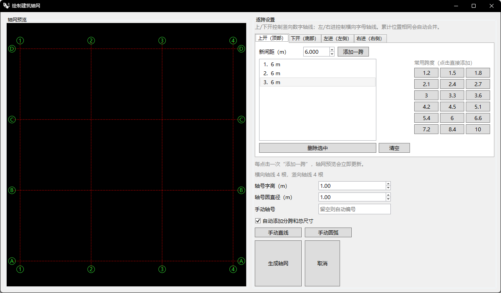

# rsArchiGrid · 智能轴网

> 模块：二维建筑 / 轴网与墙体

[← 返回命令目录](/commands/)

**功能**：建筑轴网（轴网直线、轴号圆与编号文字、分跨及总尺寸标注），归入 rstool/ArchiGrid 图层组

*非模态「绘制建筑轴网」窗口：上/下/左/右四个分页控制数字轴线间距，可逐跨添加或点常用跨度预设；下方统一设置轴号字高、圆直径、手动轴号以及自动分跨与总尺寸标注开关，并提供手动直线/手动圆弧的交互入口*

**调用**：在 Rhino 命令行输入 `rsArchiGrid`（命令行交互）

**交互流程**：

1. 命令行输入 rsArchiGrid
2. 弹出“绘制建筑轴网”窗口（非模态）
3. 在四个分页（上开/下开/左进/右进）中逐跨添加轴线间距，可点击常用跨度预设按钮
4. 设置轴号字高、圆直径、手动轴号，勾选是否自动添加分跨与总尺寸标注
5. 点击“生成轴网”后在视口指定轴网基点（或点“手动直线”/“手动圆弧”进入 GetLine/GetArc 交互）
6. 生成正交轴网直线、轴号圆与编号文字及尺寸标注

**参数**：

| 中文名 | 英文名 | 类型 | 默认值 | 范围 | 说明 |
| --- | --- | --- | --- | --- | --- |
| 上开间间距 | UpSpans | text | 6 x3 |  | 文本列表，逗号/分号/空格分隔；支持“数值x数量”重复语法（如 6x3）；默认 6m×3 跨 |
| 下开间间距 | DownSpans | text |  |  | 格式同上，默认空 |
| 左进深间距 | LeftSpans | text | 6 x3 |  | 格式同 UpSpans，默认 6m×3 跨 |
| 右进深间距 | RightSpans | text |  |  | 格式同上，默认空 |
| 轴号字高 | TextHeight | double | 0.6 | >模型公差 | 单位随模型单位，默认 0.6m |
| 轴号圆直径 | BubbleRadius | double | 0.4 | >模型公差 | 窗口内输入为直径，内部存储为半径；默认 0.4m |
| 手动轴号 | ManualAxisLabel | text |  |  | 留空则按 A/B/C… 与 1/2/3… 自动编号 |
| 自动标注尺寸 | AddDimensions | toggle | true |  | 是否在轴网旁生成分跨与总尺寸标注 |

**备注**：非模态窗口，点击生成后仍可在视口指定基点；手动直线/圆弧为交互绘制；累计位置相同的轴线自动合并
