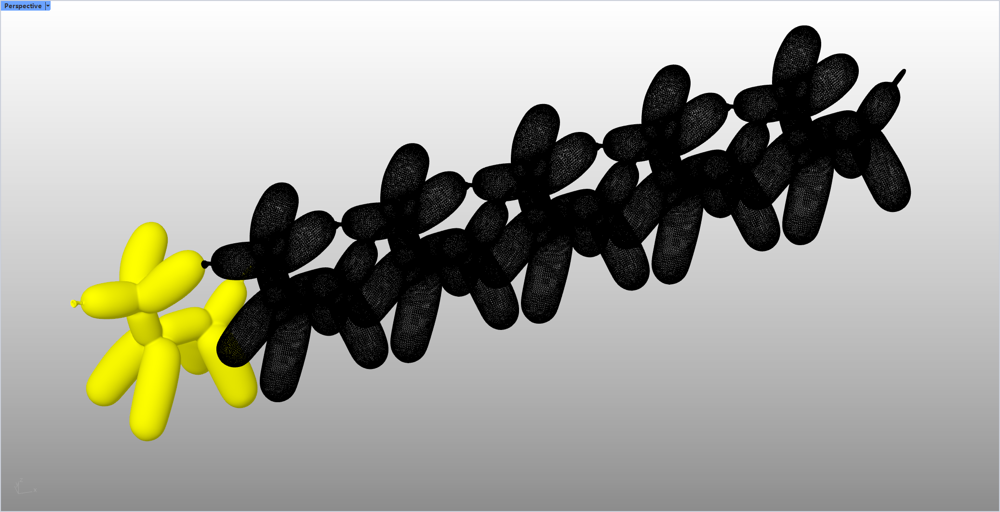

# rsArrayBetween · 两对象间阵列

> 模块：几何 / 对象变换

[← 返回命令目录](/commands/)

**功能**：沿起止两参考点连线方向，均匀复制并生成指定份数的物体阵列

*图 1：rsArrayBetween 阵列效果。Rhino Perspective 视口（左上角 Perspective 标签，左下角坐标轴）中：左下角有一个黄色气球狗形状物体及其周围几个黄色副本（输入/参照），沿从左下到右上的对角线均匀排布着约 10+ 个黑色气球狗副本——这正是命令在两参考点（起点、终点）连线方向上按指定份数均匀复制的阵列结果；间距由两参考点距离与数量参数决定，原物体保留为黄色作为参照*

**调用**：在 Rhino 命令行输入 `rsArrayBetween`（命令行交互）

**交互流程**：

1. 命令行输入 rsArrayBetween
2. 框选/逐个选择待阵列物体（GetMultiple）
3. 指定起始参考点（GetPoint）
4. 指定结束参考点，过程中可用选项调整数量（AddOptionInteger）
5. 回车确认，实时预览后生成两参考点之间的均匀阵列

**参数**：

| 中文名 | 英文名 | 类型 | 默认值 | 范围 | 说明 |
| --- | --- | --- | --- | --- | --- |
| 数量 | Count | integer | 10 | >=1 | 两参考点之间的等分阵列份数（lastArrayNum 记忆上次值，默认10），不含原物体位置，从 i=1 开始复制 |

**备注**：起点终点距离过近（< ZeroTolerance）会失败；命令行中可选数量并实时预览（ArrayPreviewConduit）。该功能参考 SketchUp 中的复制功能。
