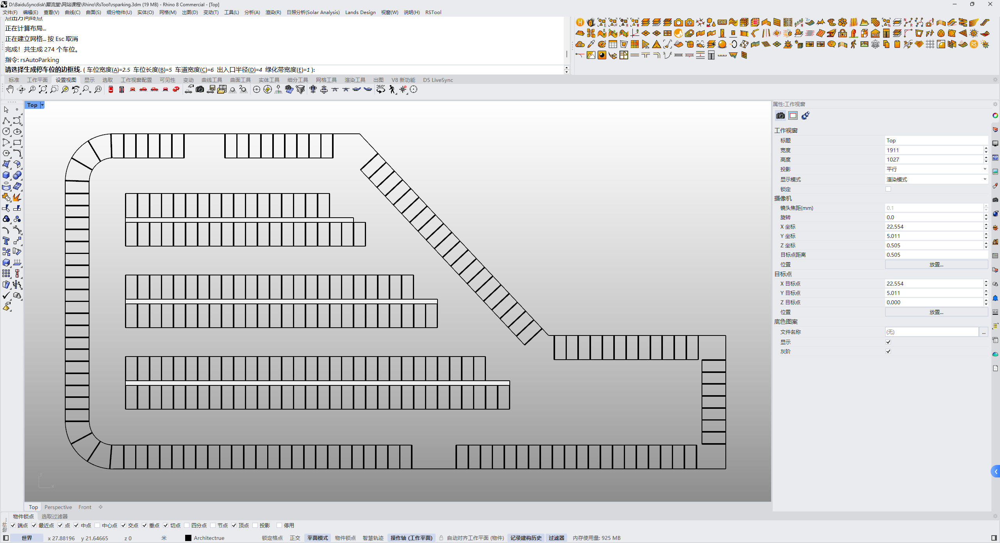

# rsAutoParking · 自动停车

> 模块：建筑 / 道路

[← 返回命令目录](/commands/)

**功能**：由边界曲线与参数生成停车位、车道、绿带及出入口布局

*自动停车生成效果：多排车位、车道、弯道出入口与绿带布局*

**调用**：在 Rhino 命令行输入 `rsAutoParking`（命令行交互）

**交互流程**：

1. 选择闭合的停车区域边界曲线
2. 设置车位宽度 / 车位长度 / 车道宽度 / 出入口半径 / 绿带宽度
3. （可选）选择内部排除区域（需闭合且位于边界内）
4. 点击出入口位置（可多个）
5. 定义内部排列方向（起点 + 终点）
6. 生成停车位 / 车道 / 绿带 / 出入口布局

**参数**：

| 中文名 | 英文名 | 类型 | 默认值 | 范围 | 说明 |
| --- | --- | --- | --- | --- | --- |
| 车位宽度 | SpotWidth | double | 2.5 | >0 (min 0.01) | 单位：米 |
| 车位长度 | SpotLength | double | 5.0 | >0 (min 0.01) | 单位：米 |
| 车道宽度 | AisleWidth | double | 6.0 | >0 (min 0.01) | 单位：米 |
| 出入口半径 | EntranceRadius | double | 4.0 | >0 (min 0.01) | 单位：米 |
| 绿带宽度 | GreenBeltWidth | double | 1.0 | >=0 | 单位：米 |
