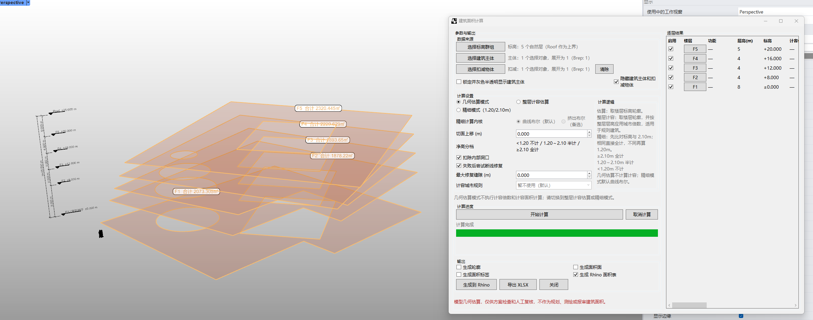

# rsBuildingArea2D · 建筑面积

> 模块：二维建筑 / 其他二维

[← 返回命令目录](/commands/)

**功能**：按楼层自动汇总套内面积、公摊面积、建筑面积、外周长度与阳台面积，支持九宫格面积式与整面计算式两种拓扑判定，可按净高分级(<1.20 不计、1.20–2.10 半计、≥2.10 全计)分别统计，输出 Rhino 面积表、视口标签与可选轮廓/面积面

*rsBuildingArea2D 主界面（左侧按层叠加的楼板面 + 右侧面积计算窗口与总览数据表）*

**调用**：在 Rhino 命令行输入 `rsBuildingArea2D`（打开设置窗口）

**交互流程**：

1. 命令行输入 rsBuildingArea2D
2. 弹出建筑面测计算窗口
3. 在「多楼层管理」中选择构建组、读图主体、裁剪主体，并勾选自动锁定外周读图等选项
4. 在「计算设置」中切换九宫格面积式 / 整面计算式，按图纸需要调整切面上移、净高分级、洞口/外墙/阳台等扣减规则
5. 框选或自动获取场景中所有参与计算的楼板/外墙/阳台对象，点击「开始计算」
6. 窗口下方进度条完成后，在 Rhino 场景中查看面积汇总标签，并在右侧「总览数据」表中复核每层数据

**参数**：

| 中文名 | 英文名 | 类型 | 默认值 | 范围 | 说明 |
| --- | --- | --- | --- | --- | --- |
| 切面上移 | SliceOffsetMeters | double | 0.010 | 0–10 | 单位：米，默认 0.010m |
| 最大缝隙修复 | MaximumGap | double |  | 0–1000 | 断线修复允许的最大缝隙 |
| 扣除内部洞口 | PreserveHoles | toggle | true |  | 是否扣除内部洞口面积 |
| 失败后尝试断线修复 | RepairGaps | toggle | true |  |  |
| 建筑面积比剖面 | FloorAreaRatioProfile | list |  | 按配置文件/下拉项 | ComboBox，选择计容面积规则剖面 |
| 生成 Rhino 面积表 | Add模块le | toggle | true |  | 其余输出项：轮廓/面积面/标签/锁定实体/隐藏实体默认未勾选 |
| 各级层高 | StoreyHeight | list |  | >0 | 按标高分级设置层高（米） |

**备注**：**重要声明**：本命令只能做前期粗略概算，不保证命令输出面积的准确性；正式报建、容积率核算与权证测绘请以有资质测绘单位的结果为准。

窗口内完成全部配置；读图主体为各层楼板面，裁剪主体界定归属，框选或自动取场景轮廓参与计算，计算完成后在视口生成面积标签并在右侧「总览数据」表按勾选楼层逐行汇总。

计算流程按「读图 → 拓扑归属 → 净高分级 → 扣洞扣板 → 分项汇总 → 输出」六步串行执行：
- 读图：以多楼层管理中的「读图主体」为输入，逐层切面上移 SliceOffsetMeters 后抽取楼板面边界，按构建组自动对应到 F1–F5 等楼层。
- 拓扑归属：根据当前「计算逻辑」决定每块子面积归到套内、共墙公摊还是外墙公摊；该步骤是命令的计算核心。
- 净高分级：根据窗口中的「净高分级」下拉(<1.20 不计 / 1.20–2.10 半计 / ≥2.10 全计)对每段面积应用 0、0.5 或 1.0 倍系数。
- 扣洞扣板：依「扣除内部洞口」「最大缝隙修复」「最大板缝厚(m)」等参数修正边界，必要时按板厚减扣外墙外侧板面积。
- 分项汇总：按楼层独立得出套内、公摊、阳台、外周等指标，并在 Rhino 面积表中以「勾选·楼层·层数(M)·楼层(m²)」格式列出。
- 输出：视口内生成面积标签（图中橙色标注块），可附加轮廓/面积面/锁定实体/隐藏实体等图层化输出。

九宫格面积式 vs 整面计算式：九宫格模式（默认）会把每户房间沿对角线和中线切为 9 个子区，再依据周边墙体归属（外墙/分户墙/内墙）把子区分到「套内」「共墙公摊」「外墙公摊」三类，是住宅与公寓类分户计算的标准拓扑；整面计算式不拆九宫格，直接把每层楼板作为完整地块计算，再依外墙归属把面积切给套内与公摊，更适用于商业、loft、大平层等没有明确分户墙的空间。

净高分级（与《建筑工程建筑面积计算规范》常见做法一致）：
- 净高 < 1.20m：当前区段不计入建筑面积。
- 1.20m ≤ 净高 < 2.10m：按 1/2 面积计入。
- 净高 ≥ 2.10m：按全面积计入。
注：实际生效档位由所选「建筑面积比剖面」配置文件控制，可在下拉中切换不同规范版本。

分项汇总口径：
- 套内面积：归属到户内的全部有效面积（含九宫格子区 + 共墙一半归属本户的部分），按净高分级折算后逐户累加。
- 公摊面积：共墙公摊 + 外墙公摊，不含本户专属阳台。
- 建筑面积：套内面积 + 公摊面积（即图中「面积」一栏，作为报建/容积率核算口径）。
- 外周长度：所有外墙外边线的累计周长，单位为 m，用于外墙饰面与脚手架估算，不进入面积合计。
- 阳台面积：所有阳台按当前规则（默认 1/2）的累计值，独立一栏，不并入公摊。

扣减与边界修正：勾选「扣除内部洞口」会按楼板内的洞（楼梯井、管道井、设备洞等）扣减对应面积；「未完成板面积扣除损」用于施工未封闭板段的减扣（同样受净高分级影响）；「外板厚」按设定米数从外墙外边线回缩用于外墙饰面评估，不影响建筑面积主体核算。

输出：场景中按层生成面积标签并生成 Rhino 面积表；可勾选「锁定实体/隐藏实体」避免误编辑；最后可在 Rhino 中按图层导出到出图模板。
