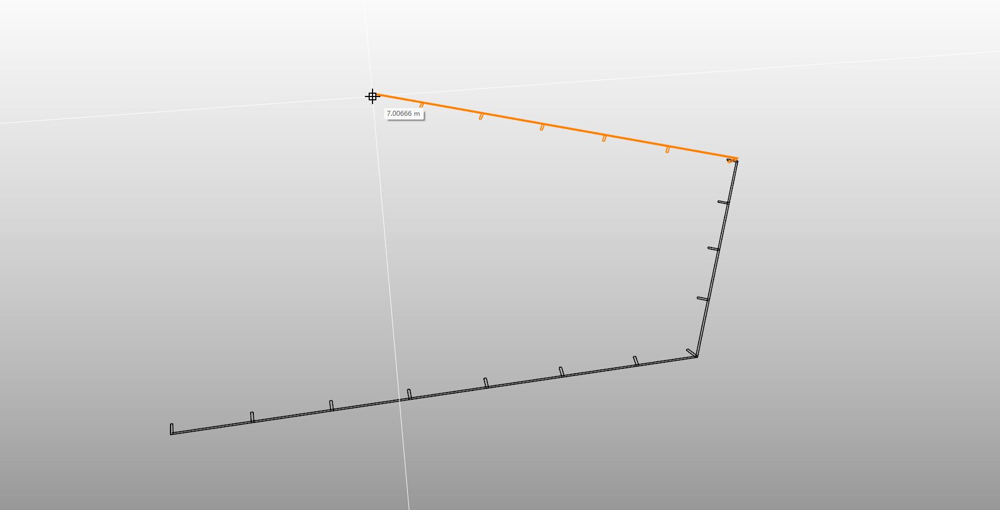

# rsCurtainWall2D · 二维幕墙

> 模块：二维建筑 / 其他二维

[← 返回命令目录](/commands/)

**功能**：沿中心线生成的 2D 幕墙（竖梃、玻璃夹板曲线），归入幕墙组

*rsCurtainWall2D 沿中心线延伸幕墙时，Rhino 视口在前一段已生成的幕墙（黑色墙线 + 等间距朝外短斜线竖梃）基础上，下一段用橙色橡皮线实时预览并附带长度标签（图中右上角 7.0066 m），便于按设计分段控制幕墙长度与折角*

**调用**：在 Rhino 命令行输入 `rsCurtainWall2D`（命令行交互）

**交互流程**：

1. 命令行输入 rsCurtainWall2D
2. 设置竖梃间距、竖梃宽/深、玻璃夹板宽、玻璃位置、绘制模式（直线/弧线/样条）
3. 指定起点并连续绘制幕墙中心线，回车结束

**参数**：

| 中文名 | 英文名 | 类型 | 默认值 | 范围 | 说明 |
| --- | --- | --- | --- | --- | --- |
| 竖梃间距 | MullionSpacing | double | 1.2 | >模型公差 | 默认 1.2m（1200mm） |
| 竖梃宽 | MullionWidth | double | 0.04 | >模型公差 | 默认 0.04m（40mm） |
| 竖梃深 | MullionDepth | double | 0.2 | >模型公差 | 默认 0.2m（200mm） |
| 玻璃夹板宽 | GlassClampWidth | double | 0.03 | >模型公差 | 默认 0.03m（30mm） |
| 玻璃位置 | GlassPosition | list | 外侧 | 外侧/中心/内侧 |  |
| 绘制模式 | Mode | list | 直线 | 直线/弧线/样条 |  |

**备注**：默认按 1200/40/200/30mm 适配模型单位
