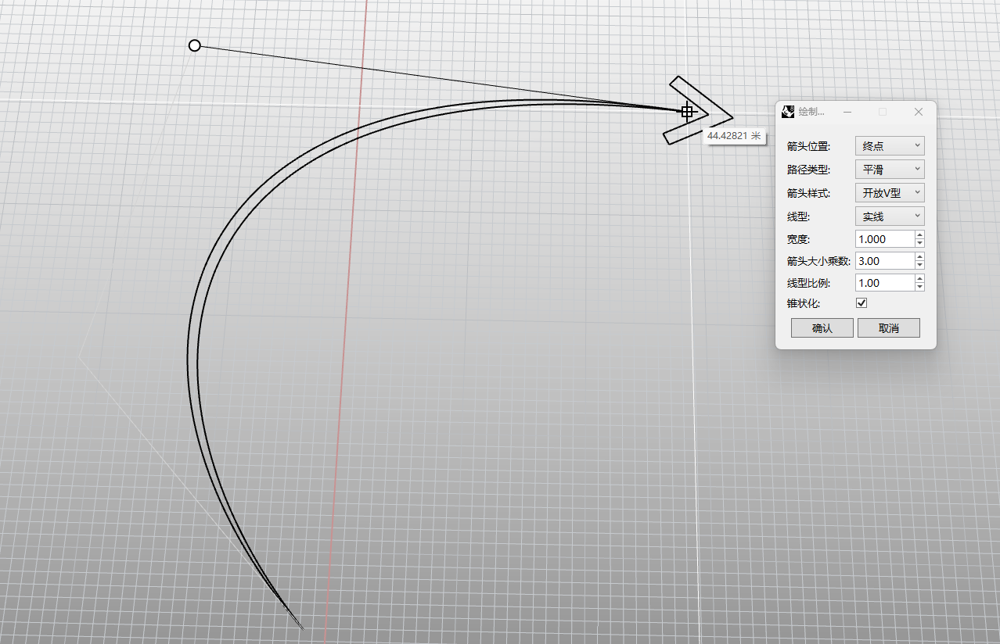

# rsDiagramArrow · 示意箭头

> 模块：视图出图 / 标注出图

[← 返回命令目录](/commands/)

**功能**：箭头实体几何 (杆体扫掠 + 箭头头部 Brep)，成组

*绘制窗口（Eto 非模态 Form）参数面板 + Rhino 视图中实时预览的开放 V 型平滑路径箭头（终点位置 / 宽度 1.000 / 箭头大小 3.00 / 锥状化 ✓）*

**调用**：在 Rhino 命令行输入 `rsDiagramArrow`（命令行交互）

**交互流程**：

1. 命令行运行 rsDiagramArrow
2. 弹出箭头设置窗口 (Eto 非模态 Form)
3. 在视图中拾取路径起点
4. 继续拾取后续点 (回车/右键结束，或在窗口点确认)
5. 实时预览并生成箭头几何

**参数**：

| 中文名 | 英文名 | 类型 | 默认值 | 范围 | 说明 |
| --- | --- | --- | --- | --- | --- |
| 宽度 | Width | double | 1.0 (按文档单位米换算) | 0.001 – 100000 | 窗口 NumericStepper 增量 0.1；默认按模型单位米换算 (unitValue)，记忆上次值 |
| 箭头大小乘数 | ArrowScale | double | 3.0 | 0.01 – 100.0 | 窗口 NumericStepper 增量 0.5 |
| 线型比例 | LineScale | double | 1.0 | 0.01 – 100.0 | 窗口 NumericStepper 增量 0.1；按模型单位缩放 |
| 箭头位置 | Location | list | End (终点) | None/Start/End/Both (无/起点/终点/两端) |  |
| 路径类型 | CurveType | list | Polyline (折线) | Polyline/Smooth (折线/平滑) |  |
| 箭头样式 | ArrowheadStyle | list | Triangle (三角形) | Triangle/OpenV (三角形/开放V型) |  |
| 线型 | LineStyle | list | Continue (实线) | Continue/Dash/DashDot/Center (实线/虚线/点划线/中心线) |  |
| 锥状化 | Taper | toggle | false |  | 仅对平滑路径 (Smooth) 生效 |

**备注**：参数通过 UserString 写入对象，可被 rsDiagramArrowEdit 读取编辑；单位随文档单位自适应
