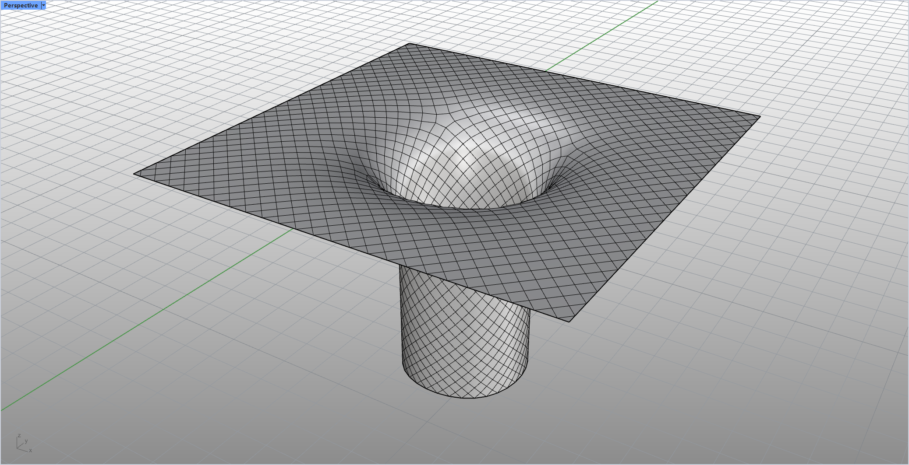

# rsDiamondMesh · 菱形网格

> 模块：几何 / 网格

[← 返回命令目录](/commands/)

**功能**：Diamond / Ambo 算子生成的双色(菱形)拓扑网格

*原始网格（Before）：Rhino 8 透视视口，物体由上方一块带中心凹陷（漏斗状）的方形板与下方一个圆柱组成，绿色 X 轴线与左下角坐标 gizmo 可见；网格线框较粗，作为 Diamond / Ambo 算子的输入对象*

*Diamond / Ambo 算子生成的菱形拓扑网格（After）：与示例 1 同一视口、同一物体（方形板 + 中心漏斗 + 下方圆柱），网格线密度显著增加——方板上的网格线由粗变细、由疏变密，圆柱面上的纵向线也明显加密；无 UI 面板（无可调参数），仅展示算子作用后的拓扑变化*

**调用**：在 Rhino 命令行输入 `rsDiamondMesh`（命令行交互）

**交互流程**：

1. 选择网格
2. 生成 Diamond（Ambo）菱形拓扑网格

**参数**：

> 此命令无命令行数值参数，相关设置在窗口中调整。

**备注**：无可调参数
