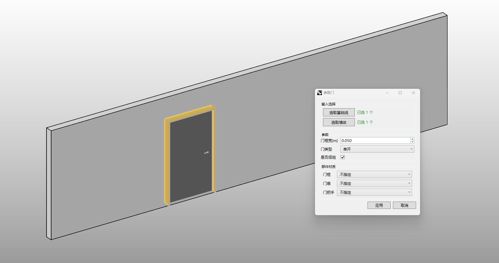

# rsDoor · 门

> 模块：建筑 / 建筑构件

[← 返回命令目录](/commands/)

**功能**：在墙上开洞并生成门（门框 / 门扇 / 门把手）

*Eto「参数」窗口：在墙上选择基础线与墙体后开洞并生成门（含门框 / 门扇 / 门把手），窗口内调整门洞宽、门类型（单开/双开等）、是否成组以及门框/门扇/门把手的指定材质*

**调用**：在 Rhino 命令行输入 `rsDoor`（打开设置窗口）

**交互流程**：

1. 打开参数化表单
2. 选择门洞基础线（一级 / 二级）与宿主墙体
3. 设置门框宽度与门类型
4. 生成门（开洞 + 门框 + 门扇 + 门把手）

**参数**：

| 中文名 | 英文名 | 类型 | 默认值 | 范围 | 说明 |
| --- | --- | --- | --- | --- | --- |
| 门框宽 | FrameWidth | double | 0.05 | 0.001~10000 | 步进 0.01，单位：米 |
| 门类型 | DoorType | list | 1 | 门洞\|单开\|双开\|子母门 | 0=门洞(Openning), 1=单开(Single), 2=双开(Double), 3=子母门(Auxiliary) |
| 成组 | IsGrouped | bool | false | true\|false | 将生成结果打组 |
