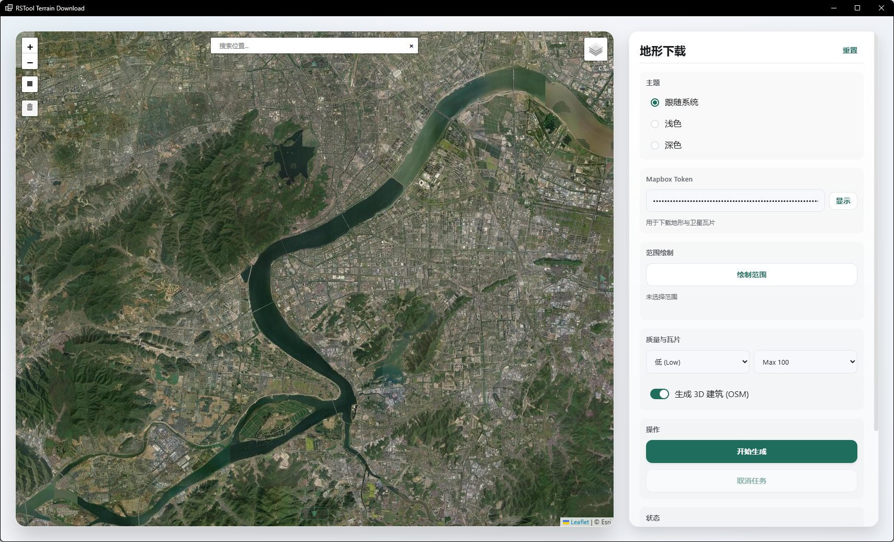

# rsEarth · 下载地形

> 模块：地形 / 获取与编辑

[← 返回命令目录](/commands/)

**功能**：将下载得到的地形网格（含贴图的 Rhino 网格）写入当前文档

**调用**：在 Rhino 命令行输入 `rsEarth`（打开设置窗口）

**交互流程**：

1. 命令行输入 rsEarth，打开地形下载窗口
2. 在窗体中搜索区域、选择地图源并设置下载精度后下载地形
3. 若新版窗口不可用，自动回退到旧版地图窗体 rsEarthOld

**参数**：

> 此命令无命令行数值参数，相关设置在窗口中调整。

**备注**：RSTool Terrain Download 是 Rhino 内的在线地形高程获取工具；启动后打开一个窗口，左侧为 Leaflet 地图，右侧为控制面板，所有交互在网页端完成。

界面分两栏。**左侧为地图预览区**（对应窗体 `#map`），整块是 Leaflet 地图：搜索框（geosearch，支持 Esri + OSM，地址输入即定位）、Zoom 缩放、底图切换按钮；地图四个方向额外放置了 4 颗移动按钮（▲▼◀▶），专门用来在没有滚动条精确定位或鼠标不便时，按「一格 tile」的步进平移当前选中范围。地图上方会显示一个 LOADING 遮罩直到瓦片加载完成。

**右侧控制面板自上而下分区**（按窗体 `#panel-inner` 顺序）：

| 顺序 | 分区 | 控件 | 说明 |
| --- | --- | --- | --- |
| 1 | 标题栏 | `Terrain Download` + `重置` | 标题与一键重置当前范围/参数 |
| 2 | 主题 | radio 三选一 | 跟随系统 / 浅色 / 深色；切换即时生效并写入全局配置 |
| 3 | Mapbox Token | 密码框 + 显示/隐藏 | 用于下载地形与卫星瓦片（pk.xxxxx 开头），本地加密存档 |
| 4 | 代理 (Debug) | 开关 + 地址 + 测试 | 仅 Debug 构建可见；支持 `http://` 或 `socks5://`，可点测试验证连通 |
| 5 | 范围绘制 | 绘制范围按钮 + 方向键 | 在地图上拖矩形选区，4 颗方向键做 tile 粒度的选区平移 |
| 6 | 质量与瓦片 | 精度 select + 瓦片上限 select + 建筑 checkbox | 精度：高/中/低 → 网格采样 step 1/2/4；瓦片上限：20/60/100；建筑：勾选启用 OSM 3D 建筑 |
| 7 | 操作 | 开始生成 + 取消任务 | 主/辅按钮：绿色生成、白底取消 |
| 8 | 状态 | 状态框 + 进度行 | 实时显示当前阶段文本与 `已耗时 Nx` 进度说明 |
| 9 | 任务日志 | 日志列表 + 导出按钮 | 滚动日志区，可导出为 `TerrainLog.txt` |

**操作流程**——打开命令后，先在搜索框定位目的区域，将地图放大到目标地块；在地图上按住鼠标拖出矩形选区，4 颗方向按钮可对选区做 tile 粒度的细微调整；按「开始生成」后流程是：Token 校验 → bounds 校验（南北纬不超过 ±85.05112878、东西经不超过 ±180）→ 计算最优 zoom → 检查瓦片预算 → 下载高程瓦片并拼接为 Rhino 网格 → 若开启 3D 建筑则调用 Overpass 拉取 OSM `building` 关系并拟合高度。

**精度与瓦片上限**决定了网格密度与下载瓦片配额：精度下拉映射 sample step（高=1、中=2、低=4），瓦片上限三档 20/60/100 决定单个任务允许拉取的瓦片数，超过会被服务端丢弃并弹错；调整这两个值会影响最终几何的细节与生成时间。生成 3D 建筑通过 Overpass API 拉取 OSM 内的 `building` 几何，再用高度策略生成 Rhino 网格。

**取消与日志**——生成途中点「取消任务」会立刻停止下载并丢弃已拉取的瓦片；任务日志按行滚动，错误项以红色显示，可一键导出为本地 txt 用于排障。状态区除当前阶段文本外，还会在右下显示阶段耗时汇总（`已耗时 Nx、阶段耗时汇总…`）。

**配置记忆**——Token、主题、最近一次地图位置 (lat/lon/zoom)、精度、瓦片上限、建筑开关、代理地址与开关都会通过 `TerrainDownloadWebForm.Config` 持久化到本地 JSON（Windows `%LocalAppData%` 目录下加密存档），下次打开命令自动恢复。首次打开会尝试从旧版 `rsEarth_Data/token.txt`、`location.txt` 迁移数据。

**网络与性能**——所有下载走自有 `TerrainNetwork` 槽（瓦片 15s 超时 / Overpass 30s 超时 / 地理搜索 15s 超时）；代理若开启则注入相应启动参数。需要联网与 Mapbox 凭据；运行旧版依赖不存在时自动回退 `rsEarthOld` 窗体。
