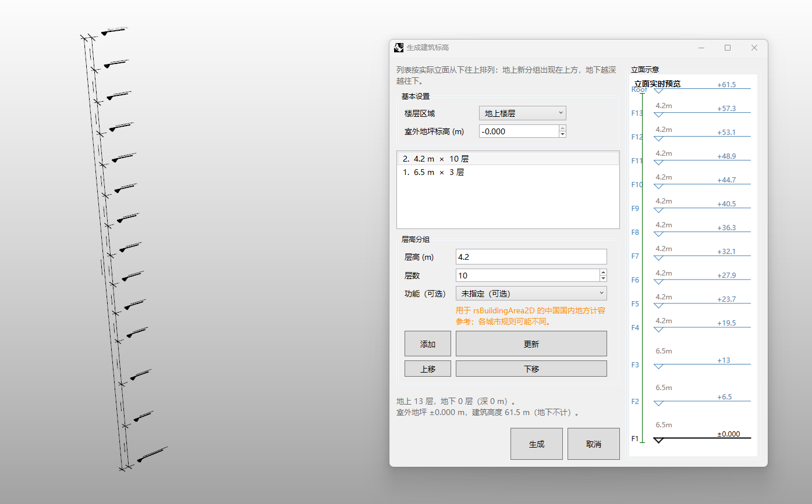

# rsElevation2D · 建筑标高

> 模块：二维建筑 / 其他二维

[← 返回命令目录](/commands/)

**功能**：按楼层分组批量生成建筑立面标高详图，支持地上/地下分层管理与多段不同层高(高度×层数)组合，右侧实时预览立面，最终输出楼层标高线、室外地坪线、标高文字与层高/总高尺寸标注；层组「功能」字段可与 rsBuildingArea2D 联动

*rsElevation2D 主界面（左侧立面视口 + 右侧多组层高设置与实时立面预览）*

**调用**：在 Rhino 命令行输入 `rsElevation2D`（命令行交互）

**交互流程**：

1. 命令行输入 rsElevation2D
2. 弹出生成建筑标高窗口
3. 在「基本设置」中选择楼层区域(地上楼层/地下楼层)与室外地坪标高
4. 在「层高分组」中添加多个层组(层高 m + 层数 + 可选功能)，用添加/更新/上移/下移调整顺序与功能标签
5. 窗口右侧「立面示意」面板按从上往下实时预览 F1–Fn 各层标高与每层层高，底部状态栏同步显示地上/地下层数与建筑总高
6. 点击「生成」后在视口指定基点放置，输出楼层标高线、室外地坪线、标高文字与层高/总高尺寸标注

**参数**：

| 中文名 | 英文名 | 类型 | 默认值 | 范围 | 说明 |
| --- | --- | --- | --- | --- | --- |
| 室外地坪标高 | OutdoorGroundElevationMeters | double | -0.15 |  | 单位：米，默认 -0.15m |
| 楼层分组(层高) | FloorGroups.HeightMeters | double |  | >0 | 每组楼层高度，由默认设置或用户输入决定 |
| 楼层分组(层数) | FloorGroups.Count | integer |  | ≥1 | 该组楼层重复层数 |
| 地下室分组(层高) | BasementGroups.HeightMeters | double |  | >0 | 地下每层高度，仅当楼层区域选「地下楼层」时生效 |
| 地下室分组(层数) | BasementGroups.Count | integer |  | ≥1 | 地下室层数 |

**备注**：主交互为窗口；按「楼层区域」区分地上与地下分组，地下越深越往下排列；层组支持多次添加/上移下移调整顺序；窗口顶部说明：「列表按实际立面从上往下排列：地上层分组出现在上方，地下越深越往下」。

层高分组逻辑：每条层组记录由「层高(m) × 层数」二字段构成，可选填「功能」标签用于联动 rsBuildingArea2D；典型添加顺序为「先底层商(高)×N、再标准层(中高)×N、再屋面机房层」等组合，例如截图中 6.5m × 3 层 + 4.2m × 10 层即组合出 13 层总高 61.5m 的高层建筑。

立面实时预览：右侧「立面示意」面板按从上到下逐行列出 F1–Fn，每行显示层号、层高与累积标高（基线为室外地坪），底部状态栏同步显示地上层数、地下层数(深 m)与建筑总高(地下不计)，方便生成前预查。

与 rsBuildingArea2D 的联动：橙色提示「用于 rsBuildingArea2D 的中国国内地方计算参考；各地规范可能不同」，层组「功能」标签可写入规范版本(如「住宅」「公建」「机房」等)用于建筑面测计算的归属识别；窗口底部会显示最终层组结构与建筑总高，便于核对面积配置对应。

生成与图层：点击「生成」后在 Rhino 视口指定基点放置标高详图；图层与功能分组保留关联，可在 Rhino 中按线、标高文字、尺寸标注分别出图或导出 CAD。
