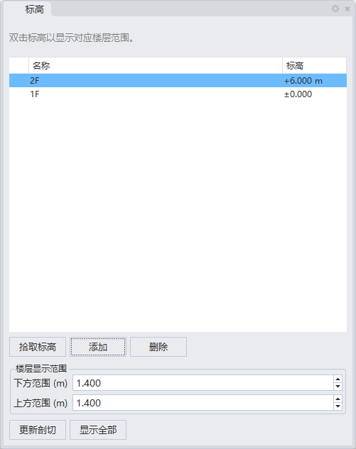

# rsElevationPanel · 标高面板

> 模块：二维建筑 / 其他二维

[← 返回命令目录](/commands/)

**功能**：由标高对象生成标高面板

*图 1：标高面板。窗口标题「标高」，右上角齿轮为设置按钮；顶部提示「双击标高以显示对应楼层范围」；中部为标高列表表格（两列：名称/标高），当前选中 2F(+6.000 m)，下方还有 1F(±0.000)；按钮区第一排「拾取标高 / 添加 / 删除」用于从模型拾取剖面高程或新增/删除标高条目；中部「楼层显示范围」可分别设「下方范围(m)」与「上方范围(m)」（均默认 1.400），决定点选标高时该楼层在 Rhino 视口里的纵向显示带高度；底部「更新剖切」按当前标高刷新 Rhino 剖切视图，「显示全部」一键显示所有标高对应的楼层范围*

**调用**：在 Rhino 命令行输入 `rsElevationPanel`（命令行交互）

**交互流程**：

1. 选择 rsElevation2D 生成的标高对象或群组（可多选）
2. 生成标高面板

**参数**：

> 此命令无命令行数值参数，相关设置在窗口中调整。

**备注**：输入对象需为 rsElevation2D 生成的标高对象或群组。
