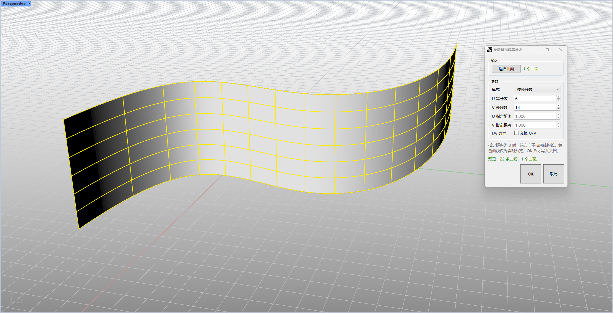

# rsExtractIsoCrvByNum · 按数量提取等参线

> 模块：几何 / 曲线

[← 返回命令目录](/commands/)

**功能**：从所选曲面按数量(等分数或等距)抽离的等参曲线(ISO curves)，按来源对象+方向分组

*图 1：rsExtractIsoCrvByNum 对话框与实时预览。Rhino Perspective 视口（左上角 Perspective 标签，红绿坐标轴在底部左右）中是一条带黄色等参网格的波浪起伏曲面（U 方向 6 条、V 方向 14 条交叉结构线，共 22 条黄色曲线），右上是“参数提取等参曲线”对话框：输入区显示“已选择 1 个曲面”；参数区含模式（按等分数）、U 等分数（6）、V 等分数（14）、U 指定距离（1.000）、V 指定距离（1.000）、UV 方向（交叉 U/V）等参数；预览状态显示“22 条曲线 1 个曲面”；底部 OK / 取消按钮。指定距离为 0 时该方向不抽取结构线，黄色曲线均为该预览，OK 后才写入文档*

**调用**：在 Rhino 命令行输入 `rsExtractIsoCrvByNum`（打开设置窗口）

**交互流程**：

1. 命令行输入 rsExtractIsoCrvByNum
2. 点击"选择曲面"拾取曲面/Brep/挤出(可多选，可子物体)
3. 选择模式(按等分数 / 按指定距离)
4. 设置 U/V 等分数或 U/V 距离
5. 实时黄色预览抽离的等参线
6. 点击 OK 写入等参线(按来源自动分组)

**参数**：

| 中文名 | 英文名 | 类型 | 默认值 | 范围 | 说明 |
| --- | --- | --- | --- | --- | --- |
| 模式 | Mode | list | 按等分数(By divisions) | 按等分数/按指定距离 | 0=ByDivisions,1=ByDistance；按距离模式禁用等分数、启用距离 |
| U 等分数 | UDivisions | integer | 3 | 0-1000 | U 方向等分数(静态 lastUCount) |
| V 等分数 | VDivisions | integer | 3 | 0-1000 | V 方向等分数(静态 lastVCount) |
| U 指定距离 | UDistance | double | 1.0 | 0-1000000.0 | U 方向按等距抽离(模型单位)；为 0 则该方向不抽离(静态 lastUDistance) |
| V 指定距离 | VDistance | double | 1.0 | 0-1000000.0 | V 方向按等距抽离；为 0 则该方向不抽离(静态 lastVDistance) |
| 交换 U/V | SwapUv | toggle | false |  | 交换 U/V 方向(静态 lastSwapUv) |

**备注**：无可调单位限制；距离模式最大分段上限 1000。
