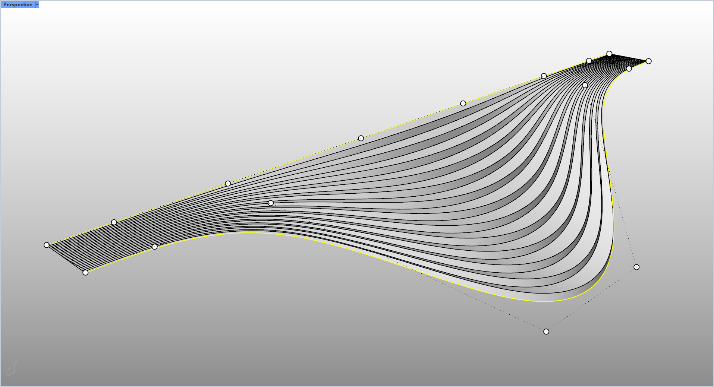

# rsFadingStair · 渐变楼梯

> 模块：建筑 / 楼梯与坡道

[← 返回命令目录](/commands/)

**功能**：由两条基础曲线渐变生成的渐消楼梯

*渐变楼梯：踏步端部随曲线渐隐消失，从左下到右上呈自由曲线造型*

**调用**：在 Rhino 命令行输入 `rsFadingStair`（命令行交互）

**交互流程**：

1. 选择两条基础曲线（顶 / 底线）
2. 输入踏步数
3. 选择渐变位置（左 / 中 / 右）
4. 生成渐消楼梯

**参数**：

| 中文名 | 英文名 | 类型 | 默认值 | 范围 | 说明 |
| --- | --- | --- | --- | --- | --- |
| 楼梯踏步数 | StepCount | int | 12 | 3~9999 | 默认 12 |
| 渐变位置 | FadePosition | list | 0 | 左\|中\|右 | 0=左, 1=中, 2=右 |
