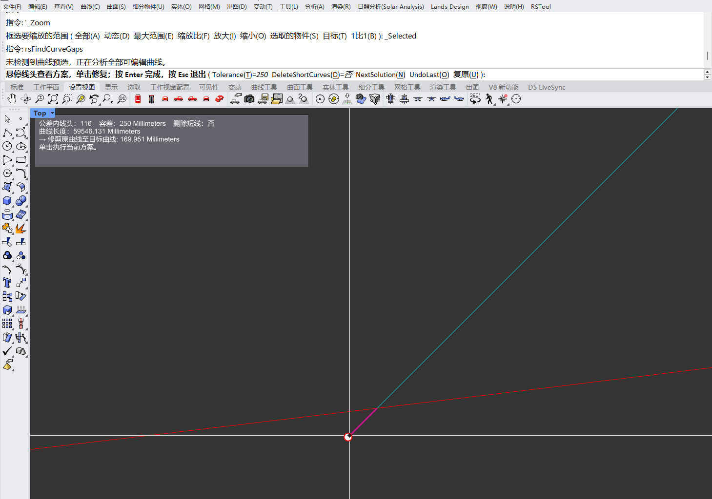

# rsFindCurveGaps · 查找线头

> 模块：几何 / 曲线

[← 返回命令目录](/commands/)

**功能**：在容差内修复的曲线(延长/修剪/连接线头)，可选删除短曲线；支持 UndoLast 逐笔撤销、NextSolution 多方案切换

*举例：容差 250mm 下共找到 116 个线头候选，悬停的端头系统给出'修剪原始曲线至目标曲线 169.951mm'的修复方案，单击即采纳*

**调用**：在 Rhino 命令行输入 `rsFindCurveGaps`（命令行交互）

**交互流程**：

1. 命令行输入 rsFindCurveGaps
2. 命令自动分析预选或全部可编辑曲线
3. 悬停线头查看修复方案(NextSolution 切换方案)
4. 单击线头执行修复
5. 用 Tolerance / DeleteShortCurves 选项调整，回车完成或 Esc 退出

**参数**：

| 中文名 | 英文名 | 类型 | 默认值 | 范围 | 说明 |
| --- | --- | --- | --- | --- | --- |
| 容差 | Tolerance | double | 10.0 (毫米，按模型单位换算；无单位时为 10.0) | 下限 max(模型绝对公差, ZeroTolerance), 上限 double.MaxValue | 线头间距容差，设置键为 FindCurveGaps.Tolerance* 持久化 |
| 删除短线 | DeleteShortCurves | toggle | false |  | 开启后单击长度小于容差的短曲线将其删除(设置键 FindCurveGaps.DeleteShortCurves) |

**备注**：命令为 hybrid 模式（命令行提示 + GetPoint 交互）：在 Rhino 主视口里直接操作，无独立对话框，所有配置走命令行选项（Tolerance / DeleteShortCurves / NextSolution / UndoLast / 复原）。

核心用途：批量补曲线之间的'缝隙'（gaps、断口）。常见场景是外部导入的 CAD/SketchUp 平面图、扫描图矢量化、Iconstuctor/LOD 出图等导致一段本应连续的多段线被切成两段甚至多段；本命令把端头小于容差的两条曲线直接连起来、或将一条修剪到另一条端部，恢复几何连续，便于后续 Offset/SweepBoolean/Trim 等。

完整用法（6 步）：①命令运行后自动按预选范围或'全部可编辑曲线'建立索引（未预选时 prompt 行会写明'未检测到曲线预选，正在分析全部已编辑曲线'），并在视口里把所有线头距离在容差内的端点用红点标出，悬停时该端点连接的候选解会以青蓝色短线高亮；②鼠标悬停线头，左上角信息框实时显示当前线头所属曲线 ID、与最近另一条曲线的距离/候选修剪长度、单击执行的动作；③若同一点有多个候选（如四条线汇聚），按命令行 `NextSolution`（快捷键 N）切换下一个方案，每条候选都列出'修剪 X 至 Y 的 Z mm'的方案描述；④确定方案后单击线头（青蓝短线处）即执行一次修复（延长/修剪），同时把它写入 UndoLast 栈；⑤命令行 `UndoLast`（O）逐笔回退最近一次修复，必要时反复 O 撤销多笔；⑥全部完成后按 Enter 结束，按 Esc 取消（不保留任何修改）。

容差（Tolerance）按模型单位缩放：毫米模型默认 250/10（即系统静态默认 10 mm 在 Rhino 内部换算成 250 个内部单位），小尺度模型（如工艺品、家具）可放到 0.5–1 mm，景观/总图可放到 50–500 mm。容差设过大容易把'不该连'的两条线错误连上（比如道路边线被连到建筑外墙），设过小又会漏掉缝隙。最佳实践是先 5–10mm 扫一遍解决大部分，再按需放大到 50–250mm 扫残余的点状缝隙。

删除短曲线（DeleteShortCurves）：开启后单击长度小于容差的孤立短曲线会直接删除（不走延长/连接），用于清洗 SketchUp 炸开后的零碎线段、把无意义的小尖角清理掉；默认关闭，避免误删有用的微小构件（如五金件轮廓）。与 FindCurveGaps.CleanUpSrf 配合用可做完整的图面清理流程。

适用边界与限制：①非平面曲线（NURBS 控制点不在同一平面）只高亮标记、不自动执行延长/连接，避免几何退化；②锁定图层上的曲线会被跳过；③参考图层曲线默认被跳过；④非常长的多段线或稠密曲线集（万条以上）首屏扫描会有可感延迟，耐心等待索引完成；⑤'复原'命令行的复原（U）实际是 Rhino 自身 Undo，与 UndoLast 不同：复原回退整组会话级，UndoLast 只回退最近一次线头修复。

输出与可视化：候选解在视口里以青蓝短线呈现，已采纳的修改合并入原曲线几何，不会生成独立对象；最终图面外没有新增实体；命令结束后所有标记自动消失，不会污染图面。
