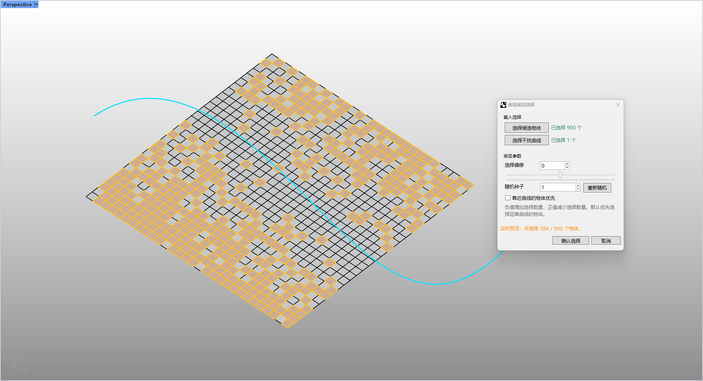
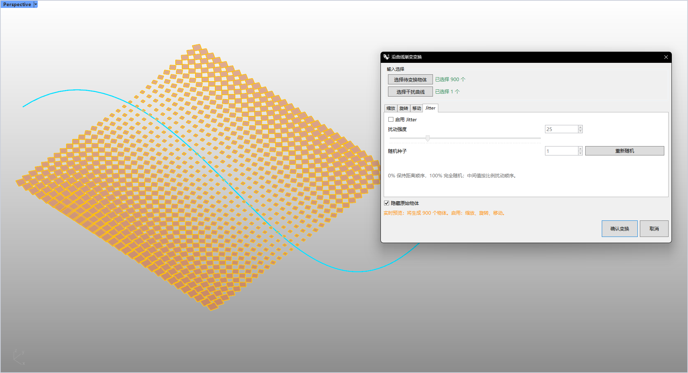

# rsGradientChangeByCrv · 沿曲线渐变变换

> 模块：几何 / 对象变换

[← 返回命令目录](/commands/)

**功能**：以物体包围盒中心到干扰曲线的最近距离为梯度，对物体做由近到远的渐变缩放（cli 模式）/ 缩放·旋转·移动复合变换（Eto 模式）

*沿曲线渐变变换：以物体到干扰曲线的最近距离为梯度，由近到远做线性重映射缩放*

*Eto 对话框：缩放/旋转/移动三维变换可分别启用，filter 提供扰动强度与随机种子，支持隐藏原始物体与实时预览*

**调用**：在 Rhino 命令行输入 `rsGradientChangeByCrv`（命令行交互）

**交互流程**：

1. 命令行模式：
2. 命令行输入 rsGradientChangeByCrv
3. 选择待变换（干扰）的物体（GetMultiple，可多选）
4. 选择干扰用曲线（Curve，GetObject，可多选）
5. 选取期间用选项设置最小缩放 / 最大缩放
6. 回车后按物体到曲线的最近距离做线性重映射缩放（cli 模式仅缩放）
7. Eto 对话框模式（4 维变换 + 实时预览）：
8. 命令行输入 rsGradientChangeByCrv 打开 Eto 对话框（或 cli 流程中选择对话框选项）
9. 在对话框中拾取 / 确认待变换物体与干扰曲线（可沿用预选集）
10. 在「缩放 / 旋转 / 移动」tab 勾选需启用的变换维度并分别设置近 / 远参数
11. 在 filter tab 设置启用 filter、扰动强度、随机种子
12. 勾选「隐藏原始物体」「实时预览」，确认变换生成结果或取消关闭

**参数**：

| 中文名 | 英文名 | 类型 | 默认值 | 范围 | 说明 |
| --- | --- | --- | --- | --- | --- |
| 最小缩放值 | MinimumScale | double | 0.8 | >= 文档绝对公差 | 最近物体对应的缩放比例（lastMinScaleNum 记忆，默认0.8） |
| 最大缩放值 | MaximumScale | double | 1.2 | >= 文档绝对公差 | 最远物体对应的缩放比例（lastMaxScaleNum 记忆，默认1.2） |

**备注**：cli 模式：缩放值通过 Remap(距离, 最小距离, 最大距离, minScale, maxScale) 计算，并按各自包围盒中心缩放。Eto 对话框模式：支持对物体同时施加缩放 / 旋转 / 移动三维变换（可分别勾选启用），变换强度同样以物体到干扰曲线的最近距离为梯度做由近到远线性重映射；filter 开启后会对「距离排序」施加随机扰动——扰动强度 0% 保持纯距离排序、100% 完全随机、中间值按比例混合；随机种子固定时可复现同一随机扰动结果。勾选「隐藏原始物体」只保留结果物体；勾选「实时预览」可在调整参数时即时刷新结果。
