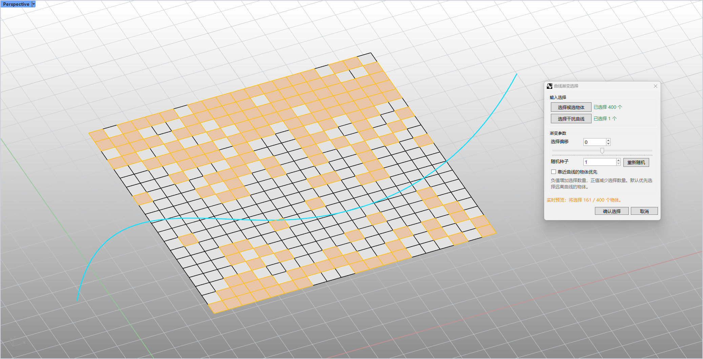

# rsGradientSelcectByCrv · 按曲线渐变选择

> 模块：组织与选择 / 选择

[← 返回命令目录](/commands/)

**功能**：根据候选物体到干扰曲线的距离渐变随机生成所选对象集合（带实时预览）

*图 1：rsGradientSelcectByCrv 渐变选择实时预览。Rhino Perspective 视口（左上角 Perspective 标签，左下/右下角红绿坐标轴）里有一个矩形密集四边形网格面板（黑色描边的方格网），从面板一侧到另一侧有橙色高亮到浅色再到白色的渐变——远离青色 S 形曲线的网格高亮为深橙色，靠近曲线的为接近白色，越远越橙；一条青色 S 形曲线穿过面板。右侧是【渐变渐次选择】Eto 对话框：输入选择区含【选择筛选物体】（已选择 400 个）和【选择干扰曲线】（已选择 1 个）按钮；渐变参数区含【选择偏移】（0）、【随机种子】（1）和【重新随机】按钮；选项【靠近曲线时物体优先】（未勾选）；说明文字提示按灰度蒙出选择数量、正确率/选中数量、默认优先选择远离曲线的物体；预览状态显示将选择 161/400 个物体；底部【确认选择】/【取消】按钮。按候选物体到干扰曲线的距离 + 随机种子计算预选，橙色高亮 = 远离曲线的物体（即将被选中），点击确认选择后正式写入*

**调用**：在 Rhino 命令行输入 `rsGradientSelcectByCrv`（打开设置窗口）

**交互流程**：

1. 命令行输入 rsGradientSelcectByCrv
2. 在弹窗点击“选择候选物体”拾取对象
3. 点击“选择干扰曲线”拾取曲线
4. 调整选择偏移/随机种子/靠近曲线优先参数并实时预览
5. 点击“确认选择”完成

**参数**：

| 中文名 | 英文名 | 类型 | 默认值 | 范围 | 说明 |
| --- | --- | --- | --- | --- | --- |
| 选择偏移 | SelectionBias | integer | 0 | -50 ~ 50 | 负值增加选择数量，正值减少；默认优先远离曲线的物体 |
| 随机种子 | RandomSeed | integer | 1 | 1 ~ 999999 | 稳定随机，可用“重新随机”按钮自增 |
| 靠近曲线的物体优先 | PreferNearCurve | toggle | false |  | 勾选后优先选择靠近曲线的物体 |

**备注**：需同时选择候选物体和干扰曲线方可确认；使用 Eto 对话框 GradientSelectionDialog
