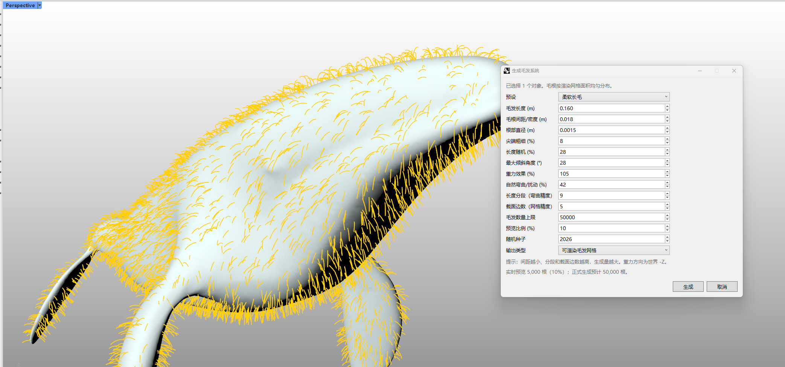

# rsHairSystem · 毛发系统

> 模块：几何 / 网格

[← 返回命令目录](/commands/)

**功能**：沿表面生成的毛发系统（可渲染网格 或 中心曲线）

*rsHairSystem 实时渲染预览：左视口黄色毛发沿曲面密集生长；右侧「生成毛发系统」面板含 16 个参数（预设 / 长度 / 密度 / 直径 / 尖端 / 随机 / 倾斜 / 重力 / 弯曲 / 分段 / 截面边数 / 数量上限 / 预览比例 / 随机种子 / 输出类型），下方「提示：预览越小、分段数越细越慢，生成量越大。重力方向为世界 -Z，实时预览 5,000 根（10%）；正式生成预计 50,000 根。」*

**调用**：在 Rhino 命令行输入 `rsHairSystem`（打开设置窗口）

**交互流程**：

1. 选择曲面 / 裁剪面 / 网格 / SubD 作为载体
2. 弹出毛发系统对话框
3. 调整参数并实时预览
4. 点击“生成”写入 / “取消”

**参数**：

| 中文名 | 英文名 | 类型 | 默认值 | 范围 | 说明 |
| --- | --- | --- | --- | --- | --- |
| 预设 | Preset | list | 自定义 | 自定义 / 地毯短绒 / 物体短毛 / 柔软长毛 |  |
| 毛发长度 | Length | double | 0.025 | min≈0.001 (模型单位), max 极大 | 默认按米换算为模型单位 0.025 |
| 毛根间距/密度 | Root spacing | double | 0.008 | min≈0.001 (模型单位) | 默认按米换算 0.008 |
| 根部直径 | Root diameter | double | 0.0008 | min≈0.0001 (模型单位) | 默认按米换算 0.0008 |
| 尖端粗细 | Tip scale | double | 12 | 1–100 | 界面显示值 = 内部值×100；内部默认 0.12 |
| 长度随机 | Length variation | double | 15 | 0–95 | 界面显示值 = 内部值×100；内部默认 0.15 |
| 最大倾斜角度 | Lean angle | double | 12 | 0–89 | 单位：度 |
| 重力效果 | Gravity | double | 25 | 0–300 | 界面显示值 = 内部值×100；内部默认 0.25 |
| 自然弯曲/扰动 | Bend | double | 12 | 0–200 | 界面显示值 = 内部值×100；内部默认 0.12 |
| 长度分段 | Length segments | integer | 4 | 1–24 | 弯曲精度 |
| 截面边数 | Section sides | integer | 4 | 3–12 | 网格精度 |
| 毛发数量上限 | Max hair count | integer | 50000 | 1–200000 |  |
| 预览比例 | Preview percentage | integer | 10 | 1–100 | 单位：% |
| 随机种子 | Random seed | integer | 2026 | 0 – int.MaxValue |  |
| 输出类型 | Output type | list | 可渲染毛发网格 | 可渲染毛发网格 / 毛发中心曲线（轻量） |  |

**备注**：在选定曲面 / 裁剪面 / 网格 / SubD 上自动按毛根间距均匀撒点，沿曲面法向（带最大倾斜角约束）长出毛发；重力方向沿世界 -Z。

## 一、典型交互流程

1. 选中一个或多个承载曲面（Brep / Mesh / SubD）
2. 命令行运行 `rsHairSystem`，弹出「生成毛发系统」对话框
3. 调整参数 → 右视口实时刷新预览（绿色进度条显示比例）
4. 点「生成」正式写入当前曲面，可选择「可渲染毛发网格」或「毛发中心曲线（轻量）」之一；点「取消」放弃
5. 大场景估算 > 50,000 根时面板底部会直接显示预计根数

## 二、参数分组详解

### 1. 形态
- **预设 Preset**：自定义 / 地毯短绒 / 物体短毛 / 柔软长毛，4 个常见组合一键套用
- **毛发长度 Length**：模型单位，0.001 起，米制默认 0.025
- **毛根间距 Root spacing**：相邻毛根的距离 (与密度反向关系)，米制默认 0.008
- **根部直径 Root diameter**：毛根圆截面直径，米制默认 0.0008
- **截面边数 Section sides**：每根毛的圆截面多边形边数 (3–12，4 常用)
- **最大倾斜角度 Lean angle**：毛发相对曲面法向的最大偏离 (°)

### 2. 随机化与扰动
- **尖端粗细 Tip scale (%)**：1–100，毛梢与毛根直径比，25–50 视觉明显
- **长度随机 Length variation (%)**：0–95，每根长度抖动幅度
- **自然弯曲/扰动 Bend (%)**：0–200，毛干扭曲弯折强度
- **重力效果 Gravity (%)**：0–300，世界 -Z 方向的拉力强度
- **长度分段 Length segments**：1–24，越大越弯曲自然 (弯曲精度成本)

### 3. 输出
- **毛发数量上限 Max hair count**：1–200,000，超过会按间距自动稀疏
- **预览比例 Preview percentage (%)**：仅影响面板实时刷新，正式生成按间距铺满
- **随机种子 Random seed**：固定后得到可复现的随机分布
- **输出类型 Output type**：可渲染毛发网格（带截面、文件量大）/ 毛发中心曲线（轻量、便于二次编辑）

## 三、显示换算说明

界面中 TipScale / LengthVariation / Gravity / Bend 显示为百分比 (0–100)，内部值 = 界面值 / 100；例：界面 12 = 内部 0.12；改默认值请用代码内部值或等比放大界面值。

## 四、典型场景

- **地毯 / 草坪 / 苔藓** → Preset=地毯短绒，Root spacing 0.005–0.012，Tip scale 30–60
- **毛绒玩具 / 抱枕** → Preset=柔软长毛，Length 0.04–0.08，Gravity 40–80，Bend 15–30
- **头发 / 兽毛** → Preset=物体短毛，Lean angle 8–15，最大倾斜角让方向自由
- **性能预算紧 / 出图慢** → 选「毛发中心曲线（轻量）」+ 长度分段调到 6–8，把截面边数降到 3

## 五、注意事项

- 必须先选承载几何再运行命令；命令运行后改承载不会自动同步
- 取消预览重建不会丢失已生成的毛发
- 渲染发白 / 全黑通常是大面积同向毛根法线问题，可适当加大随机或调小毛根间距
