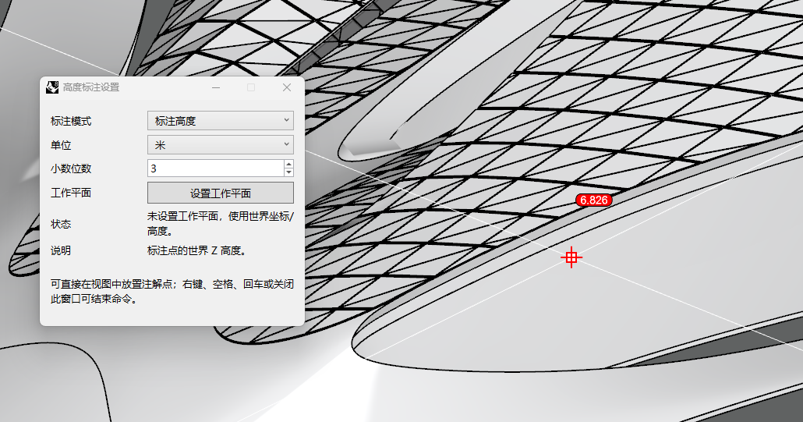

# rsHeightDot · 高程点

> 模块：视图出图 / 标注出图

[← 返回命令目录](/commands/)

**功能**：标注文本点 (TextDot)：高度值或 XYZ 坐标

**调用**：在 Rhino 命令行输入 `rsHeightDot`（命令行交互）

**交互流程**：

1. 命令行运行 rsHeightDot
2. 弹出高度标注设置窗口 (Eto Form)
3. 设置标注模式/单位/小数位
4. 在视图中拾取点生成注解（可直接标注高度或 XYZ 坐标）
5. 可点击“设置工作平面”，通过三点绘制矩形的方式放置工作平面，之后的高度/XYZ 标注都会参考该工作平面计算对应数值
6. 随时可关闭（右键/空格/回车或关闭窗口结束）

**参数**：

| 中文名 | 英文名 | 类型 | 默认值 | 范围 | 说明 |
| --- | --- | --- | --- | --- | --- |
| 标注模式 | Mode | list | Height (标注高度) | Height/Coordinates (标注高度/标注XYZ坐标) | HeightDotMode 枚举 |
| 单位 | Unit | list | 文档模型单位 | Millimeters/Centimeters/Meters/Feet/Inches | 默认取 doc.ModelUnitSystem 归一化；可选 mm/cm/m/ft/in |
| 小数位数 | Digits | integer | 3 | 0 – 8 | NumericStepper 整数，增量 1 |
| 使用工作平面 | UseReferencePlane | toggle | false |  | 通过“设置工作平面”按钮用 3 点矩形定义；决定坐标/高度基于世界坐标或工作平面 |

**备注**：支持中英文；工作平面下标注局部坐标/有符号高度；参数记忆上次设置；标注过程随时可关闭
