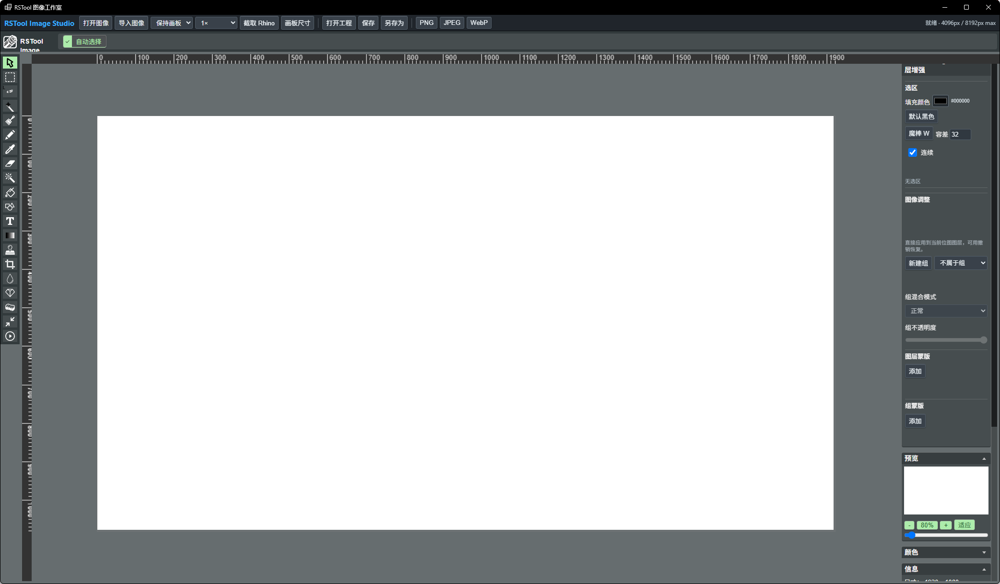

# rsImageStudio · 图像工作室

> 模块：效率工具 / 生产力

[← 返回命令完全手册](/RsTool命令手册)

**功能**：打开 RSTool 图像工作室窗口进行位图绘制/标注/导出与保存

*RSTool 图像工作室主界面（顶部工具栏 14 项，左侧绘图工具栏，右侧属性面板含 图层编辑 / 镜像测量 / 椭圆合模式 / 图层管理 / 编辑图层 / 预览 / 颜色 / 信息 8 块，底部含缩放 50% 与画布适配按钮）*

**调用**：在 Rhino 命令行输入 `rsImageStudio`（打开设置窗口）

**交互流程**：

1. 命令行输入 rsImageStudio，打开图像工作室窗口（标题「RSTool 图像工作室」）
2. 在窗口中对位图进行绘制、标注、裁剪与调色，或截图 Rhino 视窗后加标注
3. 处理完成后导出为 PNG / JPEG / WebP，或保存为 .rstool-photo 工程文件

**参数**：

> 此命令无命令行数值参数，相关设置在窗口中调整。

**备注**：基于 miniPaint 引擎，并加了若干自定义 JS 扩展用于画板布局、笔刷、选区、标尺等功能。

**顶部工具栏**（14 项，简化常用 PhotoShop 工作流）：

| 按钮 | 功能 |
| --- | --- |
| 打开图像 | 从本地文件载入位图到画布 |
| 导入图像 | 导入新图层（不替换当前画布）|
| 保存图像 v | 把当前画布导出为带版本号的本地图像 |
| 模板 | 选择内置模板套用画板布局 |
| 截取 Rhino | 抓取 Rhino 视窗截图导入（与 Rhino 双向） |
| 画板尺寸 | 调画板/纸张大小 |
| 打开工程 | 打开 .rstool-photo 工程文件 |
| 保存 / 另存为 | 把当前整套图像工程写入磁盘 |
| PNG / JPEG / WebP | 一键导出当前画布为对应格式 |

**左侧绘图工具栏**：miniPaint 自带的铅笔 / 画笔 / 钢笔 / 形状 / 选取 / 文字 / 图章等工具。

**右侧属性面板**（多块可折叠/独立面板）：

| 面板 | 用途 |
| --- | --- |
| 图层编辑 | 路径 / 填充颜色 / 默认黑色 / 描边 W（容量 32 px）/ 虚线 复选 / 节点 |
| 镜像测量 | 当前锁定的可视化图层（含新建组、不属于组下拉）|
| 椭圆合模式 | 椭圆笔触的合成模式（正常 / 正片叠底 / 滤色 等）|
| 笔不透明度 | 笔触透明度滑杆 |
| 图层管理 | 图层列表 + 添加 按钮 |
| 编辑图层 | 当前选中图层的编辑操作（添加图层、合并、删除等）|
| 预览 | 当前画布小窗缩略图；底部 50% 缩放 + 适应 按钮 |
| 颜色 | 调色板 |
| 信息 | 鼠标坐标 / 选区尺寸等 |

**底部状态栏**：画布距离（例 距离 -4096px / 8192px max）+ 缩放控制 + 适应按钮。

**与 Rhino 双向**：通过「截取 Rhino」一键把 Rhino 视窗截图导入到画布，适合在 AiRender / 渲染后再到 ImageStudio 加标注 / 比例尺 / 文字标注导出。
