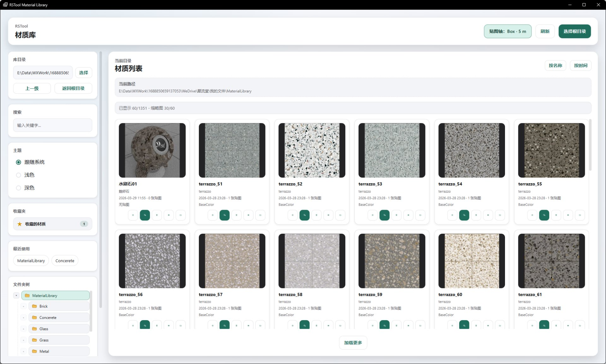

# rsMaterial · 材质库

> 模块：资源库 / 材质库

[← 返回命令完全手册](/RsTool命令手册)

**功能**：把选中的材质按当前贴图轴设置加到 Rhino 材质库，并赋予选中对象/图层，或仅导入材质不赋予；自动贴图轴开启时同步加贴图轴对象

*图 1：材质库主界面。标题栏右上「贴图轴：Box · 5 m」打开自动贴图轴设置（开启后赋予材质时自动按矩形/Box + 尺寸同步加贴图轴），其后是「刷新 / 选择根目录」；左侧栏结构与模型库一致（库目录 / 搜索 / 主题 / 收藏的材质 / 最近使用 / 文件夹树 / 状态栏 + 构建进度）；右侧主区显示当前路径下所有材质，命名空间 chip 区分（默认 MaterialLibrary，截图已切到 Concrete 关注水磨石），每张缩略图卡含文件名、标签、修改时间、并排 3 个圆形动作按钮（收藏材质 / 赋予物体 / 赋予图层），右键卡片可调右键菜单（Favorite Material / 赋予物体 / 赋予图层 / 导入材质 / 打开目录），底部「加载更多」分页全部*

**调用**：在 Rhino 命令行输入 `rsMaterial`（打开设置窗口）

**交互流程**：

1. 命令行输入 rsMaterial，打开材质库窗口（新版不可用时自动回退到旧版 rsMaterialLibraryOld）
2. 窗口打开后默认加载上次使用的库目录（与模型库共用同一套最近使用列表）
3. 标题栏「贴图轴：Box · 5 m」点开可设置：① 是否赋予材质时自动加贴图轴；② 贴图轴类型（矩形平面 / Box）；③ 贴图轴尺寸（统一宽高或长宽高），保存后按钮文案即时刷新显示当前类型+尺寸
4. 左侧栏操作：搜索框按文件名/标签即时过滤；点「收藏的材质」只显示已收藏项；用「最近使用」「文件夹树」快速切换根目录/子目录；状态栏显示索引构建进度
5. 主区浏览：缩略图卡 + 文件名 + 标签（如 terrazzo、BestColor）+ 修改时间 + 3 个圆形动作按钮（收藏/赋予物体/赋予图层），右键调出 5 项右键菜单
6. 点卡片预览按钮（眼睛）→ 弹预览大图：右侧有 4 个动作按钮 收藏材质 / 赋予物体 / 赋予图层 / 导入材质 / 打开目录
7. 点「赋予物体」：先把材质按当前贴图轴设置加到材质库，再选中 Rhino 中一个对象并应用；点「赋予图层」：选中目标图层一次性应用给该图层下所有对象
8. 点「导入材质」：仅导入到 Rhino 材质库（不直接赋予对象）；若开启自动贴图轴则同步加贴图轴
9. 主区右上「按名称 / 按时间」切换排序；底部「加载更多」翻页显示全部材质

**参数**：

| 中文名 | 英文名 | 类型 | 默认值 | 范围 | 说明 |
| --- | --- | --- | --- | --- | --- |
| 库目录 | rootPath | text | 上次使用值 | 本地路径 | 材质库根目录；通过「选择 / 选择根目录」换成任意含材质资产的文件夹；切换后自动重建索引 |
| 搜索 | searchInput | text | 空 | 任意关键字 | 对当前目录下的文件名/标签做即时过滤 |
| 主题 | theme | radio | 跟随系统 | 跟随系统 / 浅色 / 深色 | 切换 UI 主题；与模型库各自独立保存 |
| 贴图轴按钮 | btnMappingSettings | button | — | — | 标题栏「贴图轴：类型 · 尺寸」按钮：点开弹自动贴图轴设置弹层，按钮文案同步显示当前设置 |
| 自动加贴图轴 | autoTextureMappingEnabled | checkbox | 开 | 开 / 关 | 贴图轴弹层开关：开启后赋予材质时同时按当前贴图轴类型+尺寸加贴图轴对象 |
| 贴图轴类型 | autoTextureMappingType | radio | Box | 矩形（平面） / Box | 贴图轴弹层单选：矩形用同一宽高，Box 用同一长宽高；切换后按钮文案即时更新 |
| 贴图轴尺寸 | autoTextureMappingSize | number | 5.0 | > 0（model 单位） | 贴图轴弹层数字输入：矩形用统一宽高、Box 用统一长宽高，步长 0.000001 |
| 收藏视图 | favoritesView | button | 关闭 | — | 左侧「收藏的材质」按钮：点亮后只显示已收藏的资产 |
| 最近使用 | recentRoots | chip | — | — | 最近 5 次访问过的根目录，chip 一键切换 |
| 文件夹树 | folderTree | tree | — | — | 根目录下子文件夹折叠树，点头切换浏览 |
| 排序 | sort | button | 按时间 | 按名称 / 按时间 | 主区右上角切换 |
| 刷新 | refresh | button | — | — | 重建索引：扫描当前根目录所有材质资产，生成缩略图与标签，状态栏显示进度 |
| 收藏/取消收藏 | favorite | button | — | — | 卡片或预览弹窗内的星标按钮：点亮黄色 = 已收藏；支持右键菜单 Favorite Material |
| 赋予物体 | assignObject | button | — | — | 材质按当前贴图轴设置加到材质库，再选中 Rhino 中一个对象并应用；若开启自动贴图轴则同步加贴图轴对象 |
| 赋予图层 | assignLayer | button | — | — | 选中目标图层一次性应用给该图层下所有对象 |
| 导入材质 | importMaterial | button | — | — | 仅导入到 Rhino 材质库（不直接赋予对象）；若开启自动贴图轴则同步加贴图轴 |
| 打开目录 | openFolder | button | — | — | 用 Windows 资源管理器打开材质所在文件夹 |
| 加载更多 | loadMore | button | — | — | 主区底部按钮：分页加载，默认每页 60 张 |

**备注**：新版窗口不可用时自动回退到 rsMaterialLibraryOld 旧版。索引以根目录为粒度，缩略图与贴图缓存到本地；赋予走 Rhino 材质 API，开启自动贴图轴时会按当前类型+尺寸自动加 Surface/BoxMapping。材质库为本地素材库：内置素材有限，需用户自行整理、补充自己的材质资产到库目录；也可将 RSTool 相关视频转发到朋友圈后联系客服，领取更多材质素材资源
