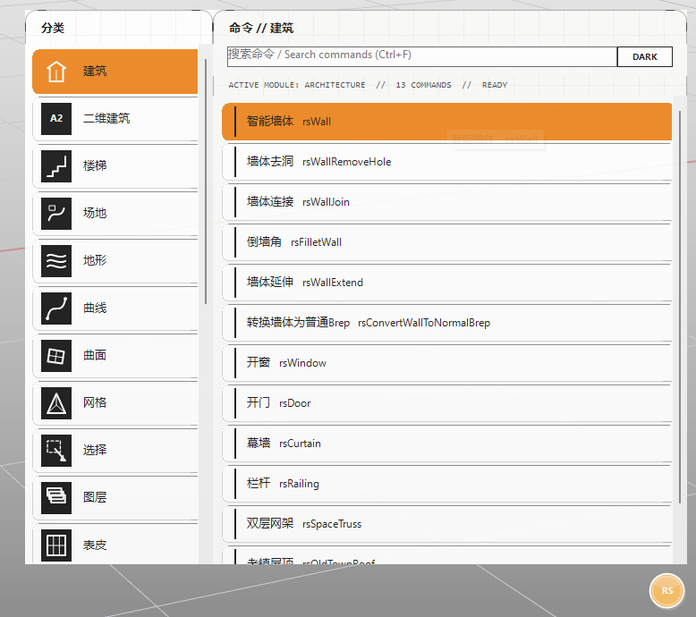
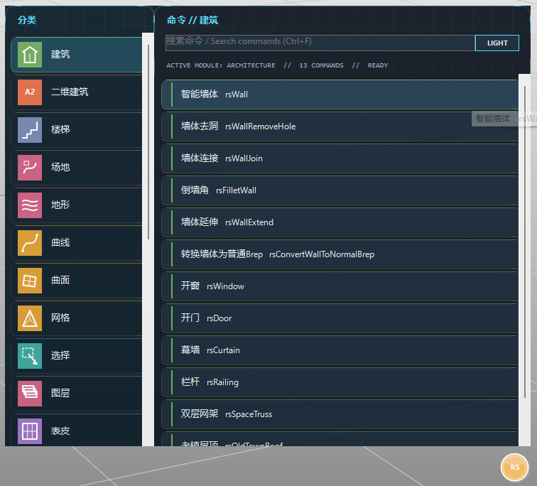

# rsMenu · RSTool菜单

> 模块：辅助工具 / 系统工具

[← 返回命令目录](/commands/)

**功能**：开启/关闭 RSTool 覆盖式悬浮菜单（点击菜单项或搜索执行命令）

*浅色主题：右上角 DARK 按钮，点击切到深色*

*深色主题：右上角 LIGHT 按钮，点击切回浅色*

**调用**：在 Rhino 命令行输入 `rsMenu`（打开设置窗口）

**交互流程**：

1. 命令行输入 rsMenu
2. 切换 RSTool 悬浮菜单显示
3. 再次运行可关闭

**参数**：

| 中文名 | 英文名 | 类型 | 默认值 | 范围 | 说明 |
| --- | --- | --- | --- | --- | --- |
| 主题 | Theme | toggle | 浅色 | 浅色 / 深色 | 悬浮菜单右上角 DARK/LIGHT 按钮切换，即时重绘整面板 |

**备注**：悬浮式覆盖菜单：在 Rhino 当前视图上叠加一个浮动面板，按分类浏览 RSTool 命令。再次运行 rsMenu 即可关闭；切换视图、切换活动文档时面板也会自动收起。

菜单布局：

| 区域 | 内容 |
| --- | --- |
| 左栏（分类） | 建筑 / 二维建筑 / 楼梯 / 场地 / 地形 / 曲线 / 曲面 / 网格 / 选择 / 图层 / 表皮；选中分类高亮 |
| 顶栏 | 当前分类标题 + 搜索框 + 主题切换按钮 |
| 主区（命令列表） | 当前分类下的命令项，每条显示中文名 + 英文名（rsXxx）；点击后关闭面板并执行对应命令 |
| 底部状态栏 | ACTIVE MODULE: 当前分类 // 该分类命令数 // READY |

核心交互：

- 搜索：搜索框 placeholder「搜索命令 / Search commands (Ctrl+F)」；按中文名称或英文命令名匹配（tooltip 提示）；输入后顶部标题切换为「搜索 // SEARCH RESULTS」，主区列出匹配项。
- 切换界面（主题）：右上角按钮文字显示的是**目标主题**——浅色模式下显示 DARK，点击切到深色；深色模式下显示 LIGHT，点击切回浅色。主题切换即时重绘整个面板（背景、文字、选中态、卡片、轨道等 9 套配色）。
- 执行：菜单项点击后先关闭面板（CloseAnimated），再通过 RhinoApp.Idle 异步执行 RunScript 脚本（前缀 !_ 加英文命令名），避免命令在面板关闭前就开始运行。
