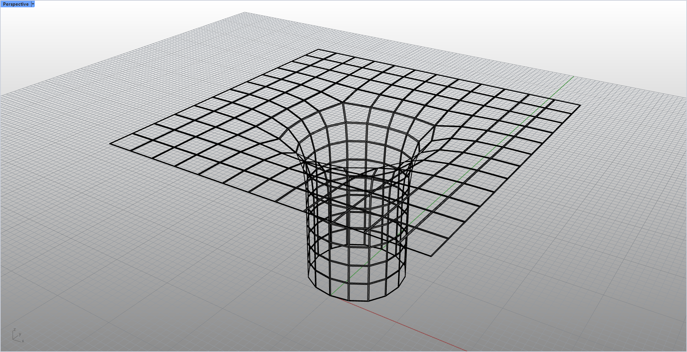

# rsMeshFrame · 网格框架

> 模块：几何 / 网格

[← 返回命令目录](/commands/)

**功能**：在原网格面内生成的图片边框(Picture Frame)拓扑

*原始网格（Before）：实心网格面，表面连续、仅可见细边线，作为生成边框拓扑的输入对象*

*边框(Picture Frame)拓扑网格（After）：在原网格每个面内生成一个内缩的边框环，相邻面的边框彼此相连，整体呈现为密集的粗黑格栅线框；边框本身有宽度，由「缩放比例」或「向内距离」控制，因此线条明显粗于 rsMeshWindow 的细窗格线；原网格面被隐藏，只保留框架结构*

**调用**：在 Rhino 命令行输入 `rsMeshFrame`（命令行交互）

**交互流程**：

1. 选择网格
2. 选择生成方式：Scale / Distance
3. 输入参数
4. 生成 Picture Frame 边框网格

**参数**：

| 中文名 | 英文名 | 类型 | 默认值 | 范围 | 说明 |
| --- | --- | --- | --- | --- | --- |
| 生成方式 | Mode | list | Scale | Scale / Distance |  |
| 缩放比例 | Scale ratio | double | 0.8 | 0.01–0.99 | 仅 Scale 模式 |
| 向内距离 | Inward distance | double | 1 | >=0.001 | 仅 Distance 模式 |

**备注**：与 rsMeshWindow 类似，都在原网格每个面内做内缩，但 rsMeshFrame 生成的是有宽度的边框(Picture Frame)而非细窗格线：线宽由「缩放比例」或「向内距离」控制，视觉上比 rsMeshWindow 更粗更黑；原网格面会被隐藏，只保留边框，适合制作格栅/框架效果
