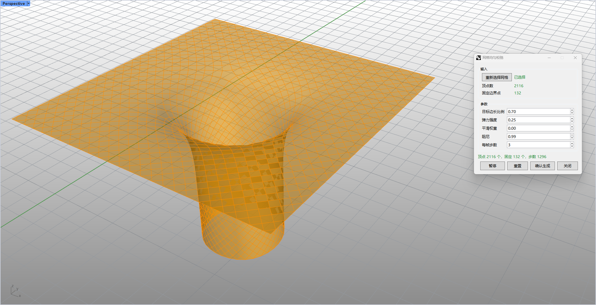

# rsMeshRelax · 网格均匀松弛

> 模块：物理模拟 / 找形与松弛

[← 返回命令目录](/commands/)

**功能**：松弛后的网格（弹簧/平滑粒子求解，Bake 写入文档）

*rsMeshRelax 实时预览状态：Rhino 8 透视视口，物体（方形板 + 中心漏斗 + 下方圆柱）的网格以**橙色高亮**显示（DisplayConduit 实时预览）；右侧弹出「网格细分控制」参数面板，分三组： - **输入**：已选择网格，顶点数 2116，表面边界点 132 - **参数**（图中所示值）：目标边长比例 0.70、准许强度 0.25、平滑权重 0.00、阻尼 0.99、每帧步数 3 - **底部状态**：顶点 2116 个、表面边界点 132 个、步数 1296 - **操作按钮**：暂停 / 重置 / 确认生成(Bake) / 关闭 点击「启动预览」后即开始弹簧/平滑粒子求解，参数可实时调；点「确认生成」即 Bake 写入文档（参见 flow[3]）*

**调用**：在 Rhino 命令行输入 `rsMeshRelax`（打开设置窗口）

**交互流程**：

1. 选择网格
2. 打开松弛面板，实时预览
3. 点击“启动预览”开始弹簧求解模拟
4. 可“重置”/“确认生成(Bake)”/“关闭”

**参数**：

| 中文名 | 英文名 | 类型 | 默认值 | 范围 | 说明 |
| --- | --- | --- | --- | --- | --- |
| 目标边长比例 | Length scale | double | 0.75 | 0.1–5.0 | 目标边长相对当前网格边长中位数的比例 |
| 准许强度 | Elasticity | double | 0.1 | 0.0–2.0 | 边弹簧强度，越大越快拉向统一边长 |
| 平滑权重 | Smoothing | double | 0.05 | 0.0–2.0 | 邻域平滑强度，越大越趋向邻点质心 |
| 阻尼 | Damping | double | 0.85 | 0.0–0.99 | 速度阻尼，越大保留越多惯性 |
| 每帧步数 | Steps per frame | integer | 3 | 1–30 | 每次界面刷新推进的求解步数 |

**备注**：使用 DisplayConduit 实时预览；记忆上次设置。注意：help 仅指向网站根域名，非 detail/NNN 详情页
