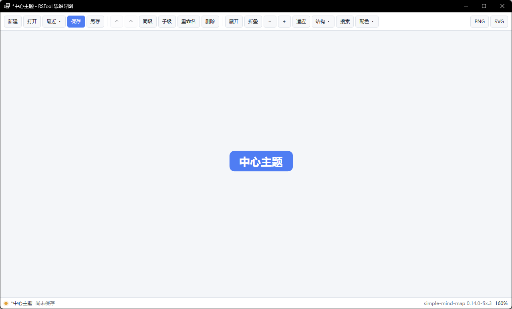

# rsMindMap · 思维导图

> 模块：效率工具 / 生产力

[← 返回命令目录](/commands/)

**功能**：打开思维导图窗口，支持编辑/保存/导出思维导图，文件为 .json（rstool-mindmap v1：title/updatedAt/root 树/view{theme,style,direction,layout}）；PNG/SVG 导出由后端弹保存对话框落盘

**调用**：在 Rhino 命令行输入 `rsMindMap`（打开设置窗口）

**交互流程**：

1. 命令行输入 rsMindMap，打开思维导图窗口
2. 在「中心主题」根节点上双击重命名；选中节点后按 Enter 加同级、Tab 加子节点、F2 重命名、Delete 删除
3. 用顶部工具栏切换结构（思维导图 / 逻辑结构 / 组织结构 / 时间轴 / 鱼骨图等）与配色（清爽蓝 / 深夜蓝等）
4. 用搜索框（Ctrl+F）定位节点；滚轮缩放、点「适应画布」查看全图；可展开 / 折叠分支
5. Ctrl+S 保存、Ctrl+Shift+S 另存为 .json 文件；或点「最近」打开历史文件
6. 点 PNG / SVG 导出当前思维导图
7. 状态栏显示保存状态、文档名与缩放比例；最近 / 结构 / 配色 / 搜索面板按 Esc 或点空白处关闭

**参数**：

> 此命令无命令行数值参数，相关设置在窗口中调整。

**备注**：基于 simple-mind-map 引擎（状态栏右下角显示版本）。

**操作**：左键选节点，右键拖动画布；滚轮反向缩放，范围 20%–400%。

**工具栏**（4 组共 21 个按钮）：

| 分组 | 按钮与快捷键 |
| --- | --- |
| 文件 | 新建 (Ctrl+N) · 打开 (Ctrl+O) · 最近 ▾ · 保存 (Ctrl+S) · 另存为 (Ctrl+Shift+S) |
| 编辑 | 撤销 (↶ Ctrl+Z) · 重做 (↷ Ctrl+Y) · 同级节点 (Enter) · 子节点 (Tab) · 重命名 (F2) · 删除 (Delete) |
| 视图 | 展开 · 折叠 · 缩小 (−) · 放大 (＋) · 适应画布 · 结构 ▾ · 搜索 (Ctrl+F) · 配色 ▾ |
| 导出 | PNG · SVG |

**结构**（共 6 种）：

| 名称 | 走向 / 形态 |
| --- | --- |
| 思维导图 | 双向（默认） |
| 逻辑结构 | 向右 |
| 向左逻辑结构 | 向左 |
| 组织结构 | 树形 |
| 目录结构 | 树形 |
| 时间轴 | 垂直 |
| 鱼骨图 | 横向 |

**配色**（共 6 套）：

| 配色 | 备注 |
| --- | --- |
| 清爽蓝 | 默认 |
| 深夜蓝 | 暗色 |
| 黑底白节点 | 演示用 |
| 暖沙棕 | 暖色调 |
| 森林绿 | 自然系 |
| 紫罗兰 | 紫色系 |

**其他细节**：

- 新增同级默认文本「新主题」，子级「子主题」
- 最近文件最多保留 10 条
- 状态栏 dot 实时提示保存状态
- 异常退出后再次打开会自动恢复未保存的内容
