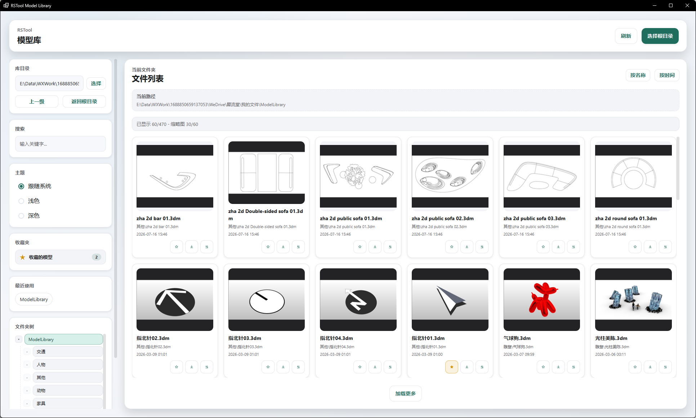

# rsModel · 模型库

> 模块：资源库 / 模型库

[← 返回命令目录](/commands/)

**功能**：将选中的 .3dm 文件作为块定义导入 Rhino，触发 InsertAsset 命令在视口点击位置放置；或在资源管理器中打开模型所在文件夹

*图 1：模型库主界面。标题栏右侧「刷新 / 选择根目录」为全局操作；左侧栏从上到下依次为：库目录（输入框只读 + 「选择」按钮，配合「上一级 / 返回根目录」快速跳转）、搜索（关键字过滤当前目录下的文件）、主题（跟随系统 / 浅色 / 深色）、收藏的模型（一键只显示已收藏的资产，带数量徽章）、最近使用（chip 形式，最近访问过的根目录可一键切换）、文件夹树（树形展示当前根下的子文件夹，点头切换）；右侧主区显示当前路径下的所有模型，每张缩略图卡含文件名、原始路径、修改时间，并排 3 个圆形动作按钮（收藏模型 / 导入一个 / 导入多个，hover 显示中文 tooltip），右键卡片还能调出右键菜单（Favorite Model / 导入模型 / 打开目录），底部有「加载更多」分页按钮*

**调用**：在 Rhino 命令行输入 `rsModel`（打开设置窗口）

**交互流程**：

1. 命令行输入 rsModel，打开模型库窗口（新版窗口不可用时自动回退到旧版 rsModelOld）
2. 窗口打开后默认加载上次使用的库目录（库目录输入框右侧「选择」按钮可换根）
3. 左侧栏操作：用「搜索」框过滤当前目录下的文件；点「收藏的模型」只显示已收藏项；用「文件夹树」切换子目录；用「上一级 / 返回根目录」快速跳转
4. 主区浏览：卡片缩略图 + 文件名 + 元数据 + 6 个圆形动作按钮；右键/长按弹出右键菜单（Favorite Model / 导入模型 / 打开目录）
5. 点卡片预览按钮（眼睛图标）→ 弹预览大图：右侧有 Favorite Model / 导入一个 / 导入多个 / 打开目录 4 个按钮，可直接收藏或导入到 Rhino
6. 点「导入一个」：模型作为块定义导入 Rhino 并在视口点击位置放置，支持 Angle/Rotate90 命令行选项控制旋转
7. 点「导入多个」：批量导入，提示点选多个位置连续放置
8. 右上角「按名称 / 按时间」切换排序；底部「加载更多」分页读取全部模型

**参数**：

| 中文名 | 英文名 | 类型 | 默认值 | 范围 | 说明 |
| --- | --- | --- | --- | --- | --- |
| 库目录 | rootPath | text | 上次使用值 | 本地路径 | 模型库的根目录路径；点击「选择 / 选择根目录」可换成任意含 .3dm 的文件夹；切换目录后自动重建索引 |
| 搜索 | searchInput | text | 空 | 任意关键字 | 对当前目录下的文件名/标签做即时过滤 |
| 主题 | theme | radio | 跟随系统 | 跟随系统 / 浅色 / 深色 | 切换 UI 主题，配置跟随系统时按 Windows 当前外观切换 |
| 收藏视图 | favoritesView | button | 关闭 | — | 左侧「收藏的模型」按钮：点亮后只显示已收藏的资产；徽章数字表示当前根目录内的收藏数 |
| 最近使用 | recentRoots | chip | — | — | 最近 5 次访问过的根目录，点 chip 快速切换 |
| 文件夹树 | folderTree | tree | — | — | 根目录下子文件夹折叠树，点头切换浏览；点行左侧三角形展开/折叠 |
| 排序 | sort | button | 按时间 | 按名称 / 按时间 | 主区右上角切换，文件卡片排列顺序即时刷新 |
| 刷新 | refresh | button | — | — | 重建索引：扫描当前根目录所有 .3dm/.3dm.gz/.zip，生成缩略图与元数据，状态栏显示进度 |
| 收藏/取消收藏 | favorite | button | — | — | 卡片或预览弹窗内的星标按钮：点亮黄色 = 已收藏；支持右键菜单 Favorite Model |
| 导入一个 | importSingle | button | — | — | 模型作为块定义导入 Rhino 并弹 InsertAsset 命令在视口点击位置放置 |
| 导入多个 | importMultiple | button | — | — | 批量导入，提示点选多个位置连续放置同一块定义 |
| 打开目录 | openFolder | button | — | — | 用 Windows 资源管理器打开模型所在文件夹 |
| 加载更多 | loadMore | button | — | — | 主区底部按钮：分页加载，默认每页 60 张；超过则出现该按钮 |

**备注**：新版窗口不可用时自动回退到 rsModelOld 旧版命令。索引以根目录为粒度，缩略图缓存到 %LOCALAPPDATA%\RSTool\ModelLibrary 缩略图缓存；导入时调用 InsertAsset 走统一放置流程（命令行 Angle/Rotate90 控制旋转）。模型库为本地素材库：内置素材有限，需用户自行整理、补充自己的 .3dm 模型到库目录；也可将 RSTool 相关视频转发到朋友圈后联系客服，领取更多模型素材资源
