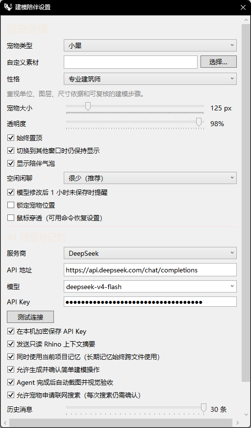

# rsModelingCompanionSettings · 建模陪伴设置

> 模块：效率工具 / 生产力

[← 返回命令目录](/commands/)

**功能**：打开建模陪伴设置窗口

*图 1：建模陪伴设置面板。顶部「外观」分组：宠物类型(默认小屋)/自定义素材/性格(默认专业建筑师)/宠物大小 96-280 px(默认 168)/透明度 45%-100%(默认 98)/始终置顶/切换到其他窗口时仍保持显示/显示陪伴气泡/空闲闲聊频率(默认很少-推荐)/模型修改后 1 小时未保存时提醒/锁定宠物位置/鼠标穿透(可用命令恢复)；中部「AI 对话记忆」分组：服务商(默认 DeepSeek)/API 地址(默认 https://api.deepseek.com/chat/completions)/模型(默认 deepseek-v4-flash)/API Key(在本机加密保存)/测试连接；底部开关：发送只读 Rhino 上下文摘要/同时使用当前项目记忆(长期记忆随终端文件使用)/允许生成并确认简单建模操作/Agent 完成后自动截图并视觉校验/允许宠物申请联网搜索(每次搜索仍需确认)/历史消息条数(默认 30)*

**调用**：在 Rhino 命令行输入 `rsModelingCompanionSettings`（打开设置窗口）

**交互流程**：

1. 命令行输入 rsModelingCompanionSettings
2. 弹出建模陪伴设置窗口
3. 调整助手设置后关闭窗口

**参数**：

> 此命令无命令行数值参数，相关设置在窗口中调整。

**备注**：设置窗口内的具体项以实际界面为准。
