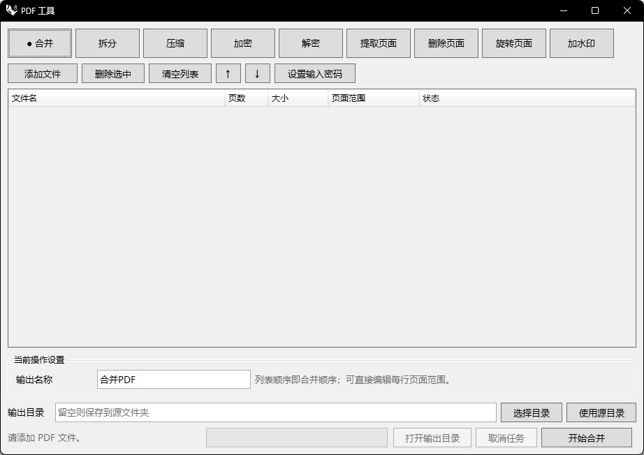

# rsPdfTools · PDF 工具

> 模块：效率工具 / 生产力

[← 返回命令目录](/commands/)

**功能**：对 PDF 执行拆分/旋转/压缩/提取/删除/合并/加密/解密/水印等操作并把结果 PDF 落到输出目录

*PDF 工具主界面（合并 Tab 选中；上方 9 个操作 Tab，下方文件列表、当前操作设置面板、输出目录、进度条/开始合并按钮）*

**调用**：在 Rhino 命令行输入 `rsPdfTools`（打开设置窗口）

**交互流程**：

1. 命令行输入 rsPdfTools
2. 创建 PdfToolsDialog (Eto) 窗口；窗口标题「PDF 工具」
3. 顶部 9 个操作 Tab 选择处理方式；中间文件列表拖入或「添加文件」
4. 在「当前操作设置」面板按 Tab 调整参数（拆分模式/旋转角度/水印样式等）
5. 下方输出目录选择或留空走源文件目录
6. 点击「开始 XXX」执行；进度条 + 状态文字实时更新；可点「取消任务」中断
7. 完成后「开始」按钮恢复，「打开输出目录」激活，按钮文案根据当前 Tab 自适应

**参数**：

| 中文名 | 英文名 | 类型 | 默认值 | 范围 | 说明 |
| --- | --- | --- | --- | --- | --- |
| 拆分跨度 | SplitSpan | integer | 5 | 1-9999 | 「每 N 页」拆分模式的页数跨度（NumericStepper） |
| 拆分模式 | SplitMode | list | 逐页拆分 | 逐页拆分 / 每 N 页 / 自定义分组 | 下拉选项，默认 逐页拆分 (index 0)；选「自定义分组」时输入框支持 `1-3;4-6;7,9` 这种分号分隔多段输出 |
| 页面旋转 | PageRotation | list | 90° | 90° / 180° / 270° | 页面旋转角度，默认 90° (index 0) |
| 压缩档位 | Compression | list | 均衡（1600px / 质量 72） | 清晰(2400px/Q85) / 均衡(1600px/Q72) / 极限(1200px/Q55) | 图像压缩档位，默认 均衡 (index 1)；只重编码合格的大图片并保留文字/矢量 |
| 水印透明度 | WatermarkOpacity | integer | 18 | 1-100 | 水印不透明度百分比，默认 18 |
| 水印字体大小 | WatermarkFontSize | integer | 28 | 8-200 | 水印文字字号（pt），默认 28 |
| 水印旋转角度 | WatermarkRotation | integer | -30 | -180~180 | 水印旋转角度（度），默认 -30 |
| 水印水平间距 | WatermarkHorizontalSpacing | integer | 70 | 20-500 | 水印水平重复间距（mm），默认 70 |
| 水印垂直间距 | WatermarkVerticalSpacing | integer | 50 | 20-500 | 水印垂直重复间距（mm），默认 50 |

**备注**：Eto 对话框；PDF 处理在独立后台管线中完成。

**顶部 9 个操作 Tab**（点中即切换设置面板，按钮文案随之改为「开始 合并 / 拆分 / 压缩 / 加密 / 解密 / 提取 / 删除 / 旋转 / 加水印」）：合并（默认）/ 拆分 / 压缩 / 加密 / 解密 / 提取页面 / 删除页面 / 旋转页面 / 加水印。

**文件操作区**（第二行按钮组）：

| 按钮 | 功能 |
| --- | --- |
| 添加文件 | 弹文件选择对话框，多选 |
| 删除选中 | 移除表格中勾选行 |
| 清空列表 | 一键清空 |
| ↑ / ↓ | 仅在「合并」Tab 启用，按列表顺序重排 |
| 设置输入密码 | 给选定文件单独设置打开密码（解密 Tab 使用） |

**文件表**（5 列）：文件名 / 页数 / 大小 / 页面范围（双击直接编辑每行页面范围）/ 状态。也支持把 PDF 文件直接拖入此区域批量添加。

**当前操作设置**（按 Tab 切换的面板）：

| Tab | 设置项 |
| --- | --- |
| 合并 | 输出名称（默认 合并PDF）+ 列表顺序即合并顺序 |
| 拆分 | 拆分模式（逐页/每 N 页/自定义分组）按模式出现「每组页数」「自定义分组」输入框 |
| 压缩 | 压缩档位（清晰/均衡/极限）|
| 加密 | 打开密码 + 确认打开密码 + 所有者密码 + 确认所有者密码 + 4 个权限 CheckBox（允许打印/复制/修改/批注） |
| 解密 | 提示文字（用上方「设置输入密码」为每个文件独立配密码） |
| 提取 / 删除 / 旋转 | 页码输入框 + 页码范围语法（同 Rhino 风格：`1;3;5-7` 或 `1-3;4-6;7,9`） |
| 加水印 | 水印文字 + 应用页码 + 透明度 1–100 + 字号 8–200 pt + 角度 -180~180 + 水平/垂直间距 20–500 mm |

**输出目录行**：输出目录输入框（默认「留空则保存到源文件夹」提示） + 选择目录 + 使用源目录两个按钮。

**底部栏**：状态文字（默认「请添加 PDF 文件。」）/ 进度条 / 三个按钮：开始 XXX（按当前 Tab 动态命名） / 取消任务（执行中才激活） / 打开输出目录（完成后激活）。窗口关闭会自动取消正在运行的任务。窗口最小尺寸 780×520，启动尺寸 920×620。
