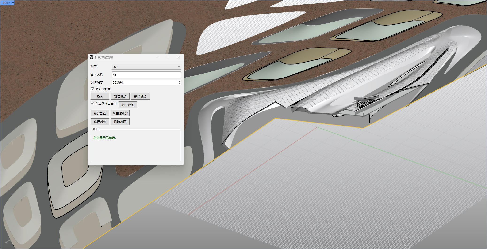

# rsPolylineSection · 折线剖切

> 模块：视图出图 / 标注出图

[← 返回命令目录](/commands/)

**功能**：生成折线剖切

*图 1：rsPolylineSection 命令面板与场地预览效果。在 Rhino 视图中选择一条折线或曲线作为剖面线后，弹出【折线/曲线剖切】对话框：可设置剖面名称、参考名称、剖切深度（85.964），勾选【填充剖切面】显示封闭的多边形剖面，启用【在条带切口处用 对齐视图】将剖面与当前视图对齐；通过【反向】、【新增折点】、【删除折点】调整剖面形状，【新建剖面】与【从曲线新建】分别支持重新绘制或从既有曲线创建，【删除剖面】用于移除已建剖面，状态栏显示【剖切面显示已就绪】。*

**调用**：在 Rhino 命令行输入 `rsPolylineSection`（命令行交互）

**交互流程**：

1. 选择折线或曲线剖面对象
2. 在观察者一侧指定一点，其距离作为剖切深度
3. 可在剖面折线附近指定新增折点，或单击删除内部折点

**参数**：

> 此命令无命令行数值参数，相关设置在窗口中调整。

**备注**：支持后续编辑折点以调整剖切范围。
