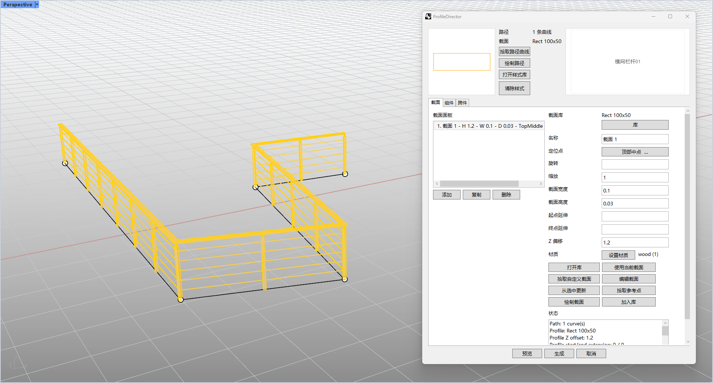

# rsProfileDirector · Profile Director

> 模块：截面管理 / Profile Director

[← 返回命令完全手册](/RsTool命令手册)

**功能**：沿路径阵列生成的截面扫掠体与组件/跨件实例（可烘焙为块或独立几何体）

*Profile Director 主界面（沿曲线路径阵列栏杆截面与竖向组件）*

**调用**：在 Rhino 命令行输入 `rsProfileDirector`（打开设置窗口）

**交互流程**：

1. 命令行输入 rsProfileDirector
2. 弹出截面路径生成器窗口（ProfileDirectorSession/Dialog）
3. 选择/绘制路径曲线，拾取或定义截面（含参考点），添加组件与跨件（设置尺寸、间距、旋转等）
4. 点击预览/生成，沿路径阵列并烘焙截面与组件

**参数**：

| 中文名 | 英文名 | 类型 | 默认值 | 范围 | 说明 |
| --- | --- | --- | --- | --- | --- |
| 截面缩放 | Profile.Scale | double | 1.0 |  | 截面整体缩放 |
| 截面旋转 | Profile.RotationDegrees | double | 0 |  | 单位：度 |
| 截面 Z 偏移（高度） | Profile.ProfileHeight | double | 0 |  | 默认 0 |
| 截面宽度 | Profile.ProfileWidth | double |  |  | 留空则按原截面 |
| 截面深度(高度) | Profile.ProfileDepth | double |  |  | 留空则按原截面 |
| 起点延伸 | Profile.StartExtension | double | 0 |  |  |
| 终点延伸 | Profile.EndExtension | double | 0 |  |  |
| 组件间距 | Component.Spacing | double |  |  | 留空则改用数量；优先使用间距 |
| 组件数量 | Component.Count | integer | 5 | ≥0 |  |
| 组件物体宽 | Component.ObjectWidth | double |  |  |  |
| 组件物体长 | Component.ObjectDepth | double |  |  |  |
| 组件物体高 | Component.ObjectHeight | double |  |  |  |
| 组件 Z 偏移 | Component.PlaneOffset | double | 0 |  |  |
| 组件 XY 旋转 | Component.RotationDegrees | double | 0 |  | 单位：度 |
| 跨件间距 | Span.Spacing | double |  |  | 留空则按数量 |
| 跨件数量 | Span.Count | integer | 1 | ≥1 |  |
| 跨件端部裁切 | Span.EndTrim | double | 0 |  |  |
| 跨件高度 | Span.Height | double |  |  |  |
| 跨件物体宽 | Span.ObjectWidth | double |  |  |  |
| 跨件物体长 | Span.ObjectDepth | double |  |  |  |
| 跨件平面偏移 | Span.PlaneOffset | double | 0 |  |  |
| 跨件旋转值 | Span.RotationValue | double | 0 |  |  |
| 跨件随机偏移 | Span.RandomPlaneOffset | double | 0 |  |  |

**备注**：窗口含路径拾取/绘制、截面库/组件库浏览、参考点拾取等交互；数值均以文本框输入，默认值多为 0 或空；分布模式可按间距或数量

**教学视频**：

<iframe class="rstool-video" src="https://player.bilibili.com/player.html?isOutside=true&aid=116918556236559&bvid=BV1HWNt6FEH5&cid=39940849872&p=1" scrolling="no" border="0" frameborder="no" framespacing="0" allowfullscreen="true" loading="lazy" title="RsTool · Profile Director 截面路径阵列操作演示（B 站）"></iframe>
*RsTool · Profile Director 截面路径阵列操作演示（B 站）*
