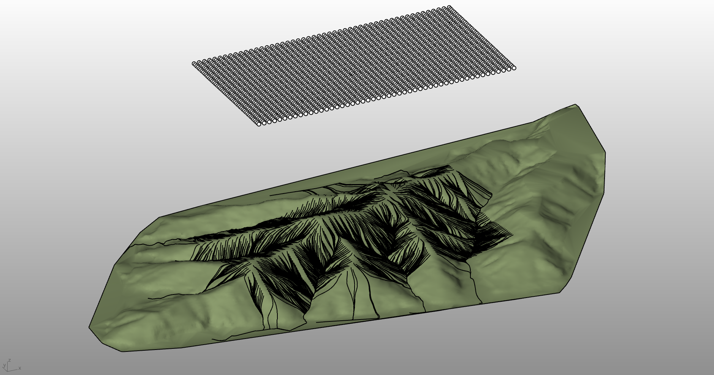

# rsRainFlowSimulation · 雨流分析

> 模块：地形 / 分析与模拟

[← 返回命令目录](/commands/)

**功能**：从各起点出发、沿地形最陡坡向累积的雨水流线（曲线组），每条曲线对应一个起点的完整径流路径

*在 Delaunay 地形网格（rsTerrain 输出）上布置 N×N 均匀降雨阵列作为起点，沿最陡下降法迭代 moveSteps 步，得到地表径流线网，可一眼看出汇水通道与山脊位置*

**调用**：在 Rhino 命令行输入 `rsRainFlowSimulation`（命令行交互）

**交互流程**：

1. 选择地形对象（网格或曲面 Brep）
2. 若为曲面，输入网格化精度
3. 在地形上选择若干起点（点）
4. 输入水流移动距离（步长）
5. 输入移动步数（迭代次数），开始模拟
6. 生成每个起点的雨水流线

**参数**：

| 中文名 | 英文名 | 类型 | 默认值 | 范围 | 说明 |
| --- | --- | --- | --- | --- | --- |
| 转网格精度 | meshPrecision | double | 1.0 | >0 | 仅当输入为 Brep/曲面时提示；静态默认 lastMeshPrecision=1 |
| 移动距离 | moveDis | double | 1.0 | >0 | 每一步水流沿最陡下坡前进的距离；静态默认 lastMoveDis=1 |
| 移动步数 | moveSteps | integer | 50 | ≥1 | 模拟迭代次数；静态默认 50 |

**备注**：命令行为 cli 流程：先选地形（Mesh 直用、Brep/曲面按 meshPrecision 临时转网格），再点若干起点，最后按 moveDis/moveSteps 沿地形最陡坡向下迭代推进；步长与步数越大流线越细越长，但耗时线性增加。

核心算法采用最陡下降法（Steepest Descent）：每一步在起点所处三角面片上对四个量做线性插值求梯度，取沿 -∇z 方向（即坡度最大方向）；当跨越到下一个三角面片时用相邻边的坡向量再插值一次，保证跨面片不折返。Brep 曲面输入时按 meshPrecision 先转成 Rhino Mesh 缓存一份，纯 Mesh 输入直接用。

参数三件套（meshPrecision / moveDis / moveSteps）按模型单位缩放：meshPrecision 默认 1.0，越小地形越接近原曲面、但顶点更多变慢；moveDis 是每步前进距离，按 rsTerrain 的 samplingLength 同量级即可；moveSteps 默认 50，大地形可放到 100–200 看完整汇流、过小可能导致流线在抵达河谷前截断。

起点布点策略决定结果形态：单点用于追一条径流走向；多点（沿屋面、沿道路、沿山坡等高线）合成流域；规则 N×M 网格（如图中所示）一次性撒下大量起点，可以一眼看到山脊/沟谷骨架以及潜在积水点；起点最少 1 个，理论上无上限，受计时影响建议单次 ≤ 500 个。

结果判读：流线越密 = 汇水量越大；流线在某点消失（走到模型边界外或落入盆地）= 该处排水不利；多条流线显著汇聚 = 主排水通道，可用于布置截洪沟/集水井；多条流线均匀分布 = 排水均匀，无明显汇水。生成结果以普通 Rhino 曲线输出，可加粗、按层级分层着不同颜色分组，也可直接 Bake 到出图图层。
