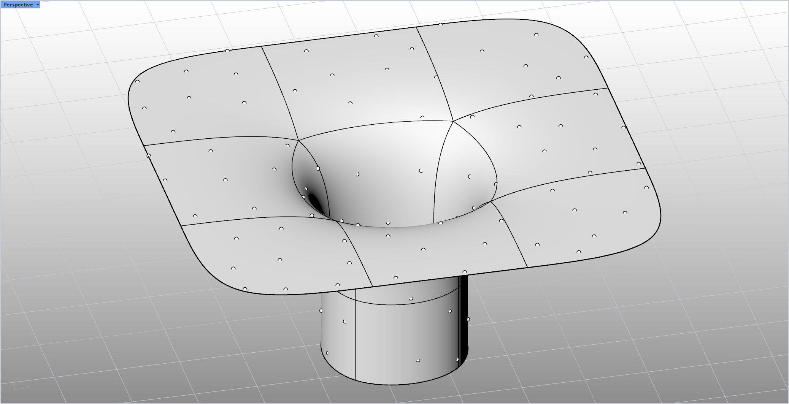

# rsRandomPtsOnObj · 物体上随机生成点

> 模块：几何 / 点

[← 返回命令目录](/commands/)

**功能**：在所选物体（曲线按长度、面/网格按面积加权）上生成指定数量的随机点

*图 1：rsRandomPtsOnObj 效果示例。Rhino Perspective 视口（左上角 Perspective 标签，红绿坐标轴在左下/右下角）中是一个蘑菇/飞碟状物体：上半部分是一个带子午线/经纬线分网的大圆角方板（伞面/蒙古包顶），中央开了一个圆形凹洞，下半部分是一个圆柱形底座支撑。物体表面（曲面）上随机分布着大量小圆圈点（每点 = 物体曲面上的一个采样点），点的密度由命令参数（数量/最小间距等）控制。点的位置严格落在输入物体曲面上，但分布是随机的、不会像等距布点那样均匀间隔*

**调用**：在 Rhino 命令行输入 `rsRandomPtsOnObj`（命令行交互）

**交互流程**：

1. 命令行输入 rsRandomPtsOnObj
2. 选择目标物体（Curve/Surface/Brep/Mesh/SubD，可多选）
3. 选取期间用选项切换分布模式（完全随机 / 尽量均匀）
4. 输入随机点数量（GetInteger，下限1，默认100）
5. 按曲线长度/网格面积加权在物体表面生成随机点并写入文档

**参数**：

| 中文名 | 英文名 | 类型 | 默认值 | 范围 | 说明 |
| --- | --- | --- | --- | --- | --- |
| 分布模式 | DistributionMode | toggle | 尽量均匀(EvenRandom) | 完全随机(TrueRandom) / 尽量均匀(EvenRandom) | 切换随机采样策略；尽量均匀采用候选点法拉开间距 |
| 随机点数量 | Count | integer | 100 | >=1 | 生成随机点数量（lastRandomPtNum 记忆，默认100，SetLowerLimit(1)） |

**备注**：该命令未重写 OnHelp，无帮助文档链接；曲线与网格混合时按长度/面积比例分配点数。
