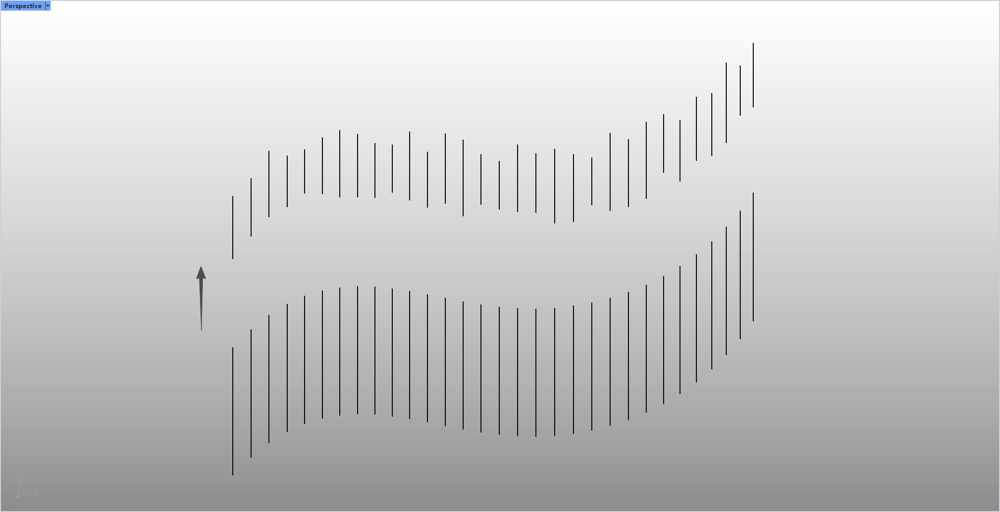

# rsRandomTrimCurve · 随机修剪曲线

> 模块：几何 / 曲线

[← 返回命令目录](/commands/)

**功能**：用随机长度裁剪后(起点和/或终点)的曲线，替换原曲线并保留图层/颜色

*图 1：rsRandomTrimCurve 效果对比。Rhino Perspective 视口（左上角 Perspective 标签，左下角坐标轴）里上下两排沿同一条斜线（左低右高再左高右低的对角线）排列的短竖线：下方一排是长度均匀、间距相等的短竖线（原始曲线按等长/等距切割的示意），上方一排则是长度不一、间距不等的短竖线（rsRandomTrimCurve 用 MinLength-MaxLength 之间的随机长度从起点/终点/两端裁剪后的结果，保留原图层与颜色）；视口左侧有一个黑色箭头由下方指向上方，示意原始→裁剪后*

**调用**：在 Rhino 命令行输入 `rsRandomTrimCurve`（命令行交互）

**交互流程**：

1. 命令行输入 rsRandomTrimCurve
2. 选择要随机裁剪的曲线(可多选)
3. 在循环选项中设置最小/最大裁剪长度与裁剪模式
4. 按回车确认执行
5. 对每条曲线随机裁剪起点/终点

**参数**：

| 中文名 | 英文名 | 类型 | 默认值 | 范围 | 说明 |
| --- | --- | --- | --- | --- | --- |
| 最小裁剪长度 | MinLength (lastMinLen) | double | 1.0 | 模型单位 | 随机裁剪长度下限 |
| 最大裁剪长度 | MaxLength (lastMaxLen) | double | 2.0 | 模型单位 | 随机裁剪长度上限；若小于 Min 自动交换 |
| 裁剪模式 | Mode (lastModeIndex) | list | 两端(Both) | 起点/终点/两端 | 0=Start,1=End,2=Both；默认 Both |

**备注**：Min>Max 时自动交换；总长度不足以裁剪的曲线被跳过。
