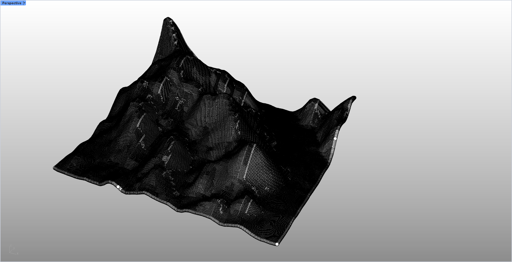
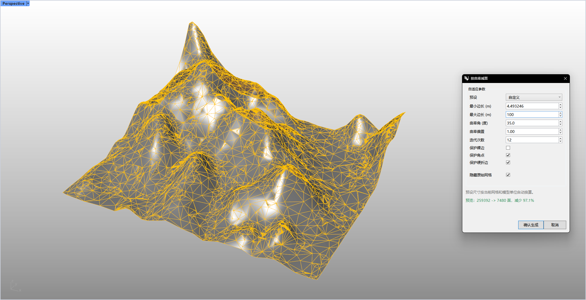

# rsReduceMeshByCurvature · 按曲率减网格面

> 模块：几何 / 网格

[← 返回命令目录](/commands/)

**功能**：按曲率保留特征、减少面数的三角网格（并传递顶点色）

*按曲率减面的输入（Before）：原始网格的灰度渲染（无 UI 面板），保留了大尺度的曲面起伏；密集三角面在谷底与转角投下深黑阴影整体仍清晰呈现原模型的尖锐轮廓；下一张即对该网格执行按曲率减面后的结果*

*按曲率减面的结果（After）：Rhino 视口，原始曲面上以**黄色线框**叠加显示减面后的网格（密集三角面 → 稀疏三角面）；右侧是本命令的「按曲率减面」参数对话框（已应用）：预设（自定义/保守/均衡/强力）、最小边长 4.0、最大边长 100、最小角 25°、曲率偏置 1.00、迭代次数 12、保护裸边/角点/硬折边、隐藏原始网格等参数；底部实时显示面数变化与减少比例*

**调用**：在 Rhino 命令行输入 `rsReduceMeshByCurvature`（打开设置窗口）

**交互流程**：

1. 选择要按曲率减面的网格
2. 弹出“按曲率减面”对话框
3. 选择预设或手动调整参数，实时预览（橙色）
4. 点击“确认生成”写入结果 / “取消”

**参数**：

| 中文名 | 英文名 | 类型 | 默认值 | 范围 | 说明 |
| --- | --- | --- | --- | --- | --- |
| 预设 | Preset | list | 均衡 (Balanced) | 保守减面 / 均衡 / 强力减面 / 自定义 | 默认索引 1；切换预设自动设置边长因子/曲率角/偏置/迭代 |
| 最小边长 | Minimum edge | double | avgEdge*0.65 | >= 模型容差，<= lengthUpperLimit | 初始为平均边长*0.65；上限 = max(包围盒对角线*2, 最大边长*100) |
| 最大边长 | Maximum edge | double | avgEdge*2.5 | >= 模型容差 | 初始为平均边长*2.5 |
| 曲率角(度) | Curvature angle | double | 25 | 1.0–180.0 |  |
| 曲率偏置 | Curvature bias | double | 1.25 | 0.2–5.0 |  |
| 迭代次数 | Iterations | integer | 8 | 1–30 |  |
| 保护裸边 | Preserve boundaries | toggle | true |  |  |
| 保护角点 | Preserve corners | toggle | true |  | 默认开启；开启『保护裸边』时本项自动置灰禁用。按 30° 边界转角阈值识别轮廓转角顶点，边折叠时跳过这类角点以保留尖锐轮廓 |
| 保护硬折边 | Preserve sharp edges | toggle | true |  |  |
| 隐藏原始网格 | Hide original mesh | toggle | true |  |  |

**备注**：采用边折叠(edge collapse)+曲率权重算法；自定义预设的边长因子：保守(0.55,1.6,18,1.5,6)、均衡(0.65,2.5,25,1.25,8)、强力(0.85,4.0,35,1.0,12)（分别为 min因子,max因子,曲率角,偏置,迭代）

⚠️ 边界与接缝保护：开启『保护裸边』时整个边界锁定，且『保护角点』自动置灰禁用；单独开启『保护角点』时，按 30° 边界转角阈值识别轮廓转角顶点并在边折叠时跳过，保留尖锐轮廓。UV 接缝与未焊接硬边的两侧顶点同步锁定，避免减面后撕裂。
