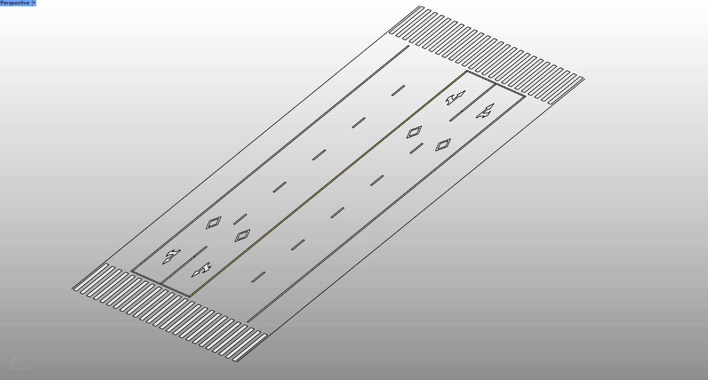
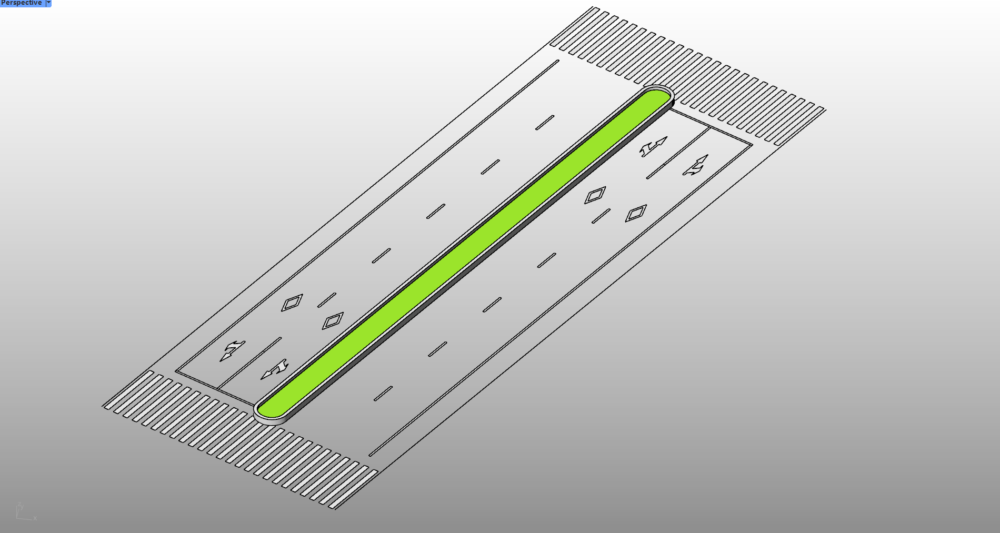
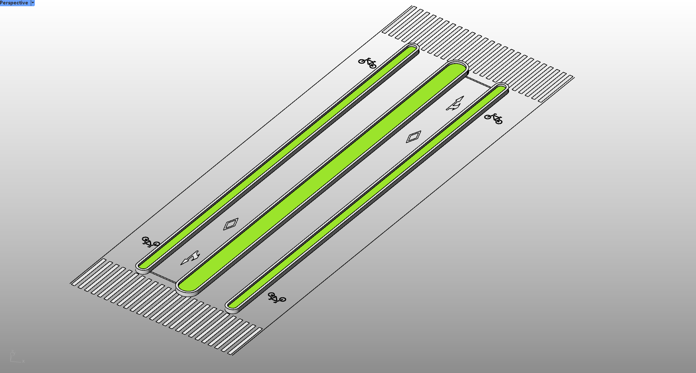

# rsRoadLine · 道路线

> 模块：建筑 / 道路

[← 返回命令完全手册](/RsTool命令手册)

**功能**：由道路两侧边缘线成对生成道路线、中心花池或自行车道几何

*道路线模式：双车道 + 车道线 + 路面标识（自行车道菱形、直行/转弯箭头、人行横道）*

*中心花池模式：中央改为绿色绿化带*

*多条平行道路：每条中央花池，端头自行车符号*

**调用**：在 Rhino 命令行输入 `rsRoadLine`（命令行交互）

**交互流程**：

1. 选择道路两侧边缘线（需成对，至少 2 条；数量为偶数）
2. 设置道路宽度
3. 设置道路中心类型（道路线 / 中心花池 / 中心花池加自行车道）
4. 设置驾驶位置（左舵 / 右舵）
5. 由成对边缘线生成道路线几何

**参数**：

| 中文名 | 英文名 | 类型 | 默认值 | 范围 | 说明 |
| --- | --- | --- | --- | --- | --- |
| 道路宽度 | RoadWidth | double | 3.5 | >0 (min 0.01) | 单位：米 |
| 道路中心类型 | RoadCenterType | list | 0 | 道路线\|道路中心花池\|中心花池和自行车道 | 0=道路线, 1=中心花池, 2=中心花池+自行车道 |
| 驾驶位置 | DriverPosition | bool | false | 右舵\|左舵 | false=右舵(RightHandDrive), true=左舵(LeftHandDrive) |

**备注**：需成对选择边缘线（数量为偶数），否则提示重新选择
