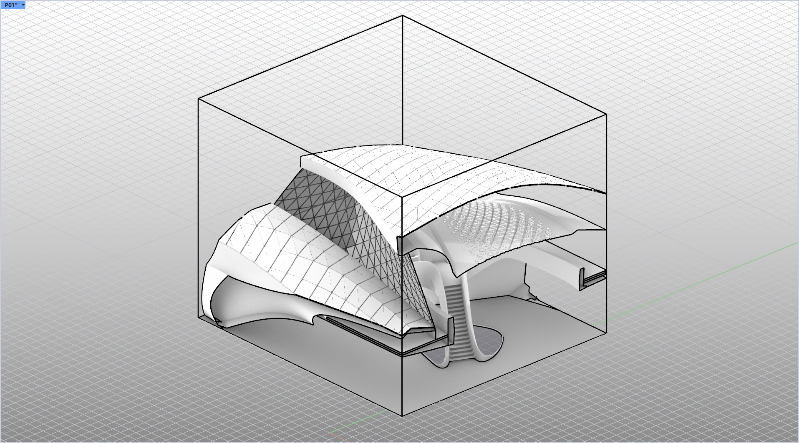

# rsSectionBox · 剖切框

> 模块：视图出图 / 标注出图

[← 返回命令目录](/commands/)

**功能**：三维剖切框 (6 个隐藏剪切平面 + 橙色线框，成组于 rsSectionBox 图层)

*rsSectionBox 剖切中：橙色长方体作为剖切框把整个建筑包起来后，被框内侧的六个隐藏剪切平面自动布尔切掉多余部分，框内可见屋顶曲面、内部楼梯、围合曲面等*

**调用**：在 Rhino 命令行输入 `rsSectionBox`（命令行交互）

**交互流程**：

1. 命令行运行 rsSectionBox
2. 通过 RhinoGet.GetBox 指定剖切长方体 (可点选或拖动)
3. 自动生成 6 个隐藏剪切平面与线框并成组

**参数**：

> 此命令无命令行数值参数，相关设置在窗口中调整。

**备注**：Z 方向厚度为 0 时自动沿 Z 膨胀 1.0；删除线框时自动清理关联剪切平面；支持缩放/移动/旋转
