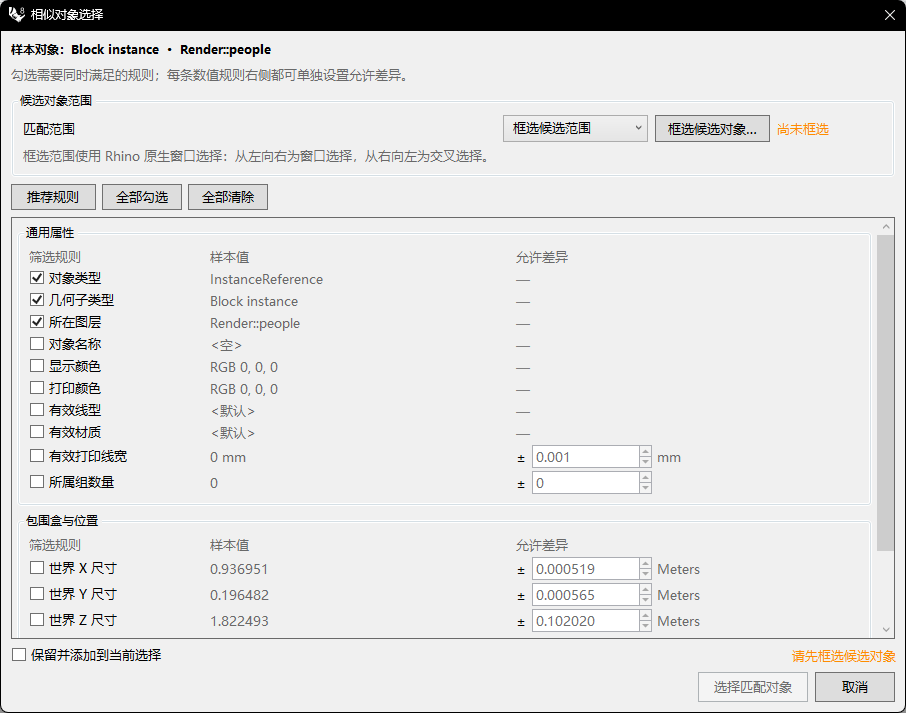

# rsSelectSimilar · 相似对象选择

> 模块：组织与选择 / 选择

[← 返回命令目录](/commands/)

**功能**：选中与参考对象满足所勾选规则的所有对象（按「匹配范围」遍历，根据各规则 + 允许差异计算）

*相似对象选择对话框：样本对象、匹配范围、动态规则组与数值容差*

**调用**：在 Rhino 命令行输入 `rsSelectSimilar`（打开设置窗口）

**交互流程**：

1. 命令行输入 rsSelectSimilar
2. 选择一个参考对象（曲线 / 曲面 / 网格 / 块 / 文字 / 填充 等任意 RhinoObject）
3. 选择匹配范围：整个文档 或 框选候选范围（点 “框选候选对象…” 进入 Rhino 原生窗口选择，左→右 窗选、右→左 交叉选）
4. 对话框实时显示当前满足勾选规则的候选数；可点 “推荐规则 / 全部勾选 / 全部清除” 快速调整勾选
5. 为数值类规则设置「允许差异」（线宽/长度/面积/体积/包围盒/方向角/整数计数各自的容差）
6. 勾选 “保留并添加到当前选择” 可与已有选区合并；否则替换当前选择
7. 点 “选择匹配对象” 执行选择（点 “取消” 不做选择）

**参数**：

| 中文名 | 英文名 | 类型 | 默认值 | 范围 | 说明 |
| --- | --- | --- | --- | --- | --- |
| 匹配范围 | candidateScope | enum | 整个文档 | 整个文档 / 框选候选范围 | Dropdown 控制候选对象池：整个文档=遍历 doc.Objects 全部对象；框选候选范围=先用 Rhino 原生窗口选择得到候选 id 集合（点 “框选候选对象…” 触发；状态栏提示 “尚未框选”/“已选 N 个”） |
| 筛选规则（勾选） | criteria | toggle | 按样本类型默认勾选对象类型 / 几何子类型 / 所在图层 / 面积 / 体积 / 闭合 / 封闭实体 / 点数量 / 块定义 / 填充图案等 |  | 动态生成：根据参考对象类型显示不同规则组（通用属性 / 几何度量 / 拓扑与形态 / 包围盒与位置 / 内容与定义），每条规则一个复选框；勾选即作为过滤条件 |
| 允许差异 | difference | double | 线宽 0.001mm、方向 1.0°、点/曲线起点终点 = 模型容差、长度/面积/体积/包围盒尺寸 = max(模型容差, 样本值×1%)、整数计数 0 | 0 ~ 1e18 | 仅数值规则可设；NumericStepper MinValue=0 MaxValue=1e18，Increment/DecimalPlaces 随规则变化（线宽 Increment=0.01 / 方向 Increment=0.5 / 整数 Increment=1 / 其他 Increment=max(模型容差,0.001)） |
| 保留并添加到当前选择 | AddToSelection | toggle | false |  | 勾选后保留原有选择并追加匹配对象（Rhino SelectObjects with enable=true + previousSelected=true 行为）；不勾选则替换当前选择 |

**备注**：**规则分组（按 `SimilarSelectionRuleFactory.Create` 动态生成）**：

- **通用属性（10 条，Common）**：对象类型 ObjectType、几何子类型 GeometrySubtype（如 Line / Polyline / Arc / Circle / NURBS curve / Single-face Brep / Multi-face Brep / Mesh / Point / Point cloud / Block instance / Hatch / Text 等）、所在图层 Layer（FullPath 路径）、对象名称 Name、显示颜色 DisplayColor（DrawColor，*含随图层*）、打印颜色 PlotColor、有效线型 Effective Linetype、有效材质 Effective Material、有效打印线宽 Effective PlotWeight（数值，默认 0.001mm 容差 / Increment=0.01 / 小数 3 位）、所属组数量 GroupCount（整数）。前 3 条默认勾选，其余按需勾选。

- **几何度量（Geometry，按几何类型动态出现）**：曲线长度 CurveLength（数值，默认容差 = max(模型容差, 样本值×1%)，单位=模型长度单位）、曲线起点 CurveStart（点，容差=模型容差）、曲线终点 CurveEnd（点）、首尾方向 CurveDirection（向量，仅在样本非空时出现；用 `VectorAngle` 计算夹角与 180-夹角取较小值，容差=角度°，默认 1°、Increment=0.5、小数 2 位，**忽略反向**）、面积 Area（数值，单位=长度单位²）、体积 Volume（数值，仅实体可用，单位=长度单位³）。曲线长度 / 面积 / 体积 / 起点 / 终点 / 方向 默认勾选。

- **拓扑与形态（Topology，按几何类型动态出现）**：闭合 Closed（布尔）、平面曲线 Planar（仅曲线）、封闭实体 Solid（仅 Brep / Mesh）、曲线阶数 Degree / 曲线跨度数 SpanCount / 控制点数 ControlPointCount（按需出现，整数容差=0 Increment=1）、曲面 U/V 阶数 Surface U/V Degree、U/V 跨度数 Surface U/V SpanCount（仅 Brep.Faces.Count==1 时出现）、曲面数量 FaceCount / 边数量 EdgeCount / 顶点数量 VertexCount / 裸边环数 NakedEdgeCount（Brep 按 `Edge.Valence==Naked` 计数，Mesh 按 `GetNakedEdges().Length`）、网格面数量 MeshFaceCount / N-gon 数量 MeshNgonCount（仅 Mesh）、点数量 PointCount（仅点云，整数容差=0）。闭合 / 封闭实体 / 点数量 默认勾选。

- **包围盒与位置（Bounds & Position，3-4 条）**：世界 X / Y / Z 尺寸 BoundingBox X / Y / Z（数值，按几何包围盒三轴长，单位=长度单位）；点坐标 PointPosition（仅 Point 几何）。包围盒数值容差= max(模型容差, 样本值×1%)。

- **内容与定义（Content & Definition，仅特定类型）**：块定义 InstanceDefinition（仅 InstanceObject，含 Block instance 几何，默认勾选）、文字内容 TextContent（仅 Annotation/TextEntity）、填充图案 HatchPattern（仅 Hatch，默认勾选）。

**匹配语义**：候选对象与样本逐条比较。文本类（名称 / 颜色 / 图层 / 块定义 / 填充 / 文字）严格相等；数值类 `Math.Abs(差) ≤ max(0, 容差)`；点类 `DistanceTo ≤ max(0, 容差)`；方向类夹角取 `min(α, \|180-α\|)` 后 ≤ 容差；布尔 / 整数类 `Math.Abs(差) ≤ 容差`（整数容差=0 即精确相等）。**匹配计数实时刷新**：修改任一勾选或容差后会触发 `RefreshMatchCount()` 重算并在对话框底部 “X / Y 个匹配” 显示（X=当前匹配数，Y=候选总数）。

**快捷按钮**："推荐规则" = 按 `SelectedByDefault` 复位（不同对象类型有不同推荐勾选）；"全部勾选" / "全部清除" 全量切换。**底部按钮**：「选择匹配对象」执行；「取消」放弃选择；右侧实时提示 `请先框选候选对象`（未选候选时禁用匹配）。

**设置持久化**：勾选状态 / 容差 / AddToSelection / 候选范围模式 由 `SimilarSelectionSettingsStore` 写入磁盘，下次打开自动带入；可在 `SimilarSelectionSettings.cs` 查看所有字段。
