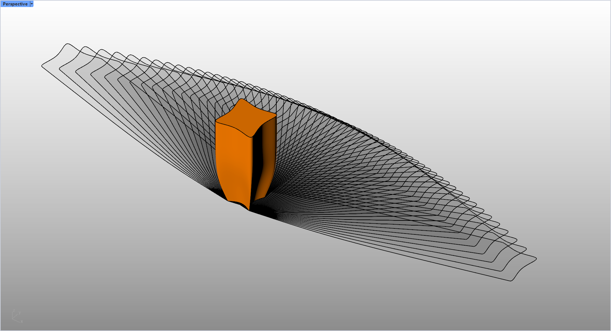

# rsShadow · 阴影分析

> 模块：分析 / 建筑物理分析

[← 返回命令目录](/commands/)

**功能**：各时刻的阴影投影曲线，以及半透明阴影填充面

*阴影分析：按 10 分钟间隔生成的逐时刻阴影投影曲线堆叠*

**调用**：在 Rhino 命令行输入 `rsShadow`（命令行交互）

**交互流程**：

1. 确保文档太阳（Sun）已启用
2. 选择要投影阴影的物体（Brep / Mesh / SubD）
3. 输入起始小时（0–23）
4. 输入结束小时（≥起始，0–23）
5. 以固定 10 分钟间隔逐时刻计算阴影

**参数**：

| 中文名 | 英文名 | 类型 | 默认值 | 范围 | 说明 |
| --- | --- | --- | --- | --- | --- |
| 起始小时 | startHour | integer | 8 | 0 – 23 | 阴影分析开始时刻（本地时间） |
| 结束小时 | endHour | integer | 17 | 0 – 23，且 ≥ 起始小时 | 阴影分析结束时刻 |

**备注**：必须启用 Sun；采样间隔固定为 10 分钟，不在命令行参数中暴露。
