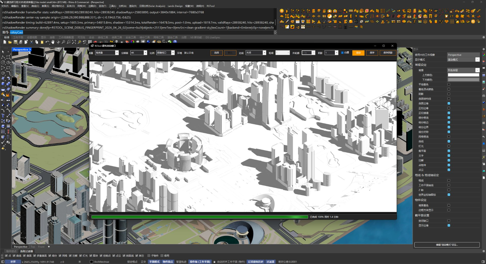

# rsShadowRender · 建筑渲染窗口

> 模块：视图出图 / 标注出图

[← 返回命令目录](/commands/)

**功能**：建筑阴影/白模渲染结果 (在 ArchiRenderWindow 中渲染当前视口场景)

*rsShadowRender 渲染中：自动捕获当前 Rhino 视口到 ArchiRenderWindow 离线渲染，顶部进度条 + 取消 / 暂停控件；右侧面板控制摄像机、视口、太阳、材质边线、白模等开关；图中已渲染到 67%，完成度实时显示。*

**调用**：在 Rhino 命令行输入 `rsShadowRender`（打开设置窗口）

**交互流程**：

1. 命令行运行 rsShadowRender
2. 打开建筑渲染窗口 (捕获当前视口)
3. 自动开启文档太阳
4. 在窗口设置质量/输出/白模/阴影等
5. 点击“渲染”开始

**参数**：

| 中文名 | 英文名 | 类型 | 默认值 | 范围 | 说明 |
| --- | --- | --- | --- | --- | --- |
| 渲染质量 | QualityPreset | list | High | Preview/Medium/High/Ultra | 影响内部分辨率倍率与抗锯齿 (Preview0.5/Medium1/High2/Ultra3) |
| 输出尺寸 | OutputPreset | list | Output2K (2560px) | 1K(1920)/2K(2560)/4K(3840)/6K(6144) | 长边像素 |
| 宽高比 | AspectRatioPreset | list | MatchViewport (跟随视口) | MatchViewport/Square1x1/4x3/16x9/9x16 |  |
| 继承Rhino材质颜色 | InheritRhinoMaterialColor | toggle | true |  | 代码中固定为 true |
| 边线模式 | EdgeRenderMode | list | ViewportOverlay | Off/ViewportOverlay/NativeFramebuffer |  |
| 物体边线宽度 | ObjectEdgeLineWidth | integer | 1 | 1 – 16 | ClampObjectEdgeLineWidth 限制 |
| 使用高级Rhino材质 | UseAdvancedRhinoMaterial | toggle | true |  | 代码中固定为 true |
| 白模模式 | UseWhiteModel | toggle | false |  |  |
| 阴影强度 | ShadowIntensity | double | 1.0 | 0.0 – 1.0 | ClampShadowIntensity 限制 |
| 主轮廓线宽比 | PrimaryOutlineWidthRatio | double | 1.5 | 0.0 – 2.0 | ClampPrimaryOutlineWidthRatio 限制 |

**备注**：自动开启文档太阳（渲染 → 太阳面板可调）；设置持久化到命令 PersistentSettings；同一文档复用窗口实例

## 一、典型使用流程

1. Rhino 命令行输入 `rsShadowRender`，弹出 ArchiRenderWindow（建筑渲染窗口）
2. 自动开启文档太阳，捕获当前 Perspective 视口作为渲染源
3. 按需设置渲染质量 / 输出尺寸 / 宽高比 / 白模开关 / 阴影强度 / 边线模式 等
4. 点「渲染」开始离线渲染；中途可「暂停」续渲或「取消」中止
5. 进度条显示百分比 + 完成值（如 67%），后台可持续在 Rhino 做其他建模
6. 完成后窗口内显示成图，可保存 / 复制 / 截图

## 二、参数分组详解

### 1. 输出
- **渲染质量 QualityPreset**：Preview / Medium / High / Ultra（内部分辨率倍率 0.5/1/2/3）
- **输出尺寸 OutputPreset**：1K(1920) / 2K(2560) / 4K(3840) / 6K(6144)（长边像素）
- **宽高比 AspectRatioPreset**：MatchViewport / Square 1×1 / 4:3 / 16:9 / 9:16

### 2. 材质
- **继承 Rhino 材质颜色 InheritRhinoMaterialColor**：代码固定为 true，从当前文档材质球取色
- **使用高级 Rhino 材质 UseAdvancedRhinoMaterial**：代码固定为 true
- **白模模式 UseWhiteModel**：开则忽略颜色统一渲染白膜，常用于体量研究 / 阴影分析

### 3. 边线
- **边线模式 EdgeRenderMode**：Off / ViewportOverlay / NativeFramebuffer
- **物体边线宽度 ObjectEdgeLineWidth**：1–16，由 ClampObjectEdgeLineWidth 限制
- **主轮廓线宽比 PrimaryOutlineWidthRatio**：0.0–2.0，主要轮廓相对次要轮廓的粗细比
- **阴影强度 ShadowIntensity**：0.0–1.0，1.0 为全黑阴影

## 三、与普通 Rhino Render 的差异

- 直接接 RSTool 建筑审图工作流：默认体量白模 + 高对比阴影 + 主轮廓线，无需逐项配 Cycles
- 自动开文档太阳，省去手动调整时间；太阳参数可到「渲染 → 太阳面板」按需改
- 渲染过程中可继续在 Rhino 中建模、缩放、改图，不会卡死画布
- 输出纯位图（含主轮廓 + 阴影的白模），后期可叠加材质图、平面图、尺寸标注一键出审图册

## 四、典型场景

- **建筑体量阴影分析**：白模 + 阴影强度 1.0 + Ultra，多视角出 4K 阴影图
- **总平面底图**：MatchViewport + High + 主轮廓线宽比 1.5，配平面树、铺地快速出图
- **鸟瞰 / 鸟瞰动画**：MatchViewport + Ultra，主轮廓 1.0，强调塔楼形体
- **方案对比渲染**：批量跑 4–6 个视角 + 边线开关对比，存 PNG 系列

## 五、注意事项

- 太阳方向随「渲染 → 太阳面板」实时联动，调太阳时已渲染图也会跟着预览刷新
- 高分辨（4K+Ultra）渲染时显存占用高，建议关闭其他 D3D 应用
- 设置存在命令 PersistentSettings，重复打开同一文档会沿用上次设置
- 取消渲染后未完成部分不会保存

**教学视频**：

<iframe class="rstool-video" src="https://player.bilibili.com/player.html?isOutside=true&aid=116754558752387&bvid=BV1ymjN6YE9P&cid=39142556947&p=1" scrolling="no" border="0" frameborder="no" framespacing="0" allowfullscreen="true" loading="lazy" title="RsTool · 建筑渲染窗口（Shadow Render）演示教学（B 站）"></iframe>
*RsTool · 建筑渲染窗口（Shadow Render）演示教学（B 站）*

<iframe class="rstool-video" src="https://player.bilibili.com/player.html?isOutside=true&aid=116607640670567&bvid=BV1jjLS6zENC&cid=38483397032&p=1" scrolling="no" border="0" frameborder="no" framespacing="0" allowfullscreen="true" loading="lazy" title="RsTool · 建筑渲染窗口（Shadow Render）补充演示（B 站）"></iframe>
*RsTool · 建筑渲染窗口（Shadow Render）补充演示（B 站）*
