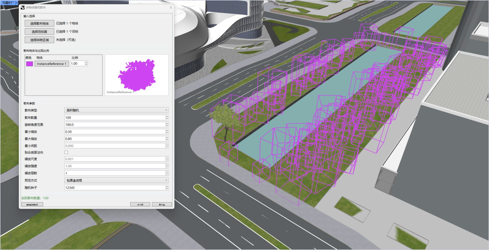
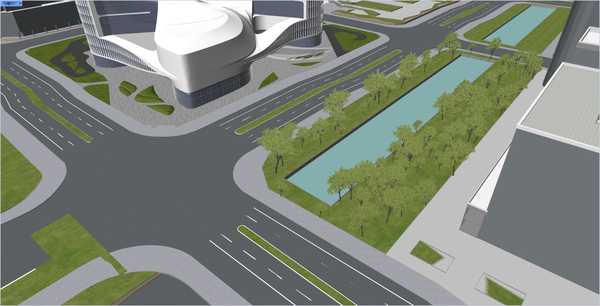

# rsSprinkerMutiple · 多点散布

> 模块：几何 / 对象变换

[← 返回命令目录](/commands/)

**功能**：按对话框参数将多个源物体随机散布到目标面上，并保留历史记录便于编辑

*图 1：rsSprinkerMutiple 对话框与线框预览。Rhino Perspective 视口（左上角 Perspective 标签，红绿坐标轴在左下/右下角）中是一个城市场景：弧形道路、矩形水池、绿色草地、左上角白色弧形建筑；水池和草地边缘整齐排列着大量紫色 InstanceReference 线框（即待散布的源物体在目标曲面上的预览占位）；左侧是多物体随机散布 Eto 对话框：输入区显示已选择 1 个物体、1 个目标、未选排除；散布预览地图比例 1.00；散布参数含散布类型（圆环随机）、散布数量（100）、旋转角度范围（180.0）、最小缩放（0.30）、最大缩放（0.80）、最小间距（0.000）、贴合表面法向（勾选）、缩放尺度（0.001）、螺旋强度（1.000）、螺旋层数（4）；预览方式=轮廓盒线框；随机种子 12345；底部提示实际散布数量 100。预览对应参数实时变化，OK 后才将散布结果作为正式历史记录写入文档*

*图 2：rsSprinkerMutiple 最终结果。同一个城市场景（道路、矩形水池、弧形建筑、绿地），紫色线框预览已被正式散布的实例对象取代：水池和绿地两侧整齐排列着成排的绿色树木实例（与预览数量 100 一致），每株带圆冠，姿态各异、大小有差异（受缩放 0.30-0.80 与旋转 0-180 度控制），保持源物体材质和图层；与图 1 对照即可看到从紫色线框预览到最终实例化的效果*

**调用**：在 Rhino 命令行输入 `rsSprinkerMutiple`（打开设置窗口）

**交互流程**：

1. 命令行输入 rsSprinkerMutiple
2. 弹出 Eto 对话框（SprinkerMultipleDialog，半模态）
3. 在对话框中选择源物体、目标面，并设置各项参数（数量/角度/缩放/间距/噪波/分布等）
4. 实时预览（SprinkerPreviewConduit）
5. 点击确定后按 TransformWithHistory 批量生成散布物体

**参数**：

| 中文名 | 英文名 | 类型 | 默认值 | 范围 | 说明 |
| --- | --- | --- | --- | --- | --- |
| 数量 | Count | integer | 100 | 1 ~ 2147483647 | 散布物体总份数 |
| 角度范围 | AngleRangeDegrees | double | 180 | 0 ~ 360 | 随机旋转角度上限（度） |
| 最小缩放 | MinimumScale | double | 0.8 | 0.01 ~ 1000000 | 随机缩放比例下限 |
| 最大缩放 | MaximumScale | double | 1.2 | 0.01 ~ 1000000 | 随机缩放比例上限 |
| 最小间距 | MinimumDistance | double | 0.5 | 0 ~ 极大值 | 散布点之间最小间距，避免物体重叠 |
| 对齐到表面 | AlignToSurface | toggle | false |  | 是否使物体法线对齐目标表面 |
| 随机种子 | RandomSeed | integer | 12345 | -2147483648 ~ 2147483647 | 随机种子，相同种子结果可复现 |
| 噪波缩放 | NoiseScale | double | 0.25 | 0.001 ~ 1000 | 噪波分布频率，仅噪波聚集/留白模式生效 |
| 噪波强度 | NoiseStrength | double | 0.85 | 0 ~ 1 | 噪波聚集/留白强度 |
| 噪波层数 | NoiseOctaves | integer | 4 | 1 ~ 8 | 噪波叠加分形层数 |
| 预览模式 | PreviewMode | list | BoxWire(包围盒线框) | 包围盒线框 / 物体线框 / 着色面预览 | 预览显示方式（SprinkerPreviewMode 枚举） |
| 分布模式 | DistributionMode | list | Random(面积随机) | 面积随机 / 均匀间距 / 噪波聚集 / 噪波留白 | 散布分布算法（SprinkerDistributionMode 枚举） |

**备注**：纯表单交互（Eto 对话框），无命令行数值参数；所有默认值由 last* 静态字段记忆。
