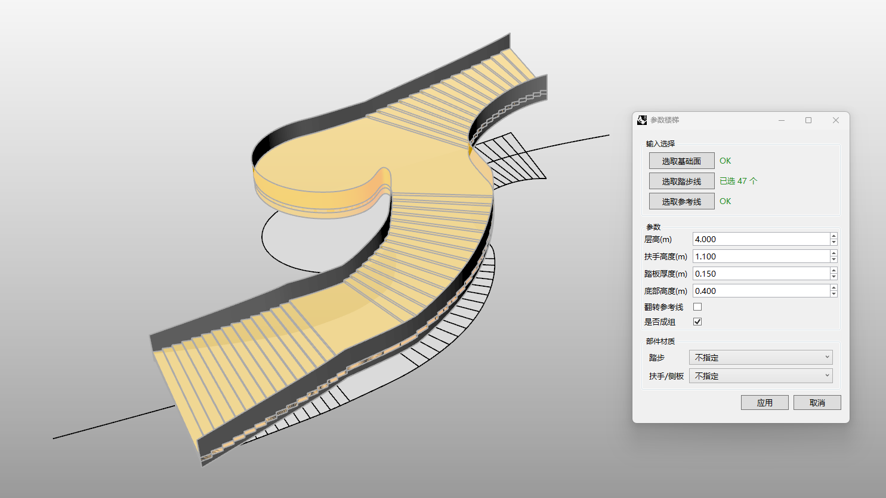

# rsStairBySteps · 按步数生成楼梯

> 模块：建筑 / 楼梯与坡道

[← 返回命令目录](/commands/)

**功能**：沿基础面与踏步线生成参数化楼梯（含扶手）

*沿基础面与踏步线/参考曲线生成参数化楼梯（含扶手），楼板/踏步/侧板均支持单独指定材质*

**调用**：在 Rhino 命令行输入 `rsStairBySteps`（命令行交互）

**交互流程**：

1. 通过表单选择基础面 / 踏步线 / 参考线模式（或直接在场景中选择）
2. 选择基础面
3. 选择踏步线
4. 选择参考（导向）曲线
5. 设置层高 / 扶手高度 / 踏板厚度 / 底部高度 / 翻转
6. 实时预览并生成参数化楼梯（含扶手）

**参数**：

| 中文名 | 英文名 | 类型 | 默认值 | 范围 | 说明 |
| --- | --- | --- | --- | --- | --- |
| 层高 | FloorHeight | double | 4 | 0.001~10000 | 步进 0.1，单位：米 |
| 扶手高度 | HandrailHeight | double | 1.1 | 0.001~10000 | 步进 0.1，单位：米 |
| 踏板厚度 | StepHeight | double | 0.15 | 0.001~10000 | 步进 0.01，单位：米 |
| 底部高度 | BottomHeight | double | 0.4 | 0~10000 | 步进 0.01，单位：米 |
| 翻转参考线 | FlipGuide | bool | false | true\|false | 翻转踏步参考线方向 |

**备注**：表单与命令行选项混合驱动
