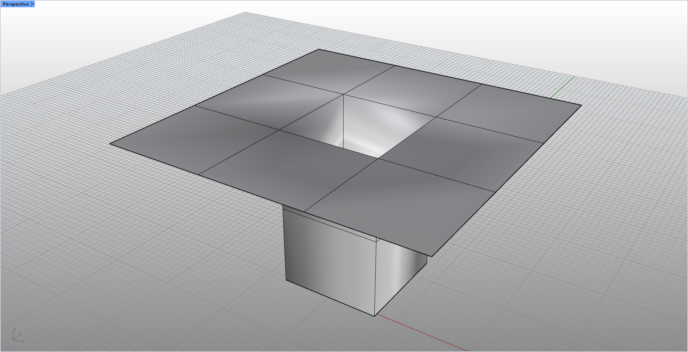
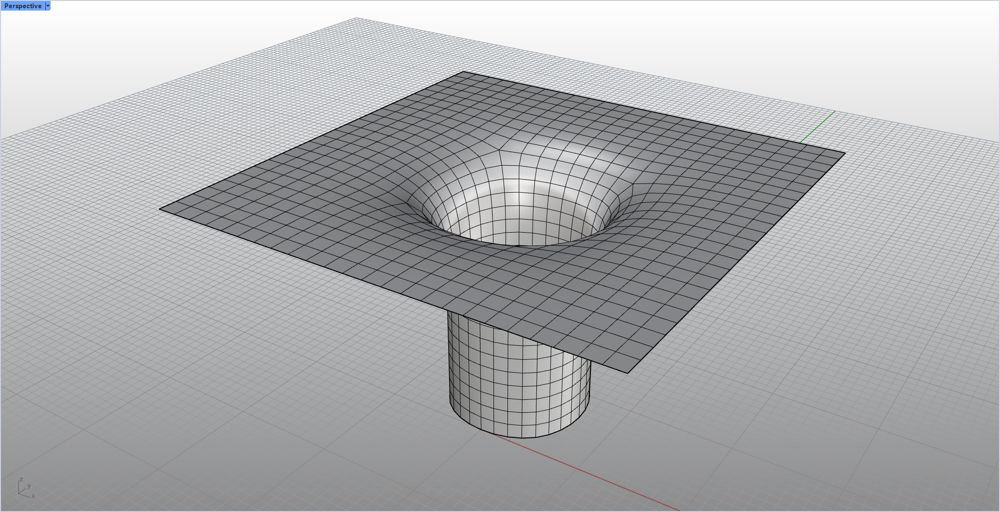

# rsSubdivideMesh · 细分网格

> 模块：几何 / 网格

[← 返回命令目录](/commands/)

**功能**：Catmull-Clark 细分后的网格

*细分前的原始网格（Before）：Rhino 8 视口，画面中央一块占据大部分视野的灰色曲面体，左右两侧是默认的渐变背景（无 UI 面板）；网格线框较疏、四边形面较大，作为 Catmull-Clark 细分的输入对象*

*Catmull-Clark 细分后的网格（After）：与示例 1 同一视口、同一物体（两图轮廓 102 行中 68 行像素级一致）；网格线密度提升约 50%，每个四边形面被一分为四、面数成倍增加，棱角与折边被细分平滑*

**调用**：在 Rhino 命令行输入 `rsSubdivideMesh`（命令行交互）

**交互流程**：

1. 选择网格
2. 循环：附加 Boundary 选项并输入细分次数（可重复切换边界模式）
3. 执行 Catmull-Clark 细分

**参数**：

| 中文名 | 英文名 | 类型 | 默认值 | 范围 | 说明 |
| --- | --- | --- | --- | --- | --- |
| 细分次数 | Iterations | integer | 1 | 1–6 |  |
| 边界处理 | Boundary | list | 固定角点 (FixCorners) | 自由(Free) / 固定角点(FixCorners) / 固定边缘(FixEdges) | AddOptionList；默认索引 1(FixCorners)，记忆上次选择 _lastModeIndex |

**备注**：通过 SubD 细分实现
