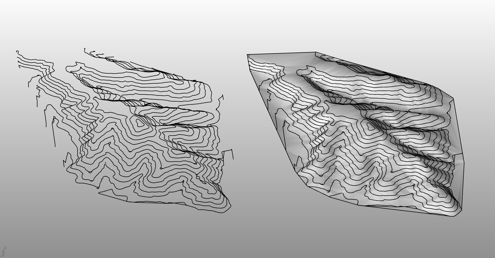

# rsTerrain · 地形网格

> 模块：地形 / 分析与模拟

[← 返回命令目录](/commands/)

**功能**：由等高线 Delaunay 三角化生成的地形网格（Mesh），与原等高线重叠输出

*rsTerrain 结果对照（左侧线稿等高线 + 右侧 Delaunay 地形网格曲面）*

**调用**：在 Rhino 命令行输入 `rsTerrain`（命令行交互）

**交互流程**：

1. 命令行输入 rsTerrain
2. 选择一组等高线（曲线/多段线，可框选多条）
3. 命令行输入采样长度 samplingLength（默认 5.0，按当前模型单位缩放）
4. 由等高线 Delaunay 三角化生成地形网格（Mesh）输出

**参数**：

| 中文名 | 英文名 | 类型 | 默认值 | 范围 | 说明 |
| --- | --- | --- | --- | --- | --- |
| 采样长度 | samplingLength | double | 5.0 | 按当前模型单位缩放，>0 | 静态默认值 lastDivLength=5，会按模型单位换算；值越小网格越密 |

**备注**：命令为命令行交互（无 Eto 对话框），流程固定为：选等高线→提示采样长度→直接构网输出。

构网算法：以等高线上按采样长度采出的离散点作为输入，使用 Delaunay 三角剖分生成表面网格；输出为 Rhino Mesh 实体，与原等高线图层并列，可在视口切换线稿/实体/渲染模式查看。

采样长度 samplingLength：决定等高线之间的网格密度。该值会按当前模型单位换算（毫米图、厘米图、米图各自不同缩放），值越小点越密、网格越细，但计算量随之增加；过小还会导致模型过大卡顿。一般建议先用 5.0 默认值出大体地形，再视精度调到 2.0–3.0 加细山谷鞍部等细微起伏。

输入要求：需要至少 3 个有效顶点/点才能构网（Delaunay 的最低要求）；等高线必须为闭合或半闭合曲线，断线会触发命令内部 max=0 报错并提示「采样长度必须大于零」；不等高线对象（如 Mesh、Brep）需先转换为等高线或自带高程点的网格再走本命令，否则会因无顶点采样失败。

与上下游命令衔接：本命令输出 Mesh 是 rsTerrainAnalysis 地形分析与 rsTerrainEdit 地形编辑的标准输入源；做地形分析前通常先用本命令拿到网格、再用 rsEarth 拉取地形数据可作为补充参考。
