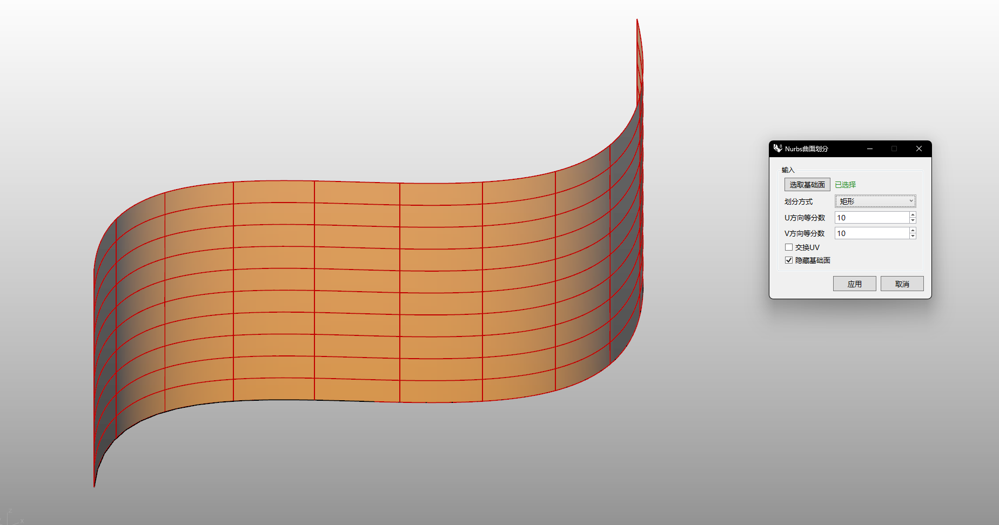

# rsTesselateNurbs · NURBS 细分铺装

> 模块：铺装表皮

[← 返回命令目录](/commands/)

**功能**：按所选图案和 U/V 等分数参数化切分 NURBS 曲面/多重曲面，输出嵌板 Brep 集合；可「交换 UV」「隐藏基础面」「按组写入」

*默认矩形划分：U/V 等分数 10×10 生成 100 块矩形嵌板，实时预览随每次参数修改立刻刷新*

**调用**：在 Rhino 命令行输入 `rsTesselateNurbs`（打开设置窗口）

**交互流程**：

1. 打开“Nurbs曲面划分”窗口
2. 选取基础面（Brep/Extrusion）
3. 选择划分方式（Pattern）
4. 设置 U / V 方向等分数，可选交换 UV
5. 实时橙色预览
6. 应用（按组写入）/ 取消

**参数**：

| 中文名 | 英文名 | 类型 | 默认值 | 范围 | 说明 |
| --- | --- | --- | --- | --- | --- |
| 划分方式 | Pattern | list | 矩形 (QuadPanels) | 矩形 / 菱形 / 三角形 / 随机矩形 / 随机四边面板 / 斜矩形 / 六边形 / 错缝砖 / 人字纹 / 八边形方格 / 三角六边形 / Cairo五边形 | 12 种图案；默认索引 0 (QuadPanels) |
| U方向等分数 | UDivideNum | integer | 10 | 1–999 | 记忆上次值 lastUDivNum |
| V方向等分数 | VDivideNum | integer | 10 | 1–999 | 记忆上次值 lastVDivNum |
| 交换UV | Swap U/V | toggle | false |  | 记忆上次值 lastSwapUV |
| 隐藏基础面 | Hide base surface | toggle | false |  |  |

**备注**：面板交互为主（form 模式 + 实时预览），流程固定 6 步：打开窗口 → 选基础面（Brep/Extrusion）→ 选划分方式 → 设 U/V 等分数 → 实时预览 → 应用/取消，输出按 output 组写入文档。

本命令的核心用途是把单张或一整组 NURBS 曲面按所选图案参数化地切成大量嵌板（Brep 嵌片），用于幕墙、屋面、室内墙顶面、地砖等位置直接用作面板原料。划分数(U/V)等分数)、图案、是否交换 UV 全部即时反馈到预览，所见即所得。

12 种图案一览（每种都是参数化、可随 U/V 等分数自由控制密度）：

① 矩形（QuadPanels，默认）— U×V 等分，矩形 4 边面板，最标准的幕墙/屋面划分。

② 菱形（DiagonalQuadPanels）— 矩形基础上按对角线二次切，每格分两块三角，更具动感，适合玻璃幕墙 + 立面呼吸缝。

③ 三角形（TriangularPanels）— 每矩形再对角切 1 次，得到三角面板，适合复杂双曲面细分。

④ 随机矩形（RandomRectangularPanels）— U/V 步长引入随机扰动，得到大小不一的矩形拼贴，模拟石材/木地板干砌效果。

⑤ 随机四边面板（RandomQuadPanels）— 每个嵌板保持四边形但形状随机，更自然的不规则表皮。

⑥ 斜矩形（SkewRectangularPanels）— 矩形但行进方向倾斜一个固定角度，适合仿砖墙错位但统一走向的样式。

⑦ 六边形（HexagonalPanels）— 蜂窝状等边六边形面板，规则 + 拓扑奇点少，适用于屋面防水饰面、室内吸音板背景。

⑧ 错缝砖（RunningBondPanels）— 横缝对齐、纵缝错 1/2，砌体/砖墙最常见步法，2:1 长宽比可调。

⑨ 人字纹（HerringbonePanels）— 矩形按 90° 交错摆放，两两一组成 V 字，铺装地毯/木地板常用肌理。

⑩ 八边形方格（OctagonSquarePanels）— 八边形 + 中间小方格的「伊斯兰几何」经典图案，多用于大型公共建筑天花板、广场地砖。

⑪ 三角六边形（TriHexagonalPanels）— 三角形与六边形交替拼贴，3-6-3-6 的拓扑，产生半规则马赛克效果。

⑫ Cairo 五边形（CairoPentagonalPanels）— Cairo 镶嵌（五边形为主，含锐角与钝角），非周期拼接，伊斯兰/中东风格几何最常见的图案。

实战要点：①多重曲面（比如一栋异形曲面幕墙整体 UV 已展开）一次选择多张，本命令会自动把它们当成一片连续曲面画 U/V 划分，再按面片归属回写到对应原始面片上，仍走 RStool 划分逻辑；②U/V 等分数共同决定面板密度，1–999 范围，肉眼感知下 1m×1m 内 4 块面板是常用幕墙尺度，屋顶大体量可放到 50/40 让每块面板 1–2m 见方；③「交换 UV」用于横向构图当 0/0、0/U、V/V 这几个方向与实际期望不一致时的快速矫正；④「隐藏基础面」配合「应用」通常用于：保留嵌板做后续建模（Offset、Trim、Boolean 等）操作、原基础面作为「模板」用一层单独图层保存以便回滚；⑤默认下 12 种图案都支持多重曲面连续划分，常见卡点是多重曲面边界接缝处会造成嵌板溢出，可预先 Join 或 RebuiltUV 至单 UV 区间再切。

最终输出：嵌板 Brep 集合，每个是独立可编辑的 Surface；按 output 组写入文档，可后续 Bake、加材质、按嵌板边界作 Offset/SweepBoolean/Trim，多用于幕墙深化、室内立面参数化建模。生成结果与原基础面共享 UV 参数空间，所以同一曲面再次重新切分（不同图案/不同等分数）会精确覆盖原区域。
