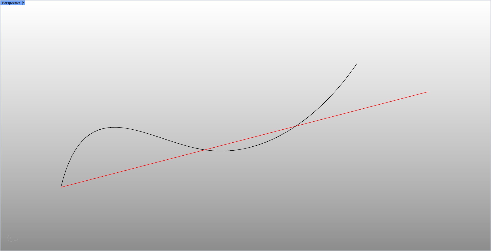

# rsUnrollCrv · 曲线展直

> 模块：几何 / 曲线

[← 返回命令目录](/commands/)

**功能**：从曲线起点沿 +X 轴正向、长度等于曲线长度的直线(Line)

*图 1：rsUnrollCrv 展开效果。Rhino Perspective 视口（左上角 Perspective 标签，左下角坐标轴）里有一条黑色 S 形 2D 曲线（从左下到右上、起伏两次，呈波浪形），以及一条红色直线（连接原曲线两端点、方向为起点→终点）；红色直线 = rsUnrollCrv 把原曲线按其总弧长沿 +X 方向展开为一条 Line 后的结果（图中以红色高亮），原曲线本身保留作为参照*

**调用**：在 Rhino 命令行输入 `rsUnrollCrv`（命令行交互）

**交互流程**：

1. 命令行输入 rsUnrollCrv
2. 选择一条曲线
3. 自动沿 +X 方向以其起点为起点创建等长直线

**参数**：

> 此命令无命令行数值参数，相关设置在窗口中调整。

**备注**：仅选一条曲线(GetMultiple(1,1))；无任何可调参数。
