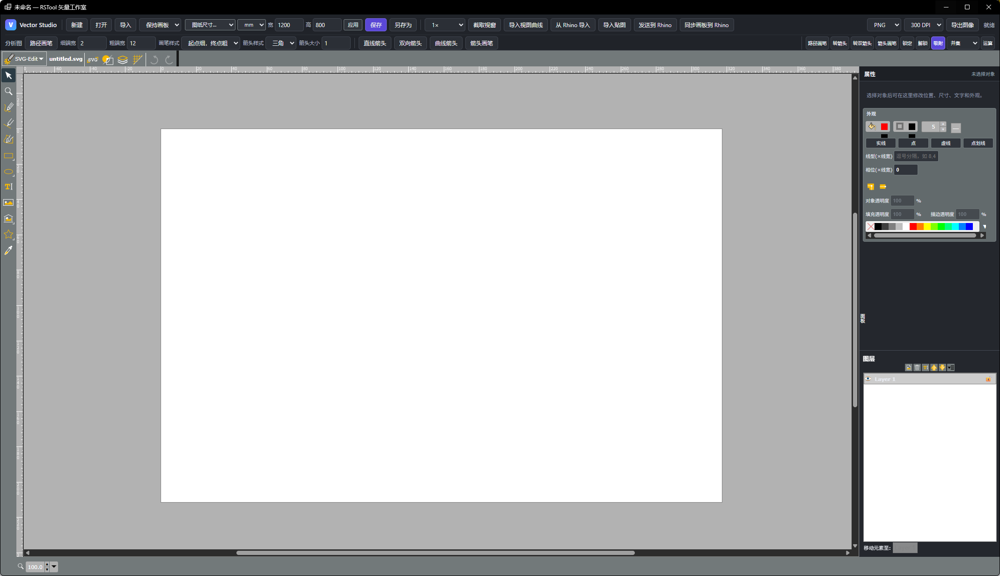

# rsVectorStudio · 矢量工作室

> 模块：效率工具 / 生产力

[← 返回命令目录](/commands/)

**功能**：打开矢量工作室 (Vector Studio) 窗口，编辑 SVG 矢量图、可与 Rhino 双向同步（曲线 / 贴图 / 视窗截图 / 画板尺寸同步）

**调用**：在 Rhino 命令行输入 `rsVectorStudio`（打开设置窗口）

**交互流程**：

1. 命令行输入 rsVectorStudio，打开矢量工作室窗口
2. 用左侧绘图工具（选择 / 铅笔 / 钢笔 / 矩形 / 圆 / 文本 / 图片等）在画板上绘制
3. 用顶部工具栏做导入 / 导出、布尔运算、路径画笔 / 箭头画笔，以及截取 Rhino 视窗、与 Rhino 双向同步
4. 选中元素后，在右侧属性面板调整填充 / 描边 / 渐变 / 图层
5. Ctrl+S 或关闭窗口前自动写回 Rhino 与本地文件

**参数**：

| 中文名 | 英文名 | 类型 | 默认值 | 范围 | 说明 |
| --- | --- | --- | --- | --- | --- |
| 导出格式 | Format | list | png | png / jpeg / webp | 导出时设置：图像输出格式 |
| 缩放 | Scale | double | 1.0 | > 0（导出尺寸 = 源尺寸 × Scale） | 导出时设置：整体缩放比例 |
| 宽度 | Width | int | 源尺寸 | 1 – 8192 | 导出时设置：指定时按宽高精确输出 |
| 高度 | Height | int | 源尺寸 | 1 – 8192 | 导出时设置：指定时按宽高精确输出 |

**备注**：基于 svg-edit 7.4.2 引擎，自定义功能代码在 vector-studio-app.js + vector-studio.css。

**左侧绘图工具**（vendor/Editor.js 自带）：选择 (V) / 铅笔 / 钢笔 / 矩形 / 圆角矩形 / 椭圆 / 多边形 / 直线 / 路径 / 文本 / 图片（点击选择后在画板拖动绘制，多段路径双击或回车闭合）。

**顶部工具栏按钮分组**（buttonLabels 列表）：

| 类别 | 按钮 |
| --- | --- |
| 文件 | 新建 · 打开 · 导入 · 保存 · 另存为 |
| Rhino 双向 | 截取视窗 · 导入视图曲线 · 从 Rhino 导入 · 导入贴图 · 发送到 Rhino · 同步画板到 Rhino |
| 分析图 | 路径画笔（细端宽 · 粗端宽 · 画笔样式：两头细/起点粗/起点细） · 箭头画笔（直线箭头 · 双向 · 曲线 · 箭头样式：三角 · 内凹 · 菱形 · 圆点 · 无 · 箭头大小） |
| 选中转换 | 转箭头 · 转双箭头 · 路径画笔 · 箭头画笔 · 锁定 · 解锁 |
| 几何布尔 | 并集 · 减去顶层 · 交集 · 排除（仅闭合路径/矩形/圆/椭圆/多边形/仅含它们的组） |
| 路径 | 路径圆角（仅由直线段组成的路径；含贝塞尔的路径不修改） |
| 视图操作 | 撤销 · 重做 · 吸附 · 显示网格 · 对齐像素 · 缩放 · 对齐图 · 缩放图 · 图纸尺寸 · 字体 · 导出图像 |
| 导出 | PNG · 原始图像 · DPI 选择 |

**右侧属性面板**：

| 面板 | 字段 |
| --- | --- |
| 填充 | 颜色 · 透明度 · 渐变方向（线性 / 径向） |
| 描边 | 颜色 · 宽度 · 不透明度 · 连接风格 · 虚线线型：实线 / 点 / 虚线 / 点划线（线型 / 相位以「线宽倍数」输入，逗号分隔例如 8,4，存为 `data-rstool-dash-*` 属性以保证 SVG 文件持久化） |
| 渐变 | 线性 · 径向 · 渐变类型 |
| 图片调整 | 亮度 · 对比度 · 饱和度 · 色相 · 灰度 · 去色 · 黑白 · 重置 |
| 图层 | 当前图层增删切换 · 可见 / 锁定 · 锁定后该图层对象不能在画板上点选 |

**与 Rhino 双向**：

- 从 Rhino 导入 — 抓取文档中选中对象的曲线或贴图面到画板
- 发送到 Rhino — 把选中曲线 (polyline/path) 与图片转成 Rhino 对象
- 截取视窗 — 按比例尺截取 Rhino 当前视图，可输入「宽x高」自定义分辨率（1–8192），自动居中并把画板缩放到与截图对齐
- 导入视图曲线 — 按当前视窗反投影曲线；视窗变化会提示「可能无法完全对齐」
- 同步画板到 Rhino — 把画板外框推回 Rhino 同步平面尺寸

**保存与恢复**：

- Ctrl+S 写为 SVG 文本导出到本地（默认 `untitled.svg`，可另存为）
- 未保存时关闭面板会弹确认「放弃修改吗？」
- 异常退出后下次打开弹「检测到上次未保存的矢量文档，是否恢复？」

**教学视频**：

<iframe class="rstool-video" src="https://player.bilibili.com/player.html?isOutside=true&aid=117089180325416&bvid=BV1yhgW6vEkV&cid=40884506417&p=1" scrolling="no" border="0" frameborder="no" framespacing="0" allowfullscreen="true" loading="lazy" title="RsTool · Vector Studio 矢量工作室说明视频（B 站）"></iframe>
*RsTool · Vector Studio 矢量工作室说明视频（B 站）*
