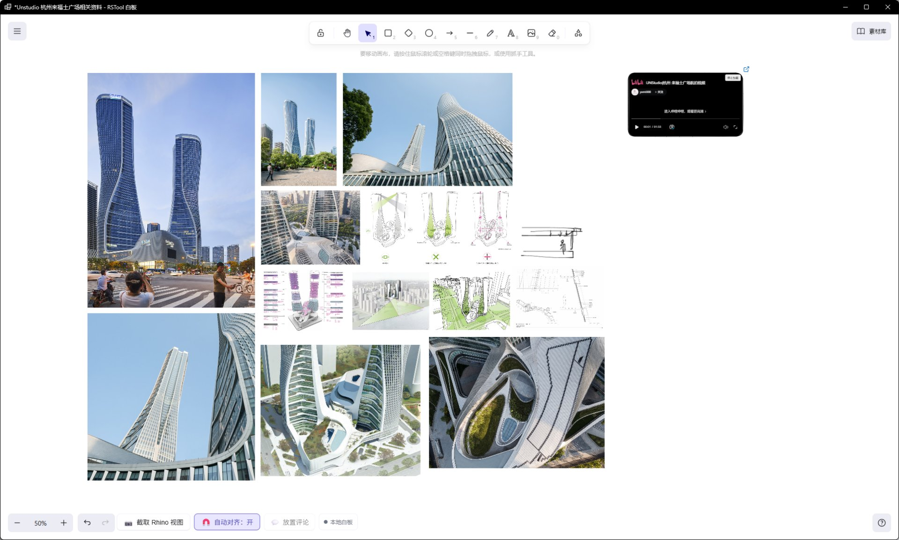

# rsWhiteboard · 白板

> 模块：效率工具 / 生产力

[← 返回命令目录](/commands/)

**功能**：打开白板窗口进行绘制、批注、协作与素材管理


*白板主界面：顶部居中 Excalidraw 主工具栏（锁/撤销重做/选择/矩形/椭圆/直线/箭头/自由画/铅笔/文字/图片/橡皮/删除）+ 右侧库按钮；左上 ≡ 汉堡菜单；底部 RSTool 自定义工具栏（截取 Rhino 视图 / 自动对齐:开 / 放置评论 / 本地快照）+ 左侧缩放 50% 控制；画板上排列项目实景与设计图参考，右上角嵌入 B 站视频卡用于设计成果回放*

**调用**：在 Rhino 命令行输入 `rsWhiteboard`（打开设置窗口）

**交互流程**：

1. 命令行输入 rsWhiteboard，打开白板窗口
2. 在白板上自由绘制 / 批注，或使用顶部工具栏的矩形、箭头、文字、图片等工具
3. 开启共享白板可与团队成员实时协作；可截取 Rhino 视窗作为参考图嵌入画板

**参数**：

| 中文名 | 英文名 | 类型 | 默认值 | 范围 | 说明 |
| --- | --- | --- | --- | --- | --- |
| 自动对齐 | AutoAlign | toggle | 开 | 开 / 关 | 底部自定义工具栏开关，控制元素放置时自动对齐 |

**备注**：白板是 RSTool 内置的协作绘图工具，基于 Excalidraw + React，与 Rhino 同窗口、可被 Rhino 正常遮挡。窗口标题为「RSTool 白板」，可在标题栏随时改名。文档以 Excalidraw 原生 `.excalidraw` 持久化（结构 `{type:"excalidraw", version, source, elements, appState, files}`）。支持**本地白板**与**公司共享白板（SMB 文件夹）**两种模式，并可保存 / 加载 Excalidraw **素材库** (`*.excalidrawlib`)。

## 主工具栏（顶部居中，从左到右）

主工具栏由 Excalidraw 自带，RSTool 未增减。仅自动对齐、捕获 Rhino、放置评论、共享状态 4 项加在底部。

| 按钮 | 功能 |
| --- | --- |
| 🔒 锁定 | 只读锁定，再点解锁，防止误触修改 |
| ↶ / ↷ | 撤销 / 重做最近编辑 |
| ▶ 选择 | 切换到选择工具，鼠标变箭头，可点击 / 框选元素 |
| ▭ 矩形 | 拖出矩形（按住 Shift 切圆角） |
| ◯ 椭圆 | 拖出椭圆 |
| ➤ 直线 / → 箭头 | 拉一条直线段；箭头模式拖出带箭头的线段 |
| ✏️ 自由画（高亮） | 用画笔按住画连续曲线 |
| ✎ 铅笔 | 比自由画更细腻的笔触 |
| A 文字 | 在画板上点击放置文本框，支持 Markdown |
| 🖼 图片 | 从本地选位图嵌入画板（拖入 / 粘贴亦可） |
| 🩹 橡皮 | 点击或框选删除元素 |
| 🗑 删除 | 移除当前选中元素 |

> 额外：RSTool 在右侧补了一个**库按钮**（book 图标），点击展开 Excalidraw **素材库面板**，列出个人 / 公司库中的可复用组件。

## 顶部汉堡菜单（≡，最左上）

Hamburger 菜单由 RSTool 在 Excalidraw `MainMenu` 中注入，**与协作会话状态联动**：共享开启时「新建 / 打开 / 最近 / 另存为 / 打开共享白板」会被隐藏以防破坏会话一致性（Excalidraw 内置的「加载场景」「保存到当前文件」「导出」按钮也被 RSTool 用 `UIOptions.canvasActions` 隐藏，由 RSTool 自己的菜单接管）。

| 分组 | 菜单项 | 说明 |
| --- | --- | --- |
| 文件 | 新建 | 清空画板（脏时会先弹保存确认） |
| 文件 | 打开… (`Ctrl+O`) | 选本地 `.excalidraw` 或 `.json` 文件 |
| 文件 | 最近 | 子菜单列出 `RecentFiles.json` 中的最近文件（含完整路径） |
| 文件 | 保存 (`Ctrl+S`) | 写当前路径（首次会触发另存为） |
| 文件 | 另存为… | 选新路径存为 `.excalidraw` |
| 共享 | 共享当前白板… | 在 SMB 共享目录首次开启协作（详见下节） |
| 共享 | 打开共享白板… | 选已存在的 `.excalidraw` 加入协作 |
| 共享 | 停止共享编辑 | 退出协作（仅在已加入时显示） |
| 素材库 | 素材库使用说明 | 弹出使用提示卡 |
| 素材库 | 连接公司素材库… | 选一个 `.excalidrawlib` 文件连接为公司库 |
| 素材库 | 刷新公司素材库 | 重新读取公司库（仅在已连接时显示） |
| 素材库 | 断开公司素材库 | 移除公司库连接（仅在已连接时显示） |
| 素材库 | 将个人素材库发布到公司… | 把当前个人库导出为 `.excalidrawlib` |
| 导出 | 导出 PNG | 把当前画板导出为 PNG 位图 |
| 导出 | 导出 SVG | 把当前画板导出为矢量 SVG |
| 默认 | 清空画板 | Excalidraw `DefaultItems.ClearCanvas` |
| 默认 | 切换主题 | Excalidraw `DefaultItems.ToggleTheme` |
| 默认 | 帮助 | Excalidraw `DefaultItems.Help` |

## 底部工具栏（Footer，底部中央）

底部只放 4 个 RSTool 自定义按钮，缩放控件 − / 50% / + 与 ∧ ∨ 的撤销 / 重做 仍是 Excalidraw 自带。

| 按钮 | 行为 |
| --- | --- |
| 📷 截取 Rhino 视图 | 一键把当前 Rhino 视窗截图嵌入到画板中央（按钮带 `loading` 态防止重复点击） |
| 📐 自动对齐：开 / 关 | 拖动元素时吸附附近元素边缘；状态写入 `appState.objectsSnapModeEnabled`，**初次打开默认开** |
| 💬 放置评论 | 仅在共享会话开启时可用：画板切换为「请在白板上点击评论位置」模式 |
| 状态指示器 | 显示「本地白板」/「已同步 · N 人在线」/「正在同步」/「后台保存中」/「共享目录离线，修改将在恢复后同步」 |

## 共享画板的设置（纯 SMB，零服务器）

RSTool 白板的共享**不需要任何专属服务器**，仅靠一个 SMB 共享目录。每个客户端在白板同目录同名 `<name>.rstcollab/` 下分别写文件，靠 `FileSystemWatcher + 400ms 轮询` 拉取其他客户端的增量。

**首位用户开启共享**

1. 打开或新建本地白板 → 顶部 ≡ → 「共享当前白板…」
2. 选择 SMB 网络盘下的某个路径（建议 `\\server\share\...\whiteboard.excalidraw`），系统用 `Path.GetFullPath + DriveInfo.DriveType == Network` 自动识别是否在网络盘；非网络盘时弹确认警告「其他电脑可能无法加入，是否仍要在此位置开启」
3. 系统原子写入 `<name>.excalidraw`（首次保存），并在同目录创建同名 `<name>.rstcollab\` 会话目录，内含：
```
<name>.rstcollab\
session.json          # 版本 / sessionId / 白板文件名 / 创建时间
scenes\<clientId>.json     # 每个客户端的增量场景 (元素 clock / files / appState)
comments\<clientId>.json   # 每个客户端的评论操作流
presence\<clientId>.json   # 客户端在线心跳 (2s 写一次, 7s 超时离线)
clients\<clientId>.json    # 客户端元信息 (userName / machineName / 加入时间)
```
4. 状态指示器从「本地白板」变为「已同步 · 1 人在线」

**其他用户加入**

1. 顶部 ≡ → 「打开共享白板…」→ 选择同一 `.excalidraw` 文件
2. 系统检测到该文件已有 `.rstcollab/session.json`，自动附加到现有会话
3. 加入时若本地有未同步的修改，会弹出「这个白板已经存在共享会话。加入后将载入公司共享目录中的最新版本，当前尚未共享的修改不会覆盖其他人的内容。是否继续？」二次确认
4. 当前在线的所有人会出现在右下角鼠标光标旁的彩色块（颜色由 AuthorId 哈希分到 6 色调色板 `#e0dfff / #d9f4ff / #dcfce7 / #ffedd5 / #ffe4e6 / #f3e8ff`）

**冲突合并**：每个元素都带 `clock` 递增时间戳，增量为 last-writer-wins (`LWW`)。每 30 秒触发一次完整快照写入 `snapshot.json`，通过 `snapshot.lock` 文件 + token 串防并发；锁超过 20 秒视为残留，由下次写入方自动清理。

**评论操作（仅共享时可用）**

- 底部点「放置评论」 → 画板切到「请在白板上点击评论位置」模式
- 点击位置后弹出「新建评论」对话框 → 输入文本 → 发布
- 评论操作类型：`create` / `reply` / `resolve` / `reopen` / `delete`，每条带唯一 `opId` 去重
- 评论位置、文本、作者、解决状态全部走共享目录，团队可见

**共享目录离线时**：状态变为「共享目录离线，修改将在恢复后同步」；本地仍把脏数据写入 `Recovery\` 目录，恢复网络后通过轮询自动补发所有落后增量。

**停止共享**：≡ → 「停止共享编辑」强制写一次完整快照 + 原子保存 `snapshot.json`；若公司共享目录当前离线，会拒绝停止以保护尚未同步的修改。

## 素材库

**添加**：选中任意白板元素 → 右键 → **添加到素材库** → 自动以 `onLibraryChange` 事件触发 500ms 防抖后写入本机库文件。

**个人库**：自动保存到 `%LOCALAPPDATA%\RSTool\Whiteboard\Library\`，每次添加后 500ms 自动写入（关闭窗口时会绕过防抖强制同步一次，避免丢失刚添加的素材）。

**公司库**：支持 `.excalidrawlib` 文件；连接 → 刷新 → 断开 三件套在汉堡菜单中。管理员可「将个人素材库发布到公司…」 → 选目标 `.excalidrawlib` 文件覆盖，其他成员通过「连接公司素材库…」共享同一份。

**容量**：RSTool **不限制**素材库大小，但 > 500KB 时弹性能提示（读写和打开面板可能更慢）。

## 与 Rhino 的双向协作

| 入口 | 行为 |
| --- | --- |
| 截取 Rhino 视图（底部） | 把 Rhino 当前视窗按屏幕分辨率截图嵌入到画板中央 |
| 嵌入 B 站 / 一般网页 | 直接在白板粘贴 `BV/av` 视频地址或外链 URL；为避免 Rhino 卡顿，重型网页默认不加载，用户点击后才加载；**已显式屏蔽 B 站首页与列表页**（过重），仅允许具体视频页 |
| 嵌入对象命名 | 双击嵌入对象的标题可改名为「嵌入的哔哩哔哩视频 / 嵌入的网页」 |
| 滚轮缩放 / 右键平移 | RSTool 加装的额外画板交互（`installWheelZoom` / `installRightButtonPan`） |
| 自定义描边宽度 | 当选中多个元素时，RSTool 在 stroke-width 面板追加「自定义描边宽度」输入；混合选区显示「混合」 |

## 崩溃恢复与离线保护

- 编辑停止 3 秒后自动写入一次恢复快照
- 共享模式下同时保留共享目录的最新快照 + 本机 Recovery 双保险（共享目录离线时仍写到本地，恢复后写回共享）
- 关闭窗口时若仍有未保存改动：非共享模式弹「是否保存」对话框；**共享模式则不会弹**——会强制写完整快照并停止会话（避免阻塞 + 防止丢失）
- 文档体积 > 512KB 时弹 `LargeDocumentPerformanceWarning`（仅首次提醒）
- 关闭后再启动会优先用最近文件恢复空态画板
