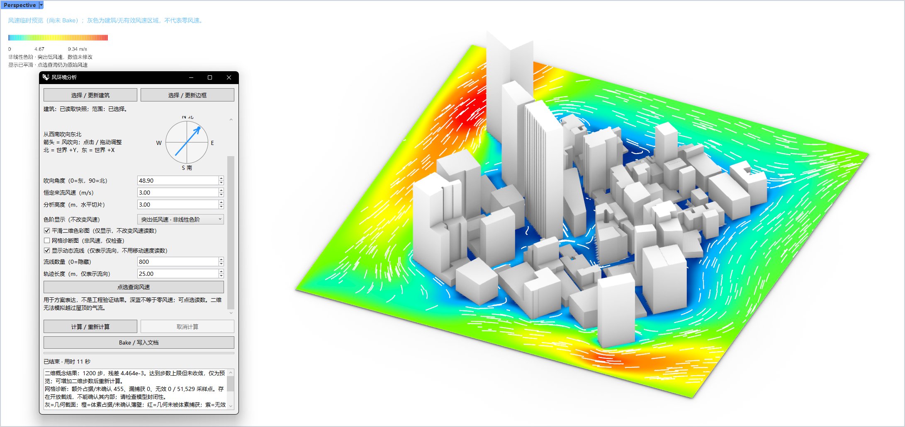

# rsWindAnalysis · 风环境分析

> 模块：分析 / 建筑物理分析

[← 返回命令目录](/commands/)

**功能**：通过非模态面板计算二维概念或三维风场，临时预览风速色彩图、图例和动态流线，支持点选读数；确认后 Bake 彩色网格、图例及静态风向线到 Rhino 文档。

*新版风环境分析示例：左侧为可滚动参数面板，右侧为建筑群水平切片风速预览。采用突出低风速的非线性色阶与显示平滑；流线只表示流向。示例计算达到 1200 步上限但未收敛，尚未 Bake，仅用于方案预览。*

**调用**：在 Rhino 命令行输入 `rsWindAnalysis`（打开设置窗口）

**交互流程**：

1. 运行 rsWindAnalysis 打开非模态面板；默认简易版、Concept2D 和快速出图，可切换专家版查看全部参数。
2. 点击「选择 / 更新建筑」选择 Mesh、Brep、Extrusion、SubD 或块；不要选分析边框或旧结果平面。建筑按快照读取，修改模型后需重新选择。
3. 点击「选择 / 更新边框」选择闭合矩形，边框高度作为初始分析高度；二维使用水平矩形。检查网格预览和范围。
4. 通过罗盘或角度输入设置风吹向，再设置来流风速、分析高度和快捷预设；需要控制网格与步数时切换专家版。
5. 点击「计算 / 重新计算」。计算中可编辑参数，但修改只在下次计算生效；可点击「取消计算」请求停止。
6. 检查风速色彩图、图例和底部状态，使用「点选查询风速」读取最近采样点；按需开启动态流线、显示平滑或网格诊断。
7. 确认结果后点击「Bake / 写入文档」，写入彩色网格、图例和静态风向线，可 Undo；诊断图不能 Bake，同一结果不能重复写入。

**参数**：

### 通用设置

这组控件始终位于面板上方，用于选择界面层级与计算模式，并设置两种模式共用的风向、风速和分析高度。简易版适合直接选择快捷预设；专家版会展开当前模式的网格、预算与诊断参数。

| 中文名 | 英文名 | 类型 | 默认值 | 范围 | 说明 |
| --- | --- | --- | --- | --- | --- |
| 参数界面 | interfaceLevel | list | 简易版 | 简易版 / 专家版 | 专家版展开网格、步数、统计及诊断；切换界面不重置参数。 |
| 计算模式 | simulationMode | list | Concept2D | Concept2D / EngineeringCFD | 二维恒定来流适合快速比较，仅支持水平切片；三维考虑建筑高度和地面。 |
| 快捷预设 | simplePreset | list | 快速出图 | 快速出图 / 标准比较 / 精细比较 | 二维分别 600/1200/2400 步，通道参考 15/10/6 m；三维分别 120/600/1500 步。选择后恢复自动网格并重置预算。 |
| 吹向角度 | windDirectionDegrees | double | 0（可沿用已保存值） | −360–360° | 从世界 +X 逆时针计角：0°向东、90°向北；表示吹去方向，不是气象来风方向。可拖动罗盘。 |
| 来流风速 | referenceSpeed | double | 3 | 0.01–100 m/s | 二维为恒定来流；三维为当前分析高度的入口风速，其他高度按地形剖面变化；不是结果最大值。 |
| 分析高度 | analysisHeight | double | 1.5；选框后取边框高度 | 0.01–10000 m | 水平切片的世界 Z 高度，不是距屋面高度。三维斜切片以中心高度为基准，此栏不可编辑。 |
| 关注的最窄通道 | passageWidth | double | 随快捷预设：15 / 10 / 6 | 0–10000 m | 专家参数；用户指定需要保留的宽度。自动网格不大于宽度 / 3；0 关闭约束，不覆盖手动网格。 |

### Concept2D（二维概念）面板

Concept2D 使用水平切片和恒定来流，计算与显示共用一张二维网格，适合快速比较总图方案。切换专家版后可设置网格间距、最大步数和残差容许值；它不能模拟气流越过屋顶。

| 中文名 | 英文名 | 类型 | 默认值 | 范围 | 说明 |
| --- | --- | --- | --- | --- | --- |
| 二维网格间距 | conceptGrid | double | 自动推荐 | 0.000001–1000000 m | 范围短边 / 50，并受通道约束；计算与显示共用，最多 80 万节点。间距减半，节点数约增至 4 倍。 |
| 二维最大步数 | conceptSteps | integer | 随快捷预设：600 / 1200 / 2400 | 20–1000000 | 达到残差条件可提前结束；达到上限不代表收敛。 |
| 二维速度残差容许值 | conceptTolerance | double | 0.05% | 0.001–10% | 越小越严格；不是实际风速测量误差。 |

### EngineeringCFD（三维工程）面板

EngineeringCFD 构建包含建筑高度和地面的三维体素风洞。内部求解体素决定几何捕捉与计算量，输出网格只决定结果切片的采样与显示；统计预设可能运行数小时，仍需检查收敛、守恒以及网格和计算域敏感性。

| 中文名 | 英文名 | 类型 | 默认值 | 范围 | 说明 |
| --- | --- | --- | --- | --- | --- |
| 三维精度 / 耗时预设 | calculationPreset | list | 快速预览 | 快速 / 标准 / 精细 / 统计 / 自定义 | 步数预算 120/600/1500/20000；节点预算 20万/80万/300万/300万。联动网格与质量，前三档均为预览。 |
| 入口地形粗糙度 | roughnessPreset | list | 城市 | 开阔地 / 郊区 / 城市 / 密集城市 | 控制三维入口随高度变化的风速剖面，不是经过校准的地面壁面函数。 |
| 质量 / 内存预算 | qualityMode | list | 随三维预设 | 预览 / 均衡 / 精细 | 影响计算域留白及安全节点预算，同时受耗时预设上限约束。 |
| 求解网格边长 | targetVoxelSize | double | 按范围、预设及预算推荐 | 0.000001–1000000 m | 实际三维体素边长；手动设置超预算时停止，不自动改粗。间距减半，节点数约增至 8 倍。 |
| 输出网格 | analysisGridSize | double | 范围短边 / 30、50 或 100 | 0.000001–1000000 m | 仅三维结果采样和显示；加密不提高内部求解精度，通常也不明显改变求解耗时。 |
| 三维最大计算步数 | iterations | integer | 随预设：120 / 600 / 1500 / 20000 | 20–1000000 | 迭代上限；长时间计算也不自动保证收敛。 |
| 按流经时间自动估算 | autoIterationBudget | toggle | 随三维预设 | 开 / 关 | 按预热与统计流经次数估算步数，仍受最大步数限制。 |
| 预热：流经次数 | warmupFlowPasses | double | 2 | 0.1–20 | 正式统计前的预热时长，以流经计算域次数计。 |
| 统计：流经次数 | averagingFlowPasses | double | 2 | 1.5–20 | 预热后时间统计的目标长度；短预览可能尚未进入统计。 |
| 均值窗口差容许值 | meanTolerance | double | 2% | 0.01–10% | 相邻时间平均窗口差的阈值。 |
| 质量平衡容许值 | massTolerance | double | 2% | 0.01–10% | 流入流出与守恒误差阈值，不能单独证明工程精度。 |
| 计算域留白倍率 | paddingScale | double | 1 | 1–5 | 增大会增加节点量与流经时间；过小会加重边界影响。 |
| 三维碰撞模型 | collisionModel | list | TRT + Smagorinsky | BGK / TRT / TRT + Smagorinsky | 基础、双松弛、带亚格子耗散三种模型；切换不等于完成湍流精度验证。 |
| 开放薄壁膨胀一格 | conservativeVoxelization | toggle | 关 | 开 / 关 | 三维保守占据，可减少漏风，也可能封堵窄通道。 |
| 视觉增强 | wakeVisualizationEnhancement | toggle | 关 | 开 / 关 | 三维尾流显示增强，不用于定量评价。 |

### 显示、诊断与输出

这些控件用于两种模式的结果表达和检查。色阶、显示平滑与动态流线不会改写计算风速；点选查询才是读取数值的入口。诊断图只检查几何和网格，不能 Bake。

| 中文名 | 英文名 | 类型 | 默认值 | 范围 | 说明 |
| --- | --- | --- | --- | --- | --- |
| 色阶显示 | colorPresentation | list | 突出低风速 · 非线性色阶 | 原始线性 / 突出低风速 | 仅调整颜色分配，不改变计算风速；图例仍为真实 m/s，修改后重新计算。 |
| 平滑二维色彩图 | smoothDisplay | toggle | 开 | 开 / 关 | 三次邻域显示平滑，不跨障碍；不改风速读数或流向，即时生效，Bake 保留显示效果。 |
| 网格诊断图 | showDiagnostics | toggle | 关 | 开 / 关 | 即时切换几何/体素诊断，隐藏风速色阶与动态流线；诊断图不可 Bake。 |
| 显示动态流线 | animate | toggle | 开 | 开 / 关 | 只表示水平流向，动画速度不是风速读数；三维完成后播放，斜切片不支持。 |
| 流线数量 | particleCount | integer | 240 | 0–2000 | 0 隐藏；即时生效，仅影响动态预览，不改变 Bake 静态风向线数量。 |
| 轨迹长度 | trailLength | double | 25 | 1–500 m | 粒子历史轨迹的最大长度，与风速数值独立。 |
| 图例上限 | legendMaximum | double | 0 | 0–100 m/s | 专家参数；0 自动覆盖峰值，手动低上限导致颜色饱和，不改变风速。 |
| 空风场 / 空风洞检查 | emptyTunnel | toggle | 关 | 开 / 关 | 从计算中移除建筑；三维保留地面与计算域，不删除 Rhino 对象。 |
| 预览分析网格 | showGrid | toggle | 开 | 开 / 关 | 临时网格线；二维为计算网格，三维为输出网格，过密时抽稀显示。 |

**备注**：面板会根据当前计算模式切换参数区。截图显示的是 Concept2D 简易界面中的一部分；48.90°、3 m 分析高度和 800 条流线均为示例设置，不是默认值。

## 界面布局

- 顶部：选择或更新建筑、分析边框，下方显示当前选择状态。
- 中部滚动区：先显示通用设置，再根据模式显示 Concept2D 或 EngineeringCFD 参数；最后是两种模式共用的显示与诊断控件。
- 底部固定区：计算、取消、Bake、进度条、耗时和结果摘要。计算结束先保留临时预览，不自动写入 Rhino 文档；关闭面板会清除临时预览。
- 「检查三维固体占据（不求解）」：只建立求解体素并对照几何截面，不迭代风场、不写文档。
- 「恢复当前模式的自动网格推荐」：退出当前模式的手动网格设置，不改变计算步数。
- 「点选查询风速」：读取最近采样点的速度及水平分量，不是现场实测；计算过程中读到的是抽样快照。

## 颜色、流线与结果判读

- 非线性色阶只是把更多颜色分配给低风速区；显示平滑不修改原始风速读数。深蓝不等于零风速，具体值请点选查询。
- 灰色为建筑或无效/未解析区域，不应解读为零风速。诊断图中的灰色代表几何截面、橙色代表体素占据/未确认薄壁、红色代表几何漏捕获、紫色代表无效采样，均非风速颜色。
- 动态流线仅辅助判断水平流向，不能通过动画移动速度估算风速；二维沿最新速度场播放，三维仅在计算完成后播放，斜切片不支持。
- 截图底部显示「达到步数上限但未收敛」，所以该图是方案预览。出现开放截线、薄壁或漏捕获提示时，应检查模型闭合性、网格与诊断结果，再重新计算。
- Concept2D 无法模拟越过屋顶的气流。EngineeringCFD 也需进行空风洞、网格和计算域敏感性验证；预览、视觉增强或未收敛结果不能直接作为工程验证或可靠定量评价。

**教学视频**：

<iframe class="rstool-video" src="https://player.bilibili.com/player.html?isOutside=true&aid=115973713567504&bvid=BV1mHzXBxEE6&cid=35672950510&p=1" scrolling="no" border="0" frameborder="no" framespacing="0" allowfullscreen="true" loading="lazy" title="RsTool · 风环境分析（Wind Analysis）演示教学（B 站）"></iframe>
*RsTool · 风环境分析（Wind Analysis）演示教学（B 站）*
